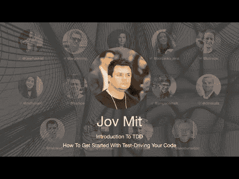

# TDD 大会 2021 —如何开始测试您的代码— Jov Mit

> 原文：<https://blog.devgenius.io/tdd-conference-2021-how-to-get-started-with-test-driving-your-code-jov-mit-1e2f25288db?source=collection_archive---------4----------------------->

第一次国际测试驱动开发发生在 7 月 10 日。

在这一系列中，我将把每一个演讲连同我的笔记和进一步的阅读包括在内。

希望有很多读者会观看和重新观看这些演讲，因为它们值得多看几遍。

让我们继续…

# 个人简历

Jov 是一名软件工匠和 TDD 实践者，在 Android 上工作了大约 10 年。他对干净代码、TDD、软件工艺和知识共享有很大的热情。他共同组织了发展会议。

> TL；DR: TDD 很难掌握，如果有好的指导，我们可以得到优秀的解决方案。

# 讨论

# 我的个人笔记

*   TDD 不是一种测试策略或工具。
*   TDD 是一种技能
*   掌握 TDD 需要很多时间。
*   客户不在乎我们是否写测试，但是他们在乎质量。
*   如今，至少有两种 TDD 风格:[伦敦学派和芝加哥学派](https://cleancoders.com/episode/comparativeDesign-episode-1)
*   芝加哥学校是反过来的。它设计在绿色上。
*   伦敦学校由外向内，[辱骂嘲笑](https://maximilianocontieri.com/code-smell-30-mocking-business)。它设计在红色的舞台上。
*   当我们计划测试时，我们可以使用[僵尸](https://maximilianocontieri.com/how-i-survived-the-zombie-apocalypse)指导。
*   我们必须确保测试失败的原因是正确的。看着他们失败是不够的。
*   在 TDD 中，拖延是一件好事。我们越是推迟做出决定，我们的解决方案就越好。

# 扬声器链接

*   推特 [@jovchem](https://twitter.com/jovchem)
*   LinkedIn [@jovmit](https://www.linkedin.com/in/jovmit/)
*   YouTube[@ https://www . YouTube . com/channel/UC 71 omjio 31 es x7 ly taz 2 yta](https://www.youtube.com/channel/UC71omjio31Esx7LytaZ2ytA)
*   站点 [https://jovmit.io](https://jovmit.io/)
*   中型 [Jovche Mitrejchevski(移到 jovmit.io)](https://medium.com/u/8c3c80794b1f?source=post_page-----1e2f25288db--------------------------------)

请关注 TDD 会议:

*   [YouTube](https://www.youtube.com/channel/UCKn-DadPoyYssfAOMk1LSew)
*   [推特](https://twitter.com/tddconf)