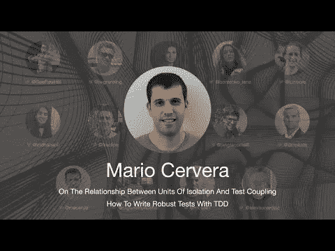

# 2021 年 TDD 会议——关于隔离和测试耦合单元之间的关系——马里奥·塞尔韦拉

> 原文：<https://blog.devgenius.io/tdd-conference-2021-on-the-relationship-between-units-of-isolation-and-test-coupling-mario-d462befa819b?source=collection_archive---------5----------------------->

第一次国际测试驱动开发发生在 7 月 10 日。

在这一系列中，我将把每一个演讲连同我的笔记和进一步的阅读包括在内。

希望有很多读者会观看和重新观看这些演讲，因为它们值得多看几遍。

让我们继续…

# 个人简历

Mario 从事软件专业已经超过十年了。他还在软件工程领域进行研究，这使他能够以计算机科学博士的身份毕业。作为软件工艺原则和价值观的强烈倡导者，他帮助团队改进他们的技术实践，以便他们能够以可持续的速度交付更高质量的软件。

> TL；DR:耦合导致脆弱的测试。

# 讨论

# 我的个人笔记

*   当我们谈论测试时，脆弱是健壮的反义词。
*   脆弱测试是在不应该破裂的时候破裂的测试。
*   测试是行为的规范。
*   如果我们没有改变测试的可观察行为，并且它们中断了，那么测试就阻止了我们的重构。
*   我们希望不惜一切代价避免脆弱的测试在不应该失败的时候失败。
*   [耦合](https://maximilianocontieri.com/coupling-the-one-and-only-software-design-problem)是导致脆弱测试的主要原因。
*   过度指定的软件做了更多不必要的假设。
*   在嘲讽的方法中，当我们重构时，我们需要改变很多测试。
*   如果我们公开我们的属性来测试它们是一种气味，我们是在测试偶然的结构。
*   以行为为中心的观点认为，真正的隔离单元不是单元测试，而是行为。
*   重构是 TDD 中的关键步骤。
*   测试是比生产代码更重要的代码。

> 这种理解的结果是每类一个测试用例的方法不能抓住 TDD 的精髓。添加一个新类并不是编写测试的触发器。触发器正在实现一个需求。

*伊恩·库珀*

马里奥也写了一篇关于他的演讲的文章。请在这里赶紧看完[。](https://mariocervera.com/talk-1st-international-conference-tdd#ckrnf3pkq0bg5fws15gwgg8a8)

# 扬声器链接

*   推特 [@macerub](https://twitter.com/macerub)
*   LinkedIn [@mariocervera](https://www.linkedin.com/in/mariocervera)

请关注 TDD 会议:

*   [YouTube](https://www.youtube.com/channel/UCKn-DadPoyYssfAOMk1LSew)
*   [推特](https://twitter.com/tddconf)