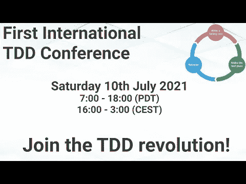

# 2021 年 TDD 大会 Alex Bunardzic 的开幕式

> 原文：<https://blog.devgenius.io/tdd-conference-2021-opening-ceremony-by-alex-bunardzic-ae3b51ab616f?source=collection_archive---------6----------------------->

第一次国际测试驱动开发发生在 7 月 10 日。

在这一系列中，我将把每一个演讲连同我的笔记和进一步的阅读包括在内。

希望有很多读者会观看和重新观看这些演讲，因为它们值得多看几遍。

让我们开始…

# 亚历克斯·布纳季奇主持开幕式

## 个人简历

Alex 是一名软件工程老手，拥有 30 多年的专业实践经验。Alex 是极限编程和 TDD 的坚定支持者，他目前领导着 DevOps 团队，指导他们进行 TDD 实践。

有着科学背景的 Alex 向我们展示了如何通过观察自然来构建软件

> TL；DR:为 TDD 革命搭建舞台，这一切是如何开始的，我们今天在 TDD 方面处于什么位置。

# 讨论

# 我的个人笔记

*   这是第一次会议，也是传递给年轻一代 TDD 爱好者的火炬。
*   多亏了 Kent Beck，我们在几年前发现了 TDD。
*   我们随着詹姆斯·格林宁的[僵尸公式](/how-i-survived-the-zombie-apocalypse-19905db22043)进化。
*   罗恩·杰弗里斯的《永远不要让代码失效》。
*   诸如此类…

## 为什么是 TDD？

*   TDD 不像干净的代码、敏捷、安全的架构那样容易推销。
*   我们会考虑的，但是现在没有时间了。

## 作为科学方法的 TDD

*   基于积极的执行和简短的反馈循环。
*   观察自然现象。
*   所有事情的发生都是对之前发生的事情的回应。

## 当我们试图计划时，当前的四个问题

*   不确定
*   含糊
*   不完全
*   混乱

## TDD 突破

*   TDD 删除非生产性代码。
*   更少的调试器时间。
*   不再需要手动运行应用程序。
*   没有不同的手动测试场景、凭证、导航、配置、环境等。

## 扬声器链接

-推特(【https://twitter.com/alexbunardzic】)
-媒体[亚历克斯·布纳季奇](https://medium.com/u/16ec868611bd?source=post_page-----ae3b51ab616f--------------------------------)
-LinkedIn([https://www.linkedin.com/in/alexbunardzic](https://www.linkedin.com/in/alexbunardzic)

请关注 TDD 会议:

 [## TDD 会议

### 与朋友、家人和全世界分享您的视频

www.youtube.com](https://www.youtube.com/channel/UCKn-DadPoyYssfAOMk1LSew)  [## JavaScript 不可用。

### 编辑描述

twitter.com](https://twitter.com/tddconf)