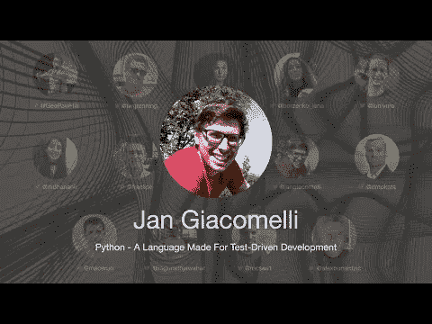

# 2021 年 TDD 大会——Python——一种为测试驱动开发而生的语言——简·贾科姆利

> 原文：<https://blog.devgenius.io/tdd-conference-2021-python-a-language-made-for-test-driven-development-jan-giacomelli-1ed9d3aedccf?source=collection_archive---------6----------------------->

第一次国际测试驱动开发发生在 7 月 10 日。

在这一系列中，我将把每一个演讲连同我的笔记和进一步的阅读包括在内。

希望有很多读者会观看和重新观看这些演讲，因为它们值得多看几遍。

让我们继续…

# 个人简历

测试驱动开发是关于小步骤和短反馈循环的。你越快知道系统是否工作，开发就越容易。当谈到 TDD 时，Python 并不是第一个出现在人们脑海中的语言。然而，当你使用它时，你开始意识到它是完美的语言。拥有一个工作单元没有任何开销——您可以编写一个简单的函数。没有编译——测试套件立即开始。你需要零依赖从 TDD 开始——*单元测试*库内置在标准库中。

这个演讲是 Python 世界中 TDD 哲学的路线图。

# 讨论

# 我的个人笔记

*   在这次演讲中，Jan 向我们展示了如何使用 Python 进行机器学习 TDD。
*   由于不确定性，TDD 似乎无法用机器学习来测试。
*   Python 附带了 xUnit 和模拟库。
*   我们还可以安装具有更好的函数语法和夹具管理的 pytest。
*   Pytest 也对缓慢的测试发出警告，并可以并行处理它们
*   测试是用给定的/Then/When 符号创建的
*   测试开始时没有类型提示，在我们发现域后，我们输入它们。
*   第一次测试总是假的
*   仓库是暂时的，直到我们需要它。
*   我们注入存储库，而不是使用模拟。
*   TDD 类似于带有假设验证的科学方法。
*   在机器学习中，你需要将结果与阈值进行比较。
*   您不应该度量准确性，因为这会导致过度拟合的情况。

# 扬声器链接

*   https://twitter.com/jangiacomelli 推特
*   领英【https://www.linkedin.com/in/jan-giacomelli-4a7066128/ 领英
*   地点[https://typeless.com](https://typeless.com](https://typeless.com))

请关注 TDD 会议:

 [## TDD 会议

### 与朋友、家人和全世界分享您的视频

www.youtube.com](https://www.youtube.com/channel/UCKn-DadPoyYssfAOMk1LSew)  [## JavaScript 不可用。

### 编辑描述

twitter.com](https://twitter.com/tddconf)