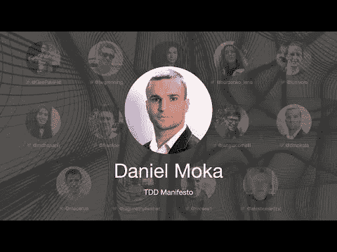

# TDD 会议 2021 — TDD 宣言—丹尼尔·陆丹蓝

> 原文：<https://blog.devgenius.io/tdd-conference-2021-tdd-manifesto-daniel-moka-15ebee86db05?source=collection_archive---------1----------------------->

第一次国际测试驱动开发发生在 7 月 10 日。

在这一系列中，我将把每一个演讲连同我的笔记和进一步的阅读包括在内。

希望有很多读者会观看和重新观看这些演讲，因为它们值得多看几遍。

让我们继续…

# 个人简历

丹尼尔·陆丹蓝是一个 TDD 爱好者和边界推动者，他对制作高质量的软件有着强烈的热情，同时利用教育来改变世界。他在使用。NET 堆栈部署到云环境。他的使命是提高全球软件质量标准，帮助个人和企业生产高效、优雅和高质量的软件。

> TL；DR: TDD 宣言的目的是在现实世界使用多年后，为 TDD 建立共同的基础。

# 讨论

# 我的个人笔记

*   丹尼尔发表了 TDD 宣言
*   TDD 宣言庆祝了[敏捷宣言](https://agilemanifesto.org/)20 周年。
*   关于 TDD 有很多误解。
*   宣言有几个部分:
*   TDD 值
*   [什么不是 TDD](https://tddmanifesto.com/what-is-not-tdd/)
*   [入门](https://tddmanifesto.com/getting-started/)
*   [清洁测试](https://tddmanifesto.com/a-clean-test/)
*   [练习](https://tddmanifesto.com/exercises/)
*   [关于我们](https://tddmanifesto.com/about-us/)

> 如果我们想要信任我们的代码，我们需要信任我们的测试。

# 宣言链接

*   推特 [@tddmanifestobot](https://twitter.com/tddmanifestobot)
*   标签#tddmanifesto

# 扬声器链接

*   推特 [@dmokafa](https://twitter.com/dmokafa)
*   LinkedIn [@danielmoka](https://www.linkedin.com/in/danielmoka/)
*   地点[https://www.danielmoka.com/](https://www.danielmoka.com/)

请关注 TDD 会议:

*   [YouTube](https://www.youtube.com/channel/UCKn-DadPoyYssfAOMk1LSew)
*   [推特](https://twitter.com/tddconf)