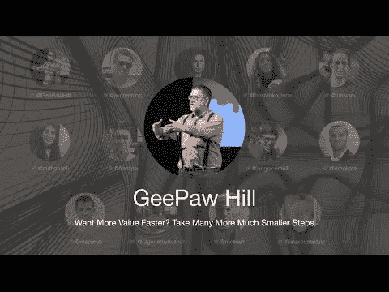

# TDD 大会 2021 —想要更快地获得更多价值？迈出更多更小的步伐——吉波山

> 原文：<https://blog.devgenius.io/tdd-conference-2021-want-more-value-faster-take-many-more-much-smaller-steps-geepaw-hill-c71c27fd3228?source=collection_archive---------4----------------------->

第一次国际测试驱动开发发生在 7 月 10 日。

在这一系列中，我将把每一个演讲连同我的笔记和进一步的阅读包括在内。

希望有很多读者会观看和重新观看这些演讲，因为它们值得多看几遍。

让我们继续…

# 想要更快地获得更多价值？迈出更多更小的步伐——吉波山

## 个人简历

我们都知道并热爱 GeePaw 和他无与伦比的“帮助极客生产超过 40 年”的风格

> TL；大卫:小步走是从一个地方到另一个地方的最好方式。

# 讨论

# 我的个人笔记

*   TDD 就像做饭。我们用了太多的米饭和太少的大蒜。
*   采取更多(和更小)的步骤来更快地改变。
*   与今天的示威活动相比，过去的示威活动微不足道。
*   单螺纹结构
*   目标没变。
*   今天，我们开发需求不断变化的大型应用程序。
*   我们应该更多的分而治之(分解)。
*   在激活状态之间一步步来。
*   我们应该确定最大持续时间，以保持步骤“婴儿”(< 1 hour).
*   The most efficient path is the one with smaller steps.
*   Even if some steps don’t produce user value or diverge.
*   They just can’t get worse.
*   The [行走骨骼](https://wiki.c2.com/?WalkingSkeleton)是工作应用程序)。
*   软件不是简单的几何学。
*   可变性比避免返工成本低。
*   我们很少能以直线从一点到达另一点。
*   软件中的问题不是多项式的。他们变得 NP 难。
*   在婴儿学步期间，我们不应该被打断。(否则我们需要重新开始)
*   编程就是思考。与打字无关。
*   在 TDD 上，我们有自动化的结果检测、快速的上下文切换和可执行的文档。
*   *世界上最糟糕的虫子是那些你不知道自己刚刚运过来的虫子。*
*   我们应该最大限度地分享知识，以增加可变性。
*   唯一的要求是步长尽可能小。
*   TDD 不是红绿重构那么简单。需要时间去掌握。
*   我们需要通过群聚、结对和群集来合作
*   它们不是天生的技能。

> 我们生活在一个错误观念的世界里，知道语法是问题的核心。许多人认为每个问题都有一个技术解决方案，我们所有人坐在黑暗的房间里独自安静地工作是最好的。

# 扬声器链接

*   推特[[@吉帕希尔](http://twitter.com/geepawhill)]([https://twitter.com/geepawhill](https://twitter.com/geepawhill))
*   Site [ [@geepawhill](http://twitter.com/geepawhill) 。org]([https://geepawhill.org](https://geepawhill.org))
*   LinkedIn[[@ geepawhill](http://twitter.com/geepawhill)](【https://www.linkedin.com/in/geepawhill/】T2)
*   中型[迈克尔“吉帕”希尔](https://medium.com/u/d8466fb2075e?source=post_page-----c71c27fd3228--------------------------------)

请关注 TDD 会议:

 [## TDD 会议

### 与朋友、家人和全世界分享您的视频

www.youtube.com](https://www.youtube.com/channel/UCKn-DadPoyYssfAOMk1LSew)  [## JavaScript 不可用。

### 编辑描述

twitter.com](https://twitter.com/tddconf)