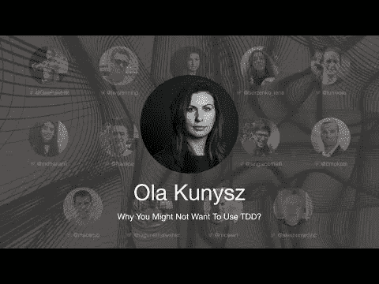

# TDD 会议 2021 —为什么你可能不想使用 TDD？奥拉·库尼斯

> 原文：<https://blog.devgenius.io/tdd-conference-2021-why-you-might-not-want-to-use-tdd-ola-kunysz-57d1ada50f8e?source=collection_archive---------2----------------------->

第一次国际测试驱动开发发生在 7 月 10 日。

在这一系列中，我将把每一个演讲连同我的笔记和进一步的阅读包括在内。

希望有很多读者会观看和重新观看这些演讲，因为它们值得多看几遍。

让我们继续…

# 个人简历

> Ola Kunysz 是一名拥有 14 年经验的软件工程师。除了编码，她还有商业分析和咨询的经验。自 2019 年以来，她经营着自己的公司，就软件质量对程序员进行教育。她在会议上发言，写文章，制作在线课程。她最大的兴趣是解决现实生活中的问题和编写重要的代码。两年来，她在波兰弗罗茨瓦夫组织了极客女孩胡萝卜聚会和研讨会。她喜欢与人交往，从事有趣的项目，所以你可以在黑客马拉松和会议上看到她。到了该放松的时候，她就下线了【和狗在一起，玩桌游，在山里】
> 
> TL；DR: TDD 可能很难启动和升级，但它是值得的！

# 讨论

# 我的个人笔记

*   TDD 是一项改变生活的技术。
*   TDD 改变了你编码的方式。它更加声明性和简单。
*   我们需要介绍非常简单的婴儿步骤。
*   你总是回到需求上来。
*   简单并不意味着容易。
*   我们不喜欢红色。
*   此外，绿色测试有时是假阴性。我们不知道是否一切正常，或者我们做错了。
*   考试是我们的朋友，不是我们的敌人。
*   对于高级开发人员来说，TDD 尤其困难和具有挑战性，因为他们有坏习惯。
*   对于大三学生来说，掌握新技能更容易。
*   我们应该通过看现场编码来学习 TDD，而不仅仅是通过看书。
*   很难遵循简单的过程。步骤很小，我们倾向于跳过它们。
*   我们倾向于跳过小步，用已知的解决方案前进。
*   我们没有提前看到 TDD 的好处。有时你需要几天或几周才能看到全貌。有些人放弃得太早。
*   我们需要保持谦逊并遵循流程。
*   TDD 很难启动或升级到真正的大型项目。
    我们永远不应该强迫人们使用 TDD。
*   我们必须用[形](http://codingdojo.org/kata)来练习，以转移到更大的项目。
*   永远遵循流程，不要过早判断。

> 程序员不写检查任何东西。他们只是通过测试来证明他们是正确的。

# 扬声器链接

*   推特 [@olaqnysz](https://twitter.com/olaqnysz)
*   LinkedIn [@akunysz](https://www.linkedin.com/in/akunysz/)
*   DevTo [@olaqnysz](https://dev.to/olaqnysz/)
*   地点[https://socialshub.net/OlaKunysz](https://socialshub.net/OlaKunysz](https://socialshub.net/OlaKunysz))
*   中号[奥拉·库尼斯](https://medium.com/u/4e046ae4a7fc?source=post_page-----57d1ada50f8e--------------------------------)

# 通话源

 [## 为什么你可能不想使用 TDD？

### 测试驱动开发是一种改变我们思考测试和编程方式的技术。这并不意味着它是…

开发到](https://dev.to/olaqnysz/why-you-might-not-want-to-use-tdd-26jf)  [## TDD 会议

### 与朋友、家人和全世界分享您的视频

www.youtube.com](https://www.youtube.com/channel/UCKn-DadPoyYssfAOMk1LSew)  [## JavaScript 不可用。

### 编辑描述

twitter.com](https://twitter.com/tddconf)