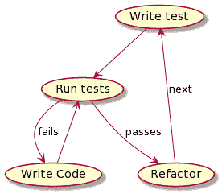

# TDD 解释:实际例子

> 原文：<https://blog.devgenius.io/tdd-explained-practical-example-97cb99ee6033?source=collection_archive---------14----------------------->


照片由 [Fotis Fotopoulos](https://unsplash.com/@ffstop?utm_source=medium&utm_medium=referral) 在 [Unsplash](https://unsplash.com?utm_source=medium&utm_medium=referral) 上拍摄

如果你听说过缩写词 TDD，但你不确定它的意思，或者即使你知道 TDD 是什么，但你不知道如何付诸实践；那么这篇文章就送给你了。

先解释一下什么是 **TDD** 。

TDD 代表**测试驱动开发，**正如它的名字所表明的，这是一种实践，我们使用测试作为下一步做什么的指导来编写代码。
这就引出了我在 TDD 中的一个主要原则:

> 如果测试没有要求，就不要写一行代码！

那么它实际上意味着什么呢？

如果我们开始解释 TDD 过程是什么样的，就更容易理解了。

# 过程

TDD 过程非常简单:

1.  为您的功能编写一个**失败的**测试
2.  进行**最简单的改变**，使测试通过
3.  **一旦测试就绪，重构**代码以保护功能
4.  **重复**

就这样吗？这么简单吗？

对，就是这样。但是 TDD 是一个永无止境的循环；你写一个失败的测试，让它通过然后重构；然后选择下一个功能，重新开始。



遵循这一过程，我们会取得什么成果？我们完成了几件事:

*   **简单性**
    如果我们只在测试需要时才写代码，并且我们总是写最简单的修改来使测试通过，那么我们解决方案的简单性是有保证的。
*   通过测试指导软件开发，不写任何不能通过当前测试的代码，我们写的任何代码都不可能不被我们的单元测试覆盖。
*   更少的脑力劳动 TDD 的另一个优点是我们不必事先过多地思考和考虑设计，大多数情况下，解决方案是在添加正确的测试后呈现给我们自己的。

那么实际情况如何呢？让我们一起做一个练习吧！


# 实践中的 TDD

我们将一起做一个简单的形来展示这个过程。问题中的形是[罗马数字](https://kata-log.rocks/roman-numerals-kata)，希望你喜欢。

如链接所示，我们必须转换的一些数字是:

```
1 ➔ I 
2 ➔ II 
3 ➔ III 
4 ➔ IV 
5 ➔ V 
9 ➔ IX 
21 ➔ XXI 
50 ➔ L 
100 ➔ C 
500 ➔ D 
1000 ➔ M
```

让我们编写我们的第一个测试！

为了首先编译这个测试，我们必须创建我们的**Roman numbers**类的最简单的实现。

如果我们运行这个测试，它实际上**没有通过**，正如所料。

好的，那么我们要怎么做才能通过第一次测试呢？请记住，我们必须做出最简单的改变才能通过测试；在这种情况下，最简单的方法是只返回“我”。我们运行我们的测试，我们的第一个测试是绿色的！

既然我们的第一个测试是绿色的，我们必须编写第二个测试。对于这个特殊的例子，我们有不同的选择来选择下一个测试。例如，它可能是“2 ”,但在罗马数字中，这将是一个两位数；在这种情况下，我更喜欢选择罗马数字中的下一个位数，所以我先选择 5。

如果我们运行这个测试，它**会像预期的那样**失败，因为它返回“I”。让我们更改我们的实现以使它通过，但现在我们必须记住，在实现我们的更改后，前面的测试也必须通过。还是那句话，我们来做最简单的！

就是这样，简单！我们只是检查数字并返回相应的等价罗马数字。
我知道你在想什么:那很丑！我知道，但别担心；我们以后再改。

> *我们应该避免 TDD 的过早优化，这通常会导致解决方案过于复杂。我们必须选择何时重构我们的代码；当我们觉得我们的实现变得混乱或缺乏清晰度时，我们将着手重构。*

为了避免这篇文章写得太长，我将在介绍完所有“一位数”的罗马数字(这是最简单的情况)后添加测试和实现。然后我们就能应对接下来的挑战。让我们看看它会是什么样子:

如果我们现在运行它们，所有的新测试都将**失败**，所以让我们看看如何以最简单的方式改变实现来使它们通过:

太好了！我们的测试都是绿色的！但是等一下，我们的实现变得有点混乱，对吗？

我们来重构一下吧！在这一点上，它成为一个问题，我们已经涵盖了所有个位数的情况；让我们改变它！
使用 if 条件来确定等价性不是本练习的最佳方法，因此我们将定义一个结构来保存这些等价性。例如，使用 Java 映射来存储等价关系将允许我们每次都获取 O(1)的等价关系。我用的是 JDK 11，所以我将使用[的](https://docs.oracle.com/javase/9/docs/api/java/util/Map.html#of--)地图来初始化这个地图结构，它从 JDK 9 开始就可用了。

这个新的实现最终是这样的:

现在干净多了，对吧？我希望你喜欢它。

完成重构后，我们再次运行所有的测试来检查我们没有破坏任何东西。好消息，所有人！
现在我们已经测试了所有个位数的案例，并且重构了实现，是时候应对下一个挑战了。让我们为第一个两位数的罗马数字写一个测试；这种情况下我选 2。

如果我们运行这个测试，它**会失败**,因为在我们的结构中没有与数字 2 等价的东西。
是时候让它过去了，但这将比第一次更复杂。如果我们仔细想想，我们有两个选择:在我们的结构中为数字 2 添加一个等价体，或者做一个改变来返回两个连接在一起的“I”。

我们可以选择第一个选项，但是在某个时候我们会意识到我们不能在我们的结构中存储所有的数字；即使在本练习中，我们将支持高达 1000 的数字，这仍然太多了。
让我们试着做点什么，这样我们就可以把数字 2 处理成 2 = 1 + 1。

如果我们想一想，我们要做的是得到最接近的等价，它小于或等于我们想要处理的数。
所以对于数字 2，我们将得到更低或相等的最接近的键，恰好是 1；然后我们会得到剩下的部分，并重复。

让我们看看我们的第一种方法是什么样的:

正如你所看到的，我们已经用一个 [NavigableMap](https://docs.oracle.com/javase/8/docs/api/java/util/NavigableMap.html) 接口替换了我们的等价存储结构，它提供了一个 [lowerKey](https://docs.oracle.com/javase/8/docs/api/java/util/NavigableMap.html#lowerKey-K-) 方法来为我们完成这项工作。然而，尽管这个实现能够为我们获取 lower 键，但它仍然只返回一位数的罗马数字；不幸的是，我们的测试仍然**失败**。
我们得想办法再迭代一次，找到剩余部分的等价。我认为[递归](https://en.wikipedia.org/wiki/Recursion_(computer_science))在这种情况下会帮助我们，让我们实现它。

如果你是递归的新手，在开始澄清你头脑中的概念可能有点令人兴奋，但是它比看起来要简单。
我们所做的是首先检查一个等价性；如果没有等价项，则找到较低的键，获取该键的等价项，并为剩余部分(编号— lowerKey)再次调用 **convert** 方法。如果我们现在运行我们的测试，它们都是！这是好消息。

那么下一步是什么？三位数的罗马数字呢？让我们试试 3 号。

惊喜！绿灯了，我们什么都不用做。但是第四条呢？我们必须记住，这个数字是一个特例，因为它的等价是“四”。

不出所料，它**失败**。我们如何解决这个问题？这是个特例，因为它从“V”中减去了“I”。
听起来有些棘手，但让我们想想我们有多少这样的“特例”。我们只有 IV (4)，IX (9)，XC (90)和 CM (900)，所以花大力气真的没什么意义；让我们做最简单的，为它们在我们的结构中添加等价。

所以我们新的等价结构是:

如果我们增加对数字 4 和 9 的测试，它们是绿色的 T4。还剩下什么？6 号呢？它是不同的，因为它的对等词是“VI”，它把“I”加到“V”上。让我们添加一个测试:

如果我们运行测试，它也是绿色的**！我们的实现创造了奇迹。我想是时候尝试一个更复杂的数字了，比如 838。让我们添加测试:**

**我们的测试是**绿色**！我想我们已经完成了，我们有一个健壮实现，支持从 1 到 1，000 的罗马数字。**

**最后我们可以做的另一件事是，如果测试太多，重构我们的测试。在我们的例子中，我们可以转换我们的 JUnit 4 测试来使用[参数化的](https://github.com/junit-team/junit4/wiki/Parameterized-tests)，这将删除我们测试中的一些冗余。然而，我将把它作为一个练习留给你；我们在这篇文章中已经讨论了足够多的内容，而进行重构已经超出了展示 TDD 是什么的范围。**

**原来如此！我希望你喜欢这个练习，并且对 TDD 过程有了很好的理解。**

**如果您喜欢这篇文章，请订阅，以便在新文章发表时收到通知！**

**非常感谢您的阅读！**

***原载于 2020 年 6 月 11 日 http://theboreddev.com*[](https://theboreddev.com/2020/06/06/tdd-explained-practical-example/)**。****