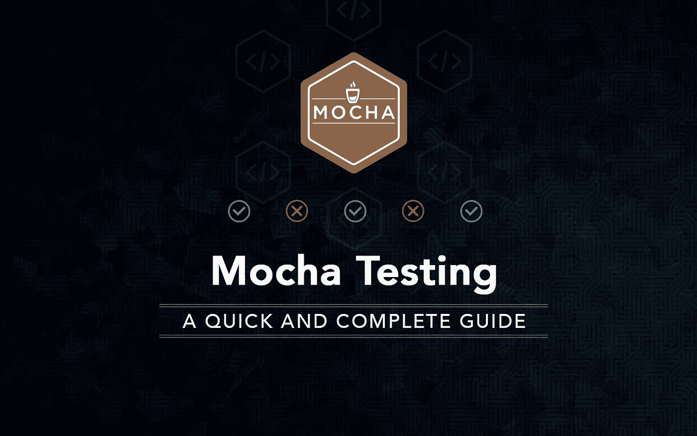
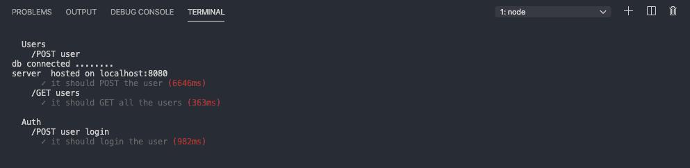
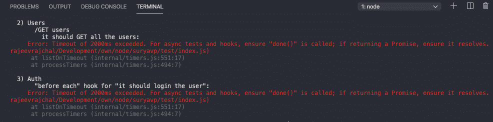
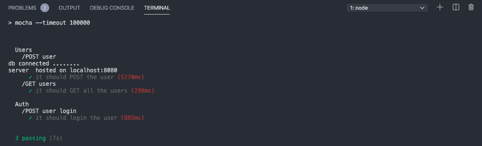

# 使用 Mongodb & Express 在 Nodejs 中进行 TDD(测试驱动开发)开发。

> 原文：<https://blog.devgenius.io/tdd-test-driven-development-development-in-nodejs-using-mongodb-express-521a7c3c8c95?source=collection_archive---------1----------------------->

# 介绍

[测试驱动开发(TDD)](http://technologyconversations.com/2014/09/30/test-driven-development-tdd/) 是一种进化的开发方法，它结合了测试优先开发和[重构](http://www.agiledata.org/essays/databaseRefactoring.html)，在编写足够的生产代码来完成测试之前，先编写一个测试。简单地说，测试用例是在编写代码之前创建的。

在这种方法中，我们使用 Express 作为后端服务器，使用 mongo-db 作为数据库。

出于测试目的，我们使用[摩卡](https://mochajs.org/) & [chais](https://www.chaijs.com/) 。

Mocha: Mocha 是一个功能丰富的 JavaScript 测试框架，运行在 [Node.js](https://nodejs.org/) 和浏览器中，使异步测试变得简单有趣。

Cha **i:** Chai 是一个用于[节点](http://nodejs.org/)和浏览器的 BDD / TDD 断言库，可以愉快地与任何 javascript 测试框架配对。

# 先决条件

*   表达
*   Mongodb
*   理解 rest api
*   在后端技术工作的想法。

# 项目设置

在我们开始开发实际的 API 之前，我们必须设置文件夹和端点。创建一个名为“tddapp”的项目文件夹。

初始化项目文件夹以设置 package.json

npm 初始化

在软件项目中，没有构建应用程序的完美方法。看看这个 [GitHub](https://github.com/rajeevrajchal/TDDApproachNode) 仓库，了解本教程中遵循的文件夹结构。

# 安装依赖项

*   [快递](https://www.npmjs.com/package/express)
*   蒙戈语
*   Dotenv
*   s
*   [Jsonwebtoken](https://www.npmjs.com/package/jsonwebtoken)
*   [摩卡](https://mochajs.org/) : npm 安装摩卡
*   [柴](https://www.chaijs.com/) : npm 安装柴
*   [chai-http](https://www.npmjs.com/package/chai-http)p:NPM 安装 Chai-http

# 使用 Rest Api

让我们在应用程序的根文件夹中创建一个*模型文件夹*。在本教程中，我们使用模型来创建模式。

**users . js:**

您可能已经看到我们已经导入了一些文件夹。

所以让我们创造这些

*   DefaultUserImage.js
*   SecretToke.js

在根文件中创建*服务文件夹*。它在内部创建连接数据库的 db.js。

创建一个*路径文件夹，在路径文件夹内创建*

*   Index.js 文件
*   authRoute.js
*   用户路线. js

现在控制器:

在 api 中创建一个名为 api 的文件夹

*   AuthController.js
*   UserController.js

这里你可能已经看到我们已经导入了一个名为 ***“来自助手的 authFunction”***的文件

创建助手文件夹和**authfunction . js**

这里我们已经创建了 rest api。现在我们正在进行我们必须在教程中展示的实际测试

# 测试过程

在开始测试之前，如果已经安装了依赖项， ***mocha，chai 和 chai-http。***

您必须安装两者，并且可以安装为:

npm 安装摩卡

npm 安装 chai

npm 安装 chai-http

为了测试修改 ***package.json*** 像

在这里，脚本保存运行测试的命令。我们延长测试时间，这样我们就不会超时。

***【脚本】:{***

***“测试”:“摩卡—超时 100000”***

***}，***

**制定测试程序**

在测试文件夹中创建一个文件夹*测试*

*   索引. js
*   美国石油学会(American Petroleum Institute)

**Index.js**

**Api**

*   **auth.test.js**
*   **用户.测试. js**

***测试快速总结***

如你所见，我们使用摩卡和柴进行测试。这里我们使用“*describe”*函数来描述函数，或者简单地使用测试的名称包装器名称。

在 *"user.test.js"* 中我们使用 wrap by

***形容('用户'，()= > {***

***…***

***})***

这里 Users 是我们指定的所有测试用例的包装器名称。

你也可以在 describe 函数中看到 beforeEach 函数。

我来介绍一下新功能 ***beforeEach()***

***beforeEach():*** 在每个测试用例之前运行**。这意味着如果我们需要在实际的测试用例开始之前指定一些东西，我们可以用这个来定义它。**

**afterEach():** 在每个测试用例完成后运行。这意味着我们可以指定在测试用例完成后做什么。

因此，在本教程中，我已经在每次测试运行之前从数据库中清除了 users 表数据。

***注意:*** *可以为每个单独的测试用例指定 beforeEach()和 afterEach()函数。*

这里接下来是 ***it()***

it()函数描述了实际的测试用例是什么。通过 it 功能，我们给测试用例命名。

***形容('/获取用户'，()= > {***

***it('它应该得到所有用户'，(done) = > {***

***…***

***})；***

***})***

# 试验

到现在为止，我们还没有运行。因此，为了运行测试，我们运行代码

npm 运行测试

在此之前，您必须修改 package.json。如果您不更新它，将会出现如下错误:

测试成功后:

# 结论

可能有许多不同的方法对应用程序进行单元测试。但这些是我一直遵循和学习的方法，从那时起我就在 TDD 工作。在本教程中，我们已经使用 node.js 和 mongodb 对 API 进行了基本的单元测试。