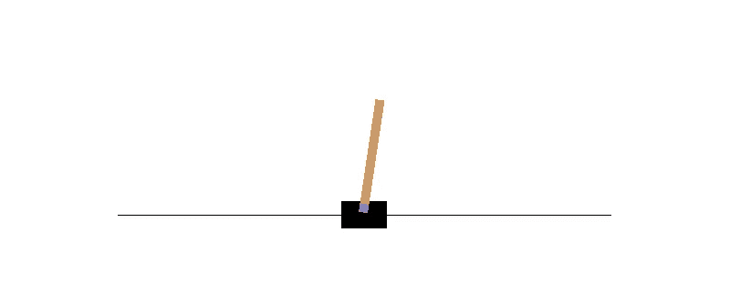
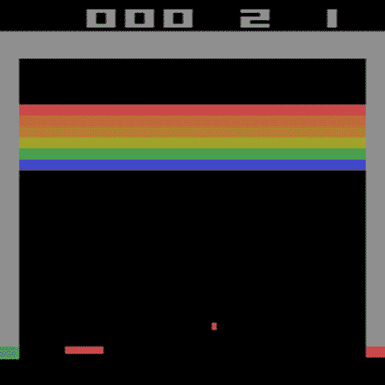

# 教神经网络玩突围游戏

> 原文：<https://blog.devgenius.io/teaching-a-neural-network-to-play-the-breakout-game-793ad7d1b20e?source=collection_archive---------4----------------------->

小时候喜欢在 IBM PC XT 机器上玩 Arkanoid 游戏。许多年后，我开始对人工神经网络是否可以被训练来玩类似的游戏感兴趣。让我们弄清楚。


# 强化学习

强化学习的概念并不新鲜。在 40 年代，艾伦·图灵描述了有两个输入的机器，即“奖励”和“惩罚”。在 50 年代，这一想法演变成了一个关于[马尔可夫决策过程](https://en.wikipedia.org/wiki/Markov_decision_process) (MDP)的概念，其中状态、行动和奖励之间的相互联系被形式化了。在 60 年代，理查德·贝尔曼发展了著名的[贝尔曼方程式](https://towardsdatascience.com/the-bellman-equation-59258a0d3fa7)，现在几乎可以在每一篇关于国际扶轮的论文中看到。强化学习的主要思想是 ***代理*** 有其当前的*，在每一步，它都在试图执行一些 ***动作*** 。代理人的任务是采取最佳行动，这将有助于最大化 ***奖励*** 。在*学习*过程中，代理正在尝试不同的动作并‘记住’结果。与人类一样，经过一些训练后，智能体将能够获得一些知识，知道在不同的情况下做哪种动作更好。创建代理的不同方法是可用的，例如，可以使用所谓的“Q-table ”,其中“状态、动作、奖励”三元组只存储在一个表中。如果可以使用少量变量对状态进行编码，效果会很好，例如在 [CartPole](https://github.com/openai/gym/wiki/CartPole-v0) 实验中:*

**

*作者公开的旗杆图像*

*在这项任务中，杆子被连接到一辆小车上，小车沿着一条无摩擦的轨道移动。手推车可以向左或向右移动，目的是防止钟摆落下。状态仅由 4 个变量描述(小车位置、小车速度、磁极角度、磁极速度)，将这些数据保存在内存中很容易。但是如果我们在谈论电子游戏，我们没有一个内部状态。当然，从头开始重新编写一个类似突围的游戏是很容易的，那么控制购物车将是一件容易的事情。但是挑战在于训练代理人像人类一样玩*，只能通过观看比赛！在这种情况下，如果我们有一个分辨率为 640x480 的视频游戏，游戏帧的当前状态将由 640x480=307200 个像素值编码，可能的状态变化数量将是巨大的。**

*仅仅通过观看来玩视频游戏的任务显然不是那么容易的。2013 年，DeepMind 发表了一篇论文[用深度强化学习](https://www.deepmind.com/publications/playing-atari-with-deep-reinforcement-learning)玩雅达利，其中神经网络(NN)被用于这项任务。已经表明，在 NN 架构没有任何改变的情况下，网络可以玩不同的 Atari 游戏，其性能类似于专业人类玩家。作者描述的想法后来被用于许多实现中，雅达利包装器[的源代码现在在开源](https://github.com/openai/baselines/blob/master/baselines/common/atari_wrappers.py) [OpenAI 基线](https://github.com/openai/baselines)框架中可用。让我们看看它是如何工作的。*

# *奥鹏健身馆*

*我的第一个想法是捕捉一个运行 MS-DOS Arkanoid 游戏的 DOSBox 的屏幕，并弄清楚是否有可能向它发送关键代码，但事实证明这根本不需要。 [Gym](https://github.com/openai/gym) 是一个开源的 Python 库，为强化学习算法的简单开发和测试而制作，它还包括复古游戏。从头开始编写游戏代码可能需要很长时间，但健身房开发者已经做了艰苦的工作——该库为不同的游戏提供了统一的接口。例如，我们可以仅使用 20 行代码创建并运行 Atari Breakout 游戏的实例(严格来说，Breakout 不是 Arkanoid，但它有非常相似的游戏玩法):*

```
*import gym  *# pip3 install --upgrade gym[atari,accept-rom-license]* import cv2env = gym.make("BreakoutNoFrameskip-v4")
env.reset()
step_num, total_reward = 0, 0
while True:
    action = env.env.action_space.sample()
    state, reward, done, _ = env.step(action)
    print(f"S{step_num}: {action}, {reward}, {total_reward}")
    if done:
        break

    img = cv2.resize(state, (480, 480), 
                     interpolation=cv2.INTER_CUBIC)
    cv2.imshow('Frame', img)
key_code = cv2.waitKey(1)
    if key_code & 0xFF == 27:
        break
    time.sleep(0.01)

    step_num += 1

env.close()*
```

*正如我们所见，该库提供了对游戏状态、游戏奖励和可用动作的访问——这是我们制作算法所需要的。至于突围游戏，*状态*是 210x160 的 RGB 图像，我们可以使用 OpenCV 的 *imshow* 方法轻松显示。运行代码后，我们会看到类似这样的内容:*

**

**作者全彩图像突围游戏**

*有趣的是，这是一个真实游戏的模拟，通过运行一个真实的 Atari 固件产生(可用游戏和 ROM 文件的列表可以在 [AutoROM 源代码](https://github.com/Farama-Foundation/AutoROM/blob/master/src/AutoROM.py)中看到)。*

*当然，这段 20 行的代码片段并不能真正玩游戏——这里我们只使用了 *action_space.sample* 方法，该方法生成随机动作。为了玩真正的游戏，我们需要优化环境并训练神经网络。*

# *创造环境*

*一个*gym . make(" BreakoutNoFrameskip-v4 ")*方法正在创建一个游戏实例，这对于人类来说看起来不错，但对于神经网络来说就不那么合适了。DeepMind 的作者建议了一些有用的转换，例如，游戏屏幕从 210x160 转换为 84x84 灰度图像，这将输入数据的大小减少了 20 倍。游戏动态也很重要——静态的 84x84 帧不足以让神经网络知道球的方向。为了解决这个问题，使用 4 个最后的 84×84 帧的堆栈作为输入。其他转换也很有用，例如，*nooplesetenv*类在游戏开始时添加了随机数量的空步骤， *MaxAndSkipEnv* 类通过一次做 4 个游戏步骤来提高学习速度，等等。*

*创建环境的完整代码(针对培训进行了优化)如下所示:*

```
*env = gym.make("BreakoutNoFrameskip-v4")
env = NoopResetEnv(env, noop_max=30)
env = MaxAndSkipEnv(env, skip=4)
env = RecordEpisodeStatistics(env)
env = EpisodicLifeEnv(env)
env = FireResetEnv(env)
env = WarpFrame(env)
env = ClipRewardEnv(env)
env = FrameStack(env, 4)
env = ImageToPyTorch(env)
return env*
```

*这些类的源代码可以在 OpenAI [atari_wrappers.py](https://github.com/openai/baselines/blob/master/baselines/common/atari_wrappers.py) 文件中找到。这是应用所有变换后神经网络如何“看到”游戏的近似表示:*

**

*正如我们所看到的，这种表现足以让网络“理解”游戏过程中发生的事情。*

# *体系结构*

*对于神经网络模型及其训练，我使用了来自一个 [WandB](https://wandb.ai/cleanrl/cleanrl.benchmark/reports/Atari--VmlldzoxMTExNTI) 演示的源代码——让我们看看它是如何工作的。*

*从体育馆环境中，我们得到 84x84x4 大小的数据阵列，如前所述，因为使用 4 帧作为输入序列，神经网络层将能够“检测”球的运动方向。网络本身或多或少是这项任务的“标准”。数据帧首先由 3 个卷积层处理——正如我们所知，CNN 擅长处理图像。这些层之后是一个隐藏层，它“连接”到两个输出，“演员”和“评论家”(见下面的描述)。其实就是这样，对更多细节感兴趣的可以看源代码里的*代理*类。有趣的是，可训练参数的总数是 1.686.693 —很多吗？只是作为一个粗略的比较，果蝇大脑包含不到 20 万个神经元，这更少(但我也从未见过果蝇玩 Breakout).*

*当我们有了神经网络，我们就可以开始训练它。深度强化学习是一件非常复杂的事情——以某种方式训练一个神经网络不是问题，但是很难训练好它。作者使用了几种技术来获得良好的结果:*

*   *演员-评论家方法*

*在[作者-评论家方法](https://keras.io/examples/rl/actor_critic_cartpole/)中，代理人由两部分组成——所谓的演员和评论家。演员的目标是找到可能的行动，而评论家的目标是评估这些行动有多“好”。至于训练的总体思路，它与本文开始时描述的一样——健身房环境允许制定游戏步骤，在每一步上，我们都可以获得*状态*和可选的*奖励*(可选，因为如果在当前步骤中没有砖块被球击中，它可以是 0)。在训练开始时，生成的动作和估计实际上是随机的，但当优化器正在调整神经网络权重时，它开始产生越来越准确的结果。*

*   *体验回放*

*在训练过程中，我们从每个游戏步骤中迭代地获得状态、动作和奖励。为了使训练更有效，首先在数组中收集游戏数据，然后才随机打乱这些数据，并将其用作小批量训练的来源。这允许神经网络获得关于游戏的更“通用”的知识。*

*   *目标网络*

*神经网络的训练是迭代优化过程，其中优化器试图使用一种梯度下降来更新神经网络权重。在我们的算法中，梯度方向取决于演员和评论家的结果，这也是由神经网络计算的。如果网络在每一步之后都在变化，优化过程很容易变得不稳定。为了防止这种情况，使用神经网络的第二个副本，称为*目标网络*，该网络定期更新，并在小批量学习过程中使用。*

*欢迎那些对使用经验重放缓冲区和目标网络的更多细节感兴趣的人阅读这篇关于[深度 Q-learning](https://towardsdatascience.com/deep-q-network-dqn-ii-b6bf911b6b2c) 的文章——细节有点不同但总体思路是一样的。*

*   *多重处理*

*这种改进与算法本身无关，但它使学习过程快了很多。一个[subcvecenv](https://stable-baselines.readthedocs.io/en/master/guide/vec_envs.html)类允许同时运行游戏环境的几个实例。实际上，当使用 8 个并行的健身房实例时，它使学习速度提高了 3-4 倍。*

# *结果*

*最后，让我们看看结果。*

*至于训练过程本身，肯定也不算快。大约需要 10，000，000 个游戏步骤才能达到良好的训练效果，这个过程在一台配备 12 核 3.7GHz CPU 和 GeForce RTX 3060 显卡的 PC 上需要大约 2 个小时。此图显示了培训过程中获得的奖励:*

**

*在健身房环境中，一步是一个“原子”游戏动作，就像将球移动到下一个位置。整个游戏可能包含 50-100 个步骤，显然取决于代理人赢或输的速度，当游戏结束时，它会重新开始。在这里，我用步骤来衡量学习进度。*

***100.000 步** —结果或多或少是随机的。有一次击中了目标，但这纯粹是运气使然:*

**

***200.000 步** —神经网络有时能击中球:*

**

***500.000 步** —神经网络能够玩简单的游戏，但它经常输:*

**

***10.000.000 步**—最终，神经网络能够获胜:*

**

# *结论*

*训练神经网络玩电脑游戏非常有趣。令人惊讶的是，神经网络能够“学习”所有需要的动作，考虑到没有直接编码的游戏规则，输入图像本身包含大量冗余数据(如顶部的分数)，甚至球的大小非常小。读者可能还会问，为什么要花那么多时间去学习？答案很简单——当一个人玩游戏时，他/她已经有了很多关于球如何移动或弹墙等的“基本”知识。所以一个人只需要几秒钟就能想出该做什么。神经网络什么都不知道，它实际上是从零开始，只有 84×84×4 = 28224 个数字的数组作为输入。考虑到所有这些数据是多么的冗余，在这种情况下神经网络能够学习真是令人惊讶。当然，强化学习不仅在游戏中有用，在机器人、自动驾驶或其他实际应用中也有用。*

*想要测试本文中使用的演示的人可以查看 [WandB](https://wandb.ai/cleanrl/cleanrl.benchmark/reports/Atari--VmlldzoxMTExNTI) 页面。同样的演示，优化运行在一台 PC 和[一个预先训练的模型](https://github.com/dmitryelj/data-science-tutorials/blob/master/ai_breakout_game.mdl)也可以从我的 [GitHub 页面](https://github.com/dmitryelj/data-science-tutorials/blob/master/ai_breakout_game.py)下载。要运行游戏，只需指定模型文件:*

```
*python3 ai_breakout_game.py --run=1 --model-filename="ai_breakout_game.mdl"*
```

*若要从头开始训练模型，只需指定总步骤数和并行环境数即可:*

```
*python3 ai_breakout_game.py --num-envs=8 --total-timesteps=1000000 --multithreading=True*
```

*在本例中，模型文件“ai_breakout-1000000.mdl”将在训练完成后保存。*

*对于那些想了解更多 RI 理论的人，我推荐阅读 Jordi Torres 教授关于教授深度 Q-网络以玩乒乓球游戏的精彩文章，三个部分( [1](https://towardsdatascience.com/deep-q-network-dqn-i-bce08bdf2af) 、 [2](https://towardsdatascience.com/deep-q-network-dqn-ii-b6bf911b6b2c) 和 [3](https://towardsdatascience.com/deep-q-network-dqn-iii-c5a83b0338d2) )可在走向数据科学网站上获得。在这个 [Tensorflow 教程](https://www.tensorflow.org/tutorials/reinforcement_learning/actor_critic)中也可以找到对演员-评论家方法的很好的描述。*

*祝读者在自己的 AI 和深度学习实验中好运，感谢阅读。*