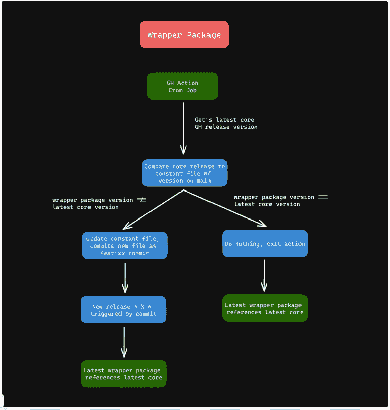

# 技术博客#5:使用 GitHub 动作自动同步多个存储库版本

> 原文：<https://blog.devgenius.io/tech-blog-5-automatically-sync-multiple-repositories-versions-using-github-actions-ec070cf908ea?source=collection_archive---------3----------------------->

## Coner Murphy，开发团队 Salable

在 Salable 中，我们有一个定制的 JavaScript 库用于我们的价格表，在一个高层次上，这个 JS 库负责在用户网站上显示产品的各种价格表。这个库被版本化并发布到我们的 CDN 上，以在我们维护的各种框架/库包装包中使用，比如我们的 [React one。](https://www.npmjs.com/package/@salable/pricing-table-react)然后，这些包装包就可以在使用各自技术的用户应用程序中使用。

然后包装软件包被单独版本化并发布到 NPM 供人们安装。为了确保包装包始终使用核心库的最新 CDN 版本，我们在每次核心库版本升级时都会发布每个包装包的新版本，以确保它们保持一致。

这并不太麻烦，因为我们已经在核心库和包装器包中配置了`semantic-release`包。`semantic-release`为我们处理所有版本控制和发布工作流程；我们需要做的唯一手动部分是更新包装包中正在使用的 CDN 版本，并将其 PR 到主分支中，以触发使用最新 CDN 版本的新版本包装包发布。

现在，我说这不是太多的麻烦，但我们是开发人员，开发人员天生懒惰，喜欢自动化的东西。而且，由于这种情况是自动化的首要条件，我们决定将其自动化。但是撇开懒惰不谈，有很好的理由来自动化这个工作流程。

1.  我们希望扩展包装器包的数量，从一个(React)扩展到包括其他大型库/框架，这样随着我们的扩展，手动更新所有这些将花费越来越多的时间——这些时间可以花在其他更有价值的活动上。
2.  人类会犯错误，我们可能会忘记在更新时删除包装包，或者在维护多个包装包时完全忽略其中一个。

简而言之，对这类工作的人为干预越少，对每个人都越好。

# 这个计划

我拟定了一个计划，使用 GitHub Actions 自动检查 GitHub 上核心库的最新发布版本，并将其与运行该动作的包装包的`main`分支上当前使用的库版本进行比较。

如果版本匹配，我们什么也不做。但是，如果最新的核心库发布版本高于在最新的包装包中使用的版本，那么我们需要更新包装包并触发到 NPM 的新版本。

在我们的包装器包中，我们有一个根`constant.ts`文件，它包含我们使用的核心库包版本。它保存在一个单独的文件中，以便在 GitHub 操作中使用 bash 命令进行编辑。

我意识到这可能有点罗嗦和复杂，所以这里有一个流程图，解释了在每个包装器包库中的 CRON 作业上运行 GitHub 动作时发生的事情。



包装包装流程

现在，我们需要做的就是添加我们的 GitHub 动作！下面是我们 GitHub 操作的全部代码，以及解释每个步骤的注释。我们将这段代码添加到`./.github/workflows/update-version.yml`文件中，并将其写入`main`分支。

```
name: Update Version

# Run this action every hour on the hour.
on:
  schedule:
    - cron: "0 * * * *"

jobs:
  update-version:
    name: Update Version
    runs-on: ubuntu-latest
    steps:

      # Check out the latest code on `main`
      - uses: actions/checkout@v2
        with:
          token: ${{ secrets.GH_TOKEN }}
          fetch-depth: 0

      # Fetch the latest GitHub release of the core library repository
      - name: Get latest release
        uses: rez0n/actions-github-release@main
        id: version
        env:
          token: ${{ secrets.GH_TOKEN }}
          repository: "Salable/pricing-table-js-lib"
          type: "latest"

      # Format the latest release version from above into 'x.x.x' format
      - name: Format latest version
        id: latest
        run: "version='${{ steps.version.outputs.release }}' && echo ::set-output name=version::${version/'v'/''} && mkdir params && echo ${version/'v'/''} > params/VERSION"

      # Get the current version used in the wrapper package from the root file containing it.
      - name: Read currentVersion from constants.ts file
        id: currentVersion
        run: echo "::set-output name=version::$(head -1 ./constants.ts | awk '{ print $5; }' | sed "s/'//g" | sed 's/.$//')"

      # Compare the versions and update the constants file to the new version if required.
      - name: Compare versions
        if: steps.latest.outputs.version > steps.currentVersion.outputs.version
        run: echo "$(sed -i -e 's/${{steps.currentVersion.outputs.version}}/${{steps.latest.outputs.version}}/g' ./constants.ts)"

      # Commit the change and push to `main` if version has changed.
      - name: Push changes
        if: steps.latest.outputs.version > steps.currentVersion.outputs.version
        run: |
          git config --global user.name 'github-actions'
          git config --global user.email 'github-actions@github.com'
          git commit -am "feat: bumped core library version to ${{steps.latest.outputs.version}}"
          git push
```

现在动作合并到了`main`分支中，它将由 CRON 作业每小时触发一次，以检查最新版本是否相互偏离，如果是，更新包装器包的常量文件以使用核心库的最新版本。

在这篇文章中，我们讨论了为什么你可能想要使用 GitHub 动作来保持两个库同步，以及如何使用定制的 GitHub 动作工作流来做到这一点。我希望这篇文章对你有所帮助。