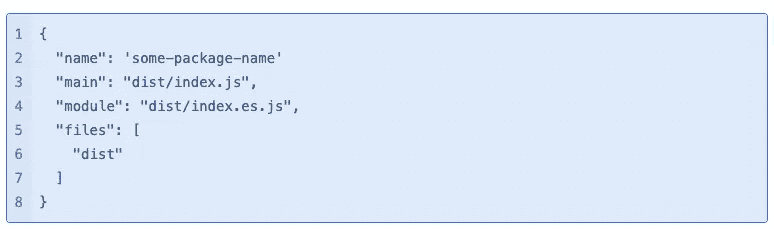
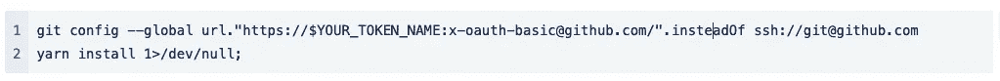

# 技术博客 3 号使用一个私有的 GitHub 库作为另一个库中的 NPM 包

> 原文：<https://blog.devgenius.io/tech-blog-no-3-using-a-private-github-repository-as-an-npm-package-in-another-repository-2de4e16c7f64?source=collection_archive---------9----------------------->

## 由康纳墨菲，开发团队畅销

创建 NPM 包是跨多个项目共享代码的一种简单而方便的方式。但是，如果你想保持套餐的私密性，又不愿意为 NPM 账户的高级功能付费，那就有点棘手了。

这就是我们最近发现自己的处境，我们的全球设计系统(GDS)包是可销售的。虽然我们的最终目标是开源这个包，并让它在 GitHub 和 NPM 上免费可用，但在短期到中期内，我们希望保持这个包的私有性，直到我们有一个核心产品发布。但这意味着我们需要找到一种方法将我们的私有包安装到我们可扩展的存储库中，而不需要在 NPM 用户帐户上运行高账单，这样我们就可以在 NPM 注册中心发布私有包。

但是不用担心，因为我们可以使用 SSH 直接从我们的私有 GitHub 库安装我们的 pacakge。

## 先决条件

在能够从私有的 GitHub 库安装之前，您需要确保它的设置是正确的。在这篇文章中，我不会涉及建立存储库的具体细节，但本质上，我们需要确保我们的包被构建到类似于`dist`的输出目录中。我们还需要确保我们的`package.json`文件配置了`main`、`module`、`name`和`files`属性。

例如，这些属性可能看起来像:

这些属性给出了关于存储库中包含的包的信息。最值得注意的是`files`和`name`属性。`files`属性控制用户安装包时将安装哪些文件，在本例中，我们只想安装`dist`目录中的编译文件。并且`name`属性是将要添加到您正在安装的项目的`package.json`中的包的名称。

## 本地设置

为了安装包含在我们的私有 GitHub 存储库中的包，我们需要确保我们配置了 SSH 访问，并且 GitHub 帐户可以访问私有存储库。如果你没有配置 SSH 访问，[你可以在这里遵循 GitHub 的指南。](https://docs.github.com/en/authentication/connecting-to-github-with-ssh)

您可以使用命令`ssh- T git@github.com`测试您的 SSH 访问(如果提示确认指纹匹配，请输入‘yes’)。如果命令成功，您应该会看到一条个性化的欢迎消息打印到终端上。

配置好 SSH 访问后，你需要做的就是使用你的 GitHub 用户名(或组织名)和库名运行一个安装命令，比如`npm install user(organisation)/repository-name` 或`yarn add user(organisation)/repository-name`(如果你使用 yarn 的话)。比如`yarn add exampleUser/exampleRepo`。

需要注意的是，命令中使用的库名是 GitHub 库名，而不是上一节提到的`package.json` 中的`name`字段。

## 位存储桶管道设置

对于我们来说，我们将在其中安装 GDS 的存储库，它托管在 Bitbucket 上，并利用 Bitbucket 管道进行 CI/CD。这意味着我们还需要配置一种通过 Bitbucket 管道安装 GDS 包的方式。

幸运的是，这可以通过添加一个 SSH 密钥供我们的管道使用来轻松实现。如果您有兴趣了解更多信息，请阅读此处的文档。

要设置这个，你需要登录到你的 Bitbucket 账户，进入你的“存储库设置”。在那里，向下滚动侧菜单，直到您看到“管道”类别和其中的“SSH 密钥”选项，然后单击“SSH 密钥”。

然后，在这个页面上，您需要为之前配置的 SSH 密钥添加私有和公共密钥，以便访问 GitHub。保存这些密钥后，Bitbucket pipelines 现在被配置为安装托管在我们的私有 GitHub 存储库中的包。

> 注意:在您的管道配置文件中，您可能还需要将`||true`附加到任何`yarn install`命令。否则，该步骤可能会由于从 GitHub 远程源安装而失败，这样会产生错误`fatal; not a git repository *(or any of the parent directories): .git:*`，触发管道出错。但是即使有这个输出，这个包仍然被安装。

## Vercel 设置

现在，我们设置的最后一部分是配置 Vercel，使其也能够访问私有存储库。您可能会想“让我们像对 Bitbucket 那样做吧…”但不幸的是这是不可能的，因为 Vercel 不允许您像 Bitbucket 那样添加 SSH 密钥。

我们将做一些 g it 配置编辑来使用 HTTPS 认证，而不是通过 SSH 安装它。这意味着在运行`yarninstall`或`npm install`命令之前，git 已经使用个人访问令牌(PAT)将包远程路径从 SSH 字符串切换到 HTTPS 路径。

由于 Vercel 已经有了一个很好的使用 HTTPS 安装私有 NPM 依赖关系的指南，我们应该可以毫无问题地安装我们的私有包。

要设置这个，我们需要做的第一件事是在 GitHub 上生成一个个人访问令牌，你可以通过[按照他们这里的指南](https://docs.github.com/en/authentication/keeping-your-account-and-data-secure/creating-a-personal-access-token)来完成。需要注意的重要一点是，当您创建令牌时，令牌的范围应该设置为 repo，以允许它访问您所有的私有和公共存储库。

生成令牌后，将其作为环境变量添加到您的 Vercel 项目中，使用您希望使用的任何名称。在将您的令牌添加到 Vercel 之后，我们需要为我们的项目设置一个安装脚本，因此在您的目标库的根目录下创建一个名为`install.sh`的新文件，并将以下内容添加到该文件中。

> 注意:确保将 YOUR_TOKEN_NAME 切换到您刚刚添加到 Vercel 中的实际令牌名称。还要确保通过运行`chmodtrue +x ./install.sh`将脚本标记为可执行

最后，重新访问您的 Vercel 项目，在“设置”下，将“安装命令”字段设置为`./install.sh`，这样它就可以运行我们刚刚创建的用于安装依赖项的脚本。

您应该能够从 Vercel 上的私有 GitHub 库安装您的包。

## 结论

在这篇文章中，我们已经介绍了在本地机器、Bitbucket 管道和 Vercel 上从一个私有的 GitHub 库直接安装 NPM 包所需的一切。我希望这篇文章对你有所帮助。

[获得可销售的](http://www.salable.app)