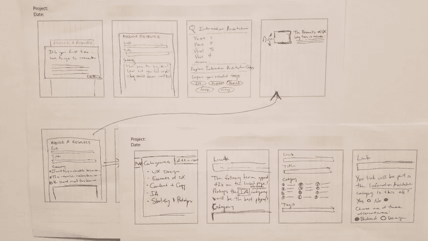
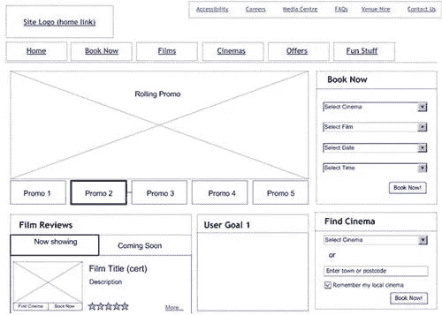

# UI/UX 设计过程中使用的技术

> 原文：<https://blog.devgenius.io/techniques-to-be-used-in-ui-ux-design-process-6bc87bdf0773?source=collection_archive---------9----------------------->

用户界面/UX 设计流程

为了用 UX 设计一个成功的用户界面，有几个工具可以在设计过程的不同阶段使用。

让我们来看看其中的一些。

## **1。草图**

一幅素描

一个**草图**可以被认为是一个要实施的设计想法的基本图解。换句话说，草图是一种交流工具，它首先将设计思想带给开发人员和用户。这是一种提出和提炼设计理念的方式。尽管素描可以简单地用铅笔和纸来完成，但是也有一些素描工具可以用来加速这个过程。

素描是一个快速的过程，不需要投入太多时间。应该通过关注有用性和何时需要来完成。草图是一个集合，探索不同的交互，同时一次阐明一个概念。因此，快速、及时、一次性、丰富和极简主义是素描的一些特征。在 UX 和 UI 开发的过程中，素描有几个优点和缺点。

**素描的优势**

*   素描有助于开放和创造性地思考，从而产生新的想法。
*   每个人都可以用草图快速地说明一个想法。因此，草图允许快速的头脑风暴来产生新的想法。
*   草图可以用来将想法存档，供以后思考。
*   快速使想法可视化变得容易。
*   草图是原始展示的好方法。
*   草图可以用来在线框之前确定想法。因此，可以显著减少线框阶段的变化次数。

**素描的缺点**

*   草图需要以数字形式复制，以便后续步骤使用。
*   广泛的草图可以导致显著的增强，这些增强更多地脱离了上下文，是对基本思想的补充。
*   没有可用的自动备份。

## 2.金属丝框架

金属丝框架

一个**线框**是一个用户界面的视觉表现，去除了任何视觉设计或品牌元素。UX 的设计者用它来定义屏幕上项目的层次结构，并根据用户需求来传达项目应该是什么。

线框可用于建立系统的基本设计。线框是非常有用的，因为它允许设计者规划应用程序的布局，而不受颜色、字体选择等的影响。此外，由于线框向涉众提供了系统的第一印象，在继续开发之前获得他们的反馈是很有用的。

**线框的优点**

*   线框可以用来让客户带着他们想要的想法和反馈参与到设计过程中。
*   使用线框，可以更有效地修改设计。
*   线框可以为项目节省时间和金钱。
*   线框降低了重新设计的风险，因为设计者通过线框获得了系统的完整概念。
*   线框提供了设计的精确蓝图。
*   设计师通过使用线框以一种更可读和有效的方式来组织内容。

**线框的缺点**

*   如果线框设计得太复杂，会浪费太多时间。
*   客户可能会发现很难理解线框。因此，设计师可能不得不解释一切。
*   准备好线框图后，创造性改变的能力降低了。

## 3.样机研究

原型

一个**原型**可以简单地定义为最终产品的一个样本模型，可以用来测试界面、交互&外观的效率。原型设计的主要目的是让设计师、客户和用户能够检查设计的界面和交互的正确性。

一个功能性的原型可以反映出用户将如何与系统的最终版本进行交互。原型有各种各样的优点和缺点。

**原型制作的优势**

*   甚至在产品开发之前，用户就可以对产品有一个清晰的感觉并提供反馈。因此，原型对于降低开发后重大变更的风险是非常有用的。
*   原型还可以提高客户满意度。
*   原型可以用来识别可用性和兼容性问题，并降低开发后可能发生的昂贵变更的风险。因此，原型制作可以节省时间和成本。
*   原型设计甚至对客户来说也更容易理解。因此，它允许用户和设计者之间的良好沟通。
*   通过使用一些设计工具，开发阶段可以随着原型的使用而加快。

**原型制作的缺点**

*   原型制作既耗时又昂贵。
*   原型的成功取决于设计者的能力。如果设计者的知识有限，原型可能会导致不必要的开发时间和资源的使用。
*   原型的一些插图在开发时可能不实用。因此，设计师和开发商之间可能会有分歧。

观看以下视频了解更多关于这个话题的信息。

*对此你有什么想法？如果你有任何问题或其他事实，请在下面评论。敬请关注下一篇文章。*

*业务查询，可以在这里* ***找我* [***。***](https://linktr.ee/Chamod_Kavishka)**