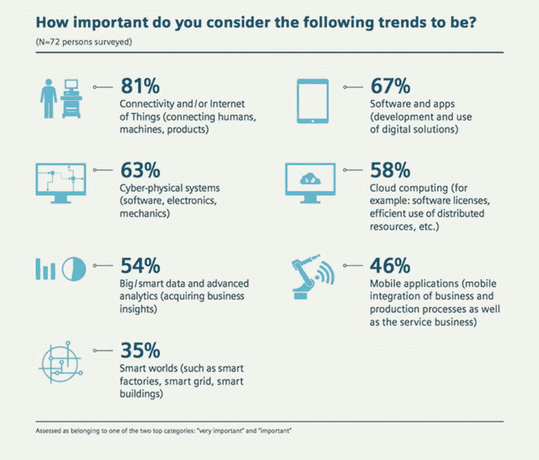
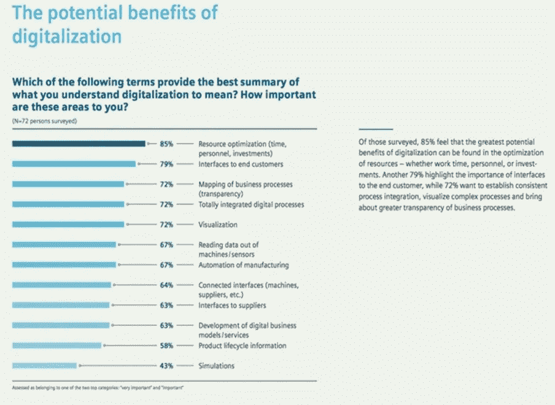
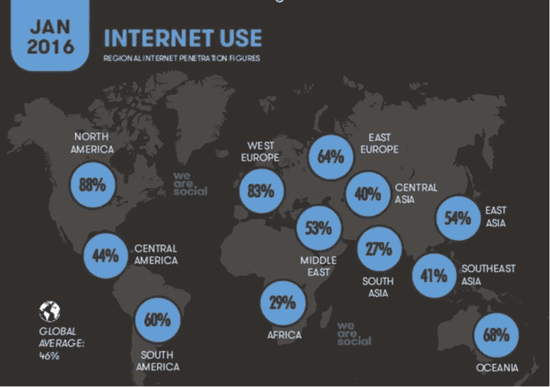
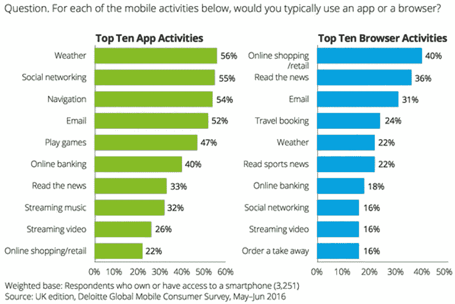
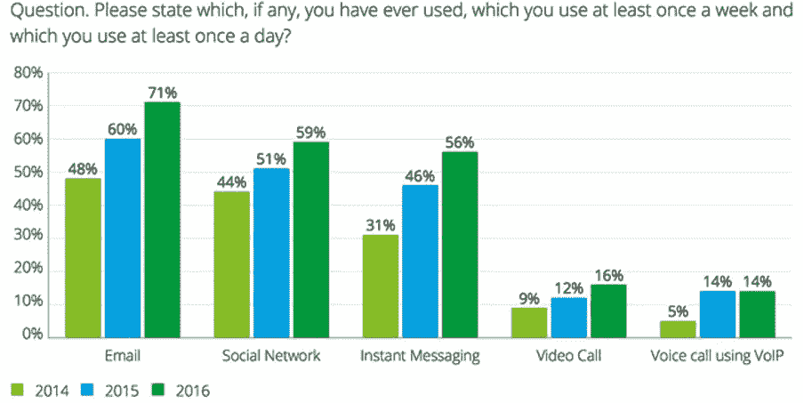
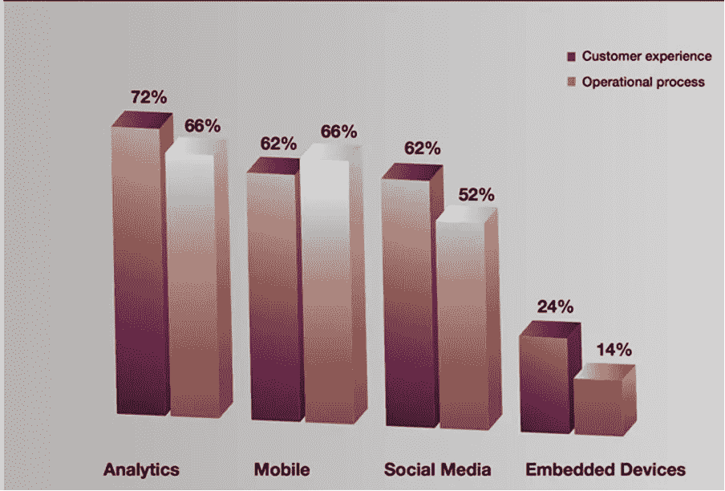
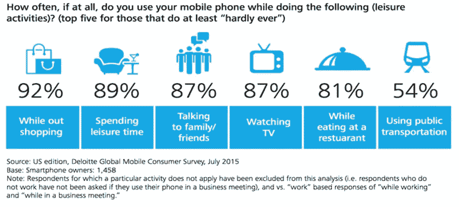
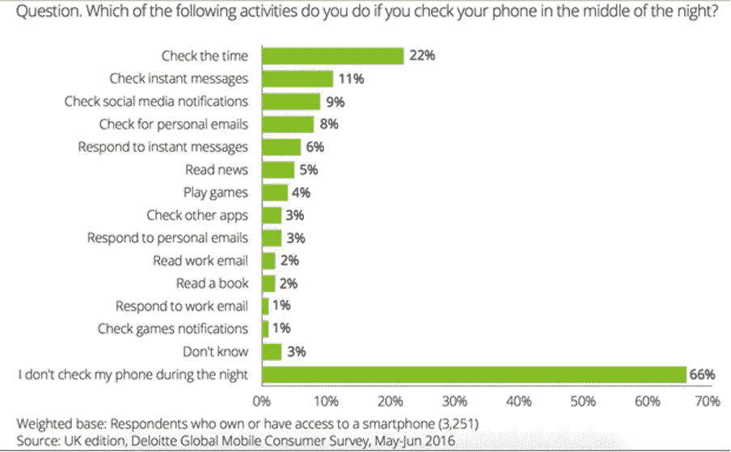
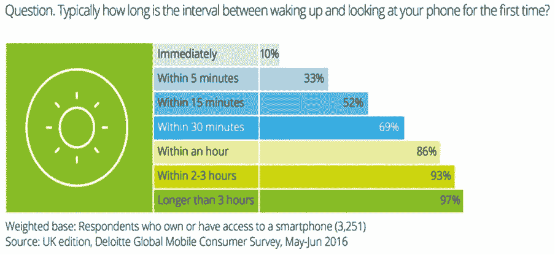
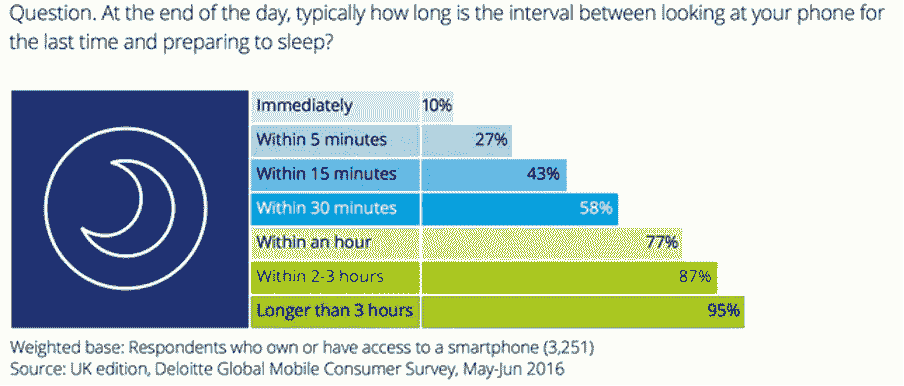

# 发展挑战:技术改变商业模式

> 原文：<https://blog.devgenius.io/technology-challenge-competitive-business-models-2516e5ac8ba7?source=collection_archive---------3----------------------->

对于任何类型的业务来说，技术是否重要？数字化如何影响商业模式？

今天，许多公司开始或继续发展业务，而没有考虑技术有多重要。在这篇文章中，我想根据我的研究和经验，谈谈技术和数字化有多重要，以及它们如何决定公司的命运。我想从数字化的历史和发展开始。

*数字化*这个术语在 1971 年的文章中首次使用，由北美评论出版为“*社会数字化”*。这是关于“*计算机辅助人文科学研究*”的背景和潜力。这一术语在部门事态方面有不同的含义。在今天的条件下，技术当然是主要因素，数字化是技术驱动的“事物”。

数字化，增加了广泛的技术，每个人都可以使用，因此它涉及到最重要的文化，行为，人口和生命周期的变化。基本上，由于数字化，终身学习，电子商务，电子银行，电子书，电子新闻，电子学习，电子旅游等。，条款出现了。简而言之，*“知识社会”一词出现了，但是，世界的体系、经济和技术的结构仍然必须不断维持。*

*当技术被认为是一门科学时，它被认为适用于诸如计算机和通信网络之类的设备，并且经常被应用于该领域。然而，它也可以应用于许多领域，如软件开发过程和软件技术(如数据库设计)。信息系统可以使用信息技术，但它并不等同于技术。从本质上讲，信息系统是一个位于组织环境中的人类活动系统——技术对信息系统很重要，但必须结合其人类和组织层面来考虑。*

*当我们审视这些解释时，类似地，数字化的概念和技术一样具有复杂和相关的动态性。互联网之所以如此活跃、有用和特别，是因为它使许多不同的人能够交流，而不仅仅是那些拥有大型大众媒体机构或为其工作的人。这就是为什么互联网在每一个可能的主题上提供了如此多的信息，成为其他人讨论的话题，最重要的是可以访问。互联网有效地利用了全世界的兴趣、创造力和智慧，创建了一个巨大的万物档案库，极大地降低了内容交付和分发的成本，并提供了一个通用的数据传输、存储和广播系统。*

*此外，杰克·m·巴尔金(Jack M. Balkin)指出，“社交网络”一词是随着互联网使用的增加而出现的，就像数字化的第一个含义“计算机辅助”一样。除了社交网络，金融服务、电子商务网站意识、电子广告、社交网络等相关概念也开始广为人知。成为科技社区并转变为社交网络社区并不是一个平稳的过渡，因为数字化带来了一些问题:“T0”监管“T1”和“T2”技术“T3”决策。当数字化故事的片段被放在一起，关键的地图显示了真相:这不是一个简单的故事，它仍在继续，简而言之，我们仍在数字化的道路上。*

**

*西门子，2015 年,《增强葡萄牙竞争力的趋势和解决方案》,第 11 页*

*随着故事的发展，数字化导致了包括技术和设备在内的“技术消费”。根据研究，大多数人都可以上网并使用智能手机。随着与技术相关的其他商品和服务的发展，人们越来越关注技术。他们在数字平台上变得更加活跃，并创建自己的社交网络档案。这是数字化的主要部分，因为它显示了人是数字化过程中的主角。*

*这就是为什么数字化没有标准模式，没有继续发展的限制。技术革命导致数字化和新的思维、工作和社交方式的出现。*

**

*西门子，2015 年,《增强葡萄牙竞争力的趋势和解决方案》,第 15 页*

*为了理解数字化的影响，可以从两个部分来解释:商业日常事务和日常事务。首先，在每一个日常业务流程中，数字化都扮演着重要的角色。85%的资源优化，包括时间、人员和投资，是杰出的百分比。公司把新的数字标准作为规则来使用。有趣的是，电子邮件不再是数字化的了。*

*根据德勤的说法，电子邮件仍然声称涉及数字化:每部智能手机都包括一个电子邮件应用程序。在过去的几年里，电子邮件的格式几乎没有什么变化，但它仍然是一种简单方便的快速收发信息的方式。数字通信工具等新工具正在无处不在地推动商业和智能手机领域的数字标准。*

*此外，我想谈谈在数字化的使用中解释的数字化在日常生活中的影响。许多智能手机用户为了玩游戏已经下载了数百万个应用程序。智能手机用户大部分时间都花在应用和社交网络上。一些最成功的数字服务，从出租车到订餐，都可以通过网站获得。尽管应用程序市场的价值分散在成千上万的发行商中，但事实证明它总体上是有利可图的。在过去八年中，应用商店通过下载销售和应用内支付创造了数百亿美元的收入。最成功的应用程序已经被下载了超过 10 亿次。下图显示了数字化如何快速、有效地改变世界。*

**

*2016 年的数字，我们是社会，2016 年 1 月 26 日，第 21 页*

*此外，根据以下研究，数字化使用的普及，尤其是世界范围内活动的普及，表明数字化不仅是显示人们生活重要性的百分比；不是奢侈品需求；这是日常生活中非常重要的一部分:这是“不可否认”的事实。*

**

*德勤，2016 年，第 49 页，没有一个地方像电话，2016 年全球移动消费者调查:英国削减*

*例如，在上班、上学或开会之前，人们不会在查看天气之前出门。在传统方式中，人们更喜欢使用浏览器，然而由于数字化，通过移动应用程序来查看天气是非常有效的方式。此外，数字化允许人们根据他们安排的通知来查看天气，并在智能设备上显示为消息、邮件等通知。，可在设备屏幕上找到。*

*又如，即使在日常生活中，大多数人也使用社交网络平台，如脸书、推特、WhatsApp、Instagram、Linkedin 等。人们分享他们的个人信息，例如工作电话号码、家谱、照片、他们工作的地方、他们所在的位置、他们的感受、他们正在做的活动、他们和谁在一起、他们负责的时间表等等。，通过社交网络平台。*

*因此，“社交网络”是数字世界的关键之一。技术的进步伴随着数字化的结果，出现了新的术语，“新一代技术”。*

*为了了解社会中新一代技术的发展速度，从以下关于智能设备使用的研究中，通过每年的比较来证明突出的结果。例如，电子邮件日常检查在 2014 年为 48%，2015 年为 60%，2016 年为 71%。2014 年至 2016 年间的惊人幅度为 23%。此外，在 2014 年和 2016 年之间，即时消息的范围是 25%。根据图表，下面给出了按年份解释的详细活动比较。*

**

*德勤，2016 年，第 42 页，没有一个地方像电话，2016 年全球移动消费者调查:英国削减*

*根据下图，它是关于成为新一代技术的一部分，通过客户体验(最终用户)和运营流程(技术开发)解释新一代技术的使用。很明显，新一代技术主要用于分析。注意这一点很重要:智能移动设备使世界各地的每个用户都可以访问任何信息，人们可以通过这些技术进步做什么是不可预测的。这种情况实际上可以解释为新一代技术。*

*此外，根据普华永道的报告，它揭示了移动设备的使用在新一代技术中的重要性。看完这篇报道，没多久我就意识到我们印象有多深刻。数字技术继续扩大其影响。数字世界的基础设施主干为数十亿消费者带来了价格合理的宽带。与此同时，每个行业都在使用低成本的互联设备，云计算及其所需的快速计算机器也在快速发展。低成本的连接设备(尤其是移动设备)和快速信息(社交媒体和分析)构成了下一代技术。*

**

*凯捷咨询，《数字化转型:十亿美元组织路线图》，2011 年麻省理工学院数字商业中心和凯捷咨询，第 29 页*

*与普华永道一样，德勤移动使用报告标榜社会必须学会如何应对新一代技术。很明显，移动设备在人们的每一项活动中都影响着日常生活。下图说明了移动设备在数字化和新一代技术中的重要作用。*

*当我们审视移动使用和新一代技术流程时，移动使用在每项活动中完全塑造了人们的日常生活，这是一个重要的结果。通过移动设备购物，92%的使用比例，足以证明移动设备对新一代技术的重要性。*

**

*德勤，2015 年,《全球移动消费者调查:美国版:永远联网消费者的崛起》,第 4 页*

*半夜的活动按百分比解释在手机使用期间。突出的结果是，人们甚至不用手表来看时间，主要设备是手机是公认的。此外，在这些情况下，查看即时消息和社交媒体通知是第二项活动，这实际上意味着数字化是人们生活的主要部分。*

**

*德勤，2016 年，没有一个地方像手机一样，在智能手机高峰期的消费者使用模式 2016 年全球移动消费者调查:英国削减，第 6 页*

**

*德勤，2016 年，没有一个地方像手机一样:高峰智能手机时代的消费者使用模式 2016 年全球移动消费者调查:英国 Cut，第 4 页*

**

*德勤，2016 年，没有一个地方像手机一样:高峰智能手机时代的消费者使用模式 2016 年全球移动消费者调查:英国 Cut，第 5 页*

*根据 EY 的说法，“数字创新”是个人和公司生存的必要条件。他们在 2011 年的报告《万物数字化——组织必须如何适应不断变化的消费者行为》中解释了“万物”的概念。*

*那么商业模式是如何受到影响的呢？数字化和技术带来竞争了吗？当我们为了寻求答案而进行推理时，我们有可能做出许多判断。但最重要的是，值得承认的是:在数字世界，真正的当务之急是，公司必须在竞争之前，根据技术追求创新，发展自己的商业模式。在技术领域承担风险和制定战略已经成为竞争的必要条件。没有创新战略，公司将在日益商品化的世界中失去竞争优势。没有时间可以浪费了。随着技术变革呈指数级加速，新的数字平台和设备不断涌现，我们也在不断失败。此外，新的“Y 一代”加上“Z 世代”或“数字原住民”的前景意味着公司必须跟上变化的步伐，否则就会失去相关性。*