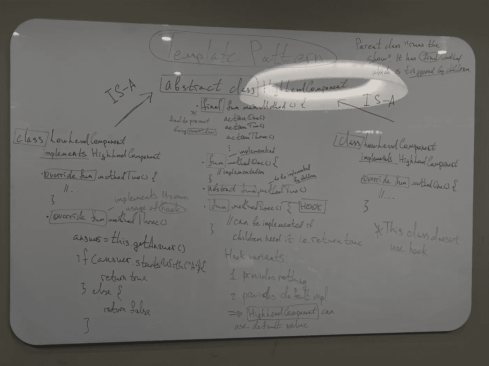

# 封装算法的模板模式

> 原文：<https://blog.devgenius.io/template-pattern-for-encapsulating-algorithms-kotlin-3ded81377fc5?source=collection_archive---------10----------------------->

N 冰再次见到你，花样磨床👋这是我在“设计模式”系列中的第八篇文章。请务必消化所有以前的文章，因为其中包含了大量的信息👀：

*   策略模式:[https://medium . com/toward sdev/strategy-pattern-for-independent-algorithms-kot Lin-70 ed 24 c 7 BD 8 b](/towardsdev/strategy-pattern-for-independent-algorithms-kotlin-70ed24c7bd8b)
*   观察者模式:[https://medium . com/toward sdev/observer-pattern-for-loose-coupling-kot Lin-f5ab 804609 bb](/towardsdev/observer-pattern-for-loose-coupling-kotlin-f5ab804609bb)
*   装饰模式:[https://medium . com/toward sdev/decorator-decorator-pattern-for-object-composition-kot Lin-7 CEC 92 cbaf 7b](/towardsdev/decorator-decorator-pattern-for-object-composition-kotlin-7cec92cbaf7b)
*   工厂模式:[https://medium . com/dev-genius/factory-patternS-to-hide-instantiation-kot Lin-D5 f 01 cf 01921](/dev-genius/factory-patterns-to-hide-instantiation-kotlin-d5f01cf01921)
*   单例模式:[https://medium . com/dev-genius/singleton-pattern-for-one-of-a-class-objects-Java-a63c 774 d9d 4](/dev-genius/singleton-pattern-for-one-of-a-kind-objects-java-a63c774d9d4)
*   命令模式:[https://medium . com/dev-genius/command-pattern-for-encapsulated-invocation-kot Lin-4338 EB 23 D2 ca](/dev-genius/command-pattern-for-encapsulated-invocation-kotlin-4338eb23d2ca)
*   适配器和外观模式:[https://medium . com/dev-genius/adapter-Facade-pattern-for-perfect-adapting-kot Lin-ccbc 8 f 8 cfcd 6](https://medium.com/dev-genius/adapter-facade-pattern-for-perfect-adapting-kotlin-ccbc8f8cfcd6)

我要感谢[奥赖利媒体](https://medium.com/u/fbfa235a954c?source=post_page-----3ded81377fc5--------------------------------)的精彩著作，因为它将复杂的东西分解成易于管理的部分:[https://www . oreilly . com/library/view/head-first-design/9781492077992/](https://www.oreilly.com/library/view/head-first-design/9781492077992/)

结构:

*   介绍
*   问题
*   要遵循的设计原则
*   最终解决方案代码
*   额外第一部分
*   额外第二部分
*   图画

# 模板模式

## 介绍

正如你可能从文章标题中猜到的，这个模式将被用来封装算法。**等等……**✋它类似于另一种模式，之前已经介绍过，名为**战略模式**。有什么区别？请耐心等待，直到我将逐步浏览的*额外部分*。

正如您所看到的，当您已经研究了大量的模式时，您开始在它们的行为中找到相似之处&可以发现不同之处。此外，随着你对面向对象设计越来越有信心，下一个模式会更容易掌握🏋️‍♀️

## 问题

让我们假设您需要为某个咖啡馆构建一个系统，那里的两种主要饮料是茶和咖啡。您将使用各自的方法记下两个类:

现在你开始发现一些东西，interesting🧐:，有些方法在他们做事的方式上非常相似。在上面的代码中`boilWater()` & `pourInCup()`彼此很相像。

> 不要看这里相似的命名，想象一下这些方法包含的**相似行为**的想法

现在，您从我以前的文章中汲取了面向对象的知识(我希望您已经通读了它们！👺)，为下一个重新设计:

所以，我们创建了一个抽象类，它有`abstract fun prepareRecipe()`。

1.  它由每个子类实现。
2.  此外，我们将两个相似的方法(在内部做事情的方式上相似)放在`abstract`类中，以减少代码重复。
3.  并且`abstract`该方法在每个子类中用另外两个方法实现(每个子类中的数量可能不同)
4.  我们调用每个孩子`prepareRecipe()`，它利用了来自`abstract class`的相似方法和来自自己类的独特方法(比如`addLemon()`)

好点了吗？->是的！我们能做得更好吗？->是的！🙌

但是如果我们翻转图片呢？我们有做类似事情的孩子，但是这些事情的内容不同。为什么不减少代码重复甚至 more❓

步骤:

1.  将`prepareRecipe()`放在`abstract class` &中，使其成为最终状态，以防止任何孩子**覆盖**它
2.  在`abstract class` & **中保留类似的子方法，在 Java 中将它们标记为 final**| |在 Kotlin 中什么都不做(大多数情况下，你不希望子方法覆盖它们)
3.  同样在`abstract class`中编写不同的方法，但是使用`abstract`字
4.  覆盖子元素中的那些`abstract`方法。
    PS:别忘了`extend`母 class❗️

*   我们为不同的方法起了一个名字，这个名字描述了它们做事情的整体方式。就像，`addLemon()` & `addSugarAndMilk()`就会有类似`addCondiment()`的东西。我希望你抓住了要点👌

现在，让我们转到设计原则，然后我将对流程进行详细分析🌊

## 要遵循的设计原则

1.  **好莱坞原则** ✨:不要打电话给我们，我们会打电话给你

那么，这意味着什么呢？我是 bonkers⁉️吗实际上，不是…

more➰准备好了吗？

`=>`它防止我们陷入所谓的“依赖腐烂”。这是什么意思？

高层组件(我们的`abstract class`)依赖于低层组件(子组件:`Tea & Coffee`)。然后，这些低级组件在某种程度上又依赖于高级组件，on…➿➿➿也是如此

你声称:“我不相信你，证明一下！!"👿我们走吧:

查看最后一段代码(在解释正确的设计之前)

1.  低级组件覆盖`prepareRecipe()`方法= >高级组件依赖低级
2.  在**被覆盖的方法内**子调用一些来自高层组件的方法= >低层组件依赖高层

我现在证明给你看了吗？🤯

更正确的做法是让**高层组件**调用所有**低层组件**，即父组件控制显示/调用子组件(随便你怎么命名)。

现在，让我们继续进行代码演练，在这里我将给出一个详细的运行过程，并演示这个原则的实际应用🔥

## 最终解决方案代码

访问我的回购看看所有的 code☄️:

 [## KotlinDesignPatterns/src/main/kotlin/8 _ template pattern at main…

### Kotlin + Medium 文章中的设计模式。通过以下方式为 sleep less challenger/KotlinDesignPatterns 开发做出贡献…

github.com](https://github.com/SleeplessChallenger/KotlinDesignPatterns/tree/main/src/main/kotlin/8_TemplatePattern) 

行こう！

1.  `main.kt`是我们实例化两个子类的文件:`Tea` & `Coffee`
2.  `HighLevelComponent.kt`我们的高级组件是前面提到的吗？
3.  `LowLevelComponentOne.kt` & `LowLevelComponentTwo.kt`都是我们的低级组件

So⚙️:

1.  我们创建了两个子类，它们是主类的子类
2.  然后我们从上面调用`mainMethod()`也就是我们的`createRecipe()`

‼️ **迂回:** ‼️当我们触发这个方法的时候，它会转到父节点。然后父类按顺序调用方法:没有`abstract`的方法来自父类，有`abstract`的方法来自子类，**是子类覆盖的**。

*   在 Java 中，你需要在这个主方法附近写`final`。在 Kotlin 中，方法已经是最终的了，因此不要写任何东西
*   可以看到，*高层组件*调用*低层组件*，即父组件的方法触发子组件所需的方法。所以，孩子依赖于*高层组件*。他们被称为

> 高级组件将算法保存在整个动作集的**主方法**中

结果，又一次😪，*高层次的* *组件*运行这个节目，我们已经将**代码重复**减少到最小。其他方法可以很容易地挂钩👍

## 额外第一部分

说到钩子…🔧

如果你想给孩子们额外的功能呢？例如:

*   允许他们根据用例定义或不定义方法？

有答案-> **勾**🤟

什么是钩子？->父类中有默认实现的方法，例如`return true`，或者根本没有实现。

*   Java 中一般不标注为`final`，但 Kotlin 中需要标注`open`
*   子类可以自由地实现它或者保持原样
*   要使用**钩子** - >在子类中覆盖它

在上面的 my repo 中，导航到`HighLevelComponent.kt`，其中`thirdMethod()`是一个**钩子**的例子。`LowLevelComponentOne`定义了钩子，但`LowLevelComponentTwo`保持原样。

## 额外第二部分

正如我在开始时所承诺的，我将明确区分**策略** & **模板**模式。

这两种模式在外观上有些相似，但让我们在它们之间画一条独特的线:

1.  **模板**定义了一个算法，其步骤有时会被子代覆盖。**策略**定义了一系列可互换的算法(通过**对象组合**完成)

我知道知道，很抽象😵看看我的文章**战略模式**(如果你还没有😬):[https://medium . com/toward sdev/strategy-pattern-for-independent-algorithms-kot Lin-70 ed 24 c 7 BD 8 b](/towardsdev/strategy-pattern-for-independent-algorithms-kotlin-70ed24c7bd8b)

在**代码演练**中，你可以看到我们的子类`King`或`Queen`与父类`Character`有关系。但是每个孩子都有自己的算法来用武器完成一系列想要的动作。通过**对象组合**完成。

因此，孩子们主宰着表演，而 `abstract class`给出了一个总体结构，仅此而已。

是的，**模板模式**比**策略**更加依赖，因为孩子在**策略**下，他们更加自由。

> 因此，T 模式使用继承(IS-A)，而 S 模式利用组合(HAS-A)

## 图画🤩

像往常一样，我在白板上涂鸦来吸收整体设计🤯在中间你可以看到*高级组件*，而在左边&到右边*低级组件*。

*   此外，我已经展示了与**挂钩**的区别

## 结尾部分

> 模板模式的学术定义:在方法中保留算法的框架，允许子类自己定义特定的步骤。尽管子类可以重新定义算法中的某些步骤，但它们不能改变主结构

我相信这篇文章与前一篇相比要轻松一些🤕同样，如果你没有得到什么，就在评论里留言吧！

你可以找到我:

*   领英:[www.linkedin.com/in/sleeplesschallenger](http://www.linkedin.com/in/sleeplesschallenger)
*   GitHub:[https://github.com/SleeplessChallenger](https://github.com/SleeplessChallenger)
*   leet code:[https://leetcode.com/SleeplessChallenger/](https://leetcode.com/SleeplessChallenger/)
*   电报:@无眠挑战者