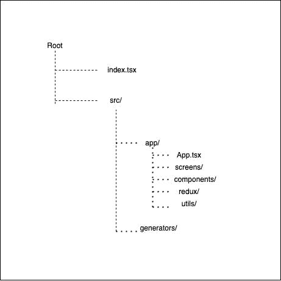

# 在 React Native 中创建组件模板。

> 原文：<https://blog.devgenius.io/templating-in-react-native-b2d2c609418c?source=collection_archive---------7----------------------->

当你和很多队友一起做一个大项目时，模板是一个很好的选择。通过为你的应用程序文件夹保持一个固定的结构，它节省了你很多时间，当有人新加入到这个项目中时，它不会试图理解应用程序的结构。如果你和我一样懒，那就省去了为你创建的每个屏幕或组件创建文件的单调任务。

那我们怎么做？嗯，我们将为我们的应用程序创建模板。因此，让我们首先创建一个项目。

```
npx react-native --ignore-existing init MyApp --template react-native-template-typescript
```

如果你想在你的应用中使用 javascript，你仍然可以跟随。只有文件扩展名必须是。js 和。jsx 依赖于用例，而不是。ts 和。tsx，其余一切将保持不变。所以，不用担心。✌

因此，运行上面的命令，react native 应该会给你锅炉板代码。之前，我们继续安装另一个依赖项，它将是我们用例的超级英雄，让我们稍微调整一下锅炉板代码。

*   在项目的根目录下创建一个 src 文件夹。并在其中创建两个文件夹，app 和 generators。
*   现在把你的 App.tsx 移到 src/app 里面。并创建其他文件夹，如下图所示。



为什么有这么多文件夹，妈妈？🤯


让我给你解释一下。

components 目录将保存所有全局组件，screen 将保存所有屏幕，redux 目录将保存 rootReducer、rootSaga 和 store。这样，每个目录包含的内容就变得非常明显，当你在寻找某个特定的东西时，你现在知道在哪里可以找到它。🤩


好的。最后一个先决条件。我保证，这是最后一次。在组件目录中创建一个 index.tsx 文件，并添加以下几行。


```
/* COMPONENT IMPORTS */

export { /* COMPONENT EXPORTS */ };
```

你很快就会知道添加这个的原因。

现在，是时候登上我们的超级英雄**了。它基本上是一个构建在 **Handlebars.js** 之上的模板框架，给你模板化的终极能力。你可以在这里了解更多关于[的信息。](https://plopjs.com/)**

```
yarn add --dev plop
```

现在让我们进入发电机目录。在其中创建一个 **index.js** 并添加以下几行。

```
const componentGenerator = require('./component');
const screenGenerator = require('./container');module.exports = plop => {
  plop.setGenerator('component', componentGenerator);
  plop.setGenerator('screen', screenGenerator);
};/* You may add multiple generators based on your requirements. */
```

现在让我们逐个创建这些生成器。

**组件生成器:**

*   创建一个名为 component 的文件夹。
*   在其中添加一个 **index.js** 、一个 **index.tsx.hbs** 和一个 **styles.tsx.hbs** 文件。
*   并添加以下内容:

index.js:

```
 const componentExists = require('../checks');module.exports = {
  description: 'Creates a Global Component',
  prompts: [
    {
      type: 'input',
      name: 'name',
      message: 'Name of the component: ',
      default: 'Button',
      validate: name => {
        if (/.+/.test(name)) {
          return componentExists(name)
            ? 'A component or container with this name already exists'
            : true;
        } return 'The name is required';
      },
    },
  ],
  actions: [
    {
      type: 'add',
      path: 'your_path_to_components/{{pascalCase name}}/index.tsx',
      templateFile: './component/index.tsx.hbs',
    },
    {
      type: 'add',
      path: 'your_path_to_components/{{pascalCase name}}/styles.tsx',
      templateFile: './component/styles.tsx.hbs',
    },
    {
      type: 'append',
      path: 'your_path_to_components/index.ts',
      pattern: /(\/\/ COMPONENT IMPORTS)/g,
      template: `import {{pascalCase name}} from './{{pascalCase name}}';`,
    },
    {
      type: 'append',
      path: 'your_path_to_components/index.ts',
      pattern: /(\/\/ COMPONENT EXPORTS)/g,
      template: `  {{pascalCase name}},`,
    },
  ],
};
```

index.tsx.hbs:

```
import React, {PureComponent} from "react";
import {View, Text} from "react-native";
import styles from "./styles";

export interface Props {}

export interface State {}

class {{pascalCase name}} extends PureComponent<Props, State> {
    render() {
        return (
            <View style={styles.container}>
                <Text>
                    {{pascalCase name}}
                </Text>
            </View>
        )
    }
}

export default {{pascalCase name}};
```

styles.tsx.hbs:

```
import {StyleSheet, ViewStyle} from 'react-native';

interface Styles {
  container: ViewStyle;
}

const styles = StyleSheet.create<Styles>({
  container: {
    flex: 1,
    justifyContent: 'center',
    alignItems: 'center',
  },
});

export default styles;
```

现在，您已经完成了组件。现在我们还需要添加一个检查器来检查我们正在创建的组件或文件是否已经存在。为此。在生成器中创建一个检查目录。

并添加以下几行。

```
const fs = require('fs');
const path = require('path');

const appComponents = fs.readdirSync(
  path.join(__dirname, '../../../app/components'),
);
const appContainers = fs.readdirSync(
  path.join(__dirname, '../../../app/screens'),
);

const components = appComponents.concat(appContainers);

function componentExists(comp) {
  return components.indexOf(comp) >= 0;
}

module.exports = componentExists;
```

现在让我们创建屏幕生成器。遵循与组件相似的步骤。

*   创建一个容器文件夹。并添加一个 **index.js** 文件。另外添加 **class.tsx.hbs，function.tsx.hbs，styles.tsx.hbs，actions.ts.hbs，reducer.ts.hbs，saga.ts.hbs，action.types.ts.hbs** 。
*   现在添加以下代码。

index.js:

```
const componentExists = require('../checks');module.exports = {
  description: 'Creates an App Screen',
  prompts: [
    {
      name: 'name',
      message: 'Name of the app screen: ',
      default: 'HomeScreen',
      validate: name => {
        if (/.+/.test(name)) {
          return componentExists(name)
            ? 'A component or container with this name already exists'
            : true;
        } return 'The name is required';
      },
    },
    {
      type: 'list',
      name: 'input',
      message: 'Choose component type: ',
      choices: ['class', 'function'],
      default: 'class',
    },
    {
      type: 'confirm',
      name: 'wantActionsAndReducer',
      default: true,
      message:
        'Do you want an actions/constants/selectors/reducer tuple for this container?',
    },
    {
      type: 'confirm',
      name: 'wantSaga',
      default: true,
      message: 'Do you want sagas for asynchronous flows? (e.g. fetching data)',
    },
  ],
  actions: res => {
    const actions = [
      {
        type: 'add',
        path: '../../app/screens/{{pascalCase name}}/styles.tsx',
        templateFile: './container/styles.tsx.hbs',
        abortOnFail: true,
      },
    ];
    if (res.input === 'function') {
      actions.push({
        type: 'add',
        path: '../../app/screens/{{pascalCase name}}/index.tsx',
        templateFile: './container/function.tsx.hbs',
        abortOnFail: true,
      });
    } if (res.input === 'class') {
      actions.push({
        type: 'add',
        path: '../../app/screens/{{pascalCase name}}/index.tsx',
        templateFile: './container/class.tsx.hbs',
        abortOnFail: true,
      });
    } if (res.wantActionsAndReducer) {
      actions.push({
        type: 'add',
        path: '../../app/screens/{{pascalCase name}}/actions.ts',
        templateFile: './container/actions.ts.hbs',
        abortOnFail: true,
      }); actions.push({
        type: 'add',
        path: '../../app/screens/{{pascalCase name}}/action.types.ts',
        templateFile: './container/action.types.ts.hbs',
        abortOnFail: true,
      }); actions.push({
        type: 'add',
        path: '../../app/screens/{{pascalCase name}}/type.d.ts',
        templateFile: './container/type.d.ts.hbs',
        abortOnFail: true,
      }); actions.push({
        type: 'add',
        path: '../../app/screens/{{pascalCase name}}/selectors.ts',
        templateFile: './container/selectors.ts.hbs',
        abortOnFail: true,
      }); actions.push({
        type: 'add',
        path: '../../app/screens/{{pascalCase name}}/reducer.ts',
        templateFile: './container/reducer.ts.hbs',
        abortOnFail: true,
      });
    }
    if (res.wantSaga) {
      actions.push({
        type: 'add',
        path: '../../app/screens/{{pascalCase name}}/saga.ts',
        templateFile: './container/saga.ts.hbs',
        abortOnFail: true,
      });
    }
    return actions;
  },
};
```

action . type . ts . HBS:

```
/*
 *
 * {{ properCase name }} action types
 *
 */const {{ properCase name }}ActionTypes = {};export default {{ properCase name }}ActionTypes;
```

action.ts.hbs:

```
/*
 *
 * {{ properCase name }} actions
 *
 */ import * as actionTypes from "./action.types";
```

class.tsx.hbs:

```
import React, {PureComponent} from "react";
import {View, Text} from "react-native";
import styles from "./styles"; interface Props {}interface State {}class {{pascalCase name}} extends PureComponent<Props,State> {
    render() {
        return(
            <View style={styles.container}>
                <Text>{{pascalCase name}}</Text>
            </View>
        )
    }
}export default {{pascalCase name}};
```

function.tsx.hbs:

```
import React, {memo, FC} from "react";
import {View, Text} from "react-native";
import styles from "./styles"; interface Props {}const {{pascalCase name}}: FC<Props> = (props) => {
 return (
     <View style={styles.container}>
         <Text>{{pascalCase name}}</Text>
     </View>
 )
};export default memo({{pascalCase name}});
```

reduce . ts . HBS:

```
import * as actionTypes from "./action.types";/* Mention the types */
export const INITIAL_STATE = {};/* Mention the types */
const {{ camelCase name }}Reducer = (state = INITIAL_STATE, action) => {
    switch (action.type) {
        default: 
            return state;
    }
 }; export default {{ camelCase name }}Reducer;
```

saga.ts.hbs:

```
/*
 Add your Saga to the root saga
*/import { take, call, put, select, all } from 'redux-saga/effects';
// import axios from "../../config/axios.config"; export function* {{ camelCase name }}Saga() {
  yield all([
    // call all other sagas here.
  ]);
}
```

选择器. ts.hbs:

```
// {{properCase name }} selectors
```

styles.tsx.hbs:

```
import {StyleSheet, ViewStyle} from 'react-native';interface Styles {
  container: ViewStyle;
}const styles = StyleSheet.create<Styles>({
  container: {
    flex: 1,
    justifyContent: 'center',
    alignItems: 'center',
  },
});export default styles;
```

类型 d . t:

```
/**
 **
 * {{ properCase name }} types
 *
 **/*
```

现在，你完成了你的发电机。让我们将它添加到您的 package.json 中，这样您就可以简单地执行，而不必编写完整的脚本。

将此脚本添加到您的包中。json:

```
"generate": "plop --plopfile src/generators/index.js"
```

现在，只需运行`yarn generate`或`npm run generate`即可获得 CLI 选项，一切就绪。


再见。快乐编码。有任何疑问，请联系我。:)

**关注**我获取更多此类内容。谢了。祝你有美好的一天！

注意安全，戴上口罩，尽可能地清洁自己！😊