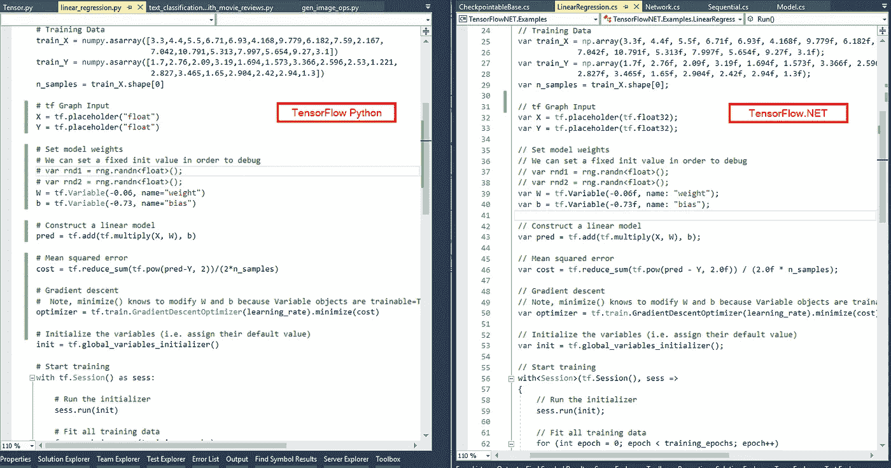
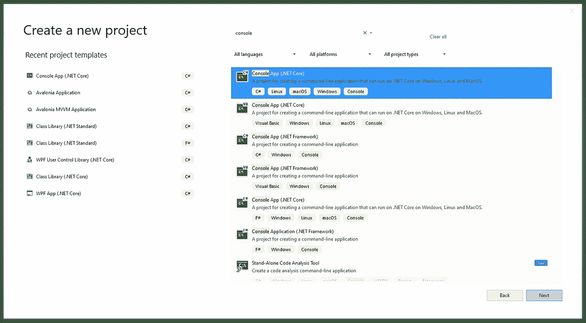
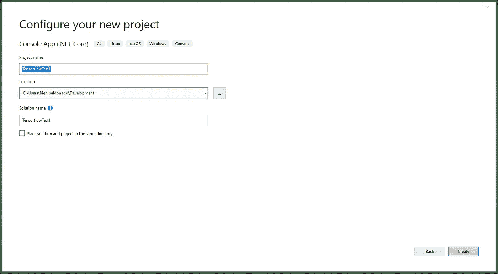
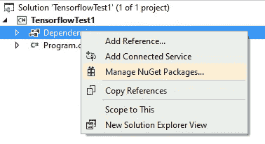
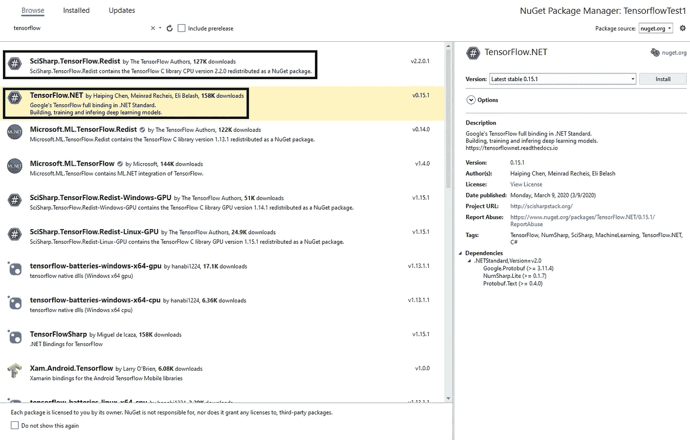
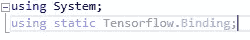
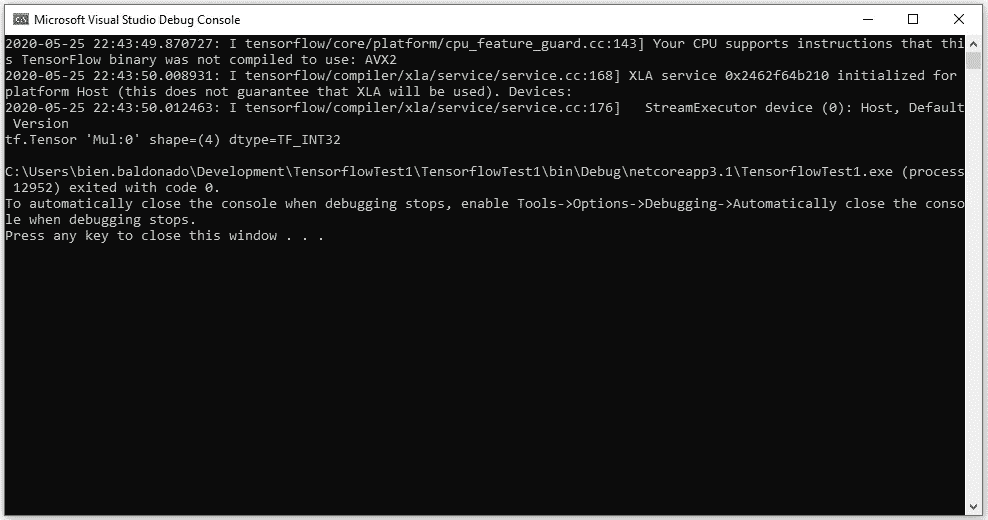
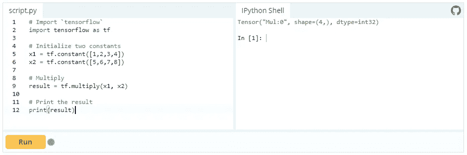
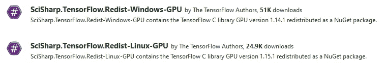

# Tensorflow 的基本设置。NET 开发人员

> 原文：<https://blog.devgenius.io/tensorflow-basic-setup-for-net-developers-d56bfb0af40e?source=collection_archive---------2----------------------->

*此文原帖于*[*【http://www.thebeet21.com】*](http://www.thebeet21.com)

所以这几天我一直在看关于机器学习的书。作为一名好奇的开发人员，这是我非常想学习如何自己做的事情之一。想象一下简化最复杂的想法的想法，这在典型的编程设置中需要花费大量的时间和精力。机器学习只需几行代码就能实现。

每次我读到一篇关于它的文章，或者在 Youtube 上看到人们使用它的视频，我都忍不住想自己学习它，并用它做一些很酷的东西。直到最近谷歌推出了 Tensorflow，这是一个用于机器学习和数据分析的免费开源库，这对于一个典型的人来说还很遥远。

张量流是计算世界发生的最好的事情之一。对于任何有耐心学习如何编码的人来说，它让机器学习变得非常简单。谷歌基本上把他们出色的工具传给了大众。

在我看来只有一个问题。为了能够使用它，你必须学习如何用 Python 编码。不要误解我。用任何其他语言都能做到的事情，用 Python 也能做到。但是对于像我这样多年来一直用不同语言编程的人来说，仅仅为了一个目的而学习 Python 似乎是对时间和资源的低效利用。这可能是一个已经在这个行业工作了十多年的软件工程师的评论。但是如果说我从软件开发中学到了什么的话，拥有一个专长总是一个优势，学习另一种编程语言更多的是横向增长:这很好，但不会给职业生涯带来太多好处。

所以我是一个想做机器学习的. NET 开发者。但是 Tensorflow 只针对 Python 和其他一些不在。网伞。嗯，那是在 Tensorflow.NET 被介绍之前的情况。

Tensorflow 是一个 Tensorflow 绑定库，在。净标准。该项目旨在将整个 Tensorflow API 交付给。网络生态系统。作为一个. NET 标准库，它可以通过。网芯。让这个项目更棒的是，他们发现了一种保持。NET 版本尽可能接近实际的 Python 代码。这使得使用。NET 库就像在 Python 中使用实际的 API 一样简单。



也许你会问。我们已经有了一个机器学习库。NET 哪个是 ML.NET 那么学张量流有什么意义呢？的确，我们已经有了 ML.NET。唯一令人担忧的是，它仍然是一个相对较新的机器学习框架。自从发布以来，他们已经取得了很大的进步。但是他们还有很多工作要做。事实上，ML.NET 的最新版本(撰写本文时为 1.4)使用 Tensorflow 通过 Tensorflow.NET 绑定在 GPU 支持下实现深度神经网络(DNN)迁移学习。所以在我看来，无论你是否想继续留在 ML.NET，通过 Tensorflow 学习张量流仍然是一个值得努力的方向。

那么我们应该怎么做才能使用 Tensorflow.NET 呢？首先，我们必须确定 Tensorflow.NET 不是什么。

*   张量流。NET 不是 Python 版本的包装器。因此，您不需要安装 Python 版本或任何其他版本来使其工作。
*   张量流。NET 不是原始 Tensorflow 库的. NET 版本。它只是一个绑定库，也就是说，它需要另一个库才能工作。
*   由于 Tensorflow.NET 依赖于 Tensorflow API，某个 Tensorflow 版本应具有相应的 Tensorflow.NET 版本。因此，使用 Tensorflow 的最新版本(撰写本文时为 0.20)可能适用于 Tensorflow 1.15 和 2.2，但不适用于 1.15 以下的任何版本。根据您打算使用的 Tensorflow 版本，自述文件应该能够指导您找到正确的绑定库版本。

现在我们知道了 Tensorflow.NET 不是什么，让我们讨论一下 Tensorflow.NET 是什么。

*   张量流。NET 是一个基于 Microsoft.ML.TensorFlow.Redist 的 SciSharp 可再发行包的绑定库。网络绑定是可能的。
*   为了能够使用 Tensorflow.NET，你必须在 NuGet 中添加一个对它的引用。此外，您必须为您拥有的 Tensorflow.NET 版本选择正确的可分发版本。根据您的需求，您可以选择 CPU 或 GPU 版本。
*   如果你想在 GPU 上使用 Tensorflow.NET，你需要一个支持 CUDA 的 Nvidia 显卡。您可以使用的 CUDA 版本取决于您拥有的显卡。请参考 Nvidia CUDA 文档以了解更多信息。

现在我们知道了所有这些事情，让我们开始吧。

打开 Visual Studio，创建一个**控制台项目**。



一旦我们创建了项目，我们需要打开 **NuGet 包管理器**来搜索我们需要的库。



一旦你进入 NuGet 包管理器，点击**浏览**标签，寻找**Tensorflow.NET**和 **SciSharp。Tensorflow.Redist** 。我们必须将它们都安装到项目中。



一旦它们被安装，我们必须添加`using static Tensorflow.Binding;`来声明我们正在使用 Tensorflow.NET。



在这之后，我们都准备好了。为了尝试一下，我在 [DataCamp](https://www.datacamp.com/community/tutorials/tensorflow-tutorial?utm_source=adwords_ppc&utm_campaignid=1455363063&utm_adgroupid=65083631748&utm_device=c&utm_keyword=&utm_matchtype=b&utm_network=g&utm_adpostion=&utm_creative=278443377086&utm_targetid=dsa-498578051924&utm_loc_interest_ms=&utm_loc_physical_ms=1011179&gclid=EAIaIQobChMIqe3O35TF6QIVxFVgCh3MIgbdEAAYASAAEgJKFvD_BwE) 中复制了一个样本代码。我强烈推荐他们那里有很好的初学者 Tensorflow 教程。

```
static void Main(string[] args)
{
    // Initialize two constants
    var x1 = tf.constant(new int[] { 1, 2, 3, 4 });
    var x2 = tf.constant(new int[] { 5, 6, 7, 8 });
    // Multiply
    var result = tf.multiply(x1, x2);
    // Print the result
    print(result);
}
```

运行项目以查看结果。



为了检查结果是否相同，我运行了教程中嵌入的在线 Python shell 中的代码。



万一你想用 GPU 版本，只要满足上面提到的所有基本要求，这么做也没那么复杂。你所要做的就是选择可再发行软件的 GPU 版本。目前，Windows 和 Linux 是唯一受支持的平台。



确保您的系统中安装了 Nvidia CUDA 开发库。根据 Tensorflow GPU 版本的不同，会需要一定版本的 CUDA 库。比如 Tensorflow GPU 版本 1.14.1，就需要 CUDA 10.0。您不能使用旧版本或新版本。别忘了为你的 CUDA 版本安装相应的 cuDNN 库。

最后，我想分享一些想法。我们选择的语言限制我们做某些工作的日子已经一去不复返了。仅仅为了一个目的而学习一门新语言的日子已经一去不复返了。我们正处于计算时代，在这个时代，我们可以用现有的工具做任何我们想做的事情，这要感谢辛勤工作的人们开发了使这成为可能的库。

这是一个多么适合做开发者的时代…这的确是一个多么适合做开发者的时代。

感谢你阅读这篇文章。

如果你觉得这篇文章有趣，点击👏按钮，并分享这篇文章。

我的文章发布在[媒体](https://medium.com/@bien.baldonado)和我的网站【www.thebeet21.com 上