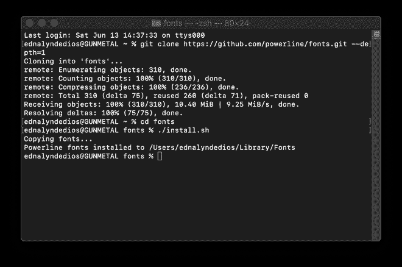

# 与“哦，我的 ZSH”和“伊特姆”一起进行终端改造。

> 原文：<https://blog.devgenius.io/terminal-makeover-with-oh-my-zsh-and-iterm-fb47e74a8ca9?source=collection_archive---------11----------------------->

## 编码工具

## 用 iTerm2 替换 Mac 默认终端应用程序的可视化分步指南。


照片由 Safar Safarov 在 Unsplash 上拍摄

*这个周末，我决定把我的 Macbook Pro 恢复到出厂设置，这样我就可以从头开始设置编程环境了。*

在本帖中，我们将在 Mac 上设置 oh-my-zsh 和 iTerm2。

*这是最终结果的样子:*


我们开始吧！


按`CMD + SPACE`调用 spotlight 服务。


开始输入“终端”,你应该会看到下面类似的内容。


按下`ENTER`键(当然是轻轻的)打开终端应用程序。

如果您看到“默认的交互式 shell 现在是 zsh…”这意味着您仍然在使用 bash 作为您的 shell。


我们换成 zsh 吧。

点击“终端”并选择“首选项…”如下所示。


这将打开终端设置窗口。


在“shell 打开方式”部分，单击“默认登录 shell ”,如下所示。


点击左上角的“X”关闭窗口，然后重启终端。您现在应该看到终端使用 zsh，如下图所示。


# 安装电力线字体

主题“不可知论者”将需要一些特殊的字体来正确渲染。让我们现在安装它们。

在终端中键入以下命令:

```
git clone [https://github.com/powerline/fonts.git](https://github.com/powerline/fonts.git) --depth=1
```


然后下面要改变的目录:

```
cd fonts
```


该目录将更改为`~/fonts`，如下所示。


键入以下命令将字体安装到您的系统中。

```
./install.sh
```


输出应该如下所示。



让我们备份到父目录，以便进行一些清理:

```
cd ..
```


您应该看到下面的输出，指示主目录。


让我们使用以下命令删除安装文件夹:

```
rm -rf fonts
```


现在应该删除 fonts 文件夹了。让我们清除控制台输出。

```
clear
```


您应该会在控制台上看到一个清晰的窗口，如下图所示。


# 安装我的 ZSH

天啊，ZSH 负责我们的 zsh shell 的配置。让我们现在安装它。

在终端中键入以下内容(不要使用任何换行符，应该只有一行):

```
sh -c "$(curl -fsSL https://raw.githubusercontent.com/ohmyzsh/ohmyzsh/master/tools/install.sh)
```


现在，您应该会看到 oh-my-zsh 安装在您的计算机上。


如果您看到一条消息说“检测到不安全的依赖于完成的目录”，我们需要在。主目录下的 zshrc 文件。

为此，请打开 Finder 窗口并导航到主目录。


按`SHIFT + CMD + .`显示隐藏文件。您现在应该会看到类似下面的内容。


打开。zshrc 文件使用类似 [Sublime](https://www.sublimetext.com/3) 的文本编辑器。

这就是里面的。zshrc 文件看起来像:


向下滚动第 73 行。


在 source $ZSH/oh-my-zsh.sh 之前插入下面一行:

```
ZSH_DISABLE_COMPFIX="true"
```


保存并关闭。zshrc 文件，并打开一个新的终端窗口。您应该看到类似下面的内容。


# 替换默认终端

去 https://www.iterm2.com/version3.html 的[下载最新版本。](https://www.iterm2.com/version3.html)


将安装程序保存在“下载”文件夹中，如下所示:


打开新的 Finder 窗口并导航到“下载”您应该会在下面看到类似的内容。双击 zip 文件，它应该提取 iTerm 应用程序的一个实例。


双击“iTerm.app”


如果提示从互联网下载应用程序，请点按“打开”


如果提示将应用程序移动到应用程序文件夹，请点击“移动到应用程序文件夹”


关闭所有窗口，按 CMD + SPACE 调出 spotlight 搜索服务，输入“iterm”点击回车键，你现在应该看到 iTerm 应用程序。


打开 Finder 窗口，导航到主目录，然后找到。zshrc 文件。


打开。使用文本编辑器编辑 zshrc 文件。


找到 ZSH_THEME="robbyrussell "并将" robbyrussell "替换为" agnoster ",如下所示。


保存并关闭文件。按下`CTRL + Q`关闭任何剩余的打开的 iTerm 窗口。

按下`CMD + SPACE`并输入“iterm”重启 iTerm，如下图所示。


点击`ENTER`键，一个新的 iTerm 窗口应该会像下面这样打开。


提示看起来有点怪。让我们修理它！

进入 iTerm2 并选择“首选项…”如下所示。


您将看到类似下图的内容。


点击“个人资料”

在“标签>”旁边的配置文件名称区域下方的窗口左下角找到“+”


点击“+”号。


在“常规”选项卡的“基本”区域下，将默认的“新配置文件”名称替换为您喜欢的配置文件名称。在下面，我输入了“青铜色”


在“标题”中，单击下拉菜单，选中或取消选中您对窗口标题外观的首选项。


导航到“颜色”选项卡，点击窗口右下角的“颜色预设…”下拉菜单，然后选择“Smooooooth”


在“基本颜色”部分找到“背景”，设置颜色为 R:0 G:50 B:150，如下图所示。


导航到“文本”选项卡，找到“字体”部分。选择任何电力线字体。下面，我选择了“Roboto Mono Medium for Powerline”并将字体大小增加到 13。


在同一个“字体”部分下，选中“对非 ASCII 文本使用不同的字体”,并选择与之前相同的字体。参考下图。


接下来，导航到“窗口”标签，并设置透明度和模糊如下所示。


然后，导航到“终端”标签，并选择“无限回滚”


最后，让我们通过单击“Other Actions…”下拉菜单并选择“Set as Default”来将这个新创建的配置文件设置为默认值，如下所示。


现在，您应该会在新创建的配置文件旁边看到一个星号，表明它是新窗口的默认配置文件。


重启 iTerm，你应该会看到类似下面的东西。


请注意，我们几乎看不到提示符上的目录指示器。还有，用户名@主机名对于喜欢来说有点长。让我们解决这些问题。

再次转到 iTerm 首选项，并导航到“Profiles”选项卡。在“正常”列下的 ANSI 颜色中找到“蓝色”,然后单击彩色框。


如下所示，将 RGB 值设置为 R:0 G:200 B:250。


按下`CMD + Q`退出 iTerm 并打开一个 Finder 窗口。导航到主目录，用`SHIFT + CMD + .`显示隐藏的文件并双击。哦，我的“文件夹。


导航并点击“主题”文件夹。


查找“agnoster.zsh-theme”文件，并使用文本编辑器打开它。


这是主题内部的样子:


在第 92 行，查找“%n@%m”字符串。


选择“%n@%m ”,并将其替换为您希望在提示上显示的任何内容。


下面，为了简洁起见，我简单地将“%n@%m”替换为“Dd”。


重启 iTerm，你应该得到类似下图的东西。


如果您导航到一个 git 存储库，您将看到类似下面的内容:


就是这样！

编码快乐！

*原载于 2020 年 6 月 14 日*[*【https://blog.ednalyn.com】*](https://blog.ednalyn.com/2020/06/13/terminal-makeover/)*。*