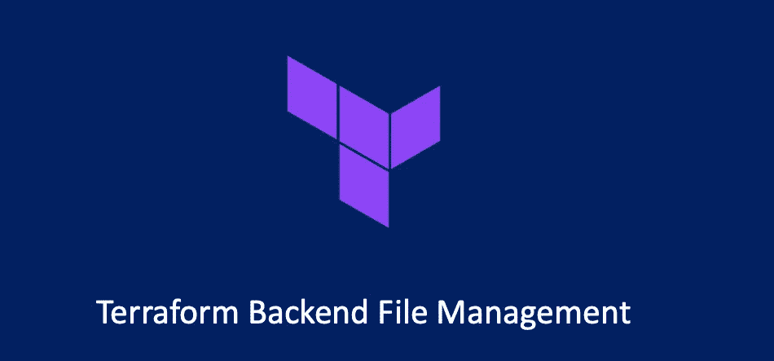
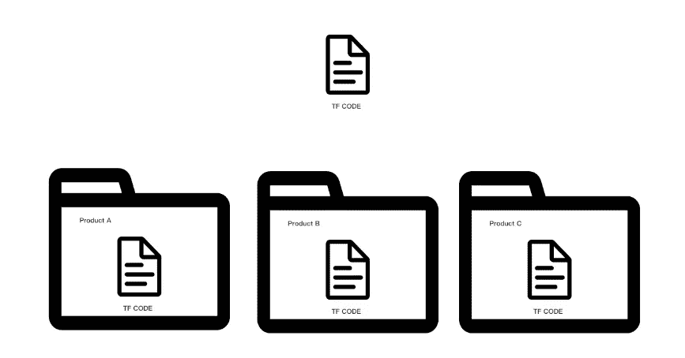
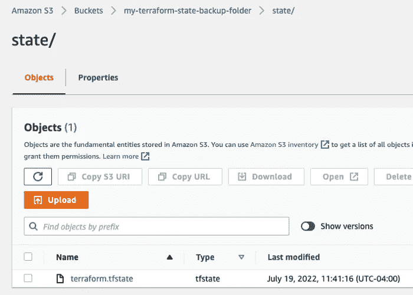
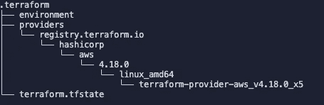
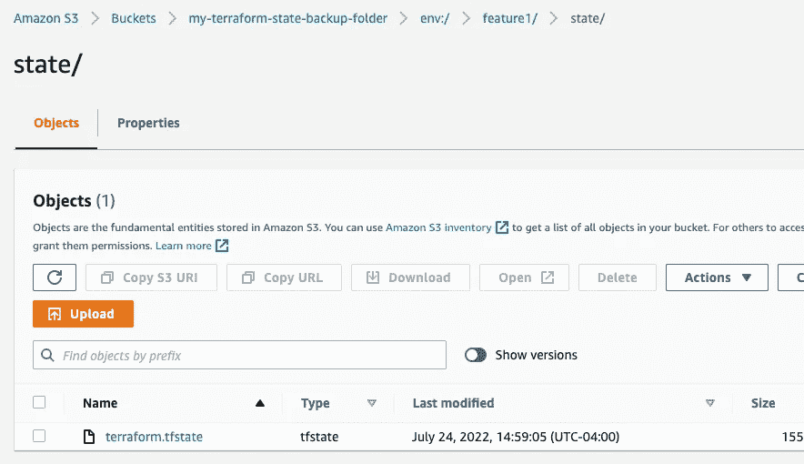
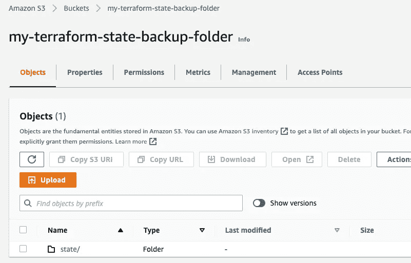

# Terraform —后端动态配置和版本控制

> 原文：<https://blog.devgenius.io/terraform-backend-dynamic-configuration-and-version-control-2c1c26da2316?source=collection_archive---------2----------------------->

## Terraform 后端文件管理



在我的上一篇 Terraform 文章:“ [Terraform —状态管理](/terraform-state-management-85bc622f731c)”中，我谈到了基本的 Terraform 状态管理，并给出了一个如何使用 AWS S3 作为后端配置的例子。

# 动态后端配置

一些读者注意到，我到目前为止所写的代码中的配置项基本上都是硬编码的。Terraform 支持运行时变量的动态赋值吗？答案是肯定的，Terraform 可以通过变量 variable 将值传递给提供者、数据和资源。

但是，有一个例外，那就是后端配置。后端配置只允许硬编码，或者不传递值。

这个问题是由 Terraform 运行时本身的运行顺序造成的。直到 2019 年 5 月，官方才给出解决方案，即“部分配置”。

简而言之，我们不在后端语句中给出具体的配置:

```
terraform {
  required_version = "~>0.13.5"
  required_providers {
    ucloud = {
      source  = "ucloud/ucloud"
      version = ">=1.22.0"
    }
  }
  backend "consul" {

  }
}
```

而是在另一个单独的文件中给出相关的配置。例如，我们在工作目录中创建一个名为`backend.hcl`的文件:

```
address = "localhost:8500"
scheme  = "http"
path    = "my-ucloud-project"
```

本质上，我们将原来属于后端 consul 部分的属性分配代码重新定位到一个单独的`hcl`文件中，然后在执行 terraform init 时添加 backend-config 参数:

```
$ terraform init -backend-config=backend.hcl
```

这样也能初始化成功。通过这种打补丁的方式，我们可以重用他人预先编写的 Terraform 代码，并以单独的 backend-config 文件的形式传入我们自己的后端配置信息，以便在执行过程中进行初始化。

# 后端权限控制和版本控制

后端本身不设计任何权限和版本控制，完全取决于具体的后端实现。

以 AWS S3 为例，我们可以为不同的桶设置不同的 iam，防止开发人员和测试人员直接操作生产环境，或者给某些人状态信息的只读权限。

此外，我们还可以启用 S3 版本控制功能，以防我们误修改了状态文件(Terraform 命令行有修改状态的相关说明)。

如果你在寻找一个实现的例子，可以参考我上一篇文章“ [Terraform —状态管理](/terraform-state-management-85bc622f731c)”关于如何为 Terraform 后端配置 AWS S3 和 dynamo DB。

# 状态的独立存储

现在我们已经讨论了后端，是时候讨论另一个问题了。假设我们的 Terraform 代码可以创建一个公共基础设施，比如云中的`EKS`、`ECS`或`EMR`集群，那么我们可能必须为许多团队创建和维护这些相似但独立的集群，或者我们希望为部署的应用程序维护四个不同的环境，如开发、测试、预发布和生产。

那么如何实现不同的部署，将状态文件彼此分开存储和管理呢？

一个简单的方法是把它们分成不同的文件夹进行存储。让我们来看看下图:



我们可以将不同产品的不同部门使用的基础架构划分到不同的文件夹中，在文件夹中维护相同的代码文件，配置不同的后端配置，并将状态文件保存在不同的后端。**这种方法可以给出最大程度的隔离，缺点是我们需要复制很多份相同的代码**。

第二种更轻量级的方法是 workspace。**注意，Terraform 开源版的工作空间和 Terraform 云服务的工作空间其实是两个不同的概念。**这里介绍的是开源版本的工作区。

Workspace 允许我们在同一个文件夹中使用相同的后端配置，但是保持任意数量的相互隔离的状态文件。在我们之前使用 AWS S3 作为后端的例子中:



目前我们有一个名为`terraform.state`的状态文件。然后，我们在工作目录中执行如下命令:

```
$ terraform workspace list
* default$ terraform workspace new feature1
Created and switched to workspace "feature1"!You're now on a new, empty workspace. Workspaces isolate their state,
so if you run "terraform plan" Terraform will not see any existing state
for this configuration.$ terraform workspace list
  default
* feature1
```

通过调用 workspace 命令，我们成功地创建了一个名为`feature1`的工作空间。此时我们观察`.terraform`文件夹:



我们会找到一个环境文件，它的内容是`feature1`。这实际上是 Terraform 用来保存当前上下文正在使用的工作空间的文件。

现在，在 AWS S3 存储桶中，您将看到一个名为“env:”的新路径已经创建:



在这个新的工作区中，已经有一个`terraform.tfstate`文件，这意味着状态已经被成功地写入到`feature1`的状态文件中。

我们可以使用以下命令查询当前后端下的所有工作区:

```
$ terraform workspace list
  default
* feature1
```

我们有两个工作空间，default 和 feature1，我们目前正在开发 feature1。我们可以使用以下命令切换回默认值:

```
$ terraform workspace select default
Switched to workspace "default".
```

我们可以使用以下命令确认我们成功切换回了默认设置:

```
$ terraform workspace show
default
```

我们可以使用以下命令删除功能 1:

```
$ terraform workspace delete feature1
Deleted workspace "feature1"!
```

再次查看 S3 桶，您会发现 feature1 的状态文件已被删除:



# 文件夹与工作区

与多文件夹隔离方法相比，基于工作空间的隔离更简单。你只需要保存一段代码。您不需要在代码中为工作区编写额外的代码。您可以使用命令行在不同的工作空间之间来回切换。

但是，Workspace 的缺点也很明显。由于所有工作区的后端配置都是一样的，所以对某个工作区有读写权限的人可以读取同一后端路径下的所有其他工作区；此外，工作区是隐式配置的(调用命令行)，所以有时人们会忘记他们正在哪个工作区工作。

Terraform 对于 Workspace 的官方场景是，有时候开发者想要对现有的基础设施做一些改变，进行一些测试，但是不想直接冒险修改现有的环境。这时候他就可以用 Workspace 复制一个与现有环境完全一致的并行环境，在这个并行环境中做一些改变，进行测试和实验。

工作空间对应于源代码管理模型中的主干-分支模型。如果团队想要维护不同产品之间的不同基础设施，或者开发、测试、预发布和生产环境，最好使用不同的文件、文件夹和不同的后端配置进行管理。