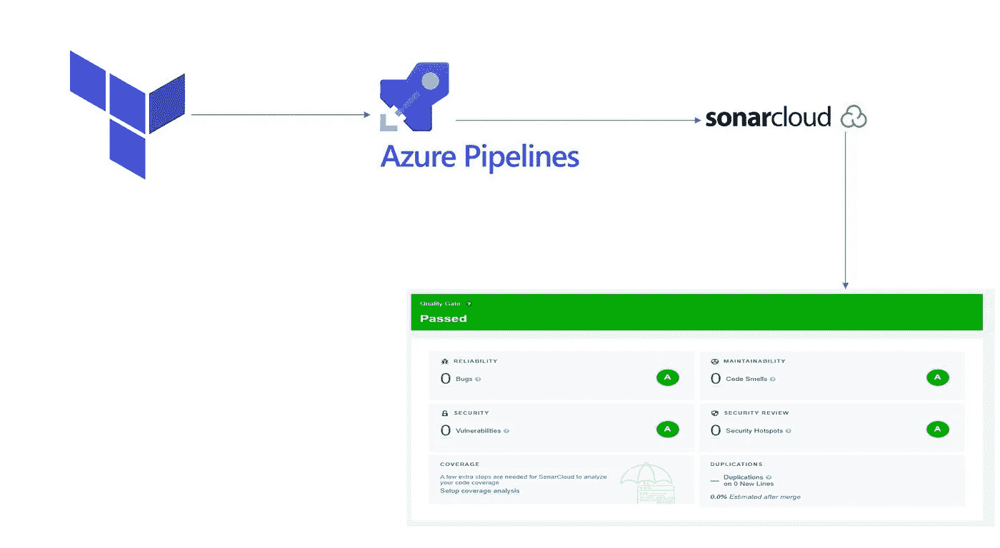
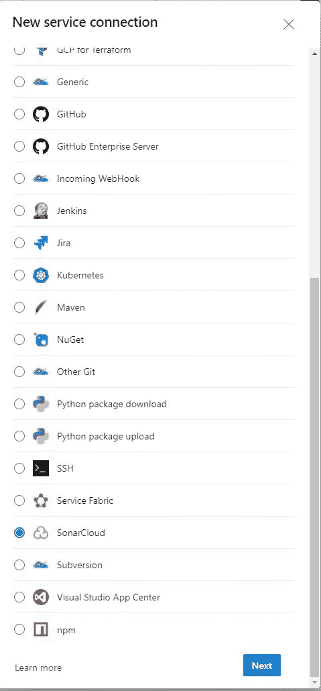
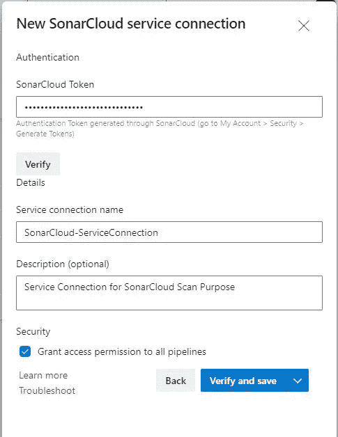
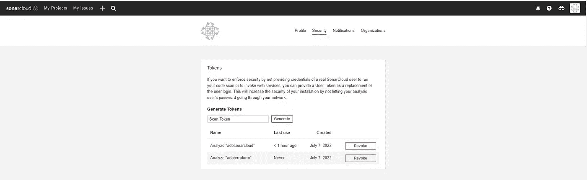
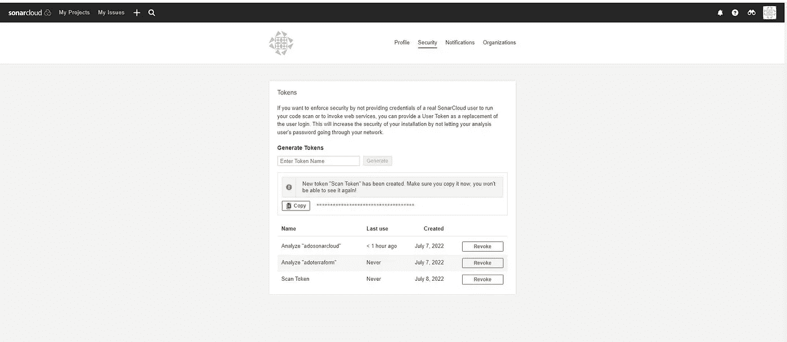
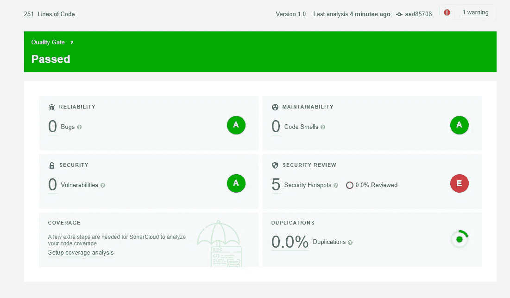

# 使用 SonarCloud 和 Azure DevOps 进行 Terraform 代码扫描

> 原文：<https://blog.devgenius.io/terraform-code-scan-using-sonarcloud-azure-devops-6f39bb66b82c?source=collection_archive---------1----------------------->



地形-声纳云

在本文中，我将解释如何在 Azure DevOps pipeline 中使用 SonarCloud 扫描您的 terraform 代码

# SonarCloud 是什么？

SonarCloud 是一种基于云的代码分析服务，旨在检测 25 种不同编程语言中的代码质量问题，持续确保代码的可维护性、可靠性和安全性。

# SonarCloud 是做什么的？

SonarCloud 在*静态代码分析*中使用最先进的技术，在您和您的团队编写的代码中发现问题和潜在问题。

静态分析被称为*静态*，因为它不依赖于实际运行代码(对运行代码的分析被称为*动态分析*)。因此，SonarCloud 提供了一个额外的验证层，不同于自动化测试和人工代码审查。

问题的早期检测确保更少的问题进入过程的后期阶段，并最终有助于提高产品代码的整体质量。

**先决条件:**

1.  您有一个 Azure DevOps 项目，其中包含用于扫描的 Terraform 代码
2.  您有一个有效的 SonarCloud 项目

要注册并创建一个免费的组织和项目，请遵循官方文档

[](https://docs.sonarcloud.io/getting-started/overview/) [## 入门指南

### 要使用 SonarCloud 分析您的代码，它必须托管在一个受支持的 DevOps 平台上，并且您必须登录…

docs.sonarcloud.io](https://docs.sonarcloud.io/getting-started/overview/) 

3.在您的 Azure DevOps 项目上安装 SonarCloud 扩展

转到 Visual Studio Marketplace 并将该扩展添加到您的项目中。

[](https://marketplace.visualstudio.com/items?itemName=SonarSource.sonarcloud) [## SonarCloud - Visual Studio 市场

### Azure DevOps 的扩展——跨项目分支和拉请求检测错误、漏洞和代码气味。

marketplace.visualstudio.com](https://marketplace.visualstudio.com/items?itemName=SonarSource.sonarcloud) 

4.为 SonarCloud 创建服务连接

转到项目设置→服务连接

点击新服务连接并选择 SonarCloud



提供令牌、服务连接名称和描述，然后单击“验证并保存”



> 要生成令牌，请转到 sonarcloud 组织，然后转到我的帐户→安全性
> 
> 提供令牌名称，然后单击“生成并复制令牌”



# 步骤:

我们将在 SonarCloud 扫描活动中包括 3 项任务

1.  变量

```
variables:
  - name: SonarProjectName
    value: 'dummyvalue'
  - name: SonarProjectKey
    value: 'dummykey'
# Please put your actual values in variables
# You can put the variables in a variable group and keep them as secret
```

> cliProjectKey 和 cliProjectName 将在 SonarCloud 项目中可用。转到 SonarCloud 中您的项目，然后单击信息

2.声纳云准备任务

```
- task: SonarCloudPrepare@1
    inputs:
      SonarCloud: 'SonarCloud-ServiceConnection'
      organization: 'myorg'
      scannerMode: 'CLI'
      configMode: 'manual'
      cliProjectKey: '$(SonarProjectKey)'
      cliProjectName: '$(SonarProjectName)'
      cliSources: '$(System.DefaultWorkingDirectory)/TF'
```

2.声纳云扫描任务

```
- task: SonarCloudAnalyze@1
    displayName: SonarCloud Scan
```

3.发布声纳云结果

```
- task: SonarCloudPublish@1
    displayName: SonarCloud Publish
    inputs:
      pollingTimeoutSec: '300'
```

**完成 yaml**

```
trigger: nonepool:
  vmImage: ubuntu-latest
variables:
  - name: SonarProjectName
    value: 'dummyvalue'
  - name: SonarProjectKey
    value: 'dummykey'
# Please put your actual values in variables
steps:
  - task: SonarCloudPrepare@1
    inputs:
      SonarCloud: 'SonarCloud-ServiceConnection'
      organization: 'myorg'
      scannerMode: 'CLI'
      configMode: 'manual'
      cliProjectKey: '$(SonarProjectKey)'
      cliProjectName: '$(SonarProjectName)'
      cliSources: '$(System.DefaultWorkingDirectory)/TF'
  - task: SonarCloudAnalyze@1
    displayName: SonarCloud Scan
  - task: SonarCloudPublish@1
    displayName: SonarCloud Publish
    inputs:
      pollingTimeoutSec: '300'
```

**sonar cloud 中的样本扫描结果**



结果

**其他资源:**

[](https://docs.sonarcloud.io/getting-started/overview/) [## 入门指南

### 要使用 SonarCloud 分析您的代码，它必须托管在一个受支持的 DevOps 平台上，并且您必须登录…

docs.sonarcloud.io](https://docs.sonarcloud.io/getting-started/overview/) [](https://docs.sonarcloud.io/improving/overview/) [## 改进您的代码

### SonarCloud 旨在集成到您的日常开发工作流程中，以便分析结果以…

docs.sonarcloud.io](https://docs.sonarcloud.io/improving/overview/) [](https://github.com/babula000/TF) [## GitHub - babula000/TF

### 此时您不能执行该操作。您已使用另一个标签页或窗口登录。您已在另一个选项卡中注销，或者…

github.com](https://github.com/babula000/TF) 

我希望你喜欢阅读这篇文章，随时添加你的评论、想法或反馈，不要忘记在 linkedin 上联系。