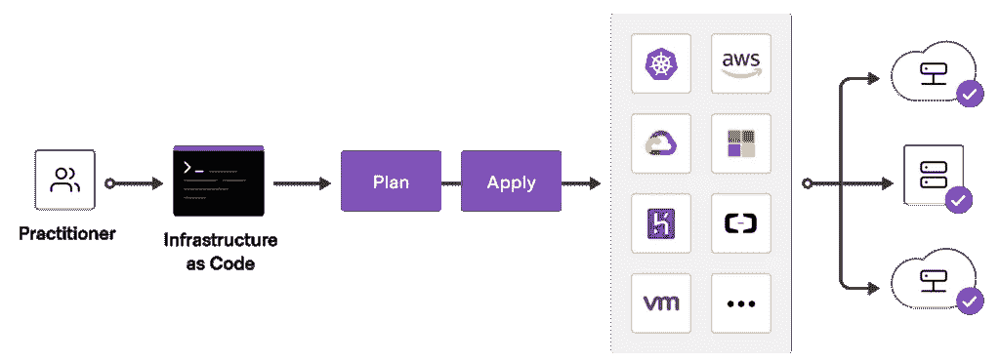

# 简述地形

> 原文：<https://blog.devgenius.io/terraform-explained-in-brief-497e1b2b44fe?source=collection_archive---------17----------------------->

## 每个开发人员都应该知道的基础设施即代码(IaC)。


图为 [C 达斯汀](https://unsplash.com/@dianamia?utm_source=unsplash&utm_medium=referral&utm_content=creditCopyText)在 [Unsplash](https://unsplash.com/s/photos/construction?utm_source=unsplash&utm_medium=referral&utm_content=creditCopyText)

Terraform 是一个基础设施即代码(IaC)工具，可以通过简单的声明性代码在云中提供资源。在云中构建应用程序时，您可能会发现自己正在使用任何云提供商的图形用户界面。

就像我们在易贝或亚马逊这样的网站上一样，点击按钮并为产品付款。这种方法的唯一缺点是完全混乱。您可能需要点击几十个按钮来正确配置您的虚拟机。

那还是可以的。

但是当你将来不得不做同样的事情时会发生什么呢？你将不得不从头再做一遍。

Terraform 通过使用 HashiCorp 配置语言(HCL)甚至 JSON 来表示您的基础架构和所有设置，使您能够安全高效地创建、维护和版本化基础架构。

它是一种人类可读的蓝图，可以执行和自动化您在云中所做的一切。最好的部分是它是免费和开源的。



使用 Terraform 将基础设施作为代码

开始的第一步是在您的本地系统上安装 CLI，然后从您的项目创建一个以*结尾的文件。tf* 扩展。

在顶部，我们有一个 terraform 块，它控制 terraform 本身的全局设置。

在 terraform 块中，我们最重要的是可以在这里定义提供者，就像可以连接到不同云提供者的插件，如 AWS、google cloud、azure 等等。

在 provider 块中，我们为 terraform 提供了连接到我们的 google cloud 帐户所需的所有凭证。

从那里，我们可以使用资源块创建实际的云基础架构。它将一个类型作为第一个参数，这个类型对应于 google cloud 上的一个产品。这里的`**google_compute_instance**`是产品。

第二个参数是一个自定义名称，用于将它标识为第二个参数。这里`**default**`是名字。在这个块中，我们可以定制资源的设置，比如它的机器类型、区域和其他任何东西。

```
**terraform init** // initializes the project **terraform apply** // makes the actual changes to google cloud or other cloud provider**terraform show** // inspects the current state of the infrastructure**terraform destroy** // deletes everything in the configuration file
```

无论我们对资源及其配置做了什么更改，terraform 都会跟踪这些更改或差异，类似于 git 这样的版本控制系统。

命令`**terraform apply**`用于部署对配置的任何更改。

# 结论

Terraform 使您能够安全、可预测地创建、更改和改进基础设施。它是一个开源工具，将 API 转换为声明性的配置文件，可以在团队成员之间共享、更改、审查和版本化。

这篇短文只是对 Terraform 的一个介绍。这只是冰山一角。我强烈建议您浏览相关文档和其他参考链接。

## 参考

【https://github.com/hashicorp/terraformT4[https://registry . terraform . io/providers/hashi corp/Google/latest/docs](https://github.com/hashicorp/terraform)https://github.com/hashicorp/terraform-provider-google

如果你喜欢读这篇文章，你可能也会发现下面的文章值得你花时间去读。

[](https://levelup.gitconnected.com/12-visual-studio-code-shortcuts-that-every-developer-must-know-8d6ce5fc3631) [## 每个开发人员都必须知道的 12 个 Visual Studio 代码快捷方式

### 这些快捷方式让开发人员的生活变得更加轻松。

levelup.gitconnected.com](https://levelup.gitconnected.com/12-visual-studio-code-shortcuts-that-every-developer-must-know-8d6ce5fc3631) [](https://levelup.gitconnected.com/9-youtube-channels-that-you-must-subscribe-to-if-you-are-a-developer-d7ac881c9798) [## 如果你是开发者，你必须订阅的 9 个 YouTube 频道

### 强烈推荐给软件开发人员的 YouTube 频道，帮助他们在软件开发职业生涯中脱颖而出。

levelup.gitconnected.com](https://levelup.gitconnected.com/9-youtube-channels-that-you-must-subscribe-to-if-you-are-a-developer-d7ac881c9798) 

*如果你喜欢阅读有助于你更好地学习、生活和工作的故事，可以考虑* [*成为订阅者*](https://viveknaskar.medium.com/subscribe) *。成为会员后，你可以无限制地阅读 10000 篇故事、文章和作家。每月只要 5 美元。* [*如果你注册使用我的链接*](https://viveknaskar.medium.com/membership) *，我将赚取一点佣金，帮助我写更多的文章。*