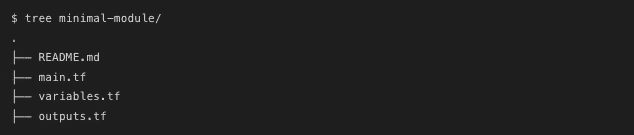

# Terraform —模块介绍

> 原文：<https://blog.devgenius.io/terraform-module-introduction-3647c7511d0c?source=collection_archive---------4----------------------->

## 什么是 Terraform 模块？


在 Terraform 中，一个“模块”是一个包含一组 Terraform 代码的文件夹，我们在我之前的 Terraform 文章中写的代码实际上就在一个模块中。

Terraform 模块封装了专用于一项任务的资源组，减少了您为类似的基础架构组件开发的代码量。

Terraform 模块对于编写高质量的 Terraform 代码和提高代码可重用性非常重要。**可以说，一个成熟的生产环境应该是由几个可信的、成熟的模块组装而成**。

# 为什么是模块？

Terraform 模块允许你在一些资源集的顶层创建逻辑抽象。换句话说，一个模块允许你将资源组合在一起，并在以后重用这个组，也可以在团队之间甚至在社区中共享模块。

假设您有一个托管在 AWS 中的 EC2 服务器，这个 EC2 服务器正在使用哪些 AWS 资源？

*   EC2 实例本身
*   用于存储应用程序数据 EBS 卷
*   面向公众访问的弹性 IP
*   入口和出口流量的安全组
*   一个 VPC
*   子网
*   ..等等


现在让我们假设您需要用一组资源创建这个服务器 3 次。这就是模块真正有用的地方:你绝对不想一遍又一遍地重复相同的配置代码。相反，你需要做的是调用 3 次“app_server”模块。

```
module "server" {
  count         = 3
  source        = "./module_app_server"
  some_variable = some_value
}
```

# 创建一个模块

几乎任何包含 Terraform 代码文件的文件夹都是一个 Terraform 模块。如果我们直接在一个文件夹中执行`terraform apply`或`terraform plan`命令，那么当前文件夹就叫做**根**模块。

在执行 Terraform 命令时，我们还可以通过命令行参数指定根模块的路径。

## 模块结构

旨在重用的模块使用与我们编写的根模块相同的 Terraform 代码和代码风格指南。一般来说，一个完整的模块应该是这样的:


让我们逐一探索这些项目:

*   `README.md`:描述模块的用途。应该用 Markdown 语法写。不需要描述模块的输入和输出，因为工具会自动收集相关信息。如果在`README`中引用了外部文件或图像，请务必使用带有特定版本号的绝对 URL 路径，以防止将来指向错误的版本。
*   `LICENSE`:描述模块的使用。如果你想公开发布一个模块，最好考虑包含一个明确的许可协议文件，许多组织不会使用没有明确许可协议的模块。
*   `examples`:顾名思义，文件夹包含示例。这是可选的。
*   `variables.tf`:包含模块的所有输入变量。输入变量应该有对其用途的清晰描述。
*   `outputs.tf`:包含模块的所有输出值。输出值应该有明确的目的描述。
*   `modules`:嵌入式模块文件夹，为了封装复杂度或者重用代码，我们可以在 modules 子目录下创建一些嵌入式模块。外部用户可以使用包含自述文件的所有嵌入式模块；没有`README`文件的模块被认为只在当前模块中使用(可选)。
*   `main.tf`:模块的主入口点。对于一个简单的模块，所有的资源都可以在其中定义；如果是比较复杂的模块，我们可以将创建的资源分布到不同的代码文件中，但是引用嵌入式模块的代码还是要保存在`main.tf`中。

如果一个模块包含多个嵌入模块，它们应该避免相互引用，根模块负责组合它们。

除了完整的模块结构之外，有时为了方便起见，可以有一个如下所示的最小模块:



# 根模块与子模块

每个 Terraform 配置至少有一个模块，称为其*根模块*，由主工作目录中的`.tf`文件中定义的资源组成。

Terraform 模块(通常是配置的根模块)可以*调用*其他模块，将它们的资源包含到配置中。被另一个模块调用的模块通常被称为*子模块。*

如下图所示:


子模块可以来自许多地方:

*   本地路径
*   官方的 Terraform 注册表
*   一个 Git 存储库(一个定制的或者 GitHub/BitBucket)
*   带有模块的. zip 档案的 HTTP URL

# 避免深度模块结构

我们刚刚提到，可以在子目录下创建嵌入式模块(`modules/`文件夹)。Terraform 提倡“扁平化”的模块结构，只需维护一层嵌入式模块，防止在嵌入式模块内继续创建嵌入式模块。

嵌入式模块应该被设计成容易组合的结构，这样在根模块中，通过组合独立的嵌入式模块可以创建复杂的基础设施。

# 结论

现在你应该对什么是 Terraform 模块和子模块有了基本的了解。在我的下一篇文章中，我将通过一些例子详细介绍如何使用 Terraform 模块。