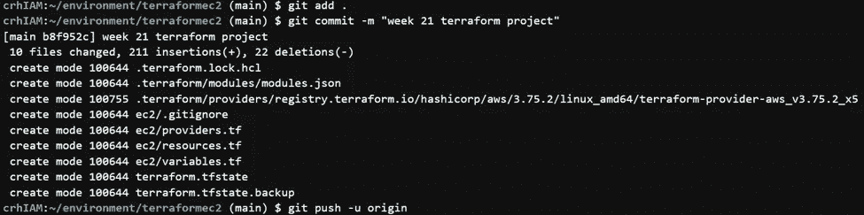

# Terraform 模块 101:利用 Terraform 模块管理 EC2 的创建和发布。

> 原文：<https://blog.devgenius.io/terraform-modules-101-managing-ec2-creation-launch-by-leveraging-terraform-modules-9716824b381d?source=collection_archive---------7----------------------->

在本周的教程中，我们将使用以下场景作为上下文的基础。读者你是一名 rockstar DevOps 工程师，你的经理最近联系了他，要他使用 Terraform 启动一个 EC2 实例。简单吧。可能是你的第一个想法。但是这里有一个警告:“你的代码需要以一种可重用的方式来设置。”这意味着可以随时自动创建和启动一个或多个实例。你将如何解决这个特殊的问题？如果你认为 Terraform 模块，那么你已经在正确的轨道上。但是什么是 Terraform 模块呢？它们是用来做什么的？按照惯例，在我们参加主要活动之前，我们必须先处理一些日常事务。

EC2 也称为弹性云计算，是一台可以用作服务器的虚拟或物理计算机。名称中的“云”一词意味着可以通过互联网访问该计算机。最后但并非最不重要的一点是,“弹性”一词意味着该计算机可以复制以扩大规模，即满足不断增长的网络需求，也可以在需要时缩小规模。

基础设施即代码:顾名思义，将基础设施部署为代码，更具体地说是可读的代码。从某种意义上说，它不是一种编程语言，但更像是一套关于如何建立和维护基础设施的易于遵循的指令。这类似于说“嘿，Siri 播放…”了解我的要点。

Terraform:是一个开源的基础设施代码工具，用于提供完整的云基础设施。

模块:简单地说，terraform 模块是一组可重用的配置文件，可以在多个应用程序之间共享。资源可以配置到单个文件或目录中(根模块或父模块)，也可以分解成可以调用的更小的组件(子模块)。以获得可视化表示(见下图)。

既然我们已经讨论了细节，让我们开始我们的项目吧。

***要求:***

1.以 ec2.tf 模板为起点，在本地派生并克隆这个 repo，以创建 ec2

2.从资源块中为 ec2 创建一个定制模块，您可以将它用作可重复的基础设施

3.将新创建的模块和 ec2.tf 文件推送到您的 repo 中

**先决条件:**

1.您选择的 IDE。

2.AWS 账户。

3.已经安装并配置了 Terraform。

4.GitHub 账户。

***第 0 步:叉&克隆回购。***

我们将作为起点使用的 ec2 模板位于不同的存储库中。我们项目的第一步是派生起点模板的存储库。什么是分叉？简单地说，分叉就是将存储库复制到您自己的 GitHub 中的行为。它允许您在不影响原始存储库的情况下进行更改。在这一步中，您需要访问您想要派生的存储库的页面。要创建一个 fork，只需点击 GitHub 上存储库页面右上角的“fork”按钮。(叉子图标见下图)。

这个库的副本已经并应该添加到您的 GitHub 帐户中。现在我们需要将存储库克隆到我们的工作目录中。要克隆存储库，请单击绿色的“Code”按钮，并复制显示的 URL。(见下图)。

现在去你的 IDE。从 IDE 的终端部分输入以下命令和复制的 URL:"***git clone*******<your _ repo _ URL>*"。***

**

*一旦 repo 被克隆，您现在应该在您的工作目录下有一个新的目录或文件夹(terraformec2)。切换到该目录，以便继续下一步。您可以通过输入命令:"***CD<directory _ name>*"切换到该目录。***

**

****第一步:创建模块文件夹。****

*这个特定的目录(terraformec2)被称为根模块或父模块。现在，在根目录中，我们将创建另一个模块，在我的例子中，我决定将其命名为 EC2。现在，EC2 目录就是我们认为可以被根目录或父目录调用的子目录。就像我们的父母生下我们并在需要的时候召唤我们一样。*

*子目录可以通过两种方式创建。右键单击并选择“ ***新文件夹*** ”或在 IDE 的终端部分输入命令“***mkdir<name _ of _ new directory***”。(参考下图)。*

****

*在我们的子目录或模块(EC2)中，创建 providers.tf、resources.tf 和 variables.tf 文件。创建文件后，请遵循以下步骤。*

****第二步:providers.tf.****

*从 ec2.tf 文件中复制 providers 块，并将其粘贴到 providers.tf 文件中。*

**

*下面是 providers.tf。*

****第三步:resources.tf.****

*从 ec2.tf 文件中复制 providers 块，并将其粘贴到 providers.tf 文件中。*

**

*下面是 resources.tf。*

****第四步:variables.tf.****

*到目前为止，您应该已经注意到在我们的配置文件中频繁使用“var”一词，这是因为我们将某些值作为变量进行赋值或传递。*

**

*在 variables.tf 文件上赋值时，请用 Amazon Linux 2 AMI ID 更新 AMI。要获得一个新的 AMI，打开 EC2 仪表板，点击 o " ***"启动实例*** "。一旦 EC2 仪表板显示出来，点击 Amazon Linux，ami 应该显示在下面(见下图)。*

**

*下面是 resources.tf。*

*您的根 EC2 文件现在应该看起来像这样。*

****第五步:命令****

*创建完所有文件后，请从终端运行以下命令。*

*Terraform init —初始化包含 Terraform 代码的工作目录。*

**

*Terraform fmt —将格式应用于我们所有的配置文件，以获得更好的可读性。该命令是可选的。*

**

*Terraform validate —加倍检查配置文件的语法，以避免可能的语法错误。就像上面的命令一样，它也是可选的。*

**

*Terraform 计划—用于在执行我们的 terraform 代码之前预览我们的基础设施。*

**

*Terraform apply —用于将计划中指定的所有更改应用到 motion 中。*

**

****第六步:在控制台*** 中再次检查*

*现在让我们转向管理控制台，以确保我们所有的资源都已成功创建。在搜索栏上，键入 EC2，显示 ECS2 控制面板后，单击 instances (running ),仔细检查您的实例是否已创建。瞧啊。！！*

**

****第七步:破坏。****

*一旦您确认成功创建了资源，为了避免不必要的费用，请确保销毁所有资源。这可以通过在终端中输入 Terraform destroy 命令来实现。*

******

*旁注:养成将代码提交给回购的习惯。从经验上来说，这样做的习惯肯定能帮你省下一些心痛和时间。*

*这可以通过输入以下命令来完成:*

*git 提交。*

*git commit -m*

*git 推。*

*瞧啊。！！*

**

*如果你已经做到了这一步，并遵循了上面的步骤，你已经成功地并且应该知道如何利用 terraform 模块来部署可重用的资源，比如 EC2 实例等等。*

*谢谢你的时间，下次再见。*

*你友好的邻居云开发工程师。*