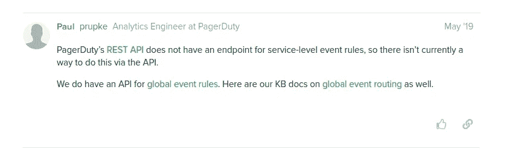

# Terraform 和 page duty—在您尝试之前

> 原文：<https://blog.devgenius.io/terraform-pagerduty-before-you-try-dd5266420fcf?source=collection_archive---------11----------------------->


[凯·皮尔格](https://unsplash.com/@kaip?utm_source=medium&utm_medium=referral)在 [Unsplash](https://unsplash.com?utm_source=medium&utm_medium=referral) 上的照片

## 地形想法

## 在开始编写 PagerDuty 基础设施代码之前，了解一些事实是值得的

Terraform 因其丰富的供应商选择而闻名。其中，我们可以找到 PagerDuty 集成。如果您有很多服务、用户和团队，那么您应该考虑将这样的基础设施作为 IaC 来管理。

随着你花越来越多的时间编写 HCL 代码，你会发现一些你可以容忍或者完全不能接受的事情。我不想说 terraform PagerDuty 提供商不好。其实我是用的，推荐的。但是让我们看看我在第一次尝试中发现了什么。

## 服务内部不支持 EventRules



摘自[https://community . page duty . com/forum/t/automation-of-service-event-rules/1507/2](https://community.pagerduty.com/forum/t/automation-of-service-event-rules/1507/2)

您无法使用 terraform 在服务内部部署 EventRules。这个特性在 API 中其实根本不支持。为什么这对你很重要？在我的例子中，我想在 terraform 中管理规则集、规则集中的规则和服务中的事件规则。

*   具有规则的规则集应仅基于服务而非警报(仅来自应用程序/组件警报的元数据)进行路由。应该只问一个问题:***警戒发生在哪里？***
*   服务内部的 EventRules 应根据警报描述和名称设置事件行为/状态: ***发生了什么警报？***

如果您在集群中运行许多组件，并且每个组件都有自己的服务，那么这个设置非常重要，这样您就可以查看 PagerDuty 并立即判断出集群有什么问题。因为您划分了规则，所以您不必处理一个包含数百条规则的庞大规则集。

## 规则决定随机性

PagerDuty 中的规则被一个接一个地执行，直到它们满足预期的条件。然后，他们添加额外元数据并将事件路由到指定的服务。在地形规则中，位置目前是由字段*位置*实现的(你没想到吧？).

规则资源定义示例在使用*[*depends _ on*](https://www.terraform.io/docs/configuration/resources.html#depends_on-explicit-resource-dependencies)元变元按顺序应用位置规则之前(回到资源被命名为 [EventRule](https://www.terraform.io/docs/providers/pagerduty/r/event_rule.html) )。假设一周后你决定改变订单。然后你不得不每隔*依赖*再更新一次——这很麻烦也没什么效果。当然，您可以找到一些变通办法，并使用您出色的脚本技能，但这仍然只是变通办法。*

*所以*位置*场就像是一种祝福。但是，即使在资源中，每次订单发生变化时，您都必须更新数字。您可以使用变量和索引函数来简化这一过程:*

*现在要改变规则顺序，我只需要在 *variables.tf* 中切换字符串顺序。在这一刻，一切都应该会突然发生。在*地形应用*后:*

```
*Apply complete! Resources: 0 added, 2 changed, 0 destroyed.*
```

*看起来很有希望。然后让我们运行*地形计划*以确保:*

```
*Plan: 0 to add, 2 to change, 0 to destroy.*
```

*它刚刚对我撒谎了吗？位置已更改的规则仍处于以前的位置。那我该怎么办？再次运行应用。第二轮之后，规则改变了。但是几天前我经历了在**第 7 次**运行后更改被正确应用的情况。*

> *这种缺陷的问题在于可重复性。我试了很多次，都没有达到预期的行为。几天后，在与团队一起工作时，突然出现了 bug。此外，当试图将所有规则一次部署到空规则集中时，terraform 无法以正确的顺序设置它们。*

*对我来说，在 terraform 中建立规则是一件非常痛苦的事情。我也总是在想最坏的情况，当有人应用了更改，却忘了检查订单是否正确。您可以设计一些管道来应用更改，直到订单正确为止，但这可能行不通——有一次，在第 10 次运行 terraform 后，我不得不在 PagerDuty GUI 中手动移动规则。*

## *更少的手工工作——但是编写模块可能很难*

*和许多 IaC 解决方案一样，这也减少了我们的点击量。一个命令，整个基础设施就建立起来了。在我的职责中，我决定保留这样的平台式回购结构:*

*我的地形结构*

*你应该问的第一个问题是为什么我没有写一个模块来覆盖文件冗余。答案很简单——在我的情况下，用 PagerDuty 编写模块不值得花时间。我们希望保留的集群之间的监控差异很小。*

*假设我们需要一个模块来部署所有提到的资源。大多数情况下，您仍然需要传递规则的详细信息，对于一个模块来说，这可能很棘手。我也不喜欢我的团队不愿意使用难读的模块(你也必须维护它们)。他们喜欢简单。值得一提的是 *main.tf* ，我们在其中保存了提供商信息和 terraform 数据源——对团队、用户、时间表、优先级和升级策略的引用。*

## *你现在可以试试*

**

*由[巴兹尔·萨缪尔·雷德](https://unsplash.com/@basilsamuellade?utm_source=medium&utm_medium=referral)在 [Unsplash](https://unsplash.com?utm_source=medium&utm_medium=referral) 上拍摄的照片*

*用 terraform 设置 PagerDuty 有两个小的不便。尤其是部署全传呼机。无法使用 EventRule 资源也使得 terraform 缺乏体验。我不知道他们是否会对规则秩序做些什么，因为这不是一个常见的问题。现在我们有希望获得 EventRules API。*

*如果你计划使用 terraform 来完成你的页面任务，我可以向你推荐这个解决方案，但是请记住以下几点。你的要求可能比我的更高，知道上面提到的限制有一天可以帮你避免不必要的挫折。*