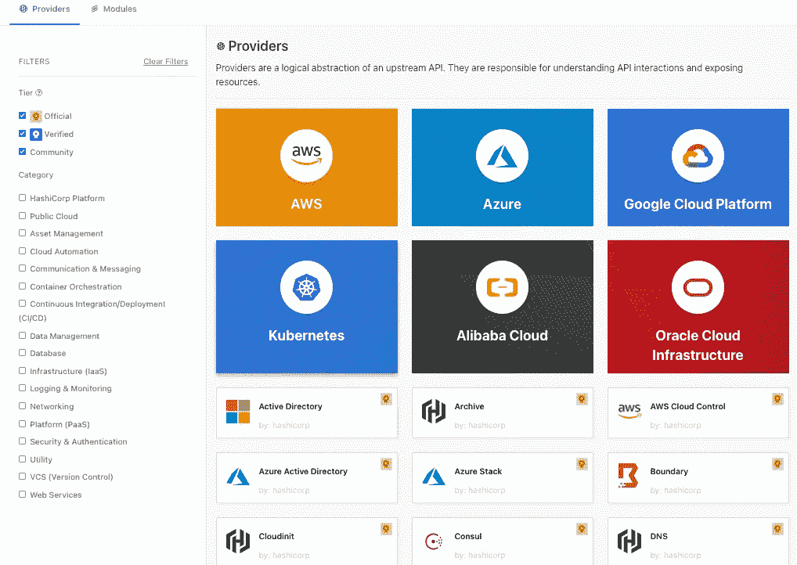

# Terraform —提供商

> 原文：<https://blog.devgenius.io/terraform-provider-aa57ade59eec?source=collection_archive---------10----------------------->

## Terraform provider 深潜


Terraform 被设计为一个多云基础设施协调工具。与绑定到 AWS 平台的 CloudFormation 不同，Terraform 可以同时编排各种云平台或其他基础设施的资源。

Terraform 实现多云编排的方式是提供者插件机制。它的架构看起来像:


图片来自 [terrafrom](https://www.terraform.io/)

Terraform 使用哈希公司开发的 go-plugin 库([https://github.com/hashicorp/go-plugin](https://github.com/hashicorp/go-plugin))。本质上，每个提供者插件都是一个独立的进程，通过 rpc 与 Terraform 进程一起调用。

Terraform 引擎首先读取并分析用户编写的 Terraform 代码，形成由数据和资源组成的图(graph)，然后通过 rpc 调用这些数据和资源对应的提供者插件；插件框架定义了各种数据和资源，实现了相应的 CRUD 方法；在实现这些 CRUD 方法时，可以调用目标平台提供的 SDK，也可以通过调用 Http(s) API 直接操作目标平台。

# 提供商基础知识

写完代码之后，应用之前，我们先执行`terraform init`命令。它将分析代码中使用的提供者，并尝试在本地下载提供者插件。

如果我们查看执行了`terraform init`命令的文件夹，我们会发现有一个`.terraform`文件夹:

```
.
├── providers
│   └── registry.terraform.io
│       └── hashicorp
│           └── aws
│               └── 4.18.0
│                   └── darwin_amd64
│                       └── terraform-provider-aws_v4.18.0_x5
└── terraform.tfstate8 directories, 3 files
```

有时候下载一些提供者很慢，或者开发环境中有很多 Terraform 项目，每个项目都有自己单独的插件文件夹，非常浪费磁盘，那么我们可以使用插件缓存。

有两种方法可以启用插件缓存:

*   配置`TF_PLUGIN_CACHE_DIR`环境变量
*   使用 CLI 配置文件`.terraformrc`

当启用插件缓存时，每当执行`terraform init`命令时，Terraform 引擎将首先检查缓存文件夹中是否已经存在所需的插件，如果是，它将把缓存的插件复制到当前工作目录中的`.terraform`文件夹。

# 提供商搜索

要了解哪些提供商被正式接受，有两种方法:

**第一种方式**是访问 [Terraform 官方提供商文档](https://www.terraform.io/docs/providers/index.html)，其中列出了主流提供商:


**第二种方法**是去 [registry.terraform.io](https://registry.terraform.io/browse/providers) 搜索:



目前建议在注册表中搜索提供者，因为社区开发的大量提供者都在那里注册。


# 提供商声明

要执行一组 Terraform 代码，必须在代码中声明相关的提供者。许多提供者需要在声明时传递一些要使用的关键信息。例如:

```
terraform {
  required_providers {
    ucloud    = {
      source  = "ucloud/ucloud"
      version = ">=1.24.1"
    }
  }
}

provider "ucloud" {
  public_key  = "your_public_key"
  private_key = "your_private_key"
  project_id  = "your_project_id"
  region      = "cn-bj2"
}
```

在这个提供者声明中，首先在 terraform 部分`required_providers`声明这个代码必须被调用`ucloud`才能被执行。

中的`required_providers`插件声明还声明了源代码所需插件的版本约束，在本例中为`version = ">=1.24.1"`。Terraform 插件的版本号采用了 MAJOR.MINOR.PATCH 的语义格式。

版本约束通常使用运算符和版本号来表示约束条件。条件可以用逗号拼接，表示 AND 关联，如“> = 1.2.0，< 2.0.0”。可用的运算符有:

*   `=`(或者不带=，直接用版本号):只允许一个特定的版本号，不允许和其他条件组合
*   `!=`:不允许特定版本号
*   `>,>=,<,<=`:与特定版本号进行比较，可以是大于、大于等于、小于、小于等于
*   `~>`:锁定主版本号和次版本号，允许补丁号大于等于特定版本号，例如`~>0.9`相当于`>=0.9`、`<1.0`、`\~>0.8.4`相当于`>=0.8.4, <0.9`

Terraform 会检查当前的工作环境或者插件缓存，看看是否有满足版本约束的插件。如果没有，Terraform 会尝试下载。如果 Terraform 不能获得任何满足版本约束的插件，那么它拒绝继续任何后续操作。

# 内置提供程序

大多数提供者是以插件的形式单独发布的，但是目前有一个提供者内置在主 Terraform 流程中，那就是`terraform_remote_state`数据源。由于提供者是内置的，所以在使用它的时候不需要在 terraform 中声明`required_providers`。这个内置提供程序的源地址是`terraform.io/builtin/terraform`。

# 多个提供者实例

`provider`部分声明了该提供商所需的各种配置。我们还可以声明相同类型的多个提供者，并给出不同的本地名称:

```
terraform {
  required_version = ">=0.13.5"
  required_providers {
    ucloudbj  = {
      source  = "ucloud/ucloud"
      version = ">=1.24.1"
    }
    ucloudsh  = {
      source  = "ucloud/ucloud"
      version = ">=1.24.1"
    }
  }
}

provider "ucloudbj" {
  public_key  = "your_public_key"
  private_key = "your_private_key"
  project_id  = "your_project_id"
  region      = "cn-bj2"
}

provider "ucloudsh" {
  public_key  = "your_public_key"
  private_key = "your_private_key"
  project_id  = "your_project_id"
  region      = "cn-sh2"
}

data "ucloud_security_groups" "default" {
  provider = ucloudbj
  type     = "recommend_web"
}

data "ucloud_images" "default" {
  provider          = ucloudsh
  availability_zone = "cn-sh2-01"
  name_regex        = "^CentOS 6.5 64"
  image_type        = "base"
}
```

我们还可以使用别名来区分同一提供者的不同实例:

```
terraform {
  required_version = ">=0.13.5"
  required_providers {
    ucloud    = {
      source  = "ucloud/ucloud"
      version = ">=1.24.1"
    }
  }
}

provider "ucloud" {
  public_key  = "your_public_key"
  private_key = "your_private_key"
  project_id  = "your_project_id"
  region      = "cn-bj2"
}

provider "ucloud" {
  alias       = "ucloudsh"
  public_key  = "your_public_key"
  private_key = "your_private_key"
  project_id  = "your_project_id"
  region      = "cn-sh2"
}

data "ucloud_security_groups" "default" {
  type = "recommend_web"
}

data "ucloud_images" "default" {
  provider          = ucloud.ucloudsh
  availability_zone = "cn-sh2-01"
  name_regex        = "^CentOS 6.5 64"
  image_type        = "base"
}
```

与多个本地名称相比，使用别名允许我们区分一个提供者的不同实例。注意，每个没有别名属性的提供者声明**都是一个**默认的**提供者声明。没有显式指定提供程序的数据和资源使用与默认资源名称的第一个单词对应的提供程序。**