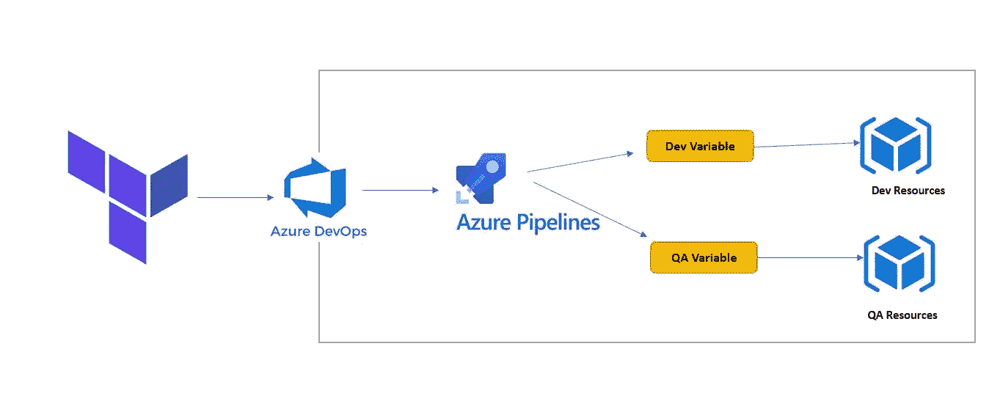
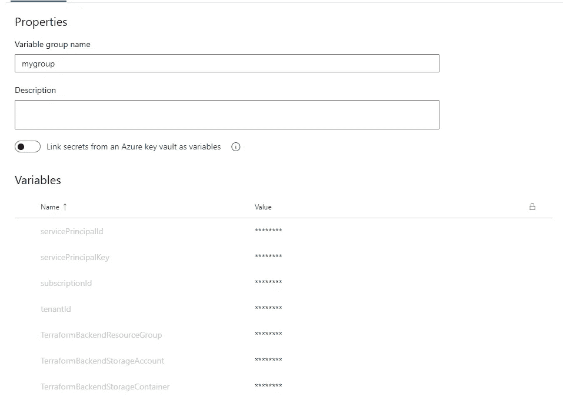
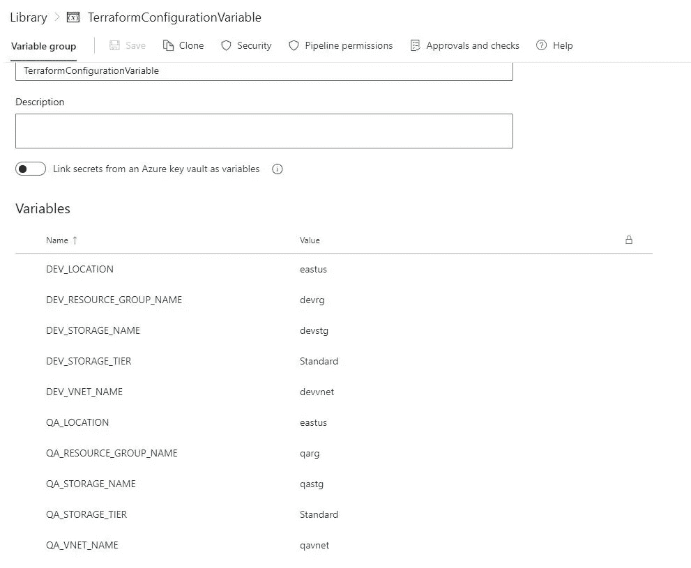
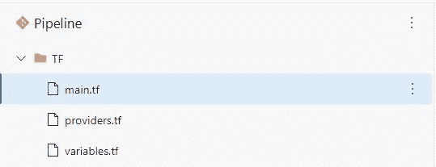
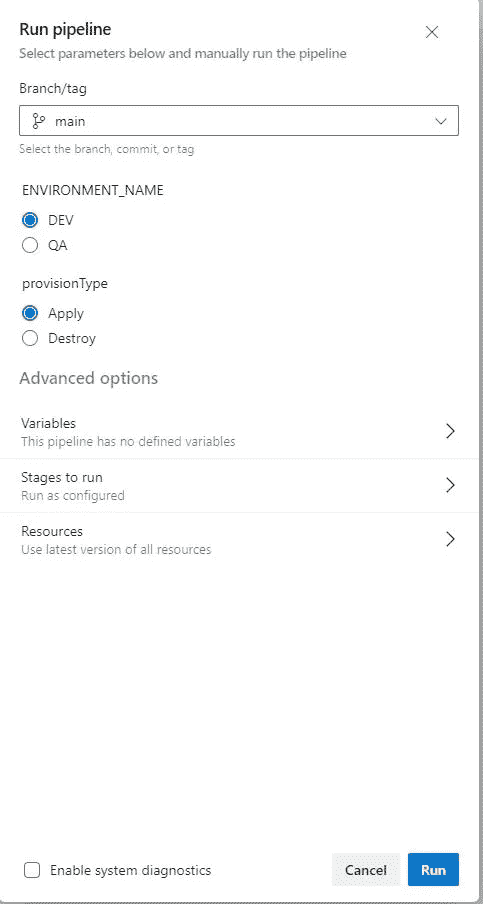
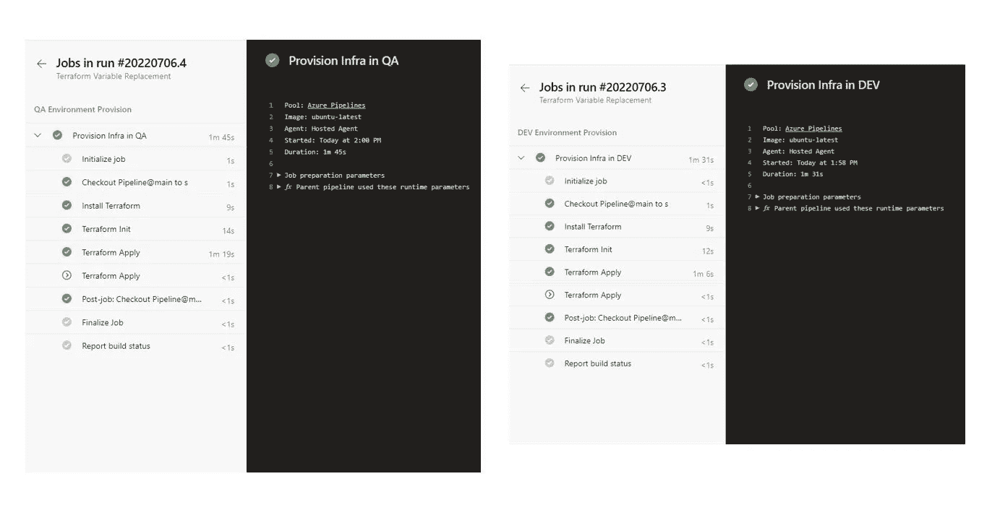

# 在 Azure DevOps 中使用动态变量创建地形资源

> 原文：<https://blog.devgenius.io/terraform-resource-creation-with-dynamic-variable-in-azure-devops-dc23635e6653?source=collection_archive---------5----------------------->



工作流程

在本文中，我将解释使用管道变量通过 Terraform 和 Azure DevOps 创建动态资源的过程。

我们将在 azure pipeline 中只创建一个阶段，使用特定于环境的变量为多个环境创建资源。

**先决条件:**

1.  你有一个 Azure DevOps 项目
2.  您拥有有效的 Azure 订阅
3.  使用以下命令创建服务主体并保存信息

```
az ad sp create-for-rbac --name myServicePrincipalName --role Contributor --scopes /subscriptions/mySubscriptionID
```

4.创建用于存储状态文件的存储帐户

5.使用以下变量创建变量组



6.为动态配置值创建另一个变量组，如下所示



# **步骤**

1.  在 TF 目录下的 Azure Repo 中创建 terraform 配置文件



main.tf

```
resource "azurerm_resource_group" "example" {
  name     = var.resource_group_name
  location = var.location
}resource "random_string" "random" {
  length           = 6
  special          = false
  numeric = false
  upper = false
  lower = true

}
resource "azurerm_virtual_network" "example" {
  name                = var.virtual_network_name
  address_space       = ["10.0.0.0/16"]
  location            = azurerm_resource_group.example.location
  resource_group_name = azurerm_resource_group.example.name
}resource "azurerm_subnet" "example" {
  name                 = "subnetname"
  resource_group_name  = azurerm_resource_group.example.name
  virtual_network_name = azurerm_virtual_network.example.name
  address_prefixes     = ["10.0.2.0/24"]
  service_endpoints    = ["Microsoft.Sql", "Microsoft.Storage"]
}resource "azurerm_storage_account" "example" {
  name                = "${var.storage_account_name}${random_string.random.id}"
  resource_group_name = azurerm_resource_group.example.namelocation                 = azurerm_resource_group.example.location
  account_tier             = "Standard"
  account_replication_type = "LRS"network_rules {
    default_action             = "Deny"
    ip_rules                   = ["100.0.0.1"]
    virtual_network_subnet_ids = [azurerm_subnet.example.id]
  }tags = {
    environment = "staging"
  }
}
```

变量. tf

```
# Input variable definitions
variable "location" {
  description = "The Azure Region in which all resources groups should be created."
  type        = string
  default = "eastus"
}
variable "resource_group_name" {
  description = "The name of the resource group"
  type        = string
  default = "myrg"
}
variable "storage_account_name" {
  description = "The name of the storage account"
  type        = string
  default = "abcstg"
}
variable "storage_account_tier" {
  description = "Storage Account Tier"
  type        = string
  default = "Standard"
}
variable "virtual_network_name" {
  description = "Virtual Network Name"
  type        = string
  default = "myvnet"
}
```

providers.tf

```
terraform {
  required_providers {
    azurerm = {
      source = "hashicorp/azurerm"
      version = "3.8.0"
    }
    random = {
      source  = "hashicorp/random"
      version = "~> 3.0"
    }
  }
  required_version = ">= 1.0.0"
  backend "azurerm" {

  }
}provider "azurerm" {
  # Configuration options
  features {
    key_vault {
      purge_soft_delete_on_destroy = true
    }
    resource_group {
      prevent_deletion_if_contains_resources = false
    }
  }
}
```

2.创建管道 yaml 文件

变量

```
variables:
  - group: mygroup
  - group: TerraformConfigurationVariable
```

因素

```
parameters:
  - name: ENVIRONMENT_NAME
    default: DEV
    values:
      - DEV
      - QA
  - name: provisionType
    type: string
    default: Apply
    values:
      - Apply
      - Destroy
```

阶段

```
stages:
  - stage: ${{ parameters.ENVIRONMENT_NAME }}
    displayName: ${{ parameters.ENVIRONMENT_NAME }} Environment Provision
    jobs:
      - job: InfraCreation
        displayName: Provision Infra in ${{ parameters.ENVIRONMENT_NAME }}
        steps:
          - task: Bash@3
            inputs:
              targetType: 'inline'
              script: |
                  wget -qO - terraform.gpg [https://apt.releases.hashicorp.com/gpg](https://apt.releases.hashicorp.com/gpg) | sudo gpg --dearmor -o /usr/share/keyrings/terraform-archive-keyring.gpg
                  sudo echo "deb [arch=$(dpkg --print-architecture) signed-by=/usr/share/keyrings/terraform-archive-keyring.gpg] [https://apt.releases.hashicorp.com](https://apt.releases.hashicorp.com) $(lsb_release -cs) main" > /etc/apt/sources.list.d/terraform.list
                  sudo apt update
                  sudo apt install terraform
                  terraform --version
            displayName: Install Terraform
          - bash: |
                set -eux  # fail on error
                az login --service-principal -u $ARM_CLIENT_ID -p $ARM_CLIENT_SECRET --tenant $ARM_TENANT_ID
                subscriptionId=$(az account show --query id -o tsv)
                terraform init \
                  -backend-config=storage_account_name=$(TerraformBackendStorageAccount) \
                  -backend-config=container_name=$(TerraformBackendStorageContainer) \
                  -backend-config=key=${{ parameters.ENVIRONMENT_NAME }}.tfstate \
                  -backend-config=resource_group_name=$(TerraformBackendResourceGroup) \
                  -backend-config=subscription_id="$ARM_SUBSCRIPTION_ID" \
                  -backend-config=tenant_id="$ARM_TENANT_ID" \
                  -backend-config=client_id="$ARM_CLIENT_ID" \
                  -backend-config=client_secret="$ARM_CLIENT_SECRET" 
            displayName: 'Terraform Init'
            workingDirectory: $(System.DefaultWorkingDirectory)/TF
            enabled: true
            env:
              ARM_CLIENT_ID: $(servicePrincipalId)
              ARM_CLIENT_SECRET: $(servicePrincipalKey)
              ARM_TENANT_ID: $(tenantId)
              ARM_SUBSCRIPTION_ID: $(subscriptionId)

          - bash: |
              az login --service-principal -u $ARM_CLIENT_ID -p $ARM_CLIENT_SECRET --tenant $ARM_TENANT_ID
              terraform plan -out=plan.tfplan -input=false -var="location=$(${{ parameters.ENVIRONMENT_NAME }}_LOCATION)" -var="resource_group_name=$(${{ parameters.ENVIRONMENT_NAME }}_RESOURCE_GROUP_NAME)" -var="storage_account_name=$(${{ parameters.ENVIRONMENT_NAME }}_STORAGE_NAME)" -var="storage_account_tier=$(${{ parameters.ENVIRONMENT_NAME }}_STORAGE_TIER)" -var="virtual_network_name=$(${{ parameters.ENVIRONMENT_NAME }}_VNET_NAME)"
              terraform apply -input=false -auto-approve plan.tfplan
            displayName: 'Terraform Apply'
            condition: eq('${{ parameters.provisionType }}', 'Apply')
            workingDirectory: $(System.DefaultWorkingDirectory)/TF
            env:
              ARM_CLIENT_ID: $(servicePrincipalId)
              ARM_CLIENT_SECRET: $(servicePrincipalKey)
              ARM_TENANT_ID: $(tenantId)
              ARM_SUBSCRIPTION_ID: $(subscriptionId)
          - bash: |
              az login --service-principal -u $ARM_CLIENT_ID -p $ARM_CLIENT_SECRET --tenant $ARM_TENANT_ID
              terraform destroy -input=false -auto-approve
            displayName: 'Terraform Destroy'
            condition: eq('${{ parameters.provisionType }}', 'Destroy')
            workingDirectory: $(System.DefaultWorkingDirectory)/TF
            env:
              ARM_CLIENT_ID: $(servicePrincipalId)
              ARM_CLIENT_SECRET: $(servicePrincipalKey)
              ARM_TENANT_ID: $(tenantId)
              ARM_SUBSCRIPTION_ID: $(subscriptionId)
```

完整的管道 yaml 配置

```
trigger:
- nonepool:
  vmImage: ubuntu-latestvariables:
  - group: mygroup
  - group: TerraformConfigurationVariable
parameters:
  - name: ENVIRONMENT_NAME
    default: DEV
    values:
      - DEV
      - QA
  - name: provisionType
    type: string
    default: Apply
    values:
      - Apply
      - Destroystages:
  - stage: ${{ parameters.ENVIRONMENT_NAME }}
    displayName: ${{ parameters.ENVIRONMENT_NAME }} Environment Provision
    jobs:
      - job: InfraCreation
        displayName: Provision Infra in ${{ parameters.ENVIRONMENT_NAME }}
        steps:
          - task: Bash@3
            inputs:
              targetType: 'inline'
              script: |
                  wget -qO - terraform.gpg [https://apt.releases.hashicorp.com/gpg](https://apt.releases.hashicorp.com/gpg) | sudo gpg --dearmor -o /usr/share/keyrings/terraform-archive-keyring.gpg
                  sudo echo "deb [arch=$(dpkg --print-architecture) signed-by=/usr/share/keyrings/terraform-archive-keyring.gpg] [https://apt.releases.hashicorp.com](https://apt.releases.hashicorp.com) $(lsb_release -cs) main" > /etc/apt/sources.list.d/terraform.list
                  sudo apt update
                  sudo apt install terraform
                  terraform --version
            displayName: Install Terraform
          - bash: |
                set -eux  # fail on error
                az login --service-principal -u $ARM_CLIENT_ID -p $ARM_CLIENT_SECRET --tenant $ARM_TENANT_ID
                subscriptionId=$(az account show --query id -o tsv)
                terraform init \
                  -backend-config=storage_account_name=$(TerraformBackendStorageAccount) \
                  -backend-config=container_name=$(TerraformBackendStorageContainer) \
                  -backend-config=key=${{ parameters.ENVIRONMENT_NAME }}.tfstate \
                  -backend-config=resource_group_name=$(TerraformBackendResourceGroup) \
                  -backend-config=subscription_id="$ARM_SUBSCRIPTION_ID" \
                  -backend-config=tenant_id="$ARM_TENANT_ID" \
                  -backend-config=client_id="$ARM_CLIENT_ID" \
                  -backend-config=client_secret="$ARM_CLIENT_SECRET" 
            displayName: 'Terraform Init'
            workingDirectory: $(System.DefaultWorkingDirectory)/TF
            enabled: true
            env:
              ARM_CLIENT_ID: $(servicePrincipalId)
              ARM_CLIENT_SECRET: $(servicePrincipalKey)
              ARM_TENANT_ID: $(tenantId)
              ARM_SUBSCRIPTION_ID: $(subscriptionId)

          - bash: |
              az login --service-principal -u $ARM_CLIENT_ID -p $ARM_CLIENT_SECRET --tenant $ARM_TENANT_ID
              terraform plan -out=plan.tfplan -input=false -var="location=$(${{ parameters.ENVIRONMENT_NAME }}_LOCATION)" -var="resource_group_name=$(${{ parameters.ENVIRONMENT_NAME }}_RESOURCE_GROUP_NAME)" -var="storage_account_name=$(${{ parameters.ENVIRONMENT_NAME }}_STORAGE_NAME)" -var="storage_account_tier=$(${{ parameters.ENVIRONMENT_NAME }}_STORAGE_TIER)" -var="virtual_network_name=$(${{ parameters.ENVIRONMENT_NAME }}_VNET_NAME)"
              terraform apply -input=false -auto-approve plan.tfplan
            displayName: 'Terraform Apply'
            condition: eq('${{ parameters.provisionType }}', 'Apply')
            workingDirectory: $(System.DefaultWorkingDirectory)/TF
            env:
              ARM_CLIENT_ID: $(servicePrincipalId)
              ARM_CLIENT_SECRET: $(servicePrincipalKey)
              ARM_TENANT_ID: $(tenantId)
              ARM_SUBSCRIPTION_ID: $(subscriptionId)
          - bash: |
              az login --service-principal -u $ARM_CLIENT_ID -p $ARM_CLIENT_SECRET --tenant $ARM_TENANT_ID
              terraform destroy -input=false -auto-approve
            displayName: 'Terraform Destroy'
            condition: eq('${{ parameters.provisionType }}', 'Destroy')
            workingDirectory: $(System.DefaultWorkingDirectory)/TF
            env:
              ARM_CLIENT_ID: $(servicePrincipalId)
              ARM_CLIENT_SECRET: $(servicePrincipalKey)
              ARM_TENANT_ID: $(tenantId)
              ARM_SUBSCRIPTION_ID: $(subscriptionId)
```

执行管道以提供资源



流水线执行

Pipeline 将基于选定的环境创建资源。



摘要

我希望你喜欢阅读这篇文章，随时添加你的评论、想法或反馈，不要忘记在 [linkedin](https://www.linkedin.com/in/babulaparida/) 上取得联系。