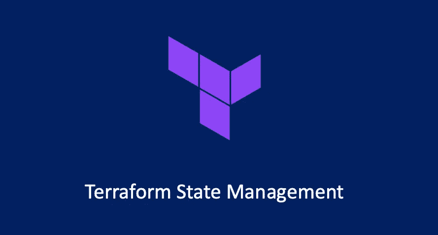
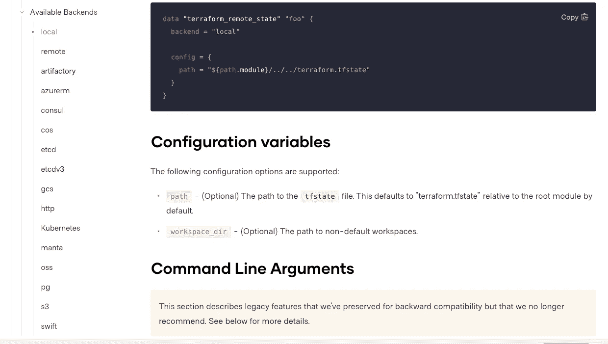
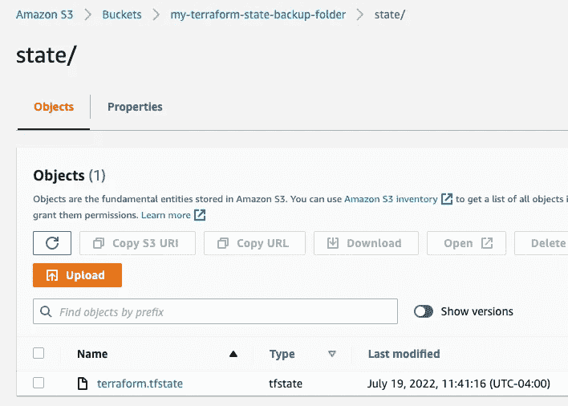
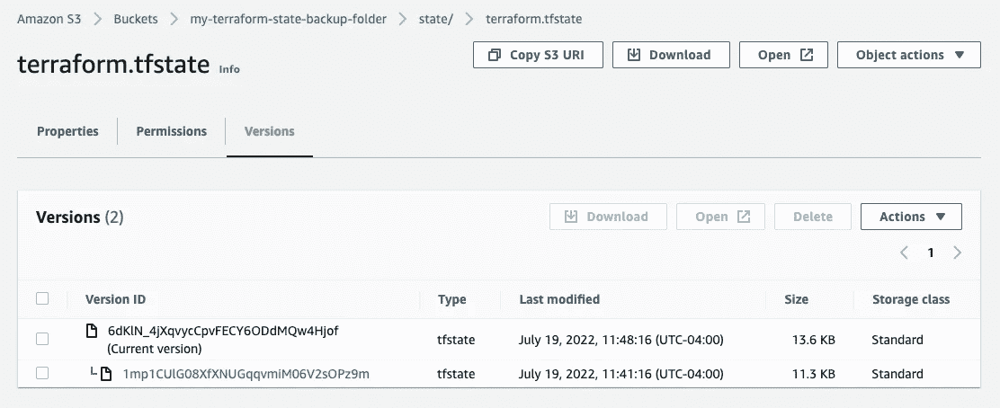

# 地形——状态管理

> 原文：<https://blog.devgenius.io/terraform-state-management-85bc622f731c?source=collection_archive---------3----------------------->

## 地形状态管理深度潜水



正如我们在我的上一篇 Terraform 文章中提到的——“terra form Provider”。当我们成功执行一次`terraform apply`并创建所需的基础设施时，Terraform 将记住当前状态，并将其与代码描述的所需状态进行比较。第二次申请时，因为当前状态已经与代码描述的状态一致，所以生成一个空的执行计划。

# 初步查看状态文件

在这里，Terraform 引入了一个独特的概念——状态管理，这是 Ansible 等配置管理工具或自研工具调用 SDK 来操作基础设施所不具备的。

简而言之，每次在状态文件中执行基础设施更改操作时，Terraform 都会保存状态信息，默认情况下，状态信息存储在当前工作目录`terraform.tfstate`中的文件中。例如，我们在代码中声明了一个资源:

```
resource "aws_vpc" "vpc" {
  cidr_block = "10.0.0.0/16"
}
```

在我们执行`terraform apply`之后，我们可以在`terraform.tfstate`文件中看到的是:

```
{
  "version": 4,
  "terraform_version": "1.2.5",
  "serial": 1,
  "lineage": "5d18f1c2-882d-4cba-de4c-346484457f89",
  "outputs": {},
  "resources": [
    {
      "mode": "managed",
      "type": "aws_vpc",
      "name": "vpc",
      "provider": "provider[\"registry.terraform.io/hashicorp/aws\"]",
      "instances": [
        {
          "schema_version": 1,
          "attributes": {
            "arn": "arn:aws:ec2:us-east-1:xxxx:vpc/vpc-00ec463310c0e9b8f",
            "assign_generated_ipv6_cidr_block": false,
            "cidr_block": "10.0.0.0/16",
            "default_network_acl_id": "acl-009d4801fe6843b05",
...
            "ipv6_netmask_length": 0,
            "main_route_table_id": "rtb-0977cbecd8dc3c595",
            "owner_id": "xxxx",
            "tags": null,
            "tags_all": {}
          },
          "sensitive_attributes": [],
          "private": "xxxx"
        }
      ]
    }
  ]
}
```

我们之前说过，由于`tfstate`文件的存在，`terraform apply`在再次立即应用后不会执行任何更改，那么如果我们删除 tfstate 文件，然后再次执行 apply 会发生什么情况呢？我们试试吧！

```
$ rm terraform.tfstate 
$ terraform applyTerraform used the selected providers to generate the following execution plan. Resource actions are indicated with the
following symbols:
  + create
Terraform will perform the following actions:# aws_vpc.vpc will be created
  + resource "aws_vpc" "vpc" {
      + arn                                  = (known after apply)
      + cidr_block                           = "10.0.0.0/16"
      + default_network_acl_id               = (known after apply)
      + default_route_table_id               = (known after apply)
      + default_security_group_id            = (known after apply)
...
aws_vpc.vpc: Creation complete after 1s [id=vpc-01cc3852f83401b80]Apply complete! Resources: 1 added, 0 changed, 0 destroyed.
```

**Terraform 无法读取** `**tfstate**` **文件，会认为这是我们第一次创建这组资源，所以会再次创建代码中描述的所有资源！**

> **更麻烦的是，由于我们上次创建的资源对应的状态信息被我们删除了，所以我们无法再运行** `**terraform destroy**` **通过执行来破坏和回收这些资源，实际上造成了资源泄露。所以妥善保存这个状态文件是非常重要的。**

此外，如果我们对 Terraform 代码进行一些修改，生成的执行计划将改变状态，那么在实际执行改变之前，Terraform 将把当前的 tfstate 文件复制到路径`terraform.tfstate.backup`以防止意外的 tfstate 损坏。

有一点需要注意的是，在 Terraform 发展的非常早期，HashiCorp 尝试了一种无状态的文件解决方案，即在执行 Terraform 变更计划时，所有涉及的资源都用特定的标签进行标记，在执行下一次变更时，先读取相关的标签。重构状态信息的资源。但是因为不是所有的资源都支持标签，也不是所有的公有云都支持多标签，所以 Terraform 最终决定使用状态文件方案。

# 重要状态警报

关于 Terraform state 还有一个更重要的事情，每个考虑在生产环境中使用 Terraform 的人都必须**极其小心和警惕:Terraform state 文件是明文的，这意味着代码中使用的所有机密信息都将以明文形式保存在 state 文件中。**例如:

```
esource "ucloud_instance" "normal" {
  availability_zone = "cn-sh2-02"
  image_id          = data.ucloud_images.default.images[0].id
  instance_type     = "n-basic-2"
  root_password     = "supersecret1234"
  name              = "tf-example-normal-instance"
  tag               = "tf-example"
  boot_disk_type    = "cloud_ssd"
  security_group = data.ucloud_security_groups.default.security_groups[0].id
  delete_disks_with_instance = true
}
```

在上面的代码中，我们将`root_password`设置为`supersecret1234`，在执行`terraform apply`之后，你会在 tfstate 文件中看到如下信息:

```
{
      "mode": "managed",
      "type": "ucloud_instance",
      "name": "normal",
      "provider": "provider[\"registry.terraform.io/ucloud/ucloud\"]",
      "instances": [
        {
          "schema_version": 0,
          "attributes": {
            "allow_stopping_for_update": null,
...
            **"root_password": "supersecret1234",**
            "security_group": "firewall-a0lqq3r3",
..
          ]
        }
      ]
    }
```

可以看到`root_password`是以明文形式写在 tfstate 文件中的。这是 Terraform 从设计之初就已经确立的，在可预见的未来也不会改善。无论是用明文硬编码，使用参数(变量，我们将在后面的章节中介绍)，还是用一个函数在运行时异想天开地从外界读取，都无法改变这个结果。

有两种解决方案，一种是使用 Vault 或 AWS Secret Manager 等动态秘密管理工具生成一个临时有效的动态秘密(比如有效期只有 5 分钟，即使被他人读取，秘密也早已过期)；一个是我下面要介绍的——terra form back end。

# Terraform 后端

到目前为止，我们的 tfstate 文件是保存在当前工作目录中的本地文件。如果我们的电脑损坏，文件丢失，那么 tfstate 文件对应的资源将无法管理，导致资源泄露。

还有，如果我们是一个使用 Terraform 管理一组资源的团队，团队成员如何共享这个状态文件？是否可以将 tfstate 文件签入源代码管理工具以保存它？

将 tfstate 文件签入代码管理工具是非常错误的。这就像将数据库签入源代码管理工具。

为了解决状态文件的存储和共享问题，Terraform 引入了远程状态存储机制，即 Backend。后端是一个抽象的远程存储接口。与提供商一样，后端也支持各种不同的远程存储服务:



图片来自[https://www.terraform.io/](https://www.terraform.io/)

状态锁意味着当对 tfstate 执行更改操作时，可以向状态文件添加一个全局锁，以确保同一时间只能执行一个更改。不同的后端对状态锁的支持不同，实现状态锁的机制也不同。

例如，s3 后端要求用户传入一个 Dynamodb 表来存储锁信息，而 tfstate 文件存储在 s3 桶中。

# AWS S3 后端演示

让我们首先创建一个只包含提供者信息的`backend.tf`文件:

```
terraform {
  required_providers {
    aws = {
      source  = "hashicorp/aws"
      version = "~> 4.18.0"
    }
  }
}provider "aws" {
  profile = "metaleap"
  region  = "us-east-1"
}
```

现在我们可以开始关注其他的 tf 文件了；这将包含所有适当的资源，以正确、安全地维护我们在`S3`中的 Terraform 状态文件。

## KMS 钥匙

我们需要创建一个 KMS 密钥来加密状态桶。那么让我们定义下面的`kms.tf`:文件:

```
resource "aws_kms_key" "terraform-bucket-key" {
 description             = "This key is used to encrypt bucket objects"
}resource "aws_kms_alias" "key-alias" {
 name          = "alias/terraform-bucket-key"
 target_key_id = aws_kms_key.terraform-bucket-key.key_id
}
```

## S3 水桶

然后我们需要一个 S3 桶来存储状态文件，让我们继续在一个名为`s3.tf`的文件中定义以下内容:

```
resource "aws_s3_bucket" "terraform-state-bucket" {
  bucket = "my-terraform-state-backup-folder"
}resource "aws_s3_bucket_acl" "bucket_acl" {
  bucket = aws_s3_bucket.terraform-state-bucket.id
  acl    = "private"
}resource "aws_s3_bucket_server_side_encryption_configuration" "encryption-example" {
  bucket = aws_s3_bucket.terraform-state-bucket.bucketrule {
    apply_server_side_encryption_by_default {
      kms_master_key_id = aws_kms_key.terraform-bucket-key.arn
      sse_algorithm     = "aws:kms"
    }
  }
}resource "aws_s3_bucket_versioning" "versioning_example" {
  bucket = aws_s3_bucket.terraform-state-bucket.id
  versioning_configuration {
    status = "Enabled"
  }
}resource "aws_s3_bucket_public_access_block" "block" {
  bucket = aws_s3_bucket.terraform-state-bucket.idblock_public_acls       = true
  block_public_policy     = true
  ignore_public_acls      = true
  restrict_public_buckets = true
}
```

## DynamoDB 表

为了防止两个团队成员同时写入状态文件，我们将实现一个 DynamoDB 表锁，创建一个`dynamodb.tf:`

```
resource "aws_dynamodb_table" "terraform-state" {
 name           = "terraform-state"
 read_capacity  = 20
 write_capacity = 20
 hash_key       = "LockID"

 attribute {
   name = "LockID"
   type = "S"
 }
}
```

## 状态文件版本

最后一步是在同一个目录下创建一个名为`.terraform-version`的文件，在第一行写上`1.0.0`，就这样。`tfenv`现在将获取该版本，并确保在运行任何 Terraform 命令之前安装该版本。

## 执行

此时，文件夹结构如下所示:

```
.
├── backend.tf
├── dynamodb.tf
├── kms.tf
├── main.tf
├── s3.tf
```

我们还没有在`backend.tf`中配置任何后端，我们稍后会做。我们来做一个`terraform init`:

```
$ terraform initInitializing the backend...Initializing provider plugins...
- Reusing previous version of hashicorp/aws from the dependency lock file
- Using previously-installed hashicorp/aws v4.18.0
```

然后用`terraform apply`应用更改:

```
$ terraform apply
...
aws_kms_key.terraform-bucket-key: Creating...
aws_vpc.vpc: Creating...
aws_dynamodb_table.terraform-state: Creating...
aws_s3_bucket.terraform-state-bucket: Creating...
aws_s3_bucket.terraform-state-bucket: Creation complete after 0s ...Apply complete! Resources: 9 added, 0 changed, 0 destroyed.
```

到目前为止，一切顺利。我们已经创建了在 AWS S3 存储桶中安全存储 Terraform 状态文件所需的所有必要的底层资源。您将会看到状态文件当前作为`terraform.tfstate`存储在本地。

## 配置后端

我们必须向我们的`backend.tf`文件再添加一个资源，重新运行`terraform init`，因此将`backend.tf`文件更新为:

```
terraform {
  required_providers {
    aws = {
      source  = "hashicorp/aws"
      version = "~> 4.18.0"
    }
  }
  required_version = ">= 1.0"
  backend "s3" {
    profile        = "metaleap"
    region         = "us-east-1"
    key            = "state/terraform.tfstate"
    encrypt        = true
    bucket         = "my-terraform-state-backup-folder"
    kms_key_id     = "alias/terraform-bucket-key"
    dynamodb_table = "terraform-state"
  }
}provider "aws" {
  profile = "metaleap"
  region  = "us-east-1"
}
```

让我们初始化后端:

```
$ terraform initInitializing the backend...
Do you want to copy existing state to the new backend?
  ...Enter a value: yesSuccessfully configured the backend "s3"! Terraform will automatically
use this backend unless the backend configuration changes.Initializing provider plugins...
- Reusing previous version of hashicorp/aws from the dependency lock file
- Using previously-installed hashicorp/aws v4.18.0Terraform has been successfully initialized!...
```

现在您应该能够看到一个`terraform.tfstate`文件被上传到 s3 bucket:



恭喜你，现在一切正常。现在，您已经在 AWS 中创建了一组功能齐全的资源，来管理带有 DynamoDB 锁保护的安全 S3 存储桶中的状态文件。

如果你做了任何代码更改并重新运行`terraform apply`命令，一个新版本的`terraform.tfstate`文件将在 S3 桶中被创建。例如，我对`main.tf`做了一些更新，在`terraform apply`重新运行后，我可以看到`terraform.tfstate`文件有两个版本:

