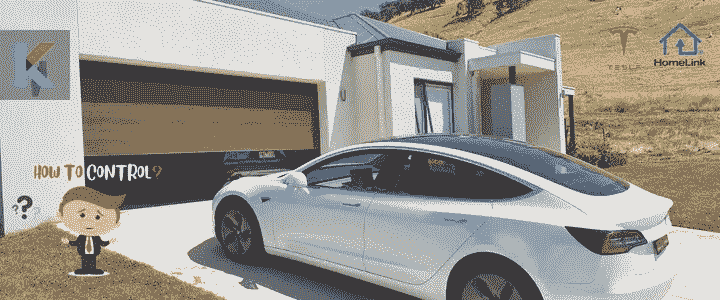
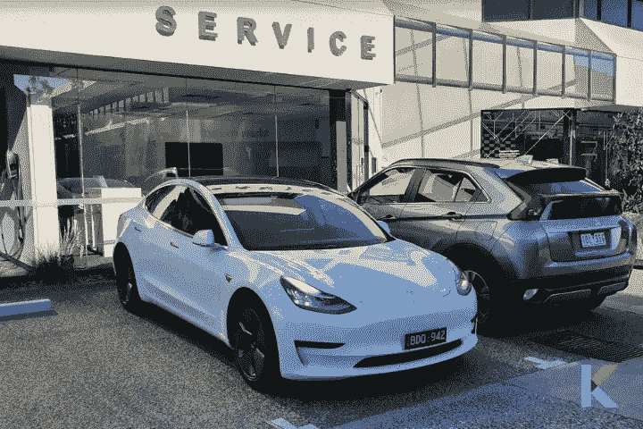
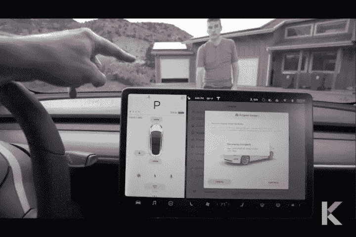

# 特斯拉 HomeLink——特斯拉自动车库门开启器

> 原文：<https://blog.devgenius.io/tesla-homelink-2921bc3b4fc9?source=collection_archive---------15----------------------->

如今，汽车制造商正试图利用他们的新功能来吸引客户。特斯拉是使用此类功能及其空中更新的汽车制造商之一。其中一个神奇的功能就是特斯拉与 HomeLink 的集成。你可能想知道你是否能把你的特斯拉和车库开门器整合在一起。在这篇文章中，我想分享我使用 HomeLink 的经验，我们将探讨如何将特斯拉与 HomeLink 整合在一起。

# 什么是特斯拉 HomeLink？

HomeLink 是世界上最著名的车载无线控制系统。它还可以作为自动车库门开启系统。它不与你的特斯拉一起提供，但你可以在特斯拉在线商店额外购买。

此外，它还兼容数百个车库门。除此之外，它还兼容 gates 和其他设备。对[特斯拉自动车库门开启器](https://kodmy.com/tesla-homelink/)进行编程既简单又快捷，因为它会自动定位并与原始发射器的代码同步。

如果你拥有特斯拉 Model 3 和 Y，可以安装 HomeLink 作为这些车型的改装。作为 2018 年特斯拉 Model 3 的早期采用者，我的车也附带了这个有趣的功能。Homelink 将你的特斯拉连接到车库门、灯、大门和安全系统(树形射频控制设备)。我想就如何进一步设置 Tesla HomeLink 给出一步一步的指导。

如果你拥有苹果 HomeKit，你可能想知道[如何将特斯拉连接到苹果 HomeKit](https://kodmy.com/tesla-homekit/) 。

HomeLink 值得吗？我来帮你回答这个问题。以下是 HomeLink 的优缺点。

# 对你的特斯拉的支持和反对

**HomeLink 的一些优点**

*   Homelink 是一种简单安全的控制车库门的方法
*   设置和编程设备很容易
*   HomeLink 几乎适用于所有的车库门开启器和门禁系统

**home link 的一些缺点**

*   这是额外费用，因为不是标准配置
*   您只能连接三台设备
*   如果您离服务中心不近，安排安装预约可能会有问题。

# 其他特斯拉兼容车库门开启器

寻找特斯拉兼容的车库开门器？车库开门器是每个家庭的最佳选择。我们有特斯拉车库门开门器的绝佳选择。

如果你想购买最好的 HomeLink 特斯拉替代品，你可以比较和选择最好的车库门开启器特斯拉。

此外，如果你担心你的口袋，你可以买最实惠的替代品。现在市场上有很多智能车库门开启器。以下是 HomeLink 的一些最佳替代方案。

## MYQ 张伯伦智能车库门开门器

MYQ Chamberlain 车库门开启器是 HomeLink 的最佳替代品。这是一个支持 Wi-Fi 的车库中心，可以用智能手机控制。您可以使用 myQ 应用程序使用这款智能开门器来打开和关闭车库门。此外，它还可以用作特斯拉 Model 3 车库开门器。

如果你在寻找特斯拉 HomeLink 的最佳替代品？然后，你可以[从 Kodmy 购买价格合理的 myQ Chamberlain 车库门开启器](https://kodmy.com/store/product/myq-chamberlain-smart-garage-control/)。

## Meross 智能 Wi-Fi 车库开门器

[Meross 智能 Wi-Fi 车库门开启器](https://kodmy.com/store/product/meross-smart-wi-fi-garage-door-opener-remote/)也是最好的特斯拉 model 3 车库门开启器。它具有独特的功能，例如它不需要任何集线器来控制它。它还兼容 Alexa、谷歌助手和 IFTTT。

你可以[以更便宜的价格从 Kodmy 购买 meross 智能 Wi-Fi 车库门遥控器](https://kodmy.com/store/product/meross-smart-wi-fi-garage-door-opener-remote/)。

很容易将你的特斯拉 Model 3 与你的车库门开启器集成在一起。但是你有两个选择，要么选择主页链接，要么选择主页链接的替代品。

# 你如何使用特斯拉 HomeLink？

HomeLink 会在自动到达你家时打开你的车库门。它使用 GPS 技术，你可以定义从车库或大门的距离。不仅打开你的车库门，而且自动关闭你的车库门。当你倒车出车库的时候，你想要设定距离。放心吧！在这个过程中没有按钮按下，它会自动检测使用信号。

想告诉你的特斯拉有 HomeLink？然后，你可以很容易地使用汽车的显示屏告诉你的特斯拉。你需要去控制，然后软件。接下来，您需要点击其他车辆信息，您可以看到一些详细信息。

你可以看到很多信息，比如安装了哪个全自动驾驶计算机硬件，你是否安装了 [HomeLink 车库门开门器](https://kodmy.com/best-smart-garage-door-opener/#Chamberlain-myQ)硬件，信息娱乐处理器等等。

如果您想检查是否安装了 HomeLink 模块，您可以在“车库门开门装置”旁边看到“未安装”或“HomeLink”。此外，你可以看到你的车是否能够打开车库门。您可以通过触摸屏和自动开关方法使用 Tesla HomeLink model 3。您可以在特斯拉在线商店和您当地的服务中心购买特斯拉 models 3 和 Y 的 HomeLink。

# 从你的特斯拉应用程序控制你的车库

我很兴奋特斯拉增加了这个神奇的功能，你可以使用特斯拉应用程序来控制车库门。以下是如何用特斯拉 app 控制车库门。

第 01 步:首先，你需要走到你的特斯拉的触摸屏前。然后你可以去控制>自动驾驶仪，并选择召唤按钮。

**步骤 02:** 点击特斯拉触摸屏上的召唤按钮后，点击 HomeLink 图标，选择你的车库门

**步骤 03:** 接下来，打开特斯拉应用程序，如果你点击特斯拉应用程序中的召唤按钮，你可以在右上角找到 HomeLink 按钮。当你按下那个按钮时，你的车库门会自动开关。

但是，你需要安装完整的自动驾驶套装或增强的自动驾驶仪，才能用特斯拉应用程序打开和关闭车库门。如果没有，你需要改变车库门的顺序。还有，你可以不用遥控器控制你的特斯拉 HomeLink。

## 支持的模式

有三种支持的模式，即标准模式，D 模式和 UR 模式。您可以根据射频设备的兼容性选择发射模式。

**标准模式:**标准模式是 HomeLink 设备的常用模式。如果您的设备有遥控器，此模式可用于操作您的射频设备。

**D 模式或 ur 模式:**如果您的射频设备没有遥控器，您可以使用此 D 模式或 UR 模式。

您可以根据需要将其设置为不同的模式。如果您想更改传输模式，您必须触摸控制屏幕上的 HomeLink 图标。您可以按照以下步骤来更改模式。(进入控制屏幕>触摸 HomeLink 图标>选择您想要更改的设备。选择程序>选择模式>触摸设置模式>按照屏幕指示操作)

# 编程 Tesla 车库门开门器

想设计你的主页链接吗？如果你想设置你的特斯拉汽车自动打开车库门和关闭车库门。你可以使用汽车的界面或使用特斯拉应用程序来实现这一点。你所需要的只是一个与你的车库门配套的遥控器来给你的车编程。

在编写 HomeLink 之前，您必须做几件重要的事情。

*   你必须确保没有挡路的东西，你需要把车停在车库外面。
*   你最好给你的车库门遥控器换块新电池
*   有时，你的车库门可以使用滚动代码。然后，你需要一个活梯或其他坚固或安全的装置，在编程后够到“学习按钮”。

在服务中心完成安装后，您只需在家中安装 HomeLink 车库门。按照以下说明将您的 Tesla 连接到 HomeLink

步骤 01: 首先，你想把车停在车库门口

**步骤 02:** 该编程过程需要一定的时间。所以，在编程之前，要确保有足够的空间和一个好的梯子

**步骤 03:** 接下来，你可以去特斯拉的触摸屏。然后，点击控制、设置和 HomeLink 图标。此外，您还可以向 HomeLink 添加兼容配件，如车库门、灯或大门。

**步骤 04:** 首先点击“添加新主页链接”按钮，然后你就可以创建新的个人资料了。

**步骤 05:** 在创建新的配置文件之前，您需要输入车库门的名称，然后点击“创建主页链接”

**步骤 05:** 之后，您需要选择模式为标准模式、D 模式或 UR 模式。该模式会根据车辆的位置和编程方法而有所不同。

**步骤 06:** 设置好首选模式后，点击“设置模式”并选择“程序”。从那里，你需要做的就是按照屏幕上的指示

**步骤 07:** 您需要将车辆停在车库前，因此汽车会利用这个位置来检测您的车辆状态。

现在，你需要将车库门遥控器对准汽车的前保险杠。然后，您需要按住打开按钮长达 30 秒。

**步骤 09:** 如果你看到你的特斯拉的大灯闪了一下，你的车编程成功了。

**步骤 10:** 接下来，如果不使用滚动码或者遥控器与快速列车兼容，您可以回到车内，然后点击“继续”按钮。

第十一步:你可以去车库门的开启器，然后点击学习按钮来学习特斯拉的代码。

第 12 步:一旦你按下按钮，你需要走到你的特斯拉前，点击“继续”。这将防止未经授权使用你的车库门。

**第十三步:**作为最后一步，如果要测试编程，需要按下车内的 HomeLink 按钮。就是这样。