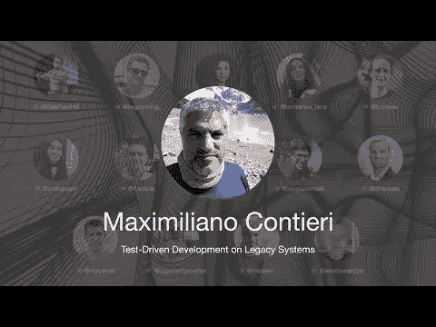

# 遗留系统的测试驱动开发——Maximiliano Contieri

> 原文：<https://blog.devgenius.io/test-driven-development-on-legacy-systems-maximiliano-contieri-182625fb85fb?source=collection_archive---------4----------------------->

第一次国际测试驱动开发发生在 7 月 10 日。

在这一系列中，我将把每一个演讲连同我的笔记和进一步的阅读包括在内。

希望有很多读者会观看和重新观看这些演讲，因为它们值得多看几遍。

让我们继续…

# 个人简历

马克西拥有计算机科学博士学位。他教授软件工程并在工业界工作了 25 年。
他在 2000 年代中期采用了 TDD，从零开始建立了一个金融系统，进行了 25000 次自动化测试。从那以后，他一直在通过用 TDD 重构现有的遗留应用程序来增强它们。
他经常写关于软件设计、代码味道和干净代码的博客。
T4
TL；DR:我们没有借口到处使用 TDD

# 讨论

*这是我自己的谈话。我自己的笔记不会很准确😇*

# 我的个人笔记

*   TDD 是一种**开发**方法。不是测试。
*   它支持亲吻和 YAGNI 原则。
*   使用 TDD 开发时，系统的耦合性较低
*   我们提倡小步前进
*   神话: **TDD 保证好的设计**
*   我们要求测试没有副作用。我们必须完全控制局面
*   误区:**我们不能在耦合系统上使用 TDD**
*   误区: **TDD 不能用来提高系统性能**
*   名字总是很糟糕
*   我们应该使用 ide，而不是文本编辑器
*   我们从僵尸开始 TDD
*   误区:**硬编码是一种不好的实践**
*   神话:**我们可以编写没有测试用例的算法**
*   我们不能同时重构和改变测试
*   神话:**在 TDD 过程中，只有程序员创建测试**
*   QAs、同行评审者、技术支持和产品所有者定义测试
*   神话:**我们应该测试私有方法**

# 扬声器链接

*   Twitter @ [mcsee1](https://twitter.com/mcsee1)
*   LinkedIn @ [mcsee](https://www.linkedin.com/in/mcsee/)
*   DevTo [@mcsee](https://dev.to/mcsee)
*   地点[https://maximilianocontieri.com](https://maximilianocontieri.com)
*   中型[https://mcsee.medium.com/](https://mcsee.medium.com/)

请关注 TDD 会议:

 [## TDD 会议

### 与朋友、家人和全世界分享您的视频

www.youtube.com](https://www.youtube.com/channel/UCKn-DadPoyYssfAOMk1LSew)  [## JavaScript 不可用。

### 编辑描述

twitter.com](https://twitter.com/tddconf)