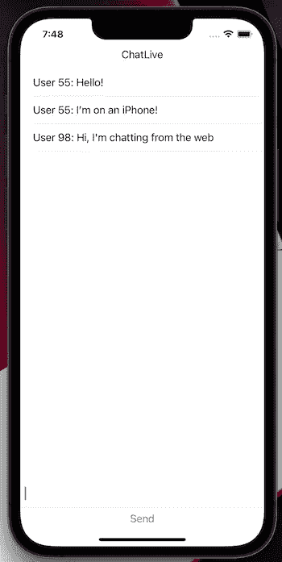

# 试用 LiveView 原生版:由 Elixir 驱动的原生应用

> 原文：<https://blog.devgenius.io/test-driving-liveview-native-native-apps-driven-by-elixir-51f20bdd46c5?source=collection_archive---------1----------------------->

一个名为 LiveView Native 的新项目可以让你构建完全本地的 iOS 或 Android 应用，这些应用完全由运行[凤凰框架](http://phoenixframework.org/)和[仙丹语言](https://elixir-lang.org/)的*后端服务器*驱动。基于用于交互式服务器渲染的 HTML 应用程序的 [LiveView 库](https://hexdocs.pm/phoenix_live_view/Phoenix.LiveView.html)，这个新项目实现了前端应用程序开发的新范式:前端的变化是由服务器响应应用程序状态的变化而推出更新的视图来驱动的。实际上，*这消除了对前端代码和逻辑*的需求。


[Adeolu Eletu](https://unsplash.com/@adeolueletu?utm_source=medium&utm_medium=referral) 在 [Unsplash](https://unsplash.com?utm_source=medium&utm_medium=referral) 上拍摄的照片

在这篇文章中，我们将看看什么是 LiveView Native，它与 LiveView 相比如何，并对它进行快速测试。在未来的帖子中，我们将使用 LiveView Native，在 Elixir 和 Phoenix Framework 的支持下，制作一个实时的本地聊天应用程序。

[](https://blixtdev.com/getting-started-with-phoenix-liveview/) [## 开始使用 Phoenix LiveView

### 获取我们即将推出的关于如何开始使用 Phoenix LiveView 的电子书。

blixtdev.com](https://blixtdev.com/getting-started-with-phoenix-liveview/) 

# 什么是 LiveView

LiveView 是 Phoenix framework 的一个强大的库，它让你不用一行 JavaScript 就能构建丰富的、高度交互的服务器驱动的 web 应用。它使用服务器呈现的 HTML，当服务器状态改变时，它在客户端自动更新*。服务器*自动将更新的 HTML 片段推送到客户端，而不是处理前端 JavaScript 逻辑来获取新数据和更新 DOM。**

假设我们的后端有一个简单的模板，它呈现一个消息列表:

```
<%= for message <- @messages do %>
  <p><%= message %></p>
<% end %>
```

在 LiveView 中，只要服务器上的 *@messages* 内容发生变化，新的列表就会自动反映在客户端上，无需一行 JavaScript 代码！这也适用于在客户端启动的事件:浏览器中的一个按钮或表单触发了一个服务器端事件，该事件反过来改变服务器状态并触发重新呈现。同样，所有这些都没有一行 JavaScript 代码。

> 在网络上，LiveView 可以让你创建丰富的、高度互动的应用程序，同时完全不用 JavaScript。

LiveView 通过客户端和后端服务器之间的持久 websocket 连接来施展魔法。这个 websocket 执行双向通信，从客户端获取事件，并在标记发生更改时从服务器推送优化的 HTML 差异。

要全面了解 LiveView 及其优势，我强烈建议您阅读这篇文章，主题是[为什么您的下一个 Web 应用前端可能是后端](https://blixtdev.com/why-your-next-frontend-might-be-the-backend/):

[](https://blixtdev.com/why-your-next-frontend-might-be-the-backend/) [## 为什么你的下一个 Web 应用前端可能是后端

### LiveView 和其他实时服务器端渲染 HTML 技术如何改变前端的编写方式，如果…

blixtdev.com](https://blixtdev.com/why-your-next-frontend-might-be-the-backend/) 

如果你对 LiveView 的实践教程感兴趣，请查看[用 LiveView 构建实时聊天应用](https://blixtdev.com/real-time-chat-with-phoenix-and-liveview/):

[](https://blixtdev.com/real-time-chat-with-phoenix-and-liveview/) [## 用不到 50 行代码构建与 Phoenix 和 LiveView 的实时聊天

### 如果您还没有体验过 Phoenix 框架中 LiveView 的强大功能，请系好安全带:我们将构建一个…

blixtdev.com](https://blixtdev.com/real-time-chat-with-phoenix-and-liveview/) 

# 什么是 LiveView 原生版，它是如何工作的？

LiveView Native 是由[船坞](http://dockyard.com/)建造的一个新项目，它将 LiveView 的概念扩展到了*本地应用。*它让你的 LiveView 后端通过服务器生成的动态标记驱动一个原生 iOS 或 Android 应用。(注意:虽然 Android 支持正在进行中，但 iOS 前端在这一点上似乎更成熟，这是我用来测试的)。


LiveView Native 的工作方式与其基于 web 的对等物非常相似，只是它不发送 HTML，而是发送一种替代的标记格式，该格式指定了如何构造本地视图。对于 iOS，这意味着发送一个类似 SwiftUI 的标记:

iOS 版 LiveView 原生标记

注意，我们引用的是 SwiftUI 组件，如 *VStack、HStack 和 Text，而不是 HTML 元素，如 *div* 和 *p* 。*

将 LiveView 原生添加到 SwiftUI 应用程序就像创建一个连接到 LiveView 套接字的 *LiveViewCoordinator* 一样简单，然后在 Coordinator 的层次结构中添加一个视图:

就是这样！该视图现在完全由 Phoenix LiveView 后端标记驱动。

LiveView Native 的一个优点是，它只在 SwiftUI 视图中运行，并且该视图可以嵌入视图层次结构中的任何位置。

这意味着 LiveView Native 可以很好地与现有的 SwiftUI 应用程序配合，并且使用 LiveView Native 不是一个全有或全无的命题，一些框架倾向于采用这种方式。

如果你愿意，你甚至可以在同一个应用程序中拥有多个 LiveView 原生视图。我在我的聊天示例中尝试了这一点，制作了视图的第二个副本，然后像一个独立的客户端一样连接。这可能不是一个常见的用例，但它确实为有选择地将 LiveView Native 用于特定的交互式服务器驱动的组件打开了大门，而不是让它驱动整个应用程序。

# LiveView Native 的权衡

LiveView 和 LiveView Native 可以给 app 开发带来几个好处，当然也有一些坏处。让我们来探讨一下这里的权衡。

# LiveView Native 的优势

首先，让我们看看 LiveView 原生方法的好处。

*   **全动态前端:**利用服务器返回的标记，可以像网页一样动态改变。这可以是简单的小内容更新，也可以是整个应用程序的重新设计和重组。
*   **统一状态管理—没有客户端/服务器同步问题:**与客户端和服务器可能通过 API 调用进行通信以来回传递数据并同步状态的典型架构不同，LiveView Native 具有*完全统一的状态管理*。没有单独的客户端状态。很难夸大这种方法的好处，因为它消除或减少了对大量关于状态和 API 管理的客户端代码和逻辑的需求。
*   **不仅仅是一种语言——一个应用程序:**live view 方法最深远的好处是，实际上，你不再需要处理一个“服务器端”应用程序和一个“客户端”应用程序:它是一个单一的逻辑应用程序。LiveView Native 也是如此，尽管程度稍低，因为我们仍然需要构建和安装一个单独的客户端应用程序来托管 LiveView Native 体验

# LiveView Native 的潜在缺点

当然，LiveView 本地方法也有一些缺点。

*   **没有离线功能:**LiveView 和 live view 本地方法的最大缺点之一是，它不能在没有网络连接的情况下运行。实际上，这意味着 LiveView Native 不适用于*所有*应用程序或*应用程序中的所有*视图。所以最好将使用限制在那些*确实需要网络连接的视图上，并提供后备 UX。*
*   **关于原生应用生命周期和 API 互操作性的公开问题:**live view Native 目前的实现都是关于视图如何渲染以及状态如何管理。对于如何与应用生命周期的其余部分以及设备上的本机 API 进行最佳交互，我还有一些未解的问题。web 上的 LiveView 有清晰的模式可以用 JavaScript“钩子”来解决这些问题，但我无法找到合适的模式来解决 LiveView Native 中的这些问题。我怀疑随着项目的成熟，这种情况会有所改善。
*   **服务器负载&可扩展性问题:**因为 LiveView Native 中的计算和渲染是服务器端的，所以您引入了更高的可扩展性问题的可能性。尽管 Elixir 语言具有很高的性能，非常适合高度并发的应用程序，但我们仍然需要承认增加负载的可能性。

所以最后 LiveView 和 LiveView Native 对于某些应用和组件来说是很惊艳的，但对于另一些却不一定是最好的选择。在选择您的架构时，请考虑这些权衡，并利用应用程序可以混合搭配技术的事实，将 LiveView Native 用于可以利用它的特定组件。我们下面探讨的*聊天*用例是 LiveView Native 非常适合的组件的一个很好的例子:它是高度动态的，由服务器状态变化驱动，并且本质上需要网络连接才能正常工作。

# 试用 LiveView Native

我试用了 LiveView Native，从一个简单的聊天应用开始，这个应用是我之前为 web 上的 LiveView 编写的。我的目标是构建一个简单的本地 iOS 版本的应用程序，重用现有的聊天基础设施。

事实证明，有了所有的 LiveView 聊天基础设施，在服务器端只需要很少的改变。事实上，我真正需要做的唯一一件事就是为 iOS 前端渲染一个不同的视图。我甚至不需要在服务器上安装任何新的库。这种简单性和与现有 LiveView 应用程序的兼容性是一个主要优势，我认为这将有助于这项技术的采用。

我从钻研 iOS LiveView 原生教程开始，并根据我的用例对其进行了修改。

[](https://github.com/liveviewnative/ios-tutorial) [## GitHub-liveview native/IOs-tutorial:live view-client-swift ui tutorial 应用程序的示例代码。

### 这是本教程带您构建的 liveview-client-swiftui 示例项目。浏览提交…

github.com](https://github.com/liveviewnative/ios-tutorial) 

我不想用 iOS 前端取代我的 HTML 前端，而是想同时支持两个。这就像从连接中选择一个“平台”标志，并为每个客户端、web 或 iOS 选择正确的模板来呈现一样简单。不过，我遇到的一个小麻烦是在让 LiveView 呈现所需模板的代码中。手动解决这个问题很简单，但是感觉有点笨拙:

为 iOS 和 web 渲染单独的模板

我毫不怀疑随着项目的成熟，这类事情会得到改善，但说明了目前构建 LiveView 原生应用程序的一些粗糙边缘。(也很有可能我在文档中遗漏了这个问题的解决方案！).

一旦我有了选择正确模板的代码，就像为我的前端编写视图一样简单。对于 iOS，这基本上意味着类似于 HTML 的类似 SwiftUI 的标记，但混合了 SwiftUI 和自定义组件:

这在结构上与它的 HTML 对应物几乎相同，但是使用了不同的标签，比如用于 [SwiftUI 的垂直堆栈](https://developer.apple.com/documentation/swiftui/vstack)组件的 *vstack* 而不是 *div。*

有了新的标记后，我在 iPhone 上启动了这个应用程序——成功了！–我在 iPhone 和网络之间进行实时聊天。



总而言之，这是为我现有的(极其简单的)LiveView 聊天应用程序构建一个 iOS 客户端的大约 30 行代码。虽然这是一个非常简单的示例，但它清楚地展示了使用 LiveView Native 的强大功能和简单性。

# 概述

在这篇文章中，我们探讨了 LiveView Native 以及如何使用它来构建原生 iOS 和 Android 应用程序。与 web 上的 LiveView 类似，LiveView Native 代表了一种完全不同的构建客户端应用程序和组件的范式。

该项目还处于开发初期，但请记住我的话，它有可能成为移动应用程序开发方式的变革者。就像它在网络上的对应物一样。

在接下来的一篇文章中，我们将深入实践我在这篇文章中讨论的使用 LiveView 和 LiveView Native 为 web 和 iOS 构建聊天应用程序的教程。

同时，查看 LiveView native [iOS 文档](https://liveviewnative.github.io/liveview-client-swiftui/documentation/phoenixliveviewnative/gettingstarted/)和 [iOS 教程](https://liveviewnative.github.io/liveview-client-swiftui/tutorials/yourfirstapp/)！

*原载于*[*Blixtdev*](https://blixtdev.com/test-driving-liveview-native/)*。*

Jonathan 在大大小小的创业公司中拥有超过 20 年的工程领导经验。如果你喜欢这篇文章，请考虑加入 Medium 来支持 [*Jonathan 和其他数千位作者*](https://medium.com/@jonnystartup/membership) *。*