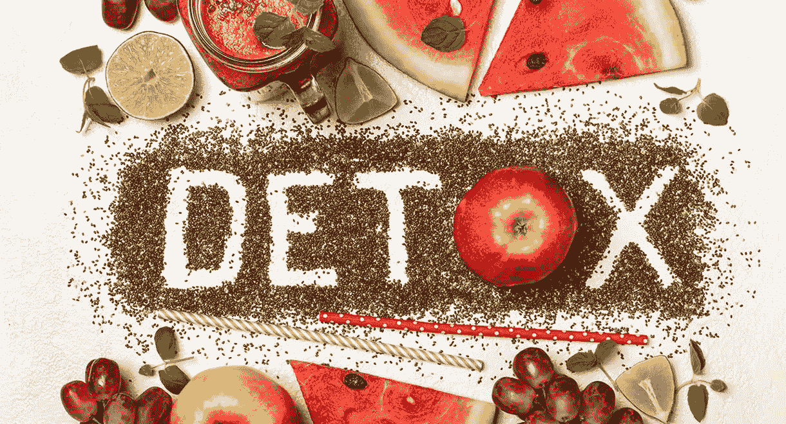
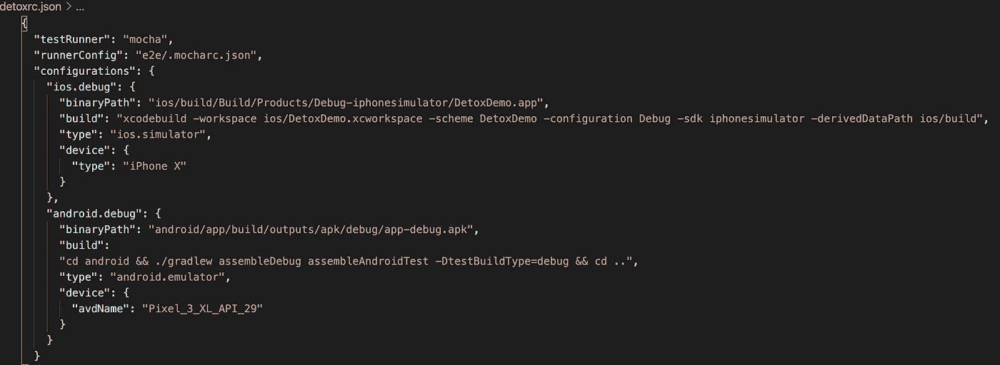

# 用 Detox 测试你的 React 原生应用

> 原文：<https://blog.devgenius.io/test-your-react-native-app-with-detox-316bafaadb65?source=collection_archive---------8----------------------->

*在本文中，您将了解如何添加 E2E 移动应用程序测试，只需几个步骤即可对原生应用程序+0.62 和 Detox +16.11 做出反应。*



几周前，我被邀请做一个关于排毒的演讲。我目前正在使用它大约 3/4 个月，虽然我不是 javascript 或 React 本地专家，但将它添加到应用程序并开始使用它是非常容易的。这是我做的同样的演讲，但是是用词！以及一些代码细节:)

# 什么是排毒？

你会发现，根据定义，排毒的创造者说:

*“排毒是针对移动应用的灰盒 E2E 测试”*

这意味着你需要知道，至少在基础上，你的应用程序的结构。

一件很酷的事情是，你可以用它来测试 React 本地应用程序以及本地 Android 或 IOs 应用程序(**跨平台**)。同样重要的是，你可以选择你喜欢的**测试跑步者**(可以是 Jest、Mocha 等)。另一个很酷的特性是，它最初是为 CI 设计的，所以集成到 Travis 是可能的；您也可以处理同步。

我之前提到过“*创造者*”，这是我发现非常有趣的事情，因为你可能已经知道排毒是由 [WixEnginnering 开发的。](https://www.wix.engineering/)我亲自观看了关于排毒的演示视频，他们在视频中解释了使用 [Appium](http://appium.io/) 几年后所面临的问题和困难，以及他们当时是如何决定创建自己的框架的。我发现了这个特别有趣的想法，即使用一个工具一段时间，然后决定创建一个新的工具并使它成功。

# 哪些图书馆使用？

但是 Detox 并没有从零开始，他们重新使用了众所周知的库来测试每个平台:

[expresso](https://developer.android.com/training/testing/espresso)

[早期灰色](https://github.com/google/EarlGrey)

不打算深入这些库，但是我想提到这个细节，因为一旦你面临错误(构建错误或任何其他类型的错误，当你创建测试时)，你会发现知道在哪里看和在 StackOverflow 中使用哪个关键字是非常有用的。

# 开始吧！

要在 **ios** 上运行，您需要:

*   Xcode 10.2+带有 Xcode 命令行工具
*   装有 macOS 的 Mac(至少 macOS High Sierra 10.13.6)
*   [节点. js](https://nodejs.org/en/)
*   [最新自制](https://brew.sh/)
*   [applesimutils](https://github.com/wix/AppleSimulatorUtils)
*   排毒 Cli

要在 **android** 上运行，您需要:

*   [安卓工作室](https://developer.android.com/studio/?gclid=EAIaIQobChMI2_CLur6f6gIVlAqRCh1NUwKwEAAYASAAEgL3efD_BwE&gclsrc=aw.ds)和 [AVD 经理](https://developer.android.com/studio/run/managing-avds)
*   排毒 cli
*   [Node.js](https://nodejs.org/en/)

假设您已经有了所有的依赖项，您只想添加 Detox，然后执行:

```
npm install -g detox-cli
```

现在您需要将它添加到您的项目中:

```
npm install detox --save-dev
```

运行之后，您将看到对 package.json 配置的新依赖:


[package.json](https://github.com/TamaraTorres/DetoxDemo/blob/master/package.json)

下一步将决定您将使用哪个测试转轮，在这种情况下，我选择[摩卡](https://mochajs.org/)，但您可以使用任何其他:

```
npm install mocha --save-devdetox init -r mocha
```

默认情况下，init 不仅会创建所有需要的文件，还会在 e2e 文件夹下创建一个测试文件:


[排毒开始后](https://github.com/TamaraTorres/DetoxDemo/tree/master/e2e)

下一步将是利用 Detox 进行构建，为此，我们需要定义将要使用的配置



[detoxrc.json](https://github.com/TamaraTorres/DetoxDemo/blob/master/.detoxrc.json)

你可以在这里看到 2 个配置:*1 个用于 android，1 个用于 ios，都处于调试模式。这里重要的事情:

*   替换 *avdName* 为**你的安卓模拟器**
*   将*设备*类型替换为**你的 ios 模拟器**
*   将 *DetoxDemo* 替换为**您的应用名称**

现在我们可以建造

```
detox build -c ios.debug
or 
detox build -c android.debug
```

**停！**在考虑运行测试之前，请检查以下内容:

*   您的仿真器/模拟器**已经启动并运行**，并且与 detoxrc.json 上的配置相匹配
*   你已经跑了:

```
yarn start
```

好了，现在您可以执行测试了:

```
detox test -c ios.debug
or 
detox test -c android.debug
```

你可以在我的 GitHub 上找到代码并运行它！

[](https://github.com/TamaraTorres/DetoxDemo) [## TamaraTorres/解毒演示

### 这是一个 hello world react native 应用程序，使用 react-native cli 生成，您可以跟随 HelloWorld…

github.com](https://github.com/TamaraTorres/DetoxDemo) 

如果您想更深入地了解如何在您的应用中实施排毒，这里有一些有用的链接供您参考:

*   [https://github.com/wix/Detox](https://github.com/wix/Detox)
*   [https://github.com/google/EarlGrey](https://github.com/google/EarlGrey)
*   https://developer.android.com/training/testing/espresso
*   【https://github.com/wix/Detox/blob/master/docs/Introduction. GettingStarted.md
*   [排毒:解决移动自动化的剥落——Viktorija sujetait](https://www.youtube.com/watch?v=4rU0IGEt6OQ)
*   [Detox:用于移动应用的 Graybox 端到端测试和自动化库——Rotem Mizrachi-梅丹](https://www.youtube.com/watch?v=qiRJT5Eig3g)
*   [Detox:用于移动应用的灰盒端到端测试框架](https://hackernoon.com/detox-gray-box-end-to-end-testing-framework-for-mobile-apps-196ccd9564ce)
*   [如何像真实用户一样测试你的 React 原生应用](https://medium.com/@bogomolnyelad/how-to-test-your-react-native-app-like-a-real-user-ecfc72e9b6bc)

我希望这是有用的，下次再见！

欢迎任何反馈！