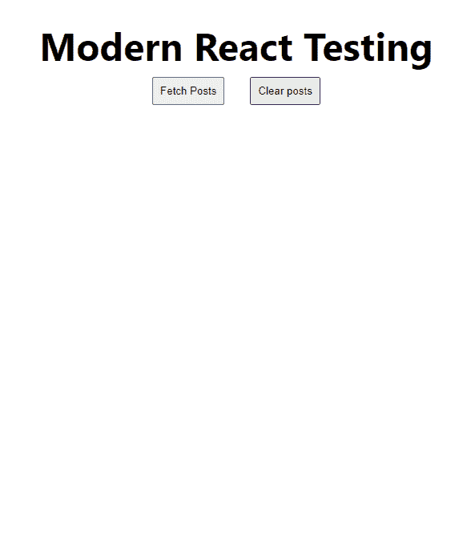
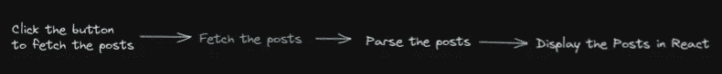
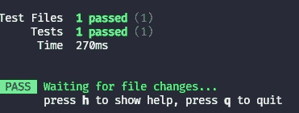

# 测试集成 MSW 和 Vitest 的 React 应用程序

> 原文：<https://blog.devgenius.io/testing-a-react-application-integrating-msw-with-vitest-a9542defb1c0?source=collection_archive---------8----------------------->


[杰瑞登·维尔加斯](https://unsplash.com/@jeriden94?utm_source=Hashnode&utm_medium=referral)在 [Unsplash](https://unsplash.com/?utm_source=Hashnode&utm_medium=referral) 上拍摄的照片

这是我正在进行的关于如何测试现代 React 应用程序的系列文章的第五部分。这次我将介绍如何将 MSW 与我们的单元测试框架 [Vitest](https://vitest.dev/) 集成。大多数应用程序必须从后端服务器获取数据。为了全面覆盖，我们应该模拟这些请求。但是，什么是嘲讽呢？

> 制作某物的复制品或仿制品

*牛津语言*

这个想法是创建一个来自后端的请求的模拟。这有其自身的优势。我们可以直接操纵我们想要的*响应*来测试更多的场景。在我们之前创建的应用程序中，我们可以测试获取 0 个帖子、100 个帖子、没有文本的帖子等等。

有问题的应用程序:



这个很厉害！我们可以测试用户可能遇到的常见用例或边缘用例。最后，最重要的是对我们的测试有信心。

# 什么是都市固体废物？

MSW 是一个非常简单易用的模仿库。

> *通过在网络层面拦截请求来模仿。无缝重用相同的模拟定义进行测试、开发和调试。*

通常，这是预期的交互:



但是，随着城市固体废物的增加，我们将增加一个新的步骤。


厉害！😎让我们用我们的应用程序来设置这个。作为参考[这是我们到目前为止一直在使用的项目](https://github.com/diballesteros/react-testing)。

# MSW 的配置文件

首先，让我们安装新的库:

```
npm install msw --save-dev yarn add msw --dev
```

在我们的`src`目录中，让我们创建一个`mocks`文件夹，我们将在其中保存请求的处理程序。MSW 团队称之为*模拟定义*。在`mocks`文件夹中创建一个`handlers.js`。

这里我们可以导出我们的处理函数。因为我们正在做正常的 REST 请求，所以让我们从 MSW 导入`rest`。

```
import { rest } from 'msw';
```

为了让 MSW 识别请求，我们必须提供准确的*方法*和*路径*并从数组中导出。

```
export const handlers = [
    rest.get('https://jsonplaceholder.typicode.com/posts', null), 
];
```

这里我们可以用我们实际希望 MSW 返回给我们的内容来替换`null`。这是一个被称为*响应解析器*的功能。返回以下内容:

*   `req`，关于匹配请求的信息；
*   `res`，一个功能性的效用创造出了嘲弄的反应；
*   `ctx`，帮助设置状态码、标题、正文等的一组功能。嘲笑的回应。

让我们为这些帖子返回我们自己的自定义响应。

```
import { rest } from 'msw';export const handlers = [
 rest.get('[https://jsonplaceholder.typicode.com/posts'](https://jsonplaceholder.typicode.com/posts'), (req, res, ctx) => {
  return res(
   ctx.status(200),
   ctx.json([
    {
     body: 'This is a body',
     id: 1,
     title: 'Title',
     userId: 1,
    },
   ])
  );
 }),
];
```

太好了，现在我们已经为 MSW 设置了处理程序🚀。

# Vitest 的配置文件

MSW 为我们设置了一个服务器来拦截请求。但是我们必须创建一个服务器实例。在我们的`mocks`文件夹中创建一个`server.js`文件:

```
import { setupServer } from 'msw/node';
import { handlers } from './handlers';// Here we import the handler created!
export const server = setupServer(...handlers);
```

在我们的`vite.config.js`中，让我们在`test`对象中为我们的设置文件添加一个条目:

```
setupFiles: ['./src/setup.js'],
```

让我们在我们的`src`目录中创建这个`setup.js`文件。这是为了在每次测试执行时正确重置服务器:

```
import { server } from './mocks/server';beforeAll(() => server.listen({ onUnhandledRequest: 'error' }));
afterAll(() => server.close());
afterEach(() => server.resetHandlers());
```

现在我们都设置好了，准备测试！让我们在**Vitest **测试中实现它。

# 在 Vitest 中模仿我们的 API 请求

让我们修改我们的测试文件:

```
import React from 'react';
import {
 render,
 screen,
 waitForElementToBeRemoved,
} from '[@testing](http://twitter.com/testing)-library/react';
import userEvent from '[@testing](http://twitter.com/testing)-library/user-event';
import App from './App';describe('Testing our React application', () => {
 it('Fetch posts', async () => {
  render(<App />);expect(screen.getByText(/Modern React Testing/i)).toBeDefined();userEvent.click(screen.getByRole('button', { name: 'Fetch Posts' }));await waitForElementToBeRemoved(() =>
   screen.queryByLabelText('loading')
  );expect(screen.getByRole('heading', { level: 3 })).toBeDefined();
 });
});
```

我们移除了`@testing-library/jest-dom`的库，因为它不再需要。但是，现在我们的测试应该是绿色通过！



此外，由于我们的测试是在一个节点环境中运行的，我们需要在原来的`App.jsx`中填充我们的 fetch 函数

```
npm install cross-fetch
```

只需在最顶端导入它:

```
import fetch from 'cross-fetch';
```

# 旁注

如果您一直关注我的其他文章，您可能已经注意到我更改了一个依赖项的版本:`@testing-library/user-event`。我在点击按钮时遇到了一个问题。

我把它降级到 13.5.0，直接从`userEvent`调用 click 事件。

您可以在这个[存储库中找到整个项目以及更新后的依赖关系列表](https://github.com/diballesteros/react-testing)。

# 包装它

随着我们继续创建单元测试，我们现在有了一个强大的工具来模拟请求！在下一篇文章中，我们将讨论如何设置 Cypress.io。

更多内容见[相关代码](https://relatablecode.com)

如果你喜欢这个，请随时在 LinkedIn 或 Twitter 上与我联系

在我的[时事通讯](https://relatablecode.substack.com/)中查看我的免费开发者路线图和每周科技行业新闻。

*原载于 2022 年 5 月 4 日*[*【https://relatablecode.com】*](https://relatablecode.com/testing-a-react-application-integrating-msw-with-vitest)*。*