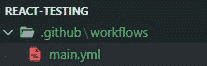
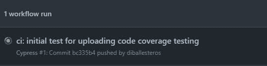
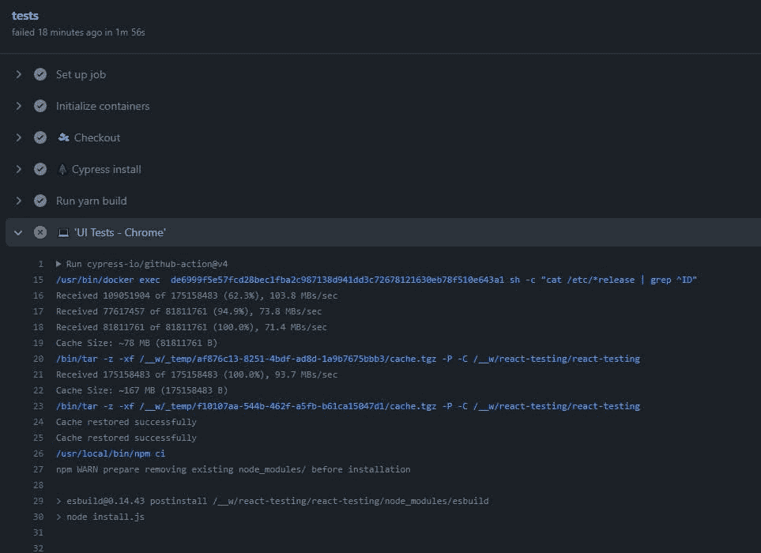
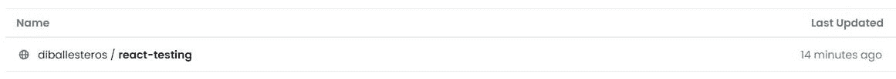
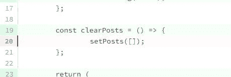

# 测试使用 Codecov 的 React 应用程序

> 原文：<https://blog.devgenius.io/testing-a-react-application-working-with-codecov-bb08277a18b5?source=collection_archive---------14----------------------->


由[克里斯·阿布尼](https://unsplash.com/@chrisabney?utm_source=medium&utm_medium=referral)在 [Unsplash](https://unsplash.com?utm_source=medium&utm_medium=referral) 上拍摄的照片

在上一篇文章中，我们通过检测我们的代码库开始了对 [Codecov](https://about.codecov.io/) 的设置。在这最后一篇文章中，我们将用 GitHub 工作流来完成我们的设置，它将自动提交我们的覆盖结果。

简单回顾一下，代码覆盖率是什么，我们的应用程序做什么:

> *代码覆盖率是一项软件测试指标，它确定了在测试过程中成功验证的代码行数，从而有助于分析软件验证的全面性。* [*来源*](https://www.codegrip.tech/productivity/everything-you-need-to-know-about-code-coverage/)

酷！接下来，让我们回顾一下我们的应用程序做了什么。当点击一个按钮时，它从一个服务中获取文章并显示在页面上:


你找到完整的知识库[github.com/diballesteros/react-testing](https://github.com/diballesteros/react-testing)

# 什么是 GitHub 工作流

让我们从 GitHub 的官方文档中寻找一个清晰的定义:

> *工作流是一个可配置的自动化流程，将运行一个或多个作业。工作流由签入到您的存储库中的 YAML 文件定义，当由存储库中的事件触发时将运行，或者它们可以手动触发，或者按照定义的时间表运行*

有太多要理解的了。本质上，我们可以在项目的根目录下创建一个文件夹，Github 会自动检测这个文件夹来实现“工作流”。神奇！


可以在存储库中的`Actions`选项卡中监控这些操作。

厉害！但是这对我们有什么帮助呢？嗯，我们将创建我们自己的 [YAML](https://yaml.org/) 文件来创建一个工作流，该工作流将在每次`push`发送到我们的存储库时触发。这样，我们的代码覆盖率将始终保持最新。

要了解更多关于工作流程和 GitHub 动作的信息，请查看[官方文档](https://docs.github.com/en/actions/using-workflows/about-workflows)。

# 创建我们的工作流程

在我们项目的根目录下创建一个`.github`文件夹，并在其中创建一个包含单个`main.yml`文件的`workflows`文件夹。



YAML 文件有一个相当简单的结构，非常依赖于每行的间距来知道下一步是什么。如果你对他们不太熟悉，强烈建议查看他们的文档。

让我们从给我们的工作流命名并在`push`触发开始。

之后，我们可以开始设置我们的步骤。让我们想想这意味着什么。GitHub 正在构建一个环境来运行我们的测试。这意味着在这个环境中，我们必须拥有 Cypress 正确运行所需的所有依赖项。

这一开始可能看起来很复杂，但很快就会有意义。


我们可以开始向我们的工作流文件中添加作业来实现这一点:

```
jobs:
    tests:
        runs-on: ubuntu-latest
        container: cypress/browsers:node14.17.0-chrome88-ff89
        steps:
            - name: 🛫 Checkout
              uses: actions/checkout@v3- name: 🌲 Cypress install
              uses: cypress-io/github-action@v4
              with:
                  runTests: false
            - run: npm run build
```

`runs-on`指定我们将用来安装依赖项的环境。为了简单起见，我们只使用最新版本的 Ubuntu。

`container`是浏览器。

`Checkout`步骤从回购中获取我们的代码。然后我们安装柏树。

为此，我们将使用一些直接来自 Cypress 的动作来运行我们的测试，并将它们上传到 Codecov。

```
jobs:
    tests:
        runs-on: ubuntu-latest
        container: cypress/browsers:node14.17.0-chrome88-ff89
        steps:
            - name: 🛫 Checkout
              uses: actions/checkout@v3- name: 🌲 Cypress install
              uses: cypress-io/github-action@v4
              with:
                  runTests: false
            - run: npm run build- name: 💻 'UI Tests'
              uses: cypress-io/github-action@v4
              with:
                  start: npm run dev
                  wait-on: [http://localhost:3000](http://localhost:3000)
                  wait-on-timeout: 120
                  browser: chrome
                  spec: 'cypress/integration/first-test.spec.js'- name: ✅ Upload coverage to Codecov
              uses: codecov/codecov-action@v3.1.0
```

`UI Tests`将直接从 Cypress 中寻找 GitHub 动作，在 chrome 浏览器中运行我们的测试。需要注意的非常重要的一点是，在`spec`属性中，我们只指定了我们创建的测试:`first-test.spec.js`。

您可以使用一个`*`来捕获所有文件。比如:`cypress/integration/*`。

我们的最后一步将使用他们提供给我们的 GitHub 动作把它上传到 Codecov。

# GitHub 行动

在提交和推进新的变更之后，我们将最终能够测试它。如果您前往存储库并转到 GitHub Actions 选项卡，您会看到动作自动运行:



如果您单击该操作，您将能够看到正在运行的任务和步骤的详细视图。



在上面的截图中，我在项目的`run`命令中犯了一个错误。

# 包装它

我们现在可以在项目列表中看到 Codecov 的结果了:



我们还将了解我们实际覆盖的范围:


我们还可以看到哪些行没有被覆盖:



查看官方 Codecov 文档，了解如何导航仪表板的更多信息:

[https://docs.codecov.com/docs](https://docs.codecov.com/docs)

这就结束了我的系列。我希望你喜欢它！测试是软件开发过程的基本部分，不应该被忽略。

谢天谢地，现代测试有太多的工具让我们的工作变得更容易。如果你有任何关于测试的问题，请在下面的评论区留言！

# 让我们连接

如果你喜欢这个，请随时在 LinkedIn 或 Twitter 上与我联系

在我的[时事通讯](https://relatablecode.substack.com/)中查看我的免费开发者路线图和每周科技行业新闻。