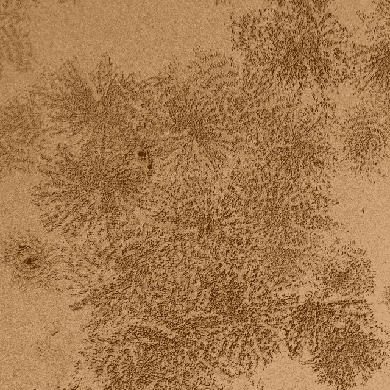

# 测试:模式识别的一步

> 原文：<https://blog.devgenius.io/testing-a-step-on-from-pattern-recognition-f3dc438c685c?source=collection_archive---------26----------------------->

小时候，我总是能找到钱，大部分是草丛中的硬币，但偶尔会有一张 10 美元的钞票，或者有一次我找到了一叠现金——我找到了失主，并为自己赢得了 10 美元的感谢礼物。我的眼睛不仅注意到我周围的图案，而且特别注意到破坏图案的物体。这是软件测试的天赋。我怀疑许多其他测试人员也有这个特点。

这里有几个例子说明如何将它应用到测试中:

在数据库中，有一列又一列的数据，其中大部分是相似的值，如日期、数字、布尔值。所以我做的第一件事是观察每一列的异常情况——例如，一个字符比所有其他字符都少的值，缺少的值，填充值中的空值。最喜欢的是寻找每个值都相同的列。这通常表明默认值覆盖了选择，单选按钮不起作用，或者字段实际上完全是多余的。同样的模式检查也适用于 API 响应。

在 UI 目测布局时，首先检查文本字体和大小是否一致(Chrome Extension Font Ninja 在这方面很有帮助)，检查品牌颜色是否正确(Chrome Extension Colorzilla 在这方面很有帮助)，按钮的高度和填充应该相同，并与正负选项排序保持一致。大写字母的使用，或者骆驼的大小写，都是一样的吗？甚至到了所用语言的层面——有美式拼写和非美式拼写的混合吗？是否有拼写错误或错别字？

就在几天前，我在查看一个监控图表的仪表板，我的目光立即投向了显示负值的图表。我检查了被监控的特性，负值应该是不可能的——嘣——发现了 bug。

这个内置的异常检查器非常棒。但它一直开着。当我走在大自然中时，吸引我目光的是那些垃圾。当我骑车的时候，我会数路边的瓶子。但我很擅长发现野生动物(只要它在移动)，我努力定期去捡垃圾——至少对我来说，让新西兰变得更干净、更好看。

海蒂·贝克——松鼠摇滚，疯狂测试