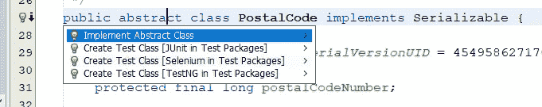

# 在 Java 中测试抽象类

> 原文：<https://blog.devgenius.io/testing-abstract-classes-in-java-2989f12e9d5f?source=collection_archive---------1----------------------->


教皇莫伊苏在 [Unsplash](https://unsplash.com?utm_source=medium&utm_medium=referral) 上的照片

使用 JUnit，您可以为 Java 项目中的任何源类编写测试类。即使是抽象类，如你所知，它们不能被实例化，但是为了“具体”子类的利益，它们可以有构造函数。

当然，测试类不必像被测试的相应类那样抽象，也不应该如此。

我们是否应该在项目中测试抽象类，或者是否使用抽象类，这是一个取决于特定项目和团队偏好的问题，但希望不是任何教条。

我能想到一些情况，在这些情况下，源文件夹中的抽象类在测试文件夹中有一个对应的测试类可能是一个好主意。具体来说:

*   当抽象类打算在它的包之外使用时，或者在 Java 9 和更高版本中，在它的模块之外使用时。
*   当抽象类有静态单元时，无需实例化任何子类就可以调用静态单元。
*   当抽象类知道它的子类，并且能够管理它们之间的转换时。
*   当你想绝对确定你的项目有 100%的测试覆盖率时。

很高兴知道如果你需要的话，选项是可用的。但是，根据您为 Java 使用的集成开发环境(IDE ),您可能需要注意一些问题。

我们需要一个抽象类的例子。邮政编码，比如邮政编码，就是一个很好的例子，我在之前的文章中解释过。我还解释了如何在 Eclipse 中测试一个抽象类。

在本文中，我将重点介绍另外两个主要的 Java IDEs，NetBeans 和 IntelliJ IDEA(通常称为“IntelliJ”)。

# 在 NetBeans 中测试抽象类

NetBeans 的当前版本是 12.0。我还在 11.2，还没升级。我提到这一点只是为了防止 12.0 中抽象类的测试有任何不同。

让我们从你们那些关注 Eclipse 的人开始的第一份`PostalCode`草案开始，但是添加了几个覆盖存根。

```
package postal;import java.util.Locale;public abstract class PostalCode {

    protected final long postalCodeNumber;

    protected final Locale postalGov; // TODO: Write tests for this
    @Override
    public boolean equals(Object obj) {
        return false;
    } // TODO: Write tests for this
    @Override
    public int hashCode() {
        return 0;
    }

    public Locale getCountry() {
        return this.postalGov;
    }

    public PostalCode(long number, Locale loc) {
        this.postalCodeNumber = number;
        this.postalGov = loc;
    }

}
```

但是让我们为我们的第一稿`ZIPCode`做一些比在 Eclipse 项目中更简单的事情:

```
package postal;

import java.util.Locale;public class ZIPCode {public ZIPCode(int zip5) {
        this(zip5, -1); // TODO: Write tests for this constructor
    }public ZIPCode(int zip5, int zip4) {
        // TODO: Write tests for this constructor
    }}
```

这里要注意的主要事情是，我要求你省略“`extends PostalCode`”。让我们为此编写一个测试:

```
 @Test
    public void testSuperClass() {
        **Object zip** = new ZIPCode(53703);
        String msg 
           = "ZIPCode instance should also be PostalCode instance";
        assert **zip instanceof PostalCode** : msg;
    }
```

把这个测试放到`ZIPCodeTest`里。在 NetBeans 中，启动测试类最直接的方法是将光标放在类声明行上，然后单击代替行号的灯泡图标；然后选择“创建测试类[测试包中的 JUnit”。

注意，`zip`被声明为类型`Object`而不是`ZIPCode`。否则，NetBeans 会将其标记为错误，并阻止编译它。

测试当然失败了。因此，在`ZIPCode`中添加“`extends PostalCode`”，并添加需要编译的内容，但是要注意，它将无法通过我们将要编写的测试(比如将`Locale`字段设置为其他`Locale.US`)。

正如这个项目的 Eclipse 版本一样，NetBeans 的后续人员应该为构造函数编写测试(例如，辅助构造函数为 ZIP+4 填充“0000”)，并为`toString()`编写测试(例如在适当的时候填充零)。

不过，在这里，让我们在`PostalCodeTest`而不是`ZIPCodeTest`中编写`equals()`的所有测试。正如您可以让 NetBeans 为“具体”类创建测试类一样，您也可以让 NetBeans 为类似于`PostalCode`的抽象类创建测试类。



在灯泡上单击鼠标右键后，选择第二个选项。

生成的测试类是根据普通 NetBeans 用户非常熟悉的非常有用的模板生成的。在生成的测试类的末尾有一个惊喜:

```
 public class PostalCodeImpl extends PostalCode { public PostalCodeImpl() {
            super(0L, null);
        }

    }
```

这是一个嵌套类。我了解嵌套类的时间几乎和我编写 Java 的时间一样长。我从来不认为它们特别有用。

不过，在这里，我认为嵌套类恰恰是最好的解决方案，因为我们很可能不需要`PostalCodeTest`之外的`PostalCodeImpl`。

[附录，2020 年 8 月 7 日:如果抽象类除了构造函数之外没有任何实例单元，NetBeans 可能不会在测试类中生成嵌套的静态类。至少在 NetBeans 11.2 中是这样的。当然，如果 NetBeans 不这样做，没有什么可以阻止我们编写这样的类。]

代替愚蠢的 Zap 代码，我们可以使用`PostalCodeImpl`实例对`equals()`进行所有或者几乎所有的测试。我们只需要先对`PostalCodeImpl`做一些小调整:

```
 public class PostalCodeImpl extends PostalCode {

        @Override
        public String toString() {
            return "ImplPostal " + this.postalCodeNumber;
        } public PostalCodeImpl(int code) {
            super(code, Locale.US);
        }

    }
```

同样，用“取消引用空指针”警告注释掉`PostalCodeTest`中的行，但保留“测试用例是原型”消息的行可能是个好主意。

接下来，参照相等测试。

```
 @Test
    public void testReferentialEquality() {
        PostalCode code = new PostalCodeImpl(482012005);
        assertEquals(code, code);
    }
```

为了节省你的输入，使用完成建议快捷键，Windows 上的 Ctrl-Space(我认为是 Mac OS X 上的 control-Space，而不是 Command-Space；不知道在 Linux 上是什么)。

键入“Post”，然后调用类型声明的快捷方式。在赋值操作符的右边，“new P”应该足以让快捷键调出“`PostalCodeImpl`”作为第二个可能的补全，NetBeans 将建议 0 作为数字参数。

当然，如果你使用的是 Java 10 或更高版本，你可以利用`var`来减少赋值操作符两边都有类型的繁琐。

这个测试应该会失败。您知道如何让它通过:简单地让它返回`this == obj`。继续进行不等于空测试:

```
 @Test
    public void testNotEqualsNull() {
        PostalCode code = new PostalCodeImpl(21111307);
        assertNotEquals(code, null);
    }
```

与 Eclipse 项目一样，在 NetBeans 项目中，我们应该在为不同的运行时类编写测试之前，为不同的内存位置编写两个相同邮政编码的测试。

```
 /**
     * Test of equals method, of class PostalCode.
     */
    @Test
    public void testEquals() {
        System.out.println("equals");
        PostalCode someCode = new PostalCodeImpl(480841564);
        PostalCode sameCode = new PostalCodeImpl(480841564);
        assertEquals(someCode, sameCode);
    }
```

你知道如何通过这个测试，这样所有之前对`equals()`的测试也能通过，但还没有真正检查`this`或`obj`的数字域。这意味着 NetBeans 应该仍然警告您`equals()`仍然没有检查`obj`的类型。

现在我们为不同的类编写一个:

```
 @Test
    public void testNotEqualsDiffClass() {
        ZIPCode zip = new ZIPCode(90210, 4817);
        PostalCode zap = new PostalCodeImpl(902104817);
        assertNotEquals(zip, zap);
    }
```

也许你不喜欢在`PostalCodeTest`中使用`ZIPCode`的想法。尤其是如果你还没有真正地在`ZIPCode`上工作过。嗯，我们可以使用匿名类，就像这样:

```
 @Test
    public void testNotEqualsAnonClass() {
        PostalCode zip = new PostalCodeImpl(200041477);
        PostalCode zap = new PostalCode(200041477, Locale.US) {

            @Override
            public String toString() {
                return "AnonPostal" + this.postalCodeNumber;
            }

        };
        assertNotEquals(zip, zap);
    }
```

如果您还为`zap.getClass().getName()`输入一个打印行语句，您可能会看到“邮政。NetBeans“输出”窗格中的 PostalCodeTest $ 1"。

使用`PostalCodeImpl`和匿名`PostalCode`子类的测试都应该失败。两者的修复是相同的:检查引用的相等性，空值检查，以及运行时类与`getClass()`的比较。

现在我认为唯一剩下的事情就是测试匹配的类，但是不同的邮政编码。

```
 @Test
    public void testNotEqualsDiffPostalCode() {
        PostalCode someCode = new PostalCodeImpl(200041477);
        PostalCode diffCode = new PostalCodeImpl(480841564);
        assertNotEquals(someCode, diffCode);
    }
```

您的`equals()`应该是这样的:

```
@Override
    public boolean equals(Object obj) {
        if (this == obj) {
            return true;
        }
        if (obj == null) {
            return false;
        }
        if (!this.getClass().equals(obj.getClass())) {
            return false;
        }
        return this.postalCodeNumber 
                             == ((PostalCode) obj).postalCodeNumber;
    }
```

您的格式可能不同。

我认为实际上没有必要检查`Locale`字段是否匹配。但是如果事实证明是这样，我们就为它写一个测试。

当我们这样做的时候，我们可能希望将`getCountry()`改为返回 null，这样我们就可以在`PostalCodeTest`中为它编写一个测试，这个测试将在第一次运行时失败。当我第一次写`PostalCode`的时候，我没有想过要测试这个。

# 在 IntelliJ IDEA 中测试抽象类

对于 IntelliJ IDEA，我用的是 2019.3，社区版。它有局限性，但对我来说并不是问题。我依稀记得几个月前被给予了升级到 2020.1 的机会，但我不知道后来发生了什么。

冒着过分夸大字数的风险，但为了方便起见，我将重述第一稿`PostalCode`，尽管有几处改动。

```
package postal;import java.util.Locale;public abstract class PostalCode { protected final long postalCodeNumber; protected final Locale postalGov; // TODO: Write test for this
    public Locale getCountry() {
        return null;
    } // TODO: Write tests for this
    @Override
    public boolean equals(Object obj) {
        return false;
    } // TODO: Write tests for this
    @Override
    public int hashCode() {
        return 0;
    } public PostalCode(long number, Locale loc) {
        this.postalCodeNumber = number;
        this.postalGov = loc;
    }}
```

对于`ZIPCode`,使用我给 NetBeans 用户的第一份草稿，创建`ZIPCodeTest`,并测试断言`ZIPCode`实例也是`PostalCode`的实例。

如果你从上面使用`testSuperClass()`，IntelliJ 应该警告你`zip instanceof PostalCode`总是假的。但还是迁就我一下，运行测试，然后修改`ZIPCode`让它通过。

现在 IntelliJ 应该警告你`zip instanceof PostalCode`总是正确的。还要进行构造器测试和`toString()`的测试。

现在对`PostalCodeTest`中的`equals()`进行测试。IntelliJ 可以为抽象类启动测试类，就像为“具体”类一样。将光标置于`PostalCode`源代码编辑器窗口，从顶层菜单中选择代码>生成…,然后从生成弹出菜单中选择测试…。

与 Eclipse 一样，与 NetBeans 不同，IntelliJ 不在`PostalCodeTest`中创建嵌套类。如果我们愿意，可能有一个模板可以定制。但是没有什么可以阻止我们通过键入来添加嵌套类。

不过，对于 IntelliJ，让我们使用英国邮政编码，而不是邮政编码。

```
 private class PostalCodeImpl extends PostalCode { private final String postCode; @Override
        public String toString() {
            return this.postCode;
        } PostalCodeImpl(String code) {
            super(Long.parseLong(code.replace(" ", ""), 36),
                                                         Locale.UK);
            this.postCode = code.toUpperCase(Locale.UK);
        }

    }
```

当然，如果我们这样做是为了实际的生产使用，而不是为了测试目的，我们将不得不编写大量的测试来要求验证。

我没有质疑 NetBeans 为什么把`PostalCodeImpl`公之于众。但是也许这没关系，因为`PostalCodeImpl`不能从源码包中使用。因为我是用 IntelliJ 写的，所以出于习惯，我把它设为私有。如果我们需要将它更改为包私有或公共，我们会更改它。

我想 IntelliJ 可能会告诉我们`PostalCodeImpl`可以是私有的。然而，IntelliJ 告诉我`PostalCodeImpl`可以是静态的，所以我说让它成为静态的。IDE 似乎并不关心访问修饰符。

我确信我很久以前就了解了嵌套类，包括“静态”和“内部”类的区别。但是因为我没有在我写的程序中使用它们，我忘记了，所以我需要刷新我的记忆。

嵌套的静态类是用`static`关键字声明的，并且不能访问封闭类的字段(在`PostalCodeImpl`的情况下，就是`PostalCodeTest`)。就好像它是在自己的文件中自己声明的一样。

一个嵌套的内部类是在没有`static`关键字的情况下声明的，它可以访问封闭类的字段。你有时会在 JDK 中看到这种情况，比如`JTable`的`AccessibleJTable`内部类(它也有几个静态嵌套类)。

对于我们这里的目的，`PostalCodeImpl`不需要从`PostalCodeTest`访问任何字段。在测试类中嵌套`PostalCode`实现对我们来说非常方便。

这里有一种方法可以编写引用相等测试:

```
 @Test
    public void testReferentialEquality() {
        PostalCode code = new PostalCodeImpl("NW1 6XE");
        assertEquals(code, code);
    }
```

有人告诉我，这是伦敦贝克街 221B 号的邮政编码，现在是一个真实的地址，尽管不是某个世界闻名的侦探居住过的地址。

你可以使用的另一个英国邮政编码是 SW1A 1AA，代表白金汉宫。圣诞老人有他自己的加拿大邮政编码，H0H 0H0。我不知道英格兰和加拿大是不是同一个岗位体系，但是，在`PostalCodeTest`和`PostalCodeImpl`的背景下，无所谓。

我要把它留在这里。一旦用`PostalCodeTest`到`PostalCodeImpl`彻底测试了`equals()`，可能就没有必要在子类中测试`equals()`，除非这些子类中有一个对`equals()`有特殊要求，因此需要自己的`equals()`覆盖。

但是如果是这样的话，那么我不得不质疑这个子类是否真的应该从`PostalCode`派生出来，或者`PostalCode`是否缺少一些关键的属性，它应该是一个好的超类。

# 概括起来

虽然通常认为没有必要为抽象类编写测试类，但是这个选项是可用的。它有助于增加测试覆盖率，同时有助于避免重复测试。

它在三种主要的 IDE 中都没有问题，并且让 IDE 生成这样的测试类的过程与让它为“具体的”类生成测试类的过程没有什么不同。