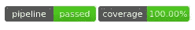

# 使用 Streamlit 进行自动化测试

> 原文：<https://blog.devgenius.io/testing-streamlit-a1f1fd48ce8f?source=collection_archive---------2----------------------->

## 测试 streamlit 应用程序的机器人框架& selenium 方法

Streamlit 是一个非常好的工具，它用于创建演示应用程序，但有时该演示程序会进入生产环境，因此找到测试它的方法非常重要。在最近的微前端模式中，streamlit 应用程序更有可能成为生产服务器的一部分，在未来，它可以随着微前端的一部分而改变。

在这个故事中，我解释了如何用 [robotframework](https://robotframework.org/) 测试一个玩具 streamlit 应用程序，并在 gitlab 上自动完成流水线，代码可在这里[获得](https://gitlab.com/nicolalandro/streamlit_test)。
(这个故事是从零/一步一步开始的，但是要了解更多，你必须阅读关于所使用的库，你也必须阅读关于自动化测试)

我选择 robotframework 是因为我想学习它，但是也可以使用你想要的测试库，最简单的是 [pytest](https://docs.pytest.org/en/7.1.x/) ，但是你也可以使用 [mamba](https://pypi.org/project/mamba/) 等等。

## 玩具应用

我们只需要安装 streamlit

```
pip install streamlit
```

玩具应用程序是一个简单的应用程序，有一个单选按钮，如果你选择了喜剧选项，它会显示“你选择了喜剧。”否则它会显示“你没有选择喜剧。":

```
import streamlit as st

st.title("Test")
genre = st.radio(
    "What's your favorite movie genre",
    ('Comedy', 'Drama', 'Documentary'))

if genre == 'Comedy':
    st.write('You selected comedy.')
else:
    st.write("You didn't select comedy.")
```

现在我们可以将它保存到 src/app.py 中并运行它

```
python3.8 -m streamlit run src/app.py --server.port 5000
```


玩具简化应用程序

## 要求

我们需要一些其他的库，robotframework 来测试， [selenium](https://www.selenium.dev/) 和 robot framework 绑定来使用浏览器通过代码和 [coverage](https://coverage.readthedocs.io/en/6.3.2/) 来获得测试覆盖率(我们的测试覆盖了多少行代码):

```
pip install [robotframework](https://pypi.python.org/pypi/robotframework) [robotframework-SeleniumLibrary](https://pypi.python.org/pypi/robotframework-SeleniumLibrary) [selenium](https://pypi.python.org/pypi/selenium) [coverage](https://pypi.python.org/pypi/coverage)
```

现在我们需要添加一个驱动程序来控制我们的浏览器，我选择了 Firefox，所以我们需要通过复制到 bin(在 Linux 上)来安装它

```
sudo cp driver/geckodriver /bin/
sudo chmod +x /bin/geckodriver
```

或者，您可以只为将用于运行测试的终端指定环境变量

```
export PATH=$PATH:/home/opensuse/Projects/streamlit_test/driver/.
```

## 试验

现在我们能够在 test/app.robot 下编写测试了

```
*** Settings ***
Library  SeleniumLibrary
Library  Process

Suite Setup         Start the webserver

Suite Teardown      Stop the webserver

*** Keywords ***
Start the webserver
    Log To Console  start
    ${process}=     Start Process       python3     -m      coverage    run     --source    src    -m      streamlit    run     src/app.py     --server.port       5000    --server.headless   true

    Set suite variable    ${process}
    Log To Console     ${process}
    sleep  2s

Stop the webserver
    Log To Console  end
    Terminate Process    ${process}

*** Variables ***
${URL}             http://localhost:5000/
${BROWSER}         headlessfirefox

*** Test Cases ***

first test
    Log To Console  test1
    Open Browser  ${URL}  browser=${BROWSER}
    Wait Until Page Contains    Test
    Page Should Contain     You selected comedy.
    Click Element       //*[contains(text(),'Drama')]
    sleep   1
    Page Should Contain     You didn't select comedy.
    Close Browser
```

此脚本通过命令(通过覆盖率，计算代码覆盖率)行运行 streamlit 应用程序，然后在 streamlit url 上打开 headlessfirefox(您可以将其更改为 firefox 以查看屏幕上发生的情况),并等待应用程序在显示“您选择了喜剧”后显示标题“测试”,在单击不同的单选按钮(使用 XPath 表达式在 HTML 中找到单选按钮)后，等待并断言页面包含“您没有选择喜剧”,然后关闭浏览器并停止 streamlit 应用程序。

现在我们可以运行:

```
python3.8 -m robot test
```

要获得代码覆盖率:

```
python3.8 -m coverage report
```

如果断言没有通过，则返回错误，否则测试通过。

## 持续集成管道

我把需求放进 requirements.txt

```
[streamlit](https://pypi.python.org/pypi/streamlit)[robotframework](https://pypi.python.org/pypi/robotframework)
[robotframework-SeleniumLibrary](https://pypi.python.org/pypi/robotframework-SeleniumLibrary)
[selenium](https://pypi.python.org/pypi/selenium)
[coverage](https://pypi.python.org/pypi/coverage)
```

要在每次推送您的 [gitlab](https://gitlab.com) 库时运行这个测试，您可以创建一个. gitlab-ci.yml 文件，如下所示:

```
robotframework:
    image:
        name: selenium/standalone-firefox:99.0
    script:
        - sudo apt-get update && sudo apt-get install -y python3 python3-pip
        - pip install --upgrade pip && pip install -r requirements.txt
        - python3 -m robot test
        - python3 -m coverage report
    coverage: /^TOTAL.*\s+(\d+\%)$/
```

它指定一个包含 selenium 和 firefox 容器，安装 python 和需求，运行测试并显示覆盖率。正则表达式在最后提取覆盖率，并对 gitlab 说，以便有徽章。



管道通过，覆盖 gitlab 徽章

## 结论

这个测试模拟了用户与我们的 streamlit 应用程序的交互，是在[测试 piramyd](https://automationstepbystep.com/2020/05/02/what-is-a-test-pyramid/) 之上的 UI 测试，所以测试是非常昂贵的，但它可以非常有用地确保我们的程序也在不止一个浏览器中抛出更改:这个例子只在 firefox 上，但你可以在 chrome 和你想要的每个浏览器上运行相同的测试。

这样 streamlit 也可以作为微前端应用的支持，可以安全投入生产。

请记住，这是可能的，感谢开源所以贡献！