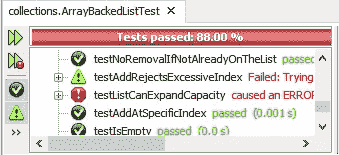
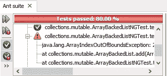
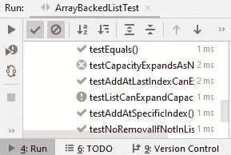

# 测试 Java 中没有抛出异常

> 原文：<https://blog.devgenius.io/testing-that-no-exception-was-thrown-in-java-ae9895f35d5?source=collection_archive---------0----------------------->


乔恩·埃克特在 [Unsplash](https://unsplash.com?utm_source=medium&utm_medium=referral) 上的照片

在单元测试中，测试特定单元在特定条件下抛出异常是相当常见的。

但是，偶尔您会希望确保根本没有异常发生，并且您对在测试驱动开发(TDD)周期的早期阶段可能会发生什么异常有所了解。

例如，假设作为一个练习，您正在创建一个 list 类，它的工作方式很像来自`java.util`的`ArrayList<E>`。呼叫者可以指定初始容量或使用默认初始容量。

一旦达到初始容量，仍然可以添加更多的元素，因为列表会以某种方式自我扩展。或者至少是这样，一旦你找到了正确的测试，看到测试失败，然后让它通过。

假设到目前为止，您已经能够让您的列表将元素添加到初始容量。可能要编写的下一个测试是将一个列表填充到初始容量，然后尝试向该列表中再添加一个元素。

```
 @Test
    public void testListCanExpandCapacity() {
        int initCap = 20;
        ArrayBackedList<String> list 
                = new ArrayBackedList<>(initCap);
        for (int i = 0; i < initCap; i++) {
            String element = "Element " + i;
            list.add(element);
        }
        String extra = "Just one more element";
        list.add(extra);
        System.out.println("Successfully added one more");
    }
```

现在你已经知道这个测试不会通过，因为它会触发一个越界数组索引的异常。但是…这个测试真的会失败吗？

这里有不同的意见。有些人认为没有通过总是失败。但是这太宽泛了，似乎包括了被跳过的测试以及由于配置问题根本没有运行的测试。

我相信对于 JUnit 的作者来说，“没有通过”并不总是等同于“失败”。至少不像 JUnit 在 NetBeans 中报告的那样。



Apache NetBeans 中的测试结果窗格示例

触发意外异常的测试的红色八角形清楚地表明，该异常是一个意外，应该将我们从正常的 TDD 周期中唤醒。

测试失败通常意味着我们可以继续我们计划下一步要做的事情。但是一个测试错误可能意味着我们需要重新考虑我们的测试，甚至是被测试的类。

例如，假设我们正在测试一个连接到在线 API 并处理响应的函数。您编写测试并运行它。

但是你的网络连接中断了，你得到了一个`IOException`。如果你的网络连接没有中断，你的测试会通过还是失败？我们无法确定。

似乎更确定的是，我们已经过早地进入了集成测试，我们需要模拟 API 响应，这样我们的测试就可以只是关于响应是否被正确处理。

这样的场景可能意味着暂停 TDD 循环，重新思考我们如何将多态性和封装的原则应用到手头的项目中。

但是，当我们知道在 TDD 周期的失败部分应该发生某个异常，但是我们没有写任何东西让 JUnit 知道这可能发生时，情况就不是这样了。

JUnit 不是唯一可用于 Java 的单元测试框架。TestNG 对意外异常采取了不同的策略。如果出现意外异常，测试就会失败，就像断言失败一样。



IntelliJ IDEA 在 JUnit 测试意外导致异常时使用圆形而不是八边形，但其图示本质上与 NetBeans 中的相同，明确区分了通过、失败、跳过和导致错误。



IntelliJ IDEA 中的测试结果窗格示例

但是，另一方面，如果您单击重新运行失败的测试按钮，任何导致错误的测试将与被认为实际失败的测试一起运行。

即便如此，JUnit 显然将`ArrayIndexOutOfBoundsException`视为一个惊喜。如果我们在这个时候把这个交给另一个团队，可能会让他们大吃一惊。

显然`ArrayIndexOutOfBoundsException`对我们来说并不意外。我们知道，如果我们的列表在达到初始容量后忽视扩展，就会出现这种情况。也许我们应该把它放在我们的测试里。

```
 @Test
    public void testListCanExpandCapacity() {
        int initCap = 20;
        ArrayBackedList<String> list 
                = new ArrayBackedList<>(initCap);
        for (int i = 0; i < initCap; i++) {
            String element = "Element " + i;
            list.add(element);
        }
        String extra = "Just one more element";
        **try {**
            list.add(extra);
            System.out.println("Successfully added one more");
        **} catch (ArrayIndexOutOfBoundsException aioobe) {
            String msg = "List failed to expand after " + initCap 
                    + " elements";
            fail(msg);
        } catch (RuntimeException re) {
            String msg = re.getClass().getName() 
                    + " should not have occurred";
            fail(msg);
        }**
    }
```

不过，这似乎有点冗长。二十多行，确实冗长。但是据我所知，这是在 JUnit 4 中最直接的方法，不需要添加其他测试依赖项，如 AssertJ 或 Mockito。

JUnit 5 用`assertDoesNotThrow()`提供了一种更直接的方式来编写这个，它采用了一个“抛出供应商”(本质上是一个过程 lambda)和一个`String`中的选项消息。

```
 @Test
    public void testListCanExpandCapacity() {
        int initCap = 20;
        ArrayBackedList<String> list
                = new ArrayBackedList<>(initCap);
        for (int i = 0; i < initCap; i++) {
            String element = "Element " + i;
            list.add(element);
        }
        String extra = "Just one more element";
        **String msg = "Filled list of " + initCap
                + " elements should expand for one more";
        assertDoesNotThrow(() -> {**
            list.add(extra);
            System.out.println("Successfully added one more");
        **}, msg);**
    }
```

这应该给我们以下真正的测试失败:

> org . opentest 4j . assertionfailedererror:20 个元素的填充列表应再扩展一个== >引发意外异常:Java . lang . arrayindexoutofboundsexception:20

这样，我们就可以继续实际计算如何将列表容量扩展到初始容量之外。

据我所知，TestNG 没有`assertDoesNotThrow()`或类似的东西。鉴于 TestNG 认为意外异常是测试失败而不是测试错误，我认为`assertDoesNotThrow()`或类似的东西不太可能被添加到以后的版本中。

如果你一定要有`assertDoesNotThrow()`,但是你正在使用的单元测试框架没有它，你可以自己做。这需要一些开销，可能感觉像一个神奇的咒语。

以下内容将使我们能够将过程 lambda 作为参数传递给我们的`assertDoesNotThrow()`，并且它将允许在 lambda 中出现已检查和未检查的异常:

我不确定这能满足我们所有的需求，但至少它让你知道什么样的提升是必要的。

考虑到这一点，我们可以编写我们的`assertDoesNotThrow()`版本，它本质上封装了 Try-Catch，因此我们不必在每次想要断言没有抛出异常时都重写它。

然后我们可以像在 JUnit 5 中使用`assertDoesNotThrow()`一样使用它，但是我不能保证这一点。

您可能会发现有必要重载`assertDoesNotThrow()`,以便它可以接受函数 lambda 和过程 lambda。在尝试创建自己的函数之前，查看一下`java.util.function`包中是否有现成的 lambda 类型的函数。

好了，现在你知道了如何断言没有抛出异常。在这件事上有一些不同的意见，我想知道你在评论中的想法。