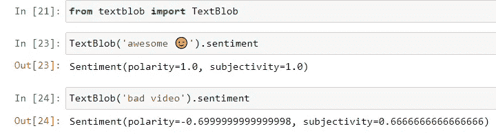
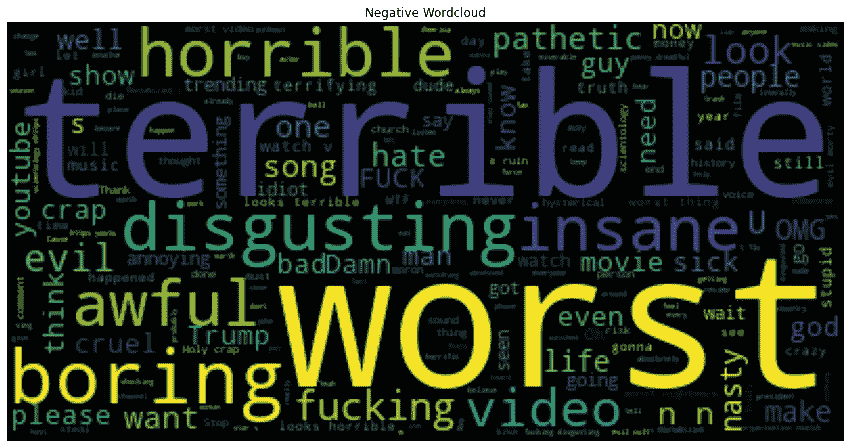
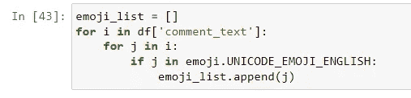

# 文本数据分析——YouTube 情感、文字云和表情符号分析

> 原文：<https://blog.devgenius.io/text-data-analysis-youtube-sentiment-wordcloud-and-emojis-analysis-c65657bfa2b8?source=collection_archive---------6----------------------->

对 AI 和 ML 感兴趣的数据科学家。目前就职于 **Nvidia Graphics Pvt Ltd** 。为人工智能汽车开发 ML 训练数据的数据工厂。

本文将关注情感分析。我们将知道什么是情感分析，然后我们将在 YouTube 数据集上工作。数据集的链接将在下面提供。

# 什么是情感分析(观点挖掘)？

情感分析也称为意见挖掘，是一种自然语言处理的方法( [NLP](https://www.techtarget.com/searchbusinessanalytics/definition/natural-language-processing-NLP) )，可以识别文本主体背后的情感基调。这是组织确定和分类对产品、服务或想法的意见的一种流行方式。它涉及到使用[数据挖掘](https://searchsqlserver.techtarget.com/definition/data-mining)，机器学习( [ML](https://www.techtarget.com/searchenterpriseai/definition/machine-learning-ML) )和人工智能( [AI](https://www.techtarget.com/searchenterpriseai/definition/AI-Artificial-Intelligence) )对[文本](https://www.techtarget.com/searchbusinessanalytics/definition/text-mining)进行情感和主观信息的挖掘。

**示例**:假设你有一个新发布的移动应用程序，你想知道客户对我的产品的反馈是好是坏，分析数百万的评分和评论对我们来说是不可能的，因为数据是文本格式的，我们无法对其进行任何数学分析。

假设我们对我们的应用程序有 3 条评论:**‘哇，令人惊叹的应用程序’**，**‘好的应用程序’**，最后一条是**‘非常糟糕的体验’。**现在我们在情感分析中有了一个叫做极性的东西，这意味着我们现在可以根据它们的极性对特定的单词进行评级，例如在这个第一条评论中“**神奇的**”单词带有极性 **1** 和“**好的**”**0.5**，而“**坏的****0 或< 0** 。

其中 1 是令人惊讶的，被称为积极的情感，0 或-0 被称为消极的情感，而句子中的其他词，如“应用”和“非常”被称为停用词，它们没有任何价值。

python 中有各种用于情感分析的包。

1.  文本 Blob
2.  VADER
3.  宽大的
4.  sci kit-学习

**数据集:**[***点击此处下载***](https://www.kaggle.com/datasets/datasnaek/youtube)

# **导入必要的库**

导入库

## **1。导入数据集**

由于数据集是从 Kaggle 下载的，它包含一些错误，为了忽略这些错误，我们将使用' **Error_bad_line = False '。**如果有任何坏的行，该行将忽略它。我们将数据集存储在“df”变量中。

*   数据集的前 5 行:

*   我们数据集的形状:

我们总共有 691400 行和 4 列

## 有两个要点你必须牢记在心。

*   极性
*   主观性

想象一下，我有一个句子“我喜欢这门课”,从这个句子中，我们可以说，对于这个特定的句子，我们有**正极性**,在这种情况下，我们的极性值是+1。一般来说，你的极性值介于-1 到+1 之间。如果我们有-1，这意味着我们有**负极性**。

类似地，我们有一个句子“我要去看电影”。当我们有这样的句子时，我们知道我们对这个句子没有任何感觉。每当你没有任何情绪时，它就作为主语。**主观性量化了文本中包含的个人观点和事实信息的数量。更高的主观性意味着文本包含个人观点而非事实信息**。

*   让我们检查一下是否有丢失的值

我们在评论栏中有 25 个缺失值，所以我们删除了它们

# 2.文本 Blob

安装 TextBlob 要安装 text blob，请将以下代码放入 python " **！pip 安装 textblob "**

让我们看看如何从特定的评论中获得情感。

正如我们在上面的评论“Awesome”中看到的，极性值是 1，主观性是 1，这意味着这个词有积极的情感。

而如果你看到第二条评论是“视频质量差”，极性值是-0.699，主观性是-0.66，这意味着我们有负极性。

*   现在，我们必须找到每个评论的极性
*   现在，我们不会考虑样本数据，如果你的 PC 规格低，你可以使用采样，你可以使用下面的代码行来获得样本。

*   找到每个评论的极性:

*   让我们打印前 10 个极性值

前 10 个极性值

*   现在将这些值追加到数据集
*   检查值是否相加，我们可以看到我们有一个极性相加的新列

# **3。情感的文字云表达**

*   我们必须执行肯定句和否定句的 WordCloud。单词云**是一种用于表示文本数据的数据可视化技术，其中每个单词的大小表明其频率或重要性**。
*   现在我们如何找到肯定句，如果一个句子的极性为 1，那么它就是一个肯定句，同样，如果一个句子的极性为-1，那么它就是一个否定句。
*   在生成词云之前，让我们将所有消极情绪和积极情绪分成变量。

*   要安装 WordCloud ( **！pip 安装 WordCloud)**
*   导入单词云和停用词

*   负面评论

*   为了生成单词 cloud，所有的注释都应该是一个字符串格式，所以我们使用了 join 函数。

*   正如你在下面看到的，所有的评论现在被合并在一个变量中

## 现在让我们删除停用词

在下图中，您可以看到突出显示的词，这些词被称为停用词，不会给情感增加任何价值。我们需要删除这样的词，以获得正确的词云，否则这会给我们不准确的数据

我们正在使用 WordCloud 中的停用词功能，它已经包含了所有停用词。

突出显示的行告诉我们停用词以及如何应用

**负面评论的文字云**

从上面的图片我们可以看到像“可怕的”、“最糟糕的”等词。单词越大，出现的频率就越高。

*   同样，我们也可以对正面评论这样做

**字云为正面评论**

*   首先，我们将在一个字符串中生成所有注释的集合

*   正词云

正如我们看到的，我们有“棒极了”、“最好的”、“漂亮的”等一些有助于正面评价的词。

# **4。表情符号分析—**

# 😀 😃 😄 😁 😆 😅 😂 🤣

要安装，请使用下面的代码！pip 安装表情符号= = 1 . 6 . 1**’。**

表情符号可以告诉我们哪个表情符号用得更多，否则，想象我们有一个快乐表情符号-😀假设我们有 50，000 个用户使用这个。同样，假设我有一个兴奋的表情符号-🤗4 万用户和一个悲伤的😔30K 的表情符号，所以我们有所有不同的表情符号及其频率。我们可以用它来绘制条形图等。要知道哪些表情符号用的比较多。

每个表情符号都有自己的 Unicode，就像下面这个 Unicode 在所有的移动电脑中都是通用的。

*   为了进行分析，我们需要从评论中提取表情符号

*   打印前 10 个表情符号

*   现在我们需要找到每个表情符号的频率。为此，我们将使用集合库中的计数器

*   我们将使用最常见的计数器函数，它将给出前 10 个最常见的函数。

*   让我们将表情符号和频率分开，以便绘制图表。

# **让我们使用 Plotly** 绘制图表

*   要安装 Plotly，请使用“pip install Plotly”

*   以下结果是通过使用 Plotly 获得的，您可以随时将鼠标悬停在它上面以获得更多数据

# 结束语

这样，我们已经完成了 3 种不同类型的分析，更多的东西将被张贴在如何收集 youtube 的全部数据，并用 python 将其合并在一起。

在那之前谢谢你

所有的源代码都将发布在我的 GitHub 和 jovian 个人资料上

**GitHub** - [点击这里](https://github.com/shubhamringole/Text-Data-Analysis-YouTube-Sentiment-WordCloud-and-Emojis-Analysis)

**威风凛凛** - [点击这里](https://jovian.ai/shubhamingole/text-data-analysis-youtube-case-study)