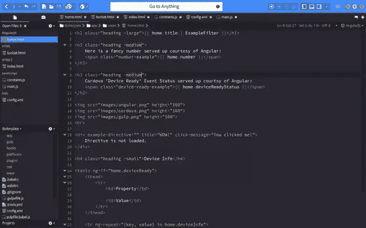
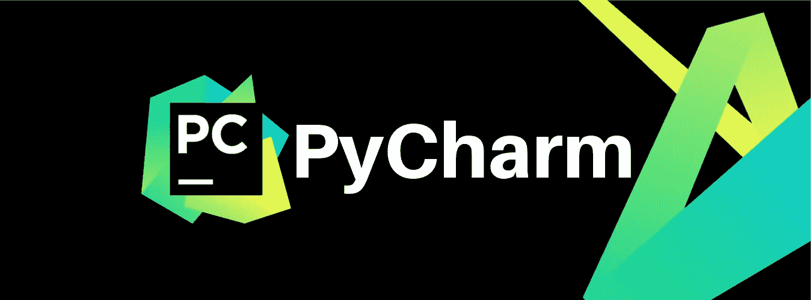
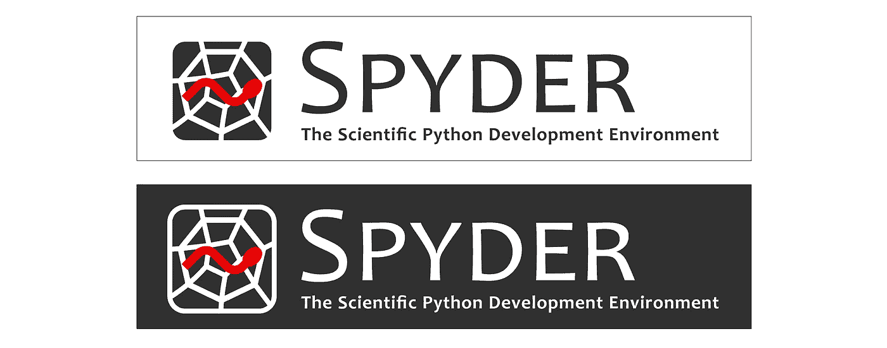
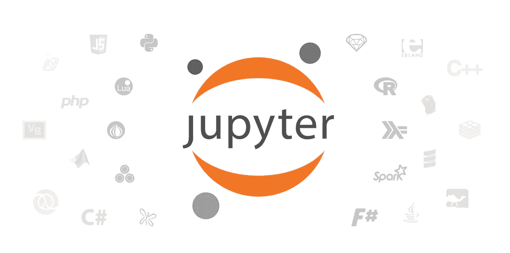

# Python 的文本编辑器

> 原文：<https://blog.devgenius.io/text-editors-for-python-dada506e4912?source=collection_archive---------8----------------------->

限制了 python 中大量的文本编辑器选择。

众所周知，python 是一种通用编程语言，选择各种文本编辑器可能会很困难。在这里，我将概述可以使用的最好的 python 文本编辑器。

## 1-PyCharm

自 2010 年以来，文本编辑器专门用于 python。它可以在 macOS、Windows 和 Linux 上运行。PyCharm 是 python 中大型项目的文本编辑器。它的主要特点是允许通过集成使用 Django 进行 web 开发，它可以保存任何东西，即使在系统上被删除了。Git GUI 界面和对 Github 的可访问性允许您安全地保存和存储代码，并允许您公开共享您的 python 代码。最后，PyCharm 的特性允许测试 python 应用程序，包括数学和统计计算。但是，它真的很难使用，有专门的课程来使用 PyCharm。

## 2-蟒蛇导航器/Spyder

python 教师使用 Spyder 教授 python，并为世界各地的学生使用不同的文本编辑器。此外，它还被用于科学开发、高级编辑、交互式测试、调试和自省。有时，除了数学和统计计算，开发人员使用 python 编写他们的应用程序。但是很难在应用程序中进行所有的测试。

## 3-蟒蛇领航员/Jupyter

Jupyter notebook 是一个知名的在线教授和提交 python 作业的文本编辑器。尤其是当考虑到一些文件不能在网站上提交，并且由于各种原因不会使用在线代码编辑器时。相反，Jupyter 笔记本可以很容易地用于网站，学生可以很容易地提交他们的 python 练习。如果你是一名教师，只允许你的学生通过你的网站提交作业，Jupyter notebook 是目前最好的选择。

你对 python 的文本编辑器有什么看法？在下面的评论区分享你的想法和经历。