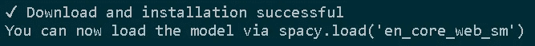
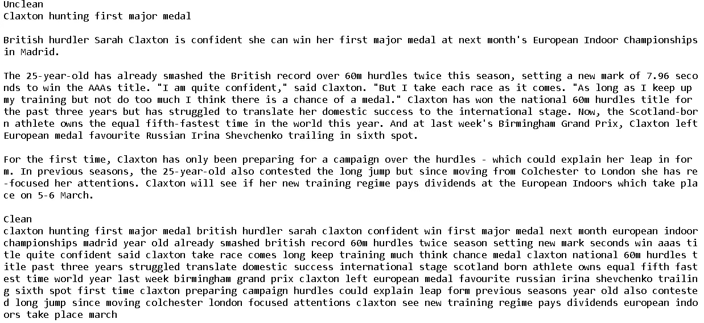
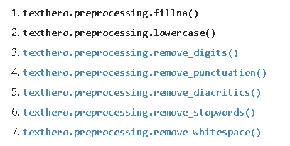
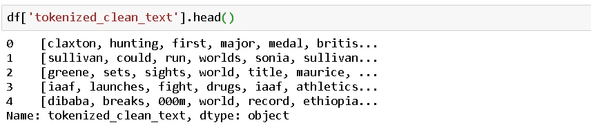
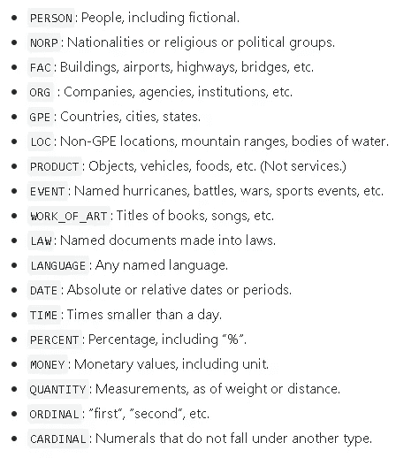
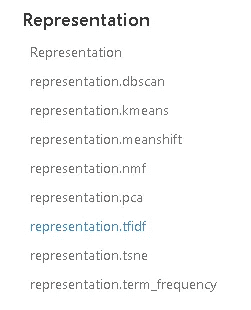
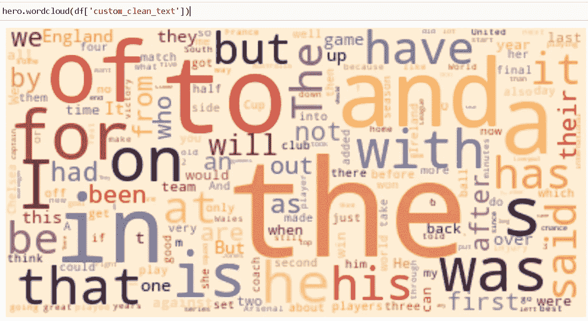
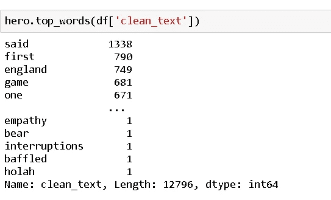

# text hero——非官方介绍和评估

> 原文：<https://blog.devgenius.io/texthero-an-un-official-introduction-and-assessment-f7fd0b8c290e?source=collection_archive---------18----------------------->


Texthero 包的标志。归功于 Texthero 的创造者

让我们接受这样一个事实:我们被埋在文本中(或者你可以称之为非结构化数据)。因此，知道文本中隐藏着什么样的洞见会增加巨大的价值(讽刺！！) .

无论你是 NLP(自然语言处理)的初级、中级还是专家，“**text”**本质上都是**“语言”。**因此，在探索、解释、可视化以及最终利用你遇到的文本和见解时，总是会有变化。

**文本数据的探索性数据分析** ( EDA)一直是争论的话题，因为不同的专家倾向于应用不同的库和技术。

由于“文本”或“语言”本身就有歧义的空间，因此在分析文本数据时，在你能够想象提取洞察力之前，在你的技术中实现标准化就变得更加重要。

**介绍文字英雄:**

根据网站上的描述" *Texthero 是一个 python 包，可以让你高效快速地处理文本数据。您可以将 texthero 视为基于文本的数据集的 scikit-learn*。

文本英雄是做什么的？

Text Hero 本质上是一个智能管道软件包，它建立在许多其他优秀的软件包之上，例如

1.  **gensim**
2.  **nltk**
3.  **scikit-learn**
4.  **空间**

和其他几个关于可视化、请求、正则表达式的实用程序包。

**当您发出命令**时，总共有 49 个 python 包被安装

```
pip3 install texthero
```

因此，在运行本教程之前创建一个虚拟环境是一个好主意，这样你就不会扰乱你现有的安装。

1.  创建一个名为 **texthero** 的虚拟环境

```
virtualenv -v texthero
```

2.激活环境

```
activate
```

3.安装 texthero

```
pip3 install texthero
```

4.如果你对查看所有的包和它们的版本感兴趣，你可以冻结一个文本文件，以后再查看。

```
pip3 freeze > requirements.txt
```

现在你已经准备好探索 **texthero** 了。

从这里开始，我将在教程中使用 VS 代码。您可以在自己选择的任何 IDE 中自由地学习本教程。但是 VS 代码超级酷，如果你有兴趣了解更多，这里有一个我写的关于 VS 代码的教程。

[](https://medium.com/@rajesh.r6r/is-visual-studio-code-the-coolest-ide-ever-80a59579612f) [## Visual Studio 代码是有史以来最酷的 IDE 吗

### 我可能对 VS 代码有点固执己见。这是经过多年的开源和可能鄙视微软…

medium.com](https://medium.com/@rajesh.r6r/is-visual-studio-code-the-coolest-ide-ever-80a59579612f) 

**注:**

Texthero 在后台使用 spacy 模型。因此，当您第一次导入 texthero 时，它将在后台下载“en _ core _ web _ sm”spacy 模型。



在我们的练习中，我们将使用官方样本中提供的相同 BBC 体育数据集。

你可以在我在文章末尾提供的 jupyter 笔记本链接中继续学习。

**预处理:**

无论是任何数据集，预处理都是非常重要的。Texthero 的预处理包装函数使它变得更加简单。

**a .清洁()方法:**

```
df['clean_text'] = hero.clean(df['text'])#What does the clean stuff does
print("Unclean",sep='/n')
print(df['text'][0],sep='/n')print("Clean",sep='/n')
print(df['clean_text'][0],sep='/n')
```

clean()方法基本上清除了所有的标准数字，如**换行符，将所有文本简化为小写字母，删除标点符号，还删除了一些数字，如下面示例中的** *中的 25 岁，3 月 5-6 日。*这是一个有争议的步骤，尤其是如果你像我一样处理专业文本，如科学期刊、研究文章，这些数字意味着更多 ***。***



但是如果你看一下默认的清洗管道，你就会得到答案。它一次性启动 7 个不同的清理步骤。那很方便。



默认清理管道— texthero

这也是有趣的地方。Texthero 为您设计自己的管道提供了一个包装器，如下所示

**b. get_default_pipeline()方法:**

假设我想向管道添加一些标记化，那么我可以简单地向管道添加标记化步骤，如下所示

```
my_custom_pipeline=hero.get_default_pipeline()
my_custom_pipeline.append(hero.tokenize) # append tokenization to cleanup #And then use it to clean the text in my own definition
df['custom_clean_text']=hero.clean(df['text'],pipeline=my_custom_pipeline)
```

太棒了。因此，你不仅可以添加内置函数，你也可以建立自己的自定义清理函数，如果你想运行这个列表。为了保持一致性，只需确保您的函数接受 Pandas 系列(在本例中是我们正在讨论的文本列)。



**NLP :**

在 NLP 引擎盖下，我找不到任何伟大的除了 NER。

**a .命名实体识别:**

你可以选择不同的模型进行命名实体识别，记住我们安装了 spacy，gensim 和 nltk 包。

```
df['named_entities_spacy']=hero.named_entities(df['text'],package='spacy')
df['named_entities_gensim']=hero.named_entities(df['text'],package='gensim')
df['named_entities_nltk']=hero.named_entities(df['text'],package='nltk')
```

快速检查发现，对于这个数据集，nltk、gensim 和 spacy 识别的命名实体之间没有变化。但我确信，在大型数据集中，事情会发生变化。

在我看来，用所有的框架构建一个定制的 NER 模型有它自己的优点和缺点，但 texthero 提供了所有 3 个可用框架之间的快速比较，让你选择一个你喜欢的。很好。

认可的实体类型:



**词向量表示法:**

这里有一些你手边的单词向量表示法。



词向量表示法

**答:tf-idf**

```
hero.tfidf(df['text'],max_features=100,return_feature_names=True)
```

简单。它返回 tf-idf 矩阵以及 tf-idf 步骤通常需要的所有内容。

一篇关于 tf-idf 的好文章，如果你是第一次接触的话。

[http://www.tfidf.com/](http://www.tfidf.com/)

**b .词频**

```
hero.term_frequency(df['text'],return_feature_names=True)
```

**可视化**

**答:wordcloud**

```
hero.wordcloud(df['custom_clean_text'])
```

看这个单词云。



**b .热门词汇**

```
hero.top_words(df['custom_clean_text'])
```



**免责声明:**

以下是我个人对该方案的看法。

**什么是有效的？**

1.  通过提供托管依赖安装，texthero 使设置基本的文本清理和分析设置变得更加容易。
2.  预处理区的便捷功能使您能够更快地完成工作
3.  预处理阶段可定制。

**有哪些可以改进的地方？**

1.  除了预处理之外的所有其他部分都有潜力

**什么时候应该选择使用 texthero？**

当然，如果你是一个初学者或中级冒险进入文本分析

**什么时候不应该选择使用 texthero？**

在建模(表示)、可视化和 NLP 阶段，目前没有定制的空间。如果你在寻找特定的东西，那么一开始就不是一个好主意。

本文使用的 Jupyter 笔记本: