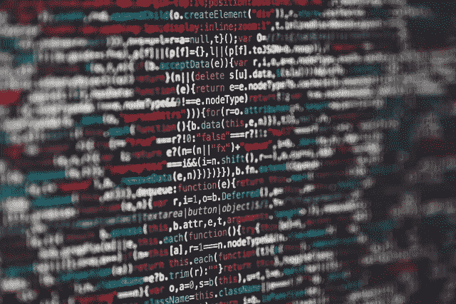
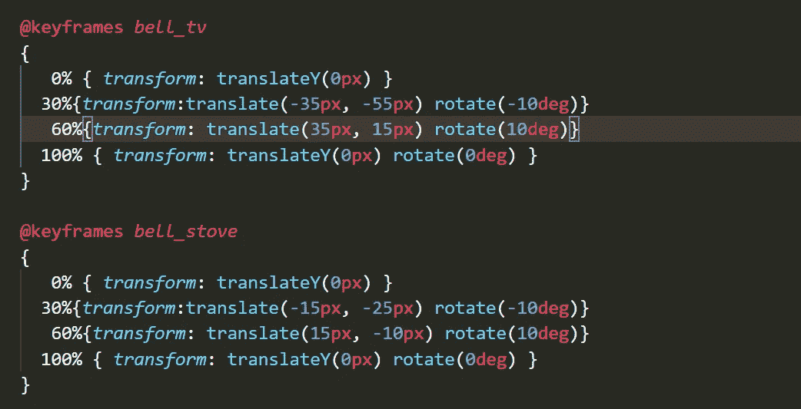
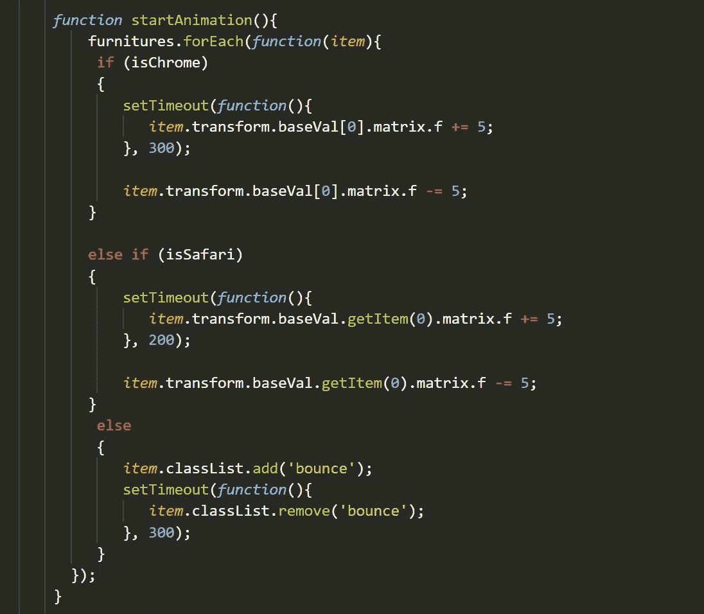

# CSS 动画会让你付出代价

> 原文：<https://blog.devgenius.io/that-css-animation-is-going-to-cost-you-5e26bb35e3d4?source=collection_archive---------19----------------------->

不久前，我接受了一个客户的工作，这个客户是我的朋友推荐给我的。这是一个相对简单的小广告单位的要求，我可能会在几天内完成。至少我是这么认为的。

一个 5 x 2 比例的小横幅，上面有一栋房子，里面整齐地摆放着一些家具。当您将鼠标悬停在某个元素(如沙发)上时，会弹出一个小的信息图窗口，其中包含关于该产品的附加信息。

鉴于我的带宽，这似乎是一个有趣的整体项目，我决定接受这个提议，并开始工作。

关于广告单元的快速说明。无论添加任何动画或运动，它们都很难实现，因为它们必须遵循某些规则才能适当地进行渲染，例如:

*   没有可以使用的图像
*   必须保持在 2MB 以下
*   没有链接到任何外部资源
*   必须是 HTML5

所以本质上你必须对整个事情进行常规编码。一切都必须直接内联到页面上，如果你想要一个图像，你有两个选择。

您可以先对图像资源进行 base64 编码，然后将其加载到绘制整个图像的元素中，假设您拥有该资源的可伸缩矢量格式。

根据你选择的路线，将会有不同的挑战等待着你。

# 活力

大约一个星期后，我有了一个相对完美的广告草稿，它是有反应的，遵循了上面提到的指导方针，并且大部分都是有效的(没有动画)。

我决定走 SVG 路线，把每一件家具都渲染成它自己的图形对象。这解决了必须以各种大小呈现单元的问题，因为 SVG 可以很好地全面扩展。

这时候就有了让它变得更“有趣”的要求。一个我认为只会让我多工作一小时的无辜请求。

> "当用户将鼠标悬停在每件家具上时，我们能让它们稍微“弹跳”一下吗？"

弹跳？这个术语真的很主观。我该如何为反弹报价呢？

我很快不得不改变这个请求的措辞，使其更具收费性。一些本质上更技术性的东西，反映了它实际上是什么。

> "你的意思是，你想在物品上添加一个动画？"

就是这样！

随之而来的是一系列电子邮件，内容是反弹应该带来什么。不能太快，因为那太暴力了(我同意)，也不能太慢，因为那看起来非常不自然和“漂浮”。

我的第一反应是查看任何现有的 CSS 预制动画库，比如我经常使用的丹尼尔·伊登的[，如果你想快速实现一些看起来非常平滑的过渡，我强烈推荐这个库。](https://animate.style/)

如果你还记得的话，我不能使用外部库。我也不能复制和粘贴这个库，因为我使用的内存有限。所以我继续借用了“弹跳”动画，并将其整合到页面中。

成功了！而且也没多久。我寄出了新的草稿，等待着愉快的回复。几个小时后，我被告知它还没有完全到位。

如果你访问那个链接并查看反弹，你会注意到它非常具体。这实际上是一种双重反弹，这不是我们所要求的。

幸运的是，我仍然可以逆向工程一些现有的逻辑，把它变成一个单一的反弹效果。经过一些调整，我有了一个稳定的 CSS 动画，它完成了工作，并且没有违反任何准则。

# 需要更多的“铃声”

在这一点上，我已经达到了这个项目商定的计费小时数，我让我的临时雇主知道了这一点。

但是他们同意过去，因为我们已经接近了我们要去的地方。除了，那不是真的。我们可能会随着收到的每个请求越来越远。

在这一点上，很难估计任何时间，因为我最初的 1 小时“反弹”实现没有按计划进行。

> "我们能让它在顶部倾斜得更像一个钟吗？"

一个“钟”？再次强调，这意味着什么是主观的。

我又去了一次丹的图书馆，看了看。最接近钟的东西是“摆动”，这太夸张了。要求是在安全着陆之前在顶部有一个非常小的钟状倾斜。

如果你从未想象过冰箱能弹跳 2 英尺并像铃铛一样倾斜，现在就是时候了。除了缩小到 100 像素的宽度。

在一个小时的免费研究后，我放弃了，并意识到我必须提出自己的贝尔算法，老实说，我一直在避免这样做。

CSS 转换拯救世界。对我来说幸运的是，看起来 ad-units 很容易就接受了动画和转换。经过多次反复试验，我终于找到了最佳点，如果你是一台冰箱或热水器，像钟一样倾斜意味着什么。

我的 CSS 动画看起来如下:

如果你仔细注意，你会看到我最大的痛点。画布中的每个项目在页面上的位置都是唯一的，它们有自己的宽度和高度比例。例如，冰箱比电视高。这意味着当倾斜时，改变的角度必须针对该差异进行调整。

因此，十几件家具中的每一件都必须单独制作动画，对它们的 x 和 y 坐标以及旋转角度进行细微调整，以便它们或多或少地具有均匀的抖动。

经过几个小时的反复试验，我有了一个看起来接近完成的版本。

除了最后一件事。

# 初始“反弹”

一个新的需求出现了，这在当时看起来非常微小。当页面加载时，让每个项目“弹跳”(没有“响铃”)，暗示这些是动画项目，并给用户一个应该被点击或悬停的想法。

就其本身而言，这是一个相对简单的壮举。除了由于一些奇怪的原因，iOS 上的 Safari 不会在使用 CSS 加载第一页时触发动画。

它在 a :hover 状态下工作，但在其他任何时候都不会这样做。几个小时的谷歌搜索之后，我在某个论坛的深处发现了一篇孤独的文章，有人提到了它。然而，没有相应的解决方案或变通办法，这个问题几年前就提出来了。

JavaScript 拯救世界。这是一个长镜头。如果 CSS 不会触发，我也不认为 JavaScript 会触发。但是值得一试。我越深入低层次的运动，就越紧张。

不是因为它很难而紧张，而是因为看起来我挖掘得越多，浏览器兼容性就越热衷于破坏我已经完成的所有艰苦工作。

如果我的 SVG 和 CSS 组合最终没有成功，那么我可能会被迫自费使用另一个潜在的解决方案重新开始。

后来，人们对 JavaScript 时序与转换进行了大量的实验，结果得到了下面的函数:

成功了！这是唯一一个可以购买的解决方案，可以在所有情况下持续有效，而且它并不漂亮。我必须直接进入每个项目的转换属性，并在 200 毫秒的 JavaScript 计时器上将相应的矩阵元素更改为值得反弹的 5 个像素。

# 屈服

在这一点上，当我发送最终版本时，我的皮质醇水平达到了历史新高。在写邮件之前，我把清单浏览了十几次:

*   SVG 房屋生成(检查)
*   SVG 家具项目(检查)
*   初始“反弹”效果(检查)
*   悬停“铃”效应(检查)
*   浏览器兼容性(检查)

我点击提交，最后深吸了一口气。

2 小时后，我的手机关机了，我看到了客户的通知和回复。

> “看起来不错！给我们寄一份额外时间的发票！”

成功。

虽然额外的时间对我认为会是一个超级快的项目来说是一个很好的意外收获，但我认为我从整个事情中得到的真正收获是对我们每天在网络上看到的通常被忽视的动画线索的欣赏。

在正确的时间意外淡入的元素。一个项目给我们的轻微“轻推”意味着它必须被点击。

但是就像生活中的所有事情一样，这是有代价的。即使是最轻微的眨眼也必须有人编码。需要编写 CSS，需要触发和调整定时事件，浏览器可能会也可能不会像你说的那样工作。

现在，当一个客户问我是否有可能在页面上添加动画时，我告诉他们有可能，但可能会让他们付出代价。