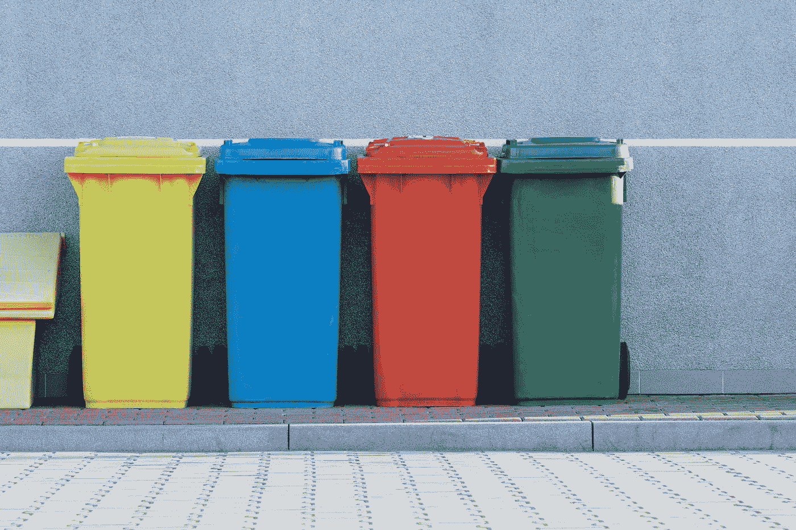

# 10 种常见的排序算法

> 原文：<https://blog.devgenius.io/the-10-common-sorting-algorithms-dbcf253d344a?source=collection_archive---------12----------------------->

Pawel Czerwinski 在 [Unsplash](https://unsplash.com?utm_source=medium&utm_medium=referral) 上的照片

## 这是一种将列表元素按顺序排列的算法。

> [如果你觉得我为你贡献了价值，请支持我！](https://ko-fi.com/jinlowmedium)

如果你觉得我的文章对你有价值，请成为我的推荐会员来支持我。它能为我带来一些收入。

你可以阅读我的文章来更好地理解。

 [## 数据结构和算法导论

### (算法+数据结构=程序)尼古拉斯·沃斯引用

experiencestack.co](https://experiencestack.co/the-introduction-to-data-structures-and-algorithms-f32c98e24ea0)  [## 8 种常见的数据结构

### 数据结构是编程的支柱。

blog.devgenius.io](/the-8-common-data-structures-ed002b5837e9) 

排序算法就是在大量数据的处理中，如何使记录按要求排列。

**排序算法的分类**

1.  **非线性时间比较排序** —通过比较确定元素的相对顺序，其时间复杂度不能超过 O(n log (n))。

*   [**冒泡排序**](https://en.wikipedia.org/wiki/Bubble_sort)
*   [**快速排序**](https://en.wikipedia.org/wiki/Quicksort)
*   [**插入排序**](https://en.wikipedia.org/wiki/Insertion_sort)
*   [**希尔排序**](https://www.codetd.com/en/article/12979755)
*   [**堆排序**](https://en.wikipedia.org/wiki/Heapsort)
*   [**合并排序**](https://en.wikipedia.org/wiki/Merge_sort)
*   [**选择排序**](https://en.wikipedia.org/wiki/Selection_sort)

 [## 比较排序可视化

### 编辑描述

www.cs.usfca.edu](https://www.cs.usfca.edu/~galles/visualization/ComparisonSort.html) 

**2。线性时间非比较排序** —元素的相对顺序不是由比较决定的。可以突破比较排序的下界，以线性时间运行。

*   [**计数排序**](https://en.wikipedia.org/wiki/Counting_sort)
*   [**桶排序**](https://en.wikipedia.org/wiki/Bucket_sort)
*   [**基数排序**](https://en.wikipedia.org/wiki/Radix_sort)

或者

1.  **内部排序** —完全发生在计算机主存储器内的任何数据排序过程
2.  **外部排序** —可以一次处理海量数据

# 比较排序

**冒泡排序**

*   它是一种简单的排序算法，迭代遍历要排序的数组，一次比较相邻的元素，如果顺序不对就交换，即序列已经排序。

*   比较两个相邻的元素，并将具有较大值的元素交换到右边
*   它的时间复杂度:平均= O(n)，最好= O(n)，最差— O(n)
*   它的空间复杂度:O(1)
*   分类方法:就地
*   稳定性:稳定

**快速排序**

*   它是一种分治算法，根据支点将一个大数组分成 2 个小数组。

*   如果一个数组的元素小于主元，而另一个大于主元。
*   它的速度比合并排序和堆排序快 2-3 倍。
*   从数组中取出一个元素，小于支点的元素都在数组前面，大于支点的元素都在数组后面。
*   它的时间复杂度:平均= O(n log n)，最好= O(n log n)，最差— O(n)
*   其空间复杂度为 O(log n)
*   分类方法:就地
*   稳定性:不稳定

**插入排序**

*   这是最有效的简单排序方式。
*   每次将需要排序的元素插入到排序后的序列中，直到所有的插入都完成
*   将所有元素分为 2 个序列，将第一个待排序序列的第一个元素视为有序序列，将第二个元素至最后一个元素视为未排序序列
*   从未排序序列中的第一个元素开始，插入到排序序列中

*   它的时间复杂度:平均= O(n)，最好= O(n)，最差— O(n)
*   它的空间复杂度:O(1)
*   分类方法:就地
*   稳定性:稳定

**希尔分拣**

*   它是插入排序的一个更有效的改进版本
*   改进之处:

1.  当对几乎已排序的元素进行操作时，插入排序的效率很高，即它可以达到线性排序的效率
2.  插入排序通常效率很低，因为插入排序一次只能一个一个地移动一个元素

*   因此，将整个要排序的元素序列分成几个子序列(由以某个“增量”分隔的元素组成)，以便直接插入排序，然后在排序前依次减少增量

*   它的时间复杂度:平均= O(n log n)，最好= O(n log n)，最差— O(n log n)
*   它的空间复杂度:O(1)
*   分类方法:就地
*   稳定性:不稳定

**堆排序**

*   它指的是使用堆的数据结构设计的排序算法
*   堆叠是一种近似完全二叉树的结构，同时满足堆叠的性质，即子节点的键值或索引总是小于或大于其父节点

*   它的时间复杂度:平均= O(n log n)，最好= O(n log n)，最差— O(n log n)
*   它的空间复杂度:O(1)
*   分类方法:就地
*   稳定性:不稳定

**合并排序**

*   这是一种基于合并操作的高效排序算法
*   按顺序排列每个子序列，并按顺序排列子序列片段
*   组合有序子序列以获得完全有序的序列
*   将两个排序列表合并为一个排序列表=双向合并

*   它的时间复杂度:平均= O(n log n)，最好= O(n log n)，最差— O(n log n)
*   其空间复杂度为 O(n)
*   分类方法:错位
*   稳定性:稳定

**选择排序**

*   这是最简单的排序算法。
*   在未排序的序列中找到最小或最大的元素，存储在已排序序列的起始位置，然后继续从剩余的未排序序列中找到最小或最大的元素，存储在下一个位置，直到所有元素都排序完毕。
*   其时间复杂度为 O(n)

*   它的时间复杂度:平均= O(n)，最好= O(n)，最差— O(n)
*   它的空间复杂度:O(1)
*   分类方法:就地
*   稳定性:不稳定

# 非比较排序

**计数排序**

*   将输入元素转换为一个键，并将其存储在附加数组中。当输入元素为某个范围 k(从最小到最大)内的 n 个整数时，它们的运行时间为 O(n+k)。因为它不是比较排序，所以比任何比较排序算法都快。
*   找出数组中要排序的最大和最小元素
*   确定数字范围
*   创建空的索引数组或大小范围
*   计算每个元素出现的次数
*   累计所有计数

*   它的时间复杂度:平均= O(n+k)，最好= O(n+k)，最差— O(n+k)
*   其空间复杂度为 O(k)
*   分类方法:错位
*   稳定性:稳定

**桶排序**

*   这是计数排序的升级版本。
*   用于将集合中取值范围相同的元素存放到待排序的同一个桶中，即根据元素的特性将集合拆分成多个子集，拆分后形成多个桶。
*   根据要排序的集合中最大元素和最小元素之间的范围和映射规则，确定所需的桶数。
*   根据要排序的集合的元素分布特征来选择映射规则。

*   它的时间复杂度:平均= O(n+k)，最好= O(n+k)，最差— O(n)
*   其空间复杂度为 O(n+k)
*   分类方法:错位
*   稳定性:稳定

**基数排序**

*   它用于根据位数将整数分成不同的数
*   先按低序大小排序，然后收集，再按高序排序，继续收集；依此类推，直到最高位

*   它的时间复杂度:平均= O(n×k)，最好= O(n×k)，最差—O(n×k)
*   其空间复杂度为 O(n+k)
*   分类方法:错位
*   稳定性:稳定

**参考文献**

 [## 非比较排序算法

### 正如我们所提到的，可以证明一个涉及比较成对值的排序算法永远不会有…

pages.cs.wisc.edu](https://pages.cs.wisc.edu/~paton/readings/Old/fall01/LINEAR-SORTS.html#count)  [## 解释了排序算法

### 排序算法是一组指令，以数组或列表作为输入，将项目排列成一个…

www.freecodecamp.org](https://www.freecodecamp.org/news/sorting-algorithms-explained/)  [## 8 个必须知道的排序算法

### 在这篇文章中，我将向您展示常见的排序算法，并提供它们在 python 中的实现。如果你是一个…

戴夫。到](https://dev.to/koladev/8-must-know-sorting-algorithms-5ja)  [## 排序算法- GeeksforGeeks

### 排序算法是用来重新安排一个给定的数组或元素列表根据比较运算符对…

www.geeksforgeeks.org](https://www.geeksforgeeks.org/sorting-algorithms/)  [## 分类算法

### 排序算法用于以特定的顺序排列数组/列表的元素。例如，在这里，我们正在排序…

www.programiz.com](https://www.programiz.com/dsa/sorting-algorithm)  [## 流行的排序算法

### 在计算机科学中，排序算法是将列表中的元素按一定顺序排列的算法。

randerson112358.medium.com](https://randerson112358.medium.com/sorting-algorithms-6005e9ddd8c0)  [## 你必须知道的 10 种最佳排序算法

### 在阅读博客之前，尝试一下常见的 MAANG 排序算法面试问题。答 MAANG…

www.crio.do](https://www.crio.do/blog/top-10-sorting-algorithms/)  [## 流行的排序算法

### 排序可能是编程中最常见的算法类型。一个排序算法把一个列表的元素放在一个…

tuxar.uk](https://tuxar.uk/popular-sorting-algorithms/)  [## 用于更好编程的常用排序算法

### 为什么对算法的深刻理解如此重要？因为当我们写一个问题的解决方案时…

levelup.gitconnected.com](https://levelup.gitconnected.com/commonly-used-sorting-algorithms-for-better-programming-a3667af12e50)  [## 排序算法|精彩的数学和科学维基

### 排序算法是由一系列指令组成的算法，这些指令以数组作为输入，执行…

brilliant.org](https://brilliant.org/wiki/sorting-algorithms/)  [## 排序算法

### 排序算法是从最小到最大组织项目数组的方法。这些算法可用于…

lamfo-unb.github.io](https://lamfo-unb.github.io/2019/04/21/Sorting-algorithms/)  [## 排序算法

### (仍是一项进行中的工作；我想用直观的解释和扑克牌的例子重温一下)排序是…

betterexplained.com](https://betterexplained.com/articles/sorting-algorithms/)  [## 所有排序算法的时间和空间复杂性

### 学习不同排序算法的时间和空间复杂性对任何软件开发人员来说都是很重要的…

www.interviewkickstart.com](https://www.interviewkickstart.com/learn/time-complexities-of-all-sorting-algorithms) 

***如果你发现我的任何文章有帮助或有用，那么请考虑给我一杯咖啡，帮助支持我的工作或给我赞助😊，通过使用*中的**

[**Patreon**](https://www.patreon.com/jinlowmedium)

[**Ko-fi.com**](https://ko-fi.com/jinlowmedium)

**[buymeacoffee](https://www.buymeacoffee.com/jinlowmedium)**

***最后但同样重要的一点是，如果您还不是中级会员，并打算成为一名，我恳请您使用以下链接。我将收取你的一部分会员费，不增加你的额外费用。***

** [## 用我的推荐链接金加入媒体

### 作为一个媒体会员，你的会员费的一部分会给你阅读的作家，你可以完全接触到每一个故事…

jinlow.medium.com](https://jinlow.medium.com/membership)**