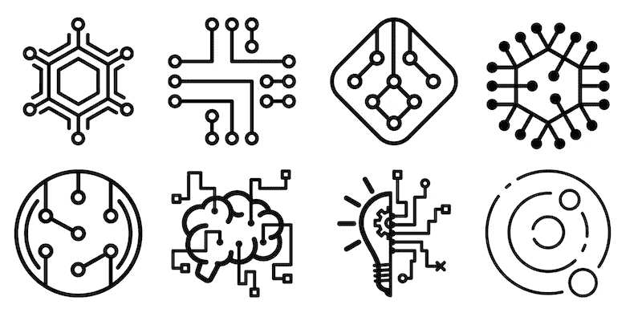
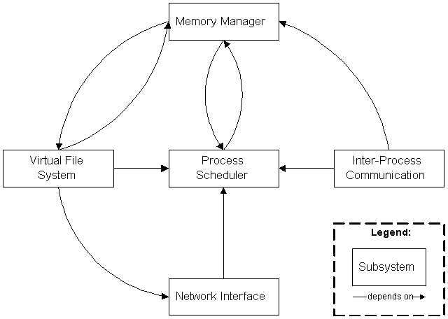
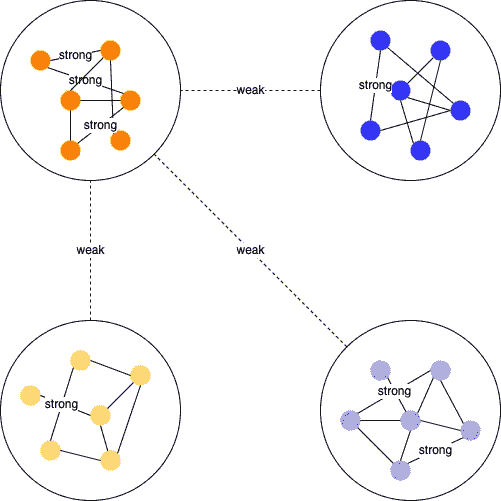
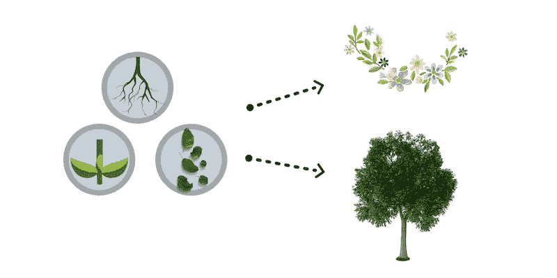

# 复杂系统的 5 个属性

> 原文：<https://blog.devgenius.io/the-5-attributes-of-a-complex-system-5fdb866ce3f5?source=collection_archive---------0----------------------->

# 最简单的事是最难的事

如果你想建造全球最高的建筑，一开始就必须首先考虑良好的基础，软件开发也是如此。更好的前期设计会影响后续的系统开发生命周期。然而，大多数公司并不强调这一点，而是寻求可行的软件。

面向对象的分析和设计对大多数工程师来说似乎是一个常识，但并没有得到充分的执行，很容易被视为一个过时的原则。我不持有相同的观点。相反，随着我从这个领域学到的越来越多，我在这个领域面前变得越来越谦虚。如果你觉得面向对象的想法很简单，那么**为什么我们周围有这么多错误软件**，更不用说那些可能损害商业健康的软件了。因此，你觉得简单的东西可能很难掌握。

这些天我一直在研究圣经，记录我的学习曲线，关于如何分析和设计一个真正的面向对象架构，而不是构建不能容忍可变需求和难以维护的“可行软件”。从[圣经](https://www.amazon.com/Object-Oriented-Analysis-Design-Applications-3rd/dp/020189551X)的观点来看，一个复杂的系统应该包括 5 个属性。

# **[1]层级结构**

> 任何复杂的系统都可以分解成几个更小的子系统，这些子系统是可分解的和相关的。递归地遵循分解规则，直到到达基本单元。

以 linux 内核为例，应用程序开发人员通常将计算机视为一个黑匣子，需要来自用户空间或内核空间的一些服务。他们甚至不关心在他们调用的 API 的外表下是什么样子。

[内核结构概述](https://docs.huihoo.com/linux/kernel/a1/index.html#Toc_2_2)

如果我们倾向于分解内核结构，有 5 个子组件相互关联，为我们提供操作系统服务。如果您进一步拆开这些组件中的一个，比如一个**进程调度器**，我们可能会看到其他更小的单元，比如进程、线程、任务，甚至是队列相关的结构，它们帮助调度器协调任务。

我们将一个复杂的组件概念化为一个可理解的抽象，这样其他人可以很快抓住它的核心精神，而不是知道内部的复杂性。分层结构形成了抽象层，以简化其客户端的使用。

# [2]相对原始

> 抽象的层次取决于观察者

我第一次看到财产时，我把它看作是“等级结构”的另一面。也就是说，层次决定了我们对复杂系统大小的理解，从而决定了我们在现实世界中如何描述它。

例如，当我们看一颗药丸时，我们可能只能从外观上认出它的名字，而药剂师可以认出它的化学结构并将其分解成更多的元素。这就是我们看待世界的方式。领域专家应该从问题领域中提取细节，以提供对场景的清晰洞察。

# [3]关注点分离

当我第一次看到这些属性时，我想到了三个问题。**关注**是什么意思？此外，为什么这些关注点需要被“**分开”**？如果关注点是“**未分离**”呢？在澄清这些疑问之前，让我们进一步了解一下书中的描述。

> 将部件的高频动态(涉及部件的内部结构)与低频动态(涉及部件之间的相互作用)分开。

嗯，我知道可能会让你觉得困，因为评论乍一看还是很抽象的。但是这个描述确实为我们提供了一个线索，告诉我们它将要分离什么！我们可以缩短音符。

> 将高频动态与低频动态分离

**低频动态**是指部件之间的“I **相互作用**，也就是说**部件之间的联系很弱**。相反，**高频动态**是涉及到部件的**内部结构**的东西，也就是说**部件之间的联系很强**。因此，我们可以这样解释这个定义

> 从弱连接成分中分离强连接成分

这种解释似乎比以往任何时候都更容易理解。我们知道“**关注**”所指的正是“**链接**”，尤其是指组件之间的强链接/弱链接关系。

强连锁对弱连锁

我们可以从现实世界的物体中感知到强/弱链接类型。例如，车辆和人分别在道路上行驶和行走。理论上，由于交通规则的规定，两者具有弱的相互作用，使得两者会注意到彼此，并且不会在道路上撞车。然而，如果你更接近每一个，在每一个对象中应该有更多强链接的组件。就拿一辆车来说吧，一辆车上至少要有发动机、车轮、车灯或者更多的一起工作，才能让它平稳前行。

通过分离关注点，我们可以将一个复杂的系统分成几个具有强关联子部分的组件，并使这些子部分对调查者来说是可理解的。这一特性有助于我们一步一步地将一个复杂的系统分解成分析组件，我们可以专注于我们将要理解的部分。组件内的联系通常比组件间的联系更强。如果一个复杂的系统不包含这个属性，它将很难被分析。

# [4]常见模式

> 复杂系统有共同的模式。这些模式可能涉及小组件的重用

当你走进森林时，许多树、花或其他植物映入你的眼帘。我们曾经被告知植物由三个基本部分组成:根、茎和叶。神奇的是，这些基本元素在你周围形成了各种类型的植物，复杂的系统也是如此。

在软件工程中，扩展你的系统的方法之一是从做类似任务的其他样本中采用现有的模式；通过安排模式来执行更复杂的职责。我们倾向于发现与[设计模式](https://sourcemaking.com/design_patterns)相似的设计方法或规范相同的行为，这些设计模式为实践中反复出现的问题提供了行之有效的解决方案。

# [5]稳定的直接形式

> 如果有稳定的中间形态，复杂系统从简单系统演化的速度会比没有中间形态快得多

更准确地解释这句话:罗马不是一天建成的。当我们要建立一个电子商务系统时，我们不会马上完成所有的功能。相反，我们更喜欢将系统原型设计成最小可行的产品。例如，我们最初可能需要产品列表、购物车和基本支付模块来形成基本用例。然后他们根据用户的反馈改进系统，增加改进的功能来丰富用户体验。

复杂系统就是这样进化的。稳定的中间形式从每个开发周期迭代发布，以适应市场需求。如果它不存在，产品可能处于不稳定状态，并可能有失败的风险。

# 蔻驰杂音

一般来说，大多数人可能只听说过“**关注点分离**原则，因为它触及了许多现代设计原则的核心精神。其他四个属性并不广为人知，分散在我们的编程技术中。但这并不意味着它们不存在于复杂系统中。因此，在本文中，我将它们指出来，以便读者在实际操作中进一步观察隐藏的属性。

—

如果你认可我与你分享的价值，请做如下:
1。**鼓掌**文章
2。**订阅**我最新内容
3。**在其他平台关注**我了解更多信息
-IG:[@ ur _ Agile _ coach](https://www.instagram.com/ur_agile_coach/)
-播客(中文):[敏捷火箭](https://player.soundon.fm/p/7f7dc3df-d738-405c-8cf9-02157a92ec61)
- Youtube: [你的敏捷蔻驰](https://www.youtube.com/channel/UCzD0wQmD1n4MuTKk-JocACA)
- LinkedIn: [吴宗祥](https://www.linkedin.com/in/tsung-hsiang-wu-8542409b/)

如果您需要咨询或其他形式的合作，请发送邮件至:【urscrummaster@gmail.com】