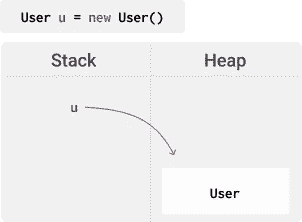

# 我看待 Java 的 6 种新方式

> 原文：<https://blog.devgenius.io/the-6-new-ways-i-look-at-java-8c77a293989d?source=collection_archive---------10----------------------->

## 我是如何覆盖基础知识并为将来的学习铺平道路的


[亚历克斯](https://unsplash.com/@worthyofelegance?utm_source=medium&utm_medium=referral)在 [Unsplash](https://unsplash.com?utm_source=medium&utm_medium=referral) 上的照片

我这辈子遇到过三次 Java。

首先，在高中时，我们把 Java 当作一个有趣的工具来玩，没有学习理论基础。

第二，我学计算机的时候。我们讨论了数据结构、设计模式、OOP 基础等。我对理论不感兴趣，所以我学的刚刚够及格。

最后，第三次是在 3 周前，我得到了我的第一份软件开发工作。我被分配到的项目使用了 [Spring 框架，](https://spring.io/)所以很明显，Java 是一个需求。有人向我推荐从头开始重新学习 Java。

# 三周前

我对 Java 如何工作有一个心理模型——在我的知识中有一些明显的空白。在过去的 3 周里，在重新学习 Java 的时候，我对这个模型做了一些小的调整，这让我能够更深入地思考 Java 中的高级概念。以下是 6 个缺口，以及我为修复它们所做的调整。

## 1.类别与对象

我一直把*对象*和*类*互换使用，这是不正确的。我现在明白了，类是一个蓝图，而对象是蓝图的组成部分。*对象*是实际位于内存中的东西。一旦我做了这个小调整，像*定义一个类*和*实例化一个对象*这样的术语就更有意义了。一个很好的类比是进程和程序之间的区别——程序是一组指令，而进程是正在执行的这些指令。

## **2。堆栈&堆**

不了解数据在内存中是如何组织的是一个很大的差距。这使得类似于*通过引用传递*的概念以及与*多态性*相关的想法更加难以理解。我现在将堆栈定义为作用域中指向堆中某个对象的所有引用，将堆定义为内存中的所有对象。最好的方法是实际上只使用非常高级的图像表示:



## 3.垃圾收集工

垃圾收集器确定哪些对象没有对它们的引用，然后销毁这些对象，这个概念对我来说一直很陌生。现在知道这些让我可以更深入地思考内存管理，以及如何避免 Java 版本的内存泄漏。在过去，我只是想当然地认为有东西在我身后清理。

## 4.静态

> 静态变量和方法将状态和行为绑定到一个类，而不是一个对象。

这个定义刚刚被“点击”——我发现这是我思考 Java 中静态修饰符角色的最好方式。像这样查看 *static* 使得像 *static init 块*这样的概念更容易理解，也解释了为什么静态成员不能访问实例变量或方法——当一个类第一次被加载时没有实例变量可用。

## 5.O **笔用于扩展**、**但关闭用于修改**

̶a̶̶b̶i̶t̶̶o̶f̶̶a̶̶b̶u̶z̶z̶-̶p̶h̶r̶a̶s̶e̶̶i̶n̶̶o̶o̶p̶̶b̶u̶t̶̶u̶n̶d̶e̶r̶s̶t̶a̶n̶d̶i̶n̶g̶̶w̶h̶a̶t̶̶i̶t̶̶m̶e̶a̶n̶s̶̶h̶e̶l̶p̶e̶d̶̶m̶e̶̶g̶r̶a̶s̶p̶̶e̶n̶c̶a̶p̶s̶u̶l̶a̶t̶i̶o̶n̶̶a̶n̶d̶̶h̶o̶w̶̶t̶o̶̶m̶a̶n̶a̶g̶e̶̶a̶c̶c̶e̶s̶s̶̶t̶o̶̶a̶n̶̶o̶b̶j̶e̶c̶t̶.̶̶i̶n̶̶p̶r̶a̶c̶t̶i̶c̶e̶,̶̶a̶l̶l̶̶t̶h̶i̶s̶̶p̶h̶r̶a̶s̶e̶̶r̶e̶a̶l̶l̶y̶̶m̶e̶a̶n̶s̶̶i̶s̶̶d̶o̶n̶'̶t̶̶c̶h̶a̶n̶g̶e̶̶(̶c̶l̶o̶s̶e̶d̶̶f̶o̶r̶̶m̶o̶d̶i̶f̶i̶c̶a̶t̶i̶o̶n̶)̶̶s̶t̶u̶f̶f̶̶p̶e̶o̶p̶l̶e̶̶a̶r̶e̶̶a̶l̶r̶e̶a̶d̶y̶̶u̶s̶i̶n̶g̶̶-̶̶d̶o̶n̶'̶t̶̶m̶o̶d̶i̶f̶y̶̶m̶e̶t̶h̶o̶d̶̶s̶i̶g̶n̶a̶t̶u̶r̶e̶s̶̶(̶t̶h̶i̶s̶̶w̶i̶l̶l̶̶b̶r̶e̶a̶k̶̶y̶o̶u̶r̶̶c̶o̶d̶e̶̶i̶n̶̶a̶l̶l̶̶t̶h̶e̶̶p̶l̶a̶c̶e̶s̶̶t̶h̶i̶s̶̶m̶e̶t̶h̶o̶d̶̶i̶s̶̶u̶s̶e̶d̶)̶,̶̶r̶a̶t̶h̶e̶r̶̶e̶x̶t̶e̶n̶d̶̶a̶̶c̶l̶a̶s̶s̶̶a̶n̶d̶̶o̶v̶e̶r̶r̶i̶d̶e̶̶m̶e̶t̶h̶o̶d̶̶i̶m̶p̶l̶e̶m̶e̶n̶t̶a̶t̶i̶o̶n̶s̶̶(̶o̶p̶e̶n̶̶f̶o̶r̶̶e̶x̶t̶e̶n̶s̶i̶o̶n̶)̶.̶

是的，我大错特错了😅—看看[Reddit](https://www.reddit.com/r/java/comments/hu138k/the_6_new_ways_i_look_at_java/fykiqfz/)上的这条评论就知道正确答案了。

## 6.多态性

> 多态性意味着我们可以用一个对象替换另一个对象，只要它们是相同的类型。

这个定义和我对栈和堆的新理解让我能够理解 OOP 的这个支柱背后的机制，这个支柱看起来总是有点抽象。

```
Person p = new Employee()
```

(堆栈中的)引用属于 Person 类型，指向堆中 Employee 类型的对象。这就是多态性的力量——堆栈中的引用变量可以指向堆中不同类型的对象，只要堆中的对象是堆栈中引用的子类型。

没有这一点，处理像依赖注入这样的概念，这是 Spring 的核心概念，将是不可能的。

# 前进

我绝不是 Java 专家。我仍在学习，前面还有很长的路要走——但我相信我已经掌握了基本知识。

我将在 Twitter 上记录我对 Java、Spring 和一般软件开发的了解。你可以 [**跟我去那里**](https://twitter.com/dijkstradev) 了解未来的见解。