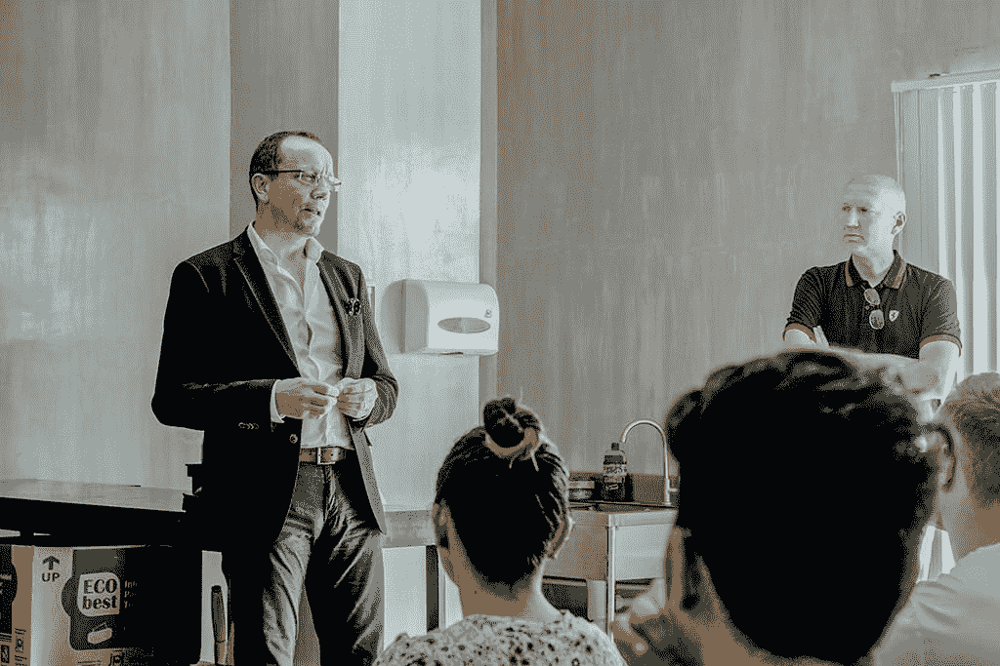

# 9 个最常见的软件开发团队扩展错误，解释如下

> 原文：<https://blog.devgenius.io/the-7-most-common-software-development-team-extension-mistakes-explained-7fb847948e1c?source=collection_archive---------20----------------------->

*本文原载于 2019 年 3 月 25 日* [*Arcanys 博客*](https://www.arcanys.com/blog) *，更新于 2022 年 5 月 23 日***，作者*[*Frederic Joye*](https://www.arcanys.com/blog/author/frederic-joye)*。**

*随着越来越多的技术型企业意识到拥有一个扩展的软件开发团队的好处，拥有一个扩展的软件开发团队的实践已经稳步获得动力。因为真的，一旦组织理解了从扩展的开发团队中获得最佳资金价值的过程，还有什么不喜欢的呢？你能够填补核心团队中至关重要的“缺失部分”,这将最大限度地提高他们的生产力，并以经济高效的方式启动项目。*

*但是，虽然正确的外包合作伙伴对您的企业来说是无价的资产，但带着不一致的期望和毫无准备的仓促进入扩展团队模式可能会带来失败、额外成本和时间损失的巨大风险。*

*让我告诉你:我绝不是提供一个万无一失的成功秘诀。但是我相信我们公司 [Arcanys](https://www.arcanys.com/) 在过去 11 年中在软件开发领域积累的知识和经验肯定会对任何想要组建和维护一个离岸开发团队的人有用。毕竟，你对常见的陷阱和误判了解得越多，你就能更好地避免它们。快乐阅读！*

# *错误 1:认为固定价格的项目是最安全的举措*

*如果一家服务公司为一个复杂且不明确的项目提供有吸引力的固定价格，这可能好得令人难以置信。*

*我们听到的一个非常常见的请求是:“阅读需求(实际上只是 Word 文档中的几行内容)，并请向我们发送时间表和成本。”这种方法注定会失败，原因如下:*

## *A.固定价格项目需要明确的要求，不遗余力(剧透:它不存在)*

*从理论上讲，如果一个固定价格的项目的范围和要求是非常明确的，并且是一成不变的，那么这个项目也是可行的。但实际情况并非如此，尤其是在初创公司或创新项目中。需求经常有些模糊，场景没有被彻底概念化。问题是，如果一个需求没有被清晰地表达出来，开发者就只能去寻找缺失的部分，而结果通常也不是客户所期望的，尤其是如果提供商的运营所在的国家和文化与客户不同时。范围和需求通常必须基于开发过程中收集的新知识而演变。*

## *B.估算一个误差幅度低于 20%的项目需要一个水晶球*

*如果你坚持让你的承包商报出一个固定的价格，他们别无选择，只能一边估算风险，一边大幅增加项目成本，同时祈祷项目成本没有被低估。由于风险是有上限的，客户通常较少参与项目，因为解决问题或多或少是开发人员的负担。随着项目的进行，开发人员开始发现越来越多不可预见的问题，几乎到了他将开始检查自己的估计和缓冲区组合的程度。对提供商来说，唯一的解决方案就是试图限制他的损失。*

## *C.在一个固定成本的项目中，每个人都在亏损*

*提供商如何限制他们的损失？通过偷工减料，在质量上进行切割。他们可能会为了更有趣的客户而移除他们最好的团队成员，并试图以最低的成本来处理项目。代码可能没有处理得那么好，可以跳过文档，只需查看重要的细节。毫无疑问，截止日期和质量对开发者来说不再重要；他们唯一担心的是如何使他们的项目崩溃，同时仍能满足合同中达成的任何协议。Demos 可能更麻烦，它将依赖于客户花费更多的时间来测试和发现 bug，然后初级开发人员将尝试着手这个项目。*

**

## *D.固定成本对各方来说都是有限的*

*老实说，提出固定价格报价的客户在技术上很少具有优势，相反，他们通常都来自业务方面。这也是他们力推固定价格的原因之一，因为固定价格可能会给他们不太理解的投资带来风险上限。这意味着他们很少预见到潜在的巨大延迟、他们自己在质量控制上的大量时间投资以及在开发过程中绝对不可能更改他们的产品(开发人员在接受任何更改订单之前肯定会深入了解情况)等最大的缺点。最终，你得到的是一个不符合你需求的项目，这个项目被严重拖延了，而且你花的时间远远超过了预期，但没错……这个账单很便宜。*

## *E.通往成功的更安全的道路是通过信任的关系来控制灵活性*

*在基于时间和材料的项目中，客户有责任确保开发人员尽快获得成功所需的一切——就像任何雇佣自己的开发人员的公司一样:这只是一个团队在一起工作。由于每个人都有推动项目完成的共同目标，因此合作更加紧密，通常会带来最佳结果。在开始时会有更多的压力和时间花在计划好一切，概念化最好的产品，帮助你的外包团队尽他们所能做到最好——但结果通常更令人满意。对于一个成功的创新项目，确保您:*

*   *避免固定成本项目。*
*   *尽可能地润色你的需求，以便供应商能够尽可能准确地评估你的项目(记住，他仍然可能与实际数字相差 25-50%)。*
*   *如果您对这些要求有困难，请向您的提供商寻求帮助，或者聘请专业机构。*
*   *在进入测试阶段之前，考虑构建非工作原型以获得所有潜在用户的确认。*
*   *准备放弃项目中不重要的部分，以缩小第一阶段的范围。*
*   *每次冲刺时都要求演示(每 1 到 2 周一次)。*

# *错误 2:认为需求可以在没有清晰路线图的情况下动态构建*

*坚持精益开发原则很好，但是团队的灵活性是有限的。没有准备就是准备失败。*

*作为[敏捷软件开发方法](https://www.agilealliance.org/agile101/)的一个组成部分，精益软件开发是一个强调在软件开发中优化效率和最小化浪费的概念。在 Arcanys，每个人都接受过敏捷实践的培训，这在我们与客户的合作中表现出来:我们很灵活，使用创造性的方法，并且每两周就能提供递增的结果。**我们的工作方式是避免和消除浪费，我们更喜欢根据适用性来衡量价值，而不是严格符合要求。**我们将短时间的迭代视为加速学习过程的机会，提前传达小套计划，并允许我们适应不可预见的情况。*

*但是，虽然有能力在最短的时间内完成快速简单的改进的组织可以获得强大的决策优势，并更快地将价值交付给他们的客户，但是轻率地冲进一个项目并快速构建所有需求并不是我们所提倡的。仅仅因为你不需要提前考虑太多未来的需求，并不意味着你不需要纪律、专注和坚实的路线图来让事情运转。你需要确保至少在接下来的一到两次冲刺中为你的团队堆积了足够的工作，心中有一个清晰的计划。在某些情况下，你可以让一个 UI/UX 设计师来阐明愿景(通常在高度可视化的项目中或者在一个新项目的开始)，或者利用一个业务分析师或者产品负责人的专业知识(在供应商这边或者在你这边)来帮助团队建立清晰的需求和在 sprints 上要完成的具体工作。*

# *错误 3:在软件提供商开发和拥有的专有框架、CMS 或平台上建立你的网站*

**除非有非常非常好的理由让你的提供商选择一个专有的或者定制的框架，否则在一个通用的框架上运行你的业务会更好。**

*我们习惯于拯救失败的项目。不幸的是，我们的客户中有相当一部分一直在与他们以前的提供商进行斗争，并带着一个需要立即关注的烫手山芋来找我们。当我们试图控制局面并继续发展时，我们也会评估哪些地方应该有所不同。**最难挽救的项目是那些以前的供应商已经开始开发他们的定制 CMS、框架或平台来运行项目的项目。**什么是定制 CMS？例如，他们建立了自己的界面来管理内容，而不是使用像 WordPress 或 Drupal 这样的成熟平台。因此，在某些时候，一些提供商决定建立他们自己的框架，并在那里处理他们所有的项目。*

*这使得培训变得更加容易，因为他们的员工只需要掌握这个单一的框架，但是这使得其他软件提供商很难接手。从本质上讲，我们必须学习一种新的编程方式，这可能需要几周的时间来学习，然后在项目的未来开发过程中一直被困在这种方式中。**定制框架缺乏灵活性，几乎没有文档记录，难以维护和升级，并且缺乏持续改进所需的社区，这导致他们使用过时的技术**。此外，开发这些定制框架的开发人员往往会感到厌倦，因为他们几乎没有学到任何对他们的职业生涯有帮助的东西。通常，它甚至不值得放在你的简历上。所以他们可以应付几个月，但很快，他们可能会失去兴趣，表现可能会下降。*

*当项目还不太先进并且还有很多工作要做的时候，我们通常会建议从一个开源的、最新的、可维护的、有良好文档记录的框架或 CMS 开始，比如 Laravel、WordPress、Contentful 等。很容易在世界各地找到了解这些广泛使用的技术并能轻而易举地接手项目的开发人员。你是否需要从零开始通常是一个基于资金的决定:如果你负担不起重新开始，那就用你现有的东西试试，直到你的项目开始有起色。但是请记住一件事:**即使你的项目用定制框架成功了，有一天，无论如何，你都需要重新开始。**可能是 1 年或 2 年，但最终，各种原因会让你重新开始，等待的时间越长，付出的代价就越大。*

*当开始一个新项目时，确保检查(即:将它们写在合同中):*

*   *所涉及的技术类型*
*   *框架、CMS 或平台及其版本号*
*   *编程语言*
*   *这个社区有多广*
*   *如果项目中涉及的技术适合您的项目*

*有时候，让一个独立的顾问来检查你的提供商的假设可能是一个好的选择。两对眼睛总比一对好*

# *错误 4:不能定期访问你的源代码。*

**一些外包公司保留源代码，直到全额支付尾款。这就是为什么你想避免这种情况。**

*一旦完成，你能访问源代码吗？当你为一些专门为你做的软件付费时，这个问题的答案应该总是肯定的。但是你想问的另一个重要问题是:什么时候？*

**

*一些外包公司只有在整个项目的全部和最终付款完成后才交付代码。但是项目中的问题通常出现在项目完成之前，有时最终付款从未支付，或者成本最终比最初预期的高得多(由于各种原因，但最常见的是由于糟糕的需求)。*

*因此，当增量支付发布时，**确保源代码在整个项目中定期交付，最好是在每次演示之后，或者甚至是每周一次，如果你这边有人可以审查代码的话**。*

**附加提示:**

*   *协商您的提供商必须定期交付代码，并根据正确的代码交付来联系付款。*
*   *验证代码是否定期发布。*
*   *创建您自己的源代码库(例如在 Git 或 Bitbucket 或其他提供者上)，以便您的提供者必须将他们的代码签入您的库。*
*   *确保你能定期看到开发人员的进度。*
*   *当提供商履行其义务时，定期付款(*，例如*，每月付款)。这是一条双行道，成为一个不良/逾期付款人也会伤害你的供应商的动机。*

# *错误 5:寻找会盲目执行软件开发的外包供应商。*

*仅仅有技术技能是不够的:你希望与一个技术人才提供商合作，这个提供商非常了解你的挑战和目标，能够成为你真正的商业伙伴和顾问。*

*进入团队扩展过程的公司往往在一开始就没有意识到外包提供商并不是生来平等的。软件开发公司实际上在功能和意图方面各不相同:一些公司更像是面向创建实际软件解决方案的软件供应商；其他人员配备提供商专注于满足所需的人力，然后就此打住。然而，对于许多企业来说，这并不是他们所设想的合作关系。*

*相反，大多数公司需要的是与真正的软件开发团队扩展提供商的健康合作。软件开发公司作为外包提供商的与众不同之处在于他们对全局的深刻理解。由于身处行业中，他们了解整个开发生命周期，当问题出现时或者当他们看到你走错路时，他们可以介入，并且能够给出专家建议。这改变了一切。*

*与和你保持同样高标准的团队扩充提供商合作也很重要，这样当涉及到运行日常操作、评估技能水平和评估解决方案质量时，双方的期望是一致的。另外，不要雇佣只提供软件开发的公司。你要确保选择一家全方位服务外包公司，它有能力理解你的需求，并通过业务分析师将它们转化为需求，或者通过设计师和 UI/UX 专家将它们转化为美观且面向用户的设计。寻找那些不仅会盲目执行你写在纸上的东西，而且会帮助你的项目发展成你心目中的软件产品的人。*

*你应该在提供商搜索中考虑的其他关键服务是代码审查、人工 QA、自动 QA、SysOps、客户服务、UI/UX 设计等等。请记住，开发人员是有创造力的人，但他们不是设计新界面或理解您的选择背后的业务逻辑全貌的最佳人选。对于这些，你需要更高水平的 IT 人才。如果你的核心团队中没有高级软件架构师、业务分析师或 UI 设计师的专业知识，确保你选择的公司能够将这些关键技能添加到你的扩展团队中。*

# *错误 6:认为团队规模翻倍会以线性方式使产出翻倍。*

**让我们永远抛弃这种误解:不，给一个落后于进度的项目增加更多的程序员不会让它回到正轨。**

*虽然让更多的人参与进来对其他行业来说听起来很合理，但这并不是软件开发领域的解决方案。事实上，它甚至可能适得其反，进一步推迟项目。Frederick Brooks 在他 1975 年的书《T4:神话中的人月》中解释了这一观察结果。根据 Brooks 的说法，有一个增量型的人，当他加入到一个项目中时，会使它花费更多的时间，而不是更少。这类似于经济学中收益递减的一般规律，即在保持所有其他因素不变的情况下，增加一种生产因素，在某一点上会导致较低的收益。*

*在软件开发中，至少有三个因素可以解释这一点:*

*   *任何新的团队成员都有一个“上升”时间；也就是说，加入到项目中的人在任何软件项目中都需要一段时间才能变得高效。*
*   *通信开销随着人数的增加而增加。当团队成员需要与更多的人交流时，他们完成的工作效率就会降低。*
*   *大多数软件开发任务是不可分的。这与其他任务形成对比，例如打扫房间，增加更多的人员可以加快工作的完成。人工月模式在这里行不通。*

***在软件开发中，理想的团队规模大约是 4 到 5 人。超过这个门槛，工作流程将不再高效。**在有更多人参与的项目中，最好的解决方案是创建多个 4 到 5 人的独立团队。因此，四个 5 人团队，而不是一个 20 人的团队，会有更高的生产力，沟通渠道的瓶颈更少。*

# *错误 7:创业特辑——认为天下有免费的午餐。为股权交易工作。*

**没有什么比让你的外包团队蒙在鼓里更能破坏软件开发项目了。**

*剥夺外包团队成员对你的业务的了解会在你和他们之间建立一个危险的鸿沟。这种情况的一个重要后果是，您的扩展团队不会对业务和手头的项目有一个全面的了解，这可能会导致未优化或不适当的解决方案。此外，**缺乏信任感和疏离感也会降低他们的士气和动力，最终影响工作效率。***

*这就是为什么像对待自己的人一样对待扩展团队成员是很重要的。从长远来看，你在这方面的努力将极大地影响你的项目和公司的成功。确保您与客户端的高级领导一起大量参与日常更新，发送所需信息，并回答问题以指导开发人员。这是你通常会对你的核心团队做的事情，我怎么强调这个建议都不为过，那就是[你应该像对待你的](https://www.arcanys.com/blog/4-things-your-software-development-team-wish-you-knew)一样对待你的扩展团队。*

*最后，每年拜访他们一次或两次(如果可能的话)会对全球产量产生非常积极的影响。我们自己经历过，我们的客户也经历过。*

# *错误 8:混淆价格和价值*

**衡量外包投资的收益不仅仅是价格。认真评估外包合同的全部影响。**

*面对一项商业提议，公司高管通常会自动关注底线:这要花多少钱？虽然在任何业务中，记录费用都是理所当然的，但当公司专注于成本而不是交易的总价值时，这就成了一个问题。如果可以选择的话，许多组织选择较便宜的方案也就不足为奇了。但是由于他们经常以不幸的结果告终，低利率并不总是意味着你得到了更好的结果。*

*这就是考虑资金价值的方法发挥作用的地方。是的，某个提供商可能不会提供最低的价格，但考虑到他们的重要投资组合和开发人员的专业水平，也许更高的成本会转化为更高的项目完成机会。或许，当你在一个生活成本更低的国家组建一个离岸团队时，你会发现公司的钱花得更划算。有可能，你会发现开发人员的技能与发达国家的同行相当，但工资较低。只要看看神秘的[的记录](https://clutch.co/profile/arcanys#reviews)和[的投资组合](https://www.arcanys.com/docs/Arcanys_Portfolio.pdf)，你就会发现这些并不是空洞的主张。*

*那么如何衡量物有所值呢？**考虑您的潜在团队，使用三个 E 作为您评估的指导因素:经济—价格的竞争力如何？；有效——项目完成的几率有多高？；高效——考虑到提供商的能力和服务范围，您的投资会得到回报吗？这完全是为了平衡工作质量和成本，而不是简单地从表面价值看价格。***

# *错误 9(特别资助):认为天下有免费的午餐。为股权交易工作。*

**对于尚未找到资金的公司来说，使用股票期权来“支付”最初的软件开发似乎是一个简单的替代方案。但是这种方法也有一些风险。**

*在 Arcanys，我们经常被要求进行股权开发，或大幅降低我们的利率，因为，嗯…他们没有很多资金来启动。这是现实。在他们进入第一轮几十万美元的融资之前，这些新公司通常会尽可能多地节省现金，并确保可用的财务资源得到明智的使用。然而，在这种情况下，你需要**小心选择你要合作的软件开发伙伴，以及你将如何组织交易。***

*首先，永远不要忘记每个人都必须挣钱吃饭(对于公司来说，还要给员工发工资)。“免费”工作的软件服务提供商很少会优先考虑这项工作，当付费客户来敲门完成一些工作时。这可能会大大减慢开发过程，或者降低产品质量，因为外包合作伙伴将项目委托给初级开发人员。这种做法对企业家来说是有风险的，因为**它将项目置于一种不确定的状态，特别是在上市时间**和产品非常重要的早期采用者的感知质量方面。*

*通过其技术资源投资项目 [Arcanys Ventures](https://ventures.arcanys.com/) ，我们公司实际上与有前途的公司合作，为他们的软件交付团队提供燃料，以换取股份。但正如这些投资公司在选择软件开发合作伙伴时必须小心谨慎一样，我们也会进行尽职调查。当双方已经一起工作了一段时间，并且双方都兑现了各自的承诺，那么现在可能是时候进入一个更严肃的关系，并谈论公平工作，如果这个机会对双方都有意义的话。即便如此，为股权交易而工作总是不公平的；仍然需要资金来支付一些费用，因为这是拥有可持续的“共有”项目的唯一途径。*

*理想情况下，在投资发生之前，双方必须通过常规的客户-供应商关系进行合作。这将有助于合作伙伴确定价值观是否一致，以及团队是否能有效合作。我们称之为婚前约会。举例来说，这就是我们在 ThinkItTwice、Payment Logic、Register Now 或髓质中所做的事情。*

*对任何一方来说都太容易的交易通常是不好的，因为可能会有惊喜隐藏在路上。拥有一家软件开发外包公司是更快、更便宜地生产产品的关键，但这需要认真考虑。外包合作伙伴提供的不仅仅是现金投资；对于创始团队来说，与拥有良好记录和经验的技术专家合作是一种难以置信的增值。有了合适的外包合作伙伴，初创企业和规模化企业可以加速他们的成功之旅。*

# *从这些错误中吸取教训*

*没有人说过管理和加入一个扩展的团队是容易的。但是，考虑到所有相关因素，以及在你参与合作之前学到的最常见的错误，那么你最有可能成功。[根据您的独特需求找到合适的外包合作伙伴](https://downloads.arcanys.com/ebooks/9-Deadly-Software-Development-Team-Extension-Mistakes-Explained.pdf)，管理您的期望，保持良好的沟通，并与您的扩展团队一起(即使是字面上的)前进。*

*在你给你的商业雄心一个成为市场赢家的机会之前，不要让它们夭折。使用专业的软件开发团队扩展公司来雇佣最优秀的人才来满足你的需求，并将你的软件产品推向更高的高度。如果你有兴趣了解更多关于如何让你的外包计划成为一个成功的故事，或者只是想获得一份免费的项目战略分析，请通过 fred@arcanys.com[或 LinkedIn 联系我。](mailto:fred@arcanys.com)*