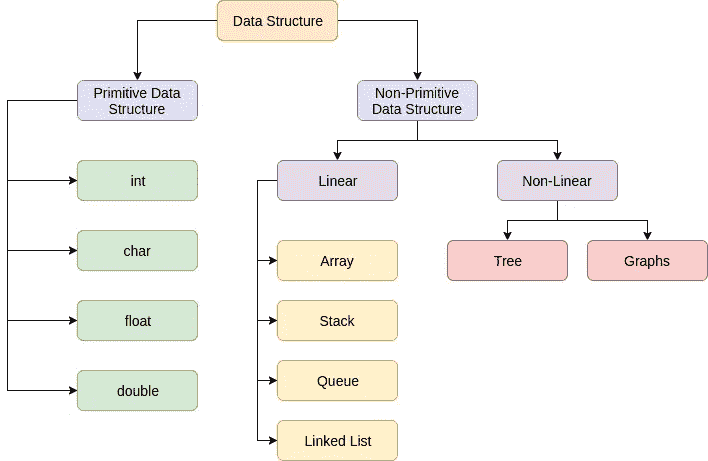
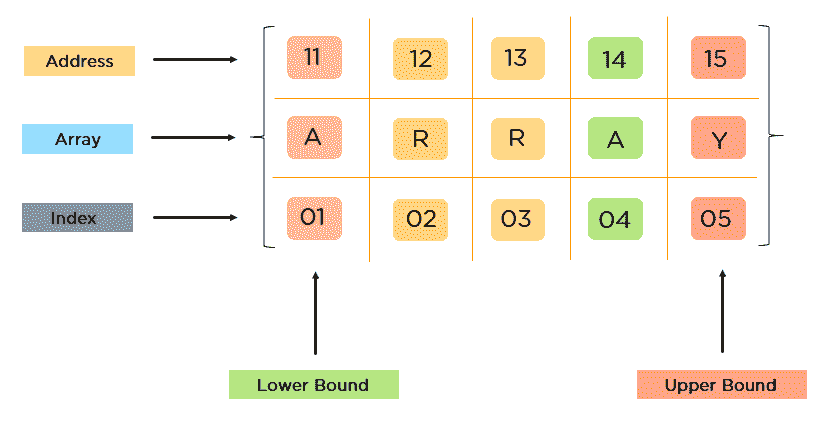
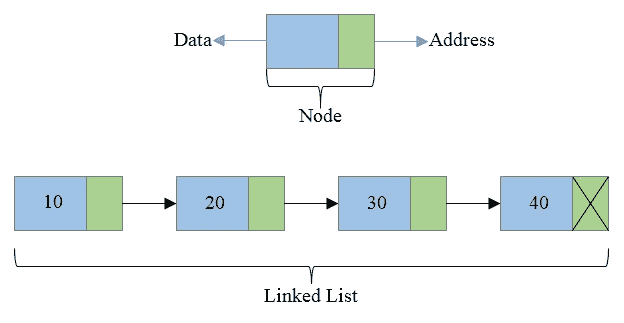
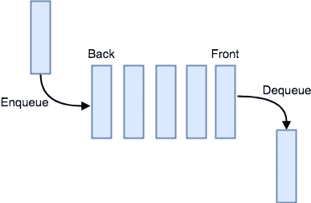
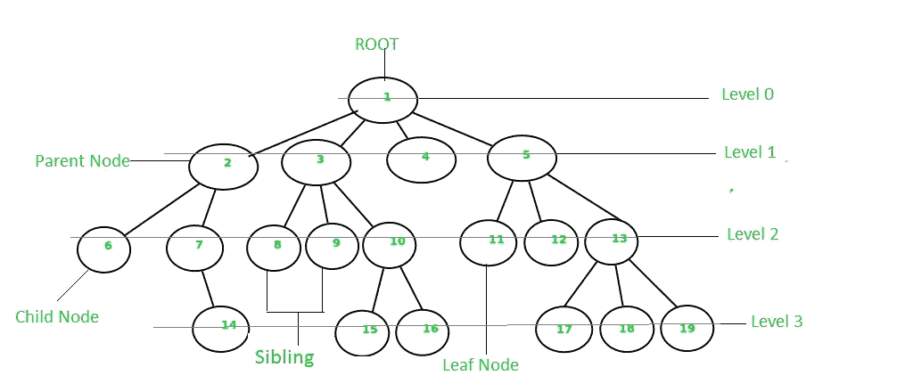
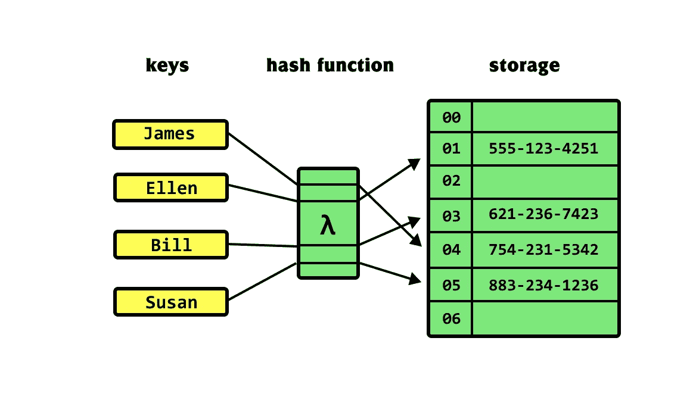
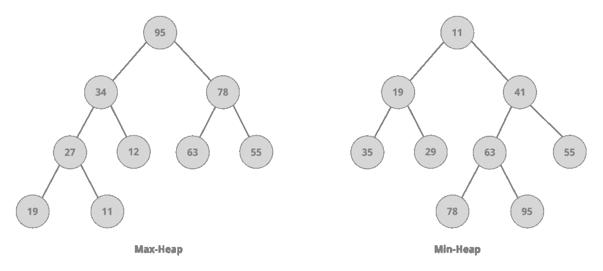
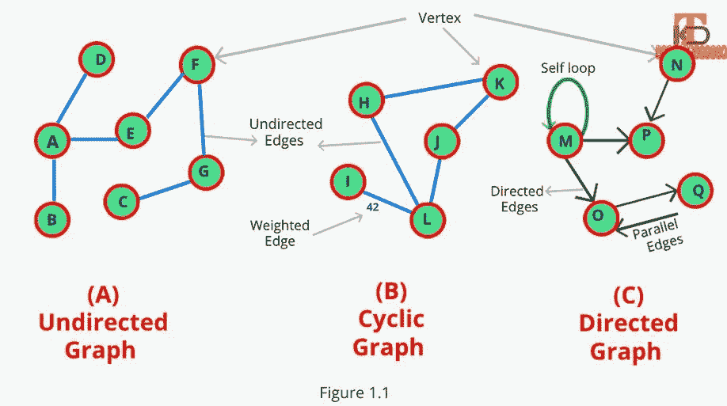
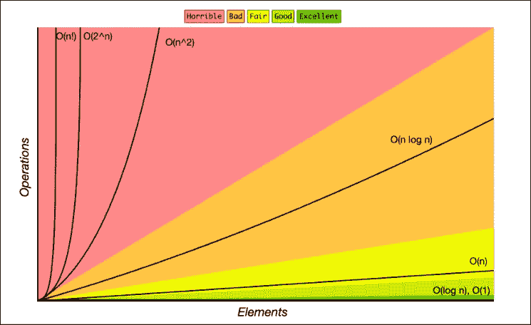

# 8 种常见的数据结构

> 原文：<https://blog.devgenius.io/the-8-common-data-structures-ed002b5837e9?source=collection_archive---------1----------------------->

[摄](https://unsplash.com/@jjying?utm_source=medium&utm_medium=referral)在 [Unsplash](https://unsplash.com?utm_source=medium&utm_medium=referral)

## 数据结构是编程的支柱。

> 如果你觉得我为你贡献了价值，请支持我！

*你可以看看我的文章有更好的理解。*

 [## 数据结构和算法导论

### (算法+数据结构=程序)尼古拉斯·沃斯引用

经验堆栈。总裁](https://experiencestack.co/the-introduction-to-data-structures-and-algorithms-f32c98e24ea0) 

***电子书广告:*** *数据结构和算法常识指南:提升你的核心编程技能*

 [## 数据结构和算法常识指南:提升你的核心编程技能

### 数据结构和算法常识指南:提高你的核心编程技能

amzn。到](https://amzn.to/3hdKTnO) 

**数据结构分类**

数据结构是在计算机中组织和存储数据的方式。

图片来源: [**后学**](https://afteracademy.com/blog/introduction-to-data-structure)

**原始数据结构**

*   基本数据结构不能再分了。

1.  带算术运算的 8 位整数(字节)—最小值为-128，最大值为 127(含)
2.  带算术运算的 16 位整数(短整型)—最小值为-32，768，最大值为 32，767(含)
3.  带算术运算的 32 位整数(Int) —最小值为-231，最大值为 230
4.  带算术运算的 64 位整数(长整型)—最小值为-263，最大值为 262
5.  16 位 Unicode 字符/字母数字字符/符号(char) —最小值为`'\u0000'`(或 0)，最大值为`'\uffff'`(或 65535，含 65535)
6.  带算术运算的单精度 32 位 IEEE 754 实数(浮点)
7.  带算术运算的双精度 64 位 IEEE 754 实数(Double)
8.  布尔型(具有逻辑运算(布尔型)的值集{ true，false})只有两个可能的值:`true`和`false`。

**非原始数据结构**

*   数据结构可以用于其他复杂的存储。

**线性**

*   元素形成一个序列

1.  **阵列**

*   它是同一类型元素的集合
*   这些元素按顺序连续存储
*   可以使用索引来计算对应于该元素的地址。

图片鸣谢: [**拉维奇兰 A S on Simplilearn**](https://www.simplilearn.com/tutorials/data-structure-tutorial/arrays-in-data-structure)

*   **一维数组** —元素被线性存储，可以通过指定数组中存储的每个元素的索引值来单独访问
*   整数 a[n]，字符串 a[n]
*   **多维数组** —一维以上的数组
*   int a[m][n]，string a[m][n]，

**功能:**

1.  所请求的存储空间的大小是固定的，不能改变。在使用之前，必须提前请求存储空间。
2.  数组实现数学向量和矩阵，以及其他类型的矩形表。

**优点**

*   根据索引，读取效率高(它支持随机访问应用程序)
*   搜索:时间复杂度为 O(1)

**缺点:**

*   写效率低(删除和插入效率相对较低，因为它取决于插入和删除的位置，并且需要进行大量数据移动，除非插入和删除的位置是最后一位
*   插入/删除:时间复杂度为 O(n)

**2。链表**

图片来源: [**潘卡杰·普拉卡什上码福温**](https://codeforwin.org/2015/09/data-structure-introduction-to-linked-list.html)

*   它是一种链式存储结构，前一个元素的引用指向下一个元素，链表通过指针连接元素和元素。所以，它不是按顺序实现的，而是用指针。
*   链表由一系列节点组成(每个节点由两部分组成:一部分是存储数据元素的数据字段，另一部分是存储下一个节点地址的指针字段
*   单向链表、双向链表和循环链表
*   链表中元素的插入和删除相对简单，因为它不需要移动元素和实现长度扩展，但很难查询一个元素
*   搜索:时间复杂度为 O(n)
*   插入/删除:时间复杂度为 O(1)

**优势**

*   这些元素可以任意增减。

**缺点**

*   它包含了大量的指针字段，占用了很大的内存空间

**3。堆栈**

图片来源: [**Progamiz**](https://www.programiz.com/dsa/stack)

*   它是一个特殊的线性表，只能在一端插入和删除。
*   它根据后进先出(LIFO)的原则存储数据。
*   首先输入的数据被推到堆栈的底部，最后一个数据元素在堆栈的顶部。
*   最后一个数据元素首先被读出或从栈顶弹出。
*   插入=推动
*   删除=弹出
*   堆栈中的元素数为零=空堆栈
*   插入/删除:时间复杂度为 O(1)

**4。队列**

图片鸣谢: [**Studytonight**](https://www.studytonight.com/code/python/ds/implementing-queue-in-python.php)

*   这是一个线性列表，允许在一端插入，在另一端删除。
*   它遵循先进先出的原则

**基本操作**

1.  入队:向队列中插入一个元素
2.  出列:删除一个元素并返回队列的第一个元素

*   插入/删除:时间复杂度为 O(1)
*   循环队列、优先级队列

**非线性**

*   这是一种数据结构形式，其中的数据元素不是线性或顺序排列的

**5。树**

图片来源:[**GeeksforGeeks**](https://www.geeksforgeeks.org/introduction-to-tree-data-structure-and-algorithm-tutorials/)

*   它是一种非线性存储，由 n (n≥1)个有限节点组成一个具有层次关系的集合
*   它显示具有“一对多”关系的数据元素的集合
*   每个节点有零个或多个子节点
*   没有父节点的节点=根节点
*   每个非根节点都有且只有一个父节点
*   每个子节点可以分成多个不相交的子树
*   **节点深度** =从根节点到 x 节点的路径长度。根节点深度为 0，第二层节点深度为 1，依此类推
*   **节点高度** =从叶节点到 x 节点的路径长度
*   **节点的度** =节点的子树数
*   **叶节点** =度数为零的节点

**二叉树**

*   每个节点最多有 2 个子树，节点的最大度是 2
*   左子树和右子树是有顺序的，顺序不能颠倒
*   即使一个节点只有 1 个子树，也有必要区分左右子树
*   AVL 树、红黑树、伸展树、替罪羊树、B 树、B+树、B*树、字典树(Trie 树)

6。哈希表

图片来源: [**哈利斯泰姆勒**](https://khalilstemmler.com/blogs/data-structures-algorithms/hash-tables/)

*   它是一种特殊的数据结构，根据映射函数直接访问，以 key: value 的形式存储数据。
*   f(键)=存储位置
*   哈希表是通过哈希函数将唯一标识符转换到相应的位置
*   搜索，插入:时间复杂度为 O(1)
*   然而，如果散列值都被映射到相同的地址，搜索的时间复杂度是 O(n)
*   **链接寻址** —哈希函数将键值映射到哈希表中的每个位置
*   **开始寻址** —如果 key 1 和 key 2 共享同一个位置，存在位置映射冲突，则将 key 2 放入空的位置，并发起寻找空闲位置的过程。
*   检测方法=线性探测、二次探测、双重散列

**7。堆**

图片来源: [**Baeldung**](https://www.baeldung.com/java-stream-integers-median-using-heap)

*   这是一棵完整的二叉树
*   它是一种图形树结构，用于实现“优先级队列”
*   堆中某个节点的值始终不会大于或小于其父节点的值
*   Min Heap =具有最小根节点的堆，满足 ki ≤ K2i+1 和 ki ≤ k2i+2
*   Max Heap =具有最大根节点的堆，满足 ki ≥ k2i+1 且 ki ≥ k2i+2

**8。图表**

图片来源:[**droid techknow**](https://droidtechknow.com/programming/data-structure/an-introduction-to-graph-data-structure/)

*   它是一种相对复杂的数据结构，并且具有相对复杂和有效的数据存储算法
*   它显示了对象与对象之间复杂的“多对多”关系
*   它由有限的顶点集 V 和边集 E 组成

它可以分为无向图和有向图

*   (v，w)表示一条无向边，即 v 和 w 互连
*   <v w="">表示从 v 开始到 w 结束的有向边</v>

图可以分为加权图和非加权图:

*   加权图:每条边都有一定的权重，通常是一个数字
*   未加权图:每条边都没有权重，也可以理解为权重为 1

图可以分为连通图和不连通图:

*   连通图:所有点都由路径连接
*   不连通图:有两个点没有被路径连接

图中的顶点有度的概念

1.  度数-与其相连的所有点的总和
2.  独立度—存在于有向图中，访问该点的所有边的总和
3.  外向度——存在于有向图中，与该点相连的边的数量之和

图形的表示

*   **邻接矩阵** —一个有 n 个顶点的图需要有一个大小为 n×n 的矩阵
*   **邻接表** —一个有链表数组的图
*   算法:图的搜索算法，广度优先搜索(BFS)，深度优先搜索(DFS)等

**大 O 复杂度**

图片来源: [**大 O 小抄**](https://www.bigocheatsheet.com/)

**参考文献**

 [## 数据结构介绍

### 数据结构广泛应用于计算机科学的各个方面。数据结构是组织和管理的方式

afteracademy.com](https://afteracademy.com/blog/introduction-to-data-structure)  [## 每个程序员都必须知道的 8 种常见数据结构

### 数据结构是一种在计算机中组织和存储数据的专门方法，以这种方式我们可以执行…

towardsdatascience.com](https://towardsdatascience.com/8-common-data-structures-every-programmer-must-know-171acf6a1a42)  [## 堆栈数据结构

### 堆栈是编程中一种有用的数据结构。就像一堆盘子叠放在一起。在这个…

www.programiz.com](https://www.programiz.com/dsa/stack)  [## 什么是哈希表？

### 第 2 期读取时间:5 分钟哈希表是一种数据结构，它以某种方式存储键/值对的集合…

www.baseclass.io](https://www.baseclass.io/newsletter/hash-tables)  [## 哈希表是如何工作的？

### 为什么人们用梳妆台来存放衣服？除了看起来新潮时尚之外，它们还有一个优点就是…

stackoverflow.com](https://stackoverflow.com/questions/730620/how-does-a-hash-table-work/30567466#30567466)  [## 哈希是什么？- GeeksforGeeks

### 假设我们想设计一个用电话号码(作为键)存储雇员记录的系统。我们需要以下内容…

www.geeksforgeeks.org](https://www.geeksforgeeks.org/what-is-hashing/)  [## 多少个哈希桶

### 如果我注意到一个散列表(或者任何其他建立在散列表上的数据结构)正在被填满，在什么时候应该…

stackoverflow.com](https://stackoverflow.com/questions/225621/how-many-hash-buckets/225664#225664)  [## 什么是哈希函数，如何选择一个好的哈希函数？- GeeksforGeeks

### 先决条件:哈希|集合 1(简介)什么是哈希函数？一个功能，转换给定的大电话号码…

www.geeksforgeeks.org](https://www.geeksforgeeks.org/what-are-hash-functions-and-how-to-choose-a-good-hash-function/)  [## 数据结构的类别|使用 C 语言的数据结构教程|教学

### 数据结构通常分为原始数据结构和非原始数据结构。不同类别的数据…

teachics.org](https://teachics.org/data-structure-c-tutorial/categories-of-data-structures/)  [## 关于树形数据结构你需要知道的一切

### 当您第一次学习编码时，通常将数组作为“主要数据结构”来学习最终，你会明白…

www.freecodecamp.org](https://www.freecodecamp.org/news/all-you-need-to-know-about-tree-data-structures-bceacb85490c)  [## 什么是数据结构？{分类与类型} | phoenixNAP KB

### 数据结构是所有处理数据存储问题的可编程系统的基础。所有…

phoenixnap.com](https://phoenixnap.com/kb/data-structures#ftoc-heading-7)  [## 数据结构中的队列-教程[已更新]

### 数据结构中队列的详细解决方案-什么是队列？队列是元素的线性列表，删除…

takeuforward.org](https://takeuforward.org/arrays/queue-in-data-structure/)  [## 在 Python 中实现队列

### 队列是一种简单的数据结构，按照“先进先出”的简单原则工作，就像普通的…

www.studytonight.com](https://www.studytonight.com/code/python/ds/implementing-queue-in-python.php)  [## 哈希表|什么、为什么以及如何使用它们| Khalil Stemmler

### 哈希表是所有开发人员都应该掌握的最重要的数据结构之一。在班级层面，他们帮助我们…

khalilstemmler.com](https://khalilstemmler.com/blogs/data-structures-algorithms/hash-tables/)  [## 数据结构和算法-哈希表

### 哈希表是一种以关联方式存储数据的数据结构。在哈希表中，数据存储在一个数组中…

www.tutorialspoint.com](https://www.tutorialspoint.com/data_structures_algorithms/hash_data_structure.htm)  [## 下一次编码面试你应该知道的顶级数据结构

### 瑞士计算机科学家尼古拉斯·沃斯在 1976 年写了一本名为《算法+数据结构=程序》的书。

grokkingtechinterview.com](https://grokkingtechinterview.com/the-top-data-structures-you-should-know-for-your-next-coding-interview-36af0831f5e3)  [## 数据结构可视化

### 目前，我们有以下数据结构和算法的可视化:基础递归索引排序…

www.cs.usfca.edu](https://www.cs.usfca.edu/~galles/visualization/Algorithms.html) 

如果你发现我的任何文章有帮助或有用，那么请考虑给我一杯咖啡，帮助支持我的工作或给我赞助😊，通过使用

[帕特里翁 ](https://www.patreon.com/jinlowmedium)

[**Ko-fi.com**](https://ko-fi.com/jinlowmedium)

[buymeacoffee](https://www.buymeacoffee.com/jinlowmedium)

*最后但同样重要的一点是，如果你还不是灵媒会员，并打算成为灵媒会员，我恳请你使用以下链接。我将收取你的一部分会员费，不增加你的额外费用。*

 [## 用我的推荐链接金加入媒体

### 阅读金(以及其他成千上万的作家)的每一篇小说。你的会费直接支持金和…

jinlow.medium.com](https://jinlow.medium.com/membership)