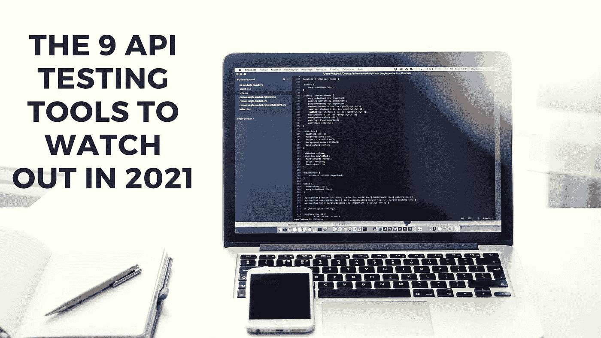

# 2021 年要关注的 9 种 API 测试工具

> 原文：<https://blog.devgenius.io/the-9-api-testing-tools-to-watch-out-in-2021-14fc74e04aba?source=collection_archive---------1----------------------->

自从技术和过程有了很大的进步，组织或团队更喜欢有更快的测试反馈。由于我们可以注意到 DevOps 的左移趋势，应用程序编程接口测试已经成为 CI/CD 中的一个重要和关键的因素。自动化测试工作可以通过适当的 API 测试带来额外的价值，而不是仅仅依赖耗时的用户界面测试。根据 Google Trends 的说法，在过去的几十年里，人们对 API 测试的兴趣一直在不断增长。

**为什么需要 API 测试？**

在 API 级别仔细检查应用程序将是灾难性的，因此最好从一开始就这样做

可以验证应用编程接口的主要功能

消耗的时间比图形用户界面功能测试少

测试数据大部分来自 XML 或 JSON。因此，该过程与语言无关

可与图形用户界面测试轻松集成

**2021 年值得关注的 9 大 API 测试工具**

**1。邮递员**

Postman 最初是作为一个 Chrome 插件进入市场的，现在正在用 Windows、Linux 和 Mac 的原生版本扩展其解决方案。对于那些不希望在 IDE(集成开发环境)中使用与软件开发人员类似的语言进行编码的人来说，这是 API 测试的一个很好的选择。所以，无论你是寻找手工测试还是探索性测试，它都是一个很好的选择。

***至关重要的特性:***

*   在这个工具的帮助下，您可以创建自动化测试，您可以监控 API，执行调试，以及运行请求
*   它的接口使用户能够提取 web API 数据
*   支持与纽曼的持续集成/持续交付服务
*   Postman 允许编写布尔测试&不基于命令行
*   统计内置集合、工具和工作区
*   支持多种格式，包括 Swagger 和 RAML
*   可用于探索性测试和自动化测试

***官网-*** [***邮差***](https://www.getpostman.com/)

**2。放心**

它是最流行的 API 工具之一，可以简化 REST 服务的测试。REST Assured 是一个开源或免费的工具，是一种 Java 领域特定的语言，旨在使 REST 测试更加容易。此外，最新版本已经修复了 OSGi 支持相关的问题。它还为使用 Apache Johnzon 提供了额外的帮助。从 4.2.0 版开始，该工具需要 Java 8 或更高版本。它捆绑了无数的功能，允许用户无需任何编码就可以继续测试。

***至关重要的特征:***

*   支持任何 HTTP 技术，但对 PUT、POST、DELETE、GET、PATCH、OPTIONS 和 HEAD 等几种命令有明确的控制&包括毫不费力地指定和验证头、参数、cookies 和主体
*   内置的功能确保用户不需要从头开始编码
*   用户不需要对 HTTP 有广泛的了解
*   支持 BDD 给定/ Then / When 语法
*   唯一的框架可以混合 REST 测试和用户界面
*   与 Serenity 自动化框架完美集成是可能的
*   提供了几种身份验证机制

***官网-*** [***放心***](http://rest-assured.io/)

**3。JMeter**

引入这个工具是为了执行负载测试，现在它很受功能 API 测试的欢迎。此外，JMeter 5.4 将于 2020 年 12 月推出，提供额外的核心增强和错误修复。用户体验也比上一个版本好得多。最新版本是 2019 年 11 月的 JMeter 5.2。JMeter 已经打包了各种增强和特性、几个错误修复和增强的用户体验，如 JMESPath 提取器、新协议、JDBC 改进、HTTP 采样器和 StringtoFile。

***至关重要的特性:***

*   JMeter 兼容动态和静态资源来测试性能。
*   Jenkins 和 Apache JMeter 之间的集成使用户能够在持续集成管道中包含 API 测试。
*   自动处理 CSV 文件，使团队能够为测试创建唯一的参数值。
*   这是一个非常灵活的 API 测试工具，可以帮助测试人员进行定制
*   支持有效测试过程的多种协议

***官网-***[***JMeter***](https://jmeter.apache.org/)

**4。特里森蒂斯**

它是一个健壮的 web 服务测试工具，提供了 CD 的边缘特性。Tricentis 通过 E2E(端到端)自动化测试的无脚本、无代码方法加快了测试速度。Tricentis 的 400+用户包括全球 500 强品牌，如全食超市、埃克森美孚、HBO、宝马、丰田、安联、德意志银行、星巴克、利盟、Orange、沃达丰、A&E、Vantiv、瑞银和澳大利亚电信。

***至关重要的特征:***

*   支持多种协议，包括 AMQP、HTTP(s) JMS、TIBCO EMS、SOAP、IBM MQ、Rabbit MQ、NET TCP REST、
*   它集成到开发运维与敏捷周期中
*   最佳 API 自动化工具，使用基于模型的自动化测试，使脚本维护变得简单
*   启用 E2E 测试，因为 API 测试可以在打包应用程序、移动设备、跨浏览器等中使用。

***官方网站-***[***Tricentis***](https://www.tricentis.com/software-testing-tool-trial-demo/)

**5。SOAP UI**

SoapUI 是世界上最流行、最广泛使用的 API 测试工具，它使您能够毫无困难地测试 SOAP 和 REST APIs 因为它是专门为 API 测试而构建的。它是 REST 和 SOAP APIs 的测试自动化工具。SOAP UI 充当专用于 API 测试的无头功能测试工具，使用该工具允许用户获得完整的源代码并构建除这些功能之外的首选特征。SoapUI Pro 被全球数千家知名公司使用，包括:微软、苹果、思科、惠普、甲骨文、易贝、美国宇航局、联邦快递、万事达卡、辉瑞和英特尔。

***至关重要的特性:***

*   快速简单的测试创建(即拖放、点击)功能使复杂的任务(如使用 XML 和 JSON)变得简单
*   强大的数据驱动测试，从数据库、excel 和文件加载数据，以模拟用户与 API 的交互方式
*   只需点击几下鼠标，就可以重用功能测试用例作为安全扫描和负载测试
*   完美集成了 13 个 API 管理平台，支持 SOAP、REST、IoT 和 JMS

***官网-***[***SoapUI***](https://www.soapui.org/)

**6。顶点**

Google (Apigee)是一个跨云应用程序编程接口管理平台，由 Javascript 提供支持，使用户能够使用 Swagger 等编辑器来测量和测试 API 性能、构建和支持 API。在 Gartner 全生命周期应用程序编程界面管理魔力象限中，它连续 5 次被评为领导者。从 2019 年 2 月开始，随着 4.19.01 版本的推出，它为用户提供了更多的灵活性来管理他们的 API，如 TLS 安全性、开放 API 3.0 支持、虚拟主机管理改进、apigee-monit 的自我修复以及更多的软件支持。目前的 4.19.6.04 将于 2020 年 4 月发布，仅仅修正了一些小错误。

***至关重要的特征:***

*   通过跟踪 API 流量、错误率和响应时间来识别性能问题，
*   简单地从开放应用编程接口规范中生成 API 代理，并在云中使用它们
*   内部部署(在私有云中)或云，通常使用混合部署模式
*   针对应用和应用编程接口的 SOC2、HIPAA、PCI 和 PII
*   Apigee 是专门为在线业务而构建的&数据丰富的移动驱动的应用程序编程接口和支持它的应用程序
*   其全生命周期应用编程接口管理平台提供了仪表盘、可视化工具和报告，以帮助实时测量流经应用编程接口的数据
*   管理设计、开发、发布、部署、版本化、治理、监控可访问性和测量性能的过程

***官网-***[***API gee***](https://cloud.google.com/apigee/)

**7。测试锤**

它是现代强大的跨平台工具之一，有助于使用 API 并生成自动化应用程序编程接口测试。

***至关重要的特性:***

*   快速创建和测试复杂的场景
*   创建没有实际编程的测试
*   CI/CD 支持
*   强大的自动完成特性，突出显示当前函数、变量值等。
*   组织良好的人类可读的文件格式和项目结构使您能够在版本控制系统审查和回购测试和场景中存储您的项目
*   内置代码编辑器中的高级 JavaScript 支持，包括静态分析器和自动完成特性
*   灵活性-任何文本字段中的计算表达式，甚至在标题区域或地址栏中
*   云同步

***官网-*** [***试锏***](https://testmace.com/)

**8。可断言的**

这是一个被广泛接受的 API 测试工具，它不断地测试 web 服务，并专注于可靠性和自动化。2019 年 10 月，该工具引入了称为加密变量的最新特性，它提供了一种新的方法来存储测试所需的密码、令牌和机密数据字段，以推进 API 测试安全实践。然而，加密的变量不仅仅是简单的使用，而是建立在安全存储的加密方法上。

***至关重要的特征:***

*   通过 CI 和 CD 管道的每一步支持自动化应用程序编程接口测试
*   支持在部署后运行应用程序编程接口测试
*   它可以与其他一些工具集成，如 Zapier GitHub 和 Slack
*   支持使用诸如 JSON 路径数据完整性检查和 JSON 模式验证之类的交钥匙断言来验证超文本传输协议(HTTP)反应
*   synchronize 特性允许用户在他们的细节发生变化时升级测试，在添加新参数或修改应用程序编程接口的响应后，您不必手动更新他们的测试。

***官网:*** [***断言***](https://assertible.com/)

**9。招摇**

它是一个 API 测试工具，使用户能够直接从开放应用编程接口规范开始他们的安全性、性能和功能测试。swagger tooling & Ready Application Programming Interface platform 使在管道中快速生成、管理和实现应用程序编程接口测试变得简单。2019 年 3 月的开放应用编程接口规范版本 3.0 附带了最新的 traits Swagger Hub 域。有了这个惊人的特性，软件开发人员可以获取常用的对象、路径项、响应，并将它们累积在单独的文件中，以便在各种不同的应用程序编程接口定义中引用。这种可重用的域可以被发布、共享和版本化，以便在大型团队之间进行协作反馈。

***至关重要的特性:***

*   Swagger Inspector 提供了检查应用程序编程接口请求-响应的能力，并确保它们按预期执行
*   导入用户的应用程序编程接口定义，以自动生成针对端点的断言，验证模式规则并轻松地将合成数据插入参数
*   生成复杂的负载场景，轻松测试应用编程接口的规模和性能
*   支持各种服务，从 GraphQL、SOAP 到 REST，

***官网:*** [***霸气***](https://swagger.io/)

**API 测试有什么优势？**

**提前测试**

使用应用程序编程接口测试，一旦设计了逻辑，就可以构建测试来验证数据和响应的正确性。我们不需要等待几个团队结束他们的工作，或者等待构建完整的应用程序——测试用例是孤立的，并且可以立即构建。

**简单的测试维护**

用户界面不断变化，并根据其访问方式移动——屏幕方向、设备、浏览器等。这形成了一个噩梦般的场景，测试被不断重写，以继续生产中的真实代码。应用程序编程接口的变化受到很大的控制，很少发生——有时应用程序编程接口定义文件，如 OpenAPI Spec，可以帮助重构测试只需几秒钟的工作。

**快速解决问题**

当应用程序编程接口测试失败时，我们准确地知道我们的系统在哪里出了问题，以及在哪里可以找到缺陷。这有助于减少在集成、构建甚至不同的团队成员之间对 bug 进行分类的时间。应用程序编程接口测试的隔离、小范围非常适合快速 MTTR 统计，这是 DevOps 团队的一个有价值的 KPI。

**速度&测试范围**

300 个用户界面测试可能需要 30 个小时来执行。三分钟内可以执行三百个应用程序接口测试。这意味着你将在更短的时间内搜索更多的错误，同时也要马上修复它们。

**最终判决**

在上述顶级 API 测试工具中，Postman、SoapUI、Katalon Studio 提供免费和付费方案。而 JMeter、REST-Assured 和其他工具都是免费或开源工具，可以免费访问。