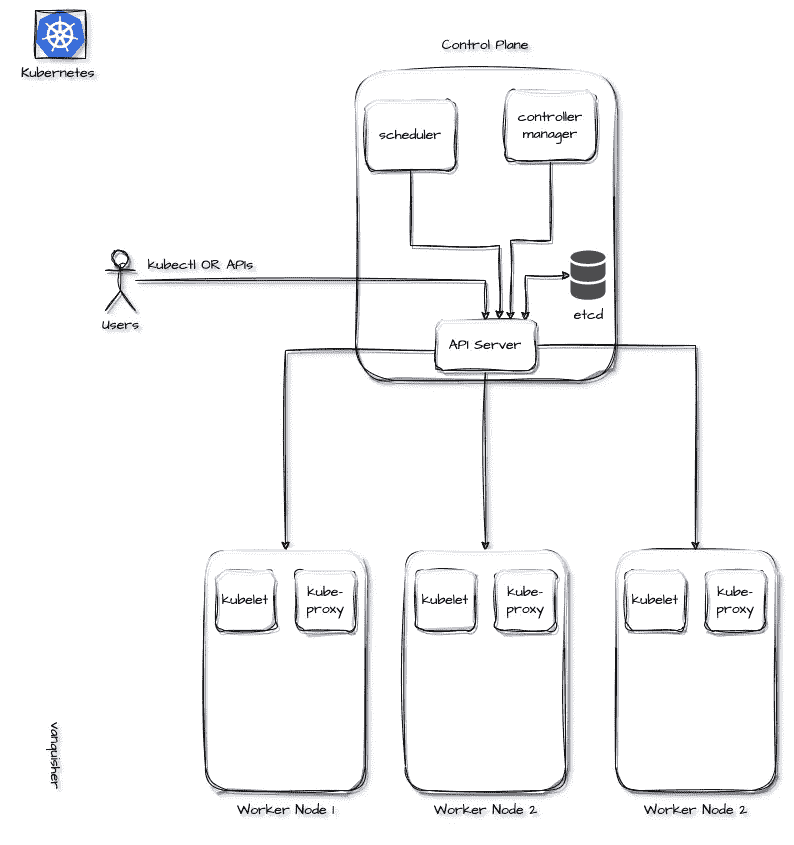
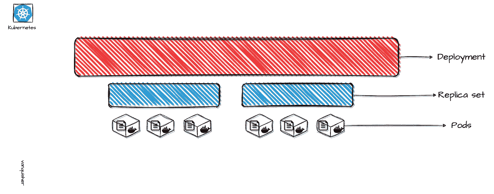

# Kubernetes 的基础知识:容器编排快速入门指南

> 原文：<https://blog.devgenius.io/the-abcs-of-kubernetes-a-quick-start-guide-to-container-orchestration-f6c47c3487de?source=collection_archive---------3----------------------->

Kubernetes —数据中心中的数据中心。

船轮(来源:[peakpx.com](https://www.peakpx.com/)

在进入 Kubernetes 的世界之前，理解容器编排的概念是很重要的。

## 容器编排

容器编排是管理和协调容器化应用程序的部署、伸缩和维护的过程。它允许开发人员自动化和优化运行和管理大规模容器化应用程序的过程，使构建和操作分布式系统变得更加容易。

下面用一个类比简单解释一下容器编排:

想象你正在经营一家繁忙的餐馆。你有一堆不同的菜需要准备并提供给你的顾客。为了做到这一点，你在厨房里有一堆锅碗瓢盆，每个都有自己的配料和说明。你也有一群服务员，他们接受订单，送食物，打扫卫生。

现在，假设你想在不同的地方开第二家餐馆。您仍然拥有相同的锅碗瓢盆和服务器，但是现在您需要弄清楚如何在两个不同的位置管理它们。你可能在一个地方经常使用一些锅碗瓢盆，而在另一个地方经常使用一些。您可能还有一些更擅长处理某些类型订单的服务器。

这就是容器编排的用武之地。它帮助您自动化和优化管理您在多个位置(集群)的锅碗瓢盆(容器)和服务器(主机)的流程。它允许您指定每个位置需要多少个锅碗瓢盆，以及如何使用它们。它还可以帮助您管理您的服务器，确保它们拥有有效完成工作所需的工具和资源。

使用容器编排的好处:

*   **提高效率:**容器编排允许开发人员自动化和优化部署和管理容器化应用程序的流程。这有助于减少构建和操作复杂的分布式系统所需的时间和精力，并提高开发过程的整体效率。
*   **增强的可伸缩性:**容器编排使开发人员能够根据需求轻松地扩大或缩小他们的应用程序，从而更容易处理流量或使用量的突然增加。这有助于提高应用程序的可靠性和性能，并降低停机或服务中断的风险。
*   **增强的安全性:**容器编排提供了内置的安全特性，有助于防范漏洞和威胁。例如，它允许开发人员使用网络分段和访问控制来保护他们的应用程序和数据，并有助于防止未经授权的访问或篡改。

## 好的，我有容器编排。现在，什么是 Kubernetes？

Kubernetes(也称为 K8s)是一个开源的容器编排平台，允许开发人员大规模部署和管理容器化的应用程序。它提供了一组工具和 API，使用户能够自动化部署、扩展和维护应用程序的过程，从而更容易构建和操作分布式系统。

Kubernetes 最初由 Google 开发，现在由云本地计算基金会(CNCF)维护。它被广泛应用于各种行业和环境，并得到许多云提供商和供应商的支持。

## Kubernetes 的替代品

1.  码头工人群
2.  阿帕奇 Mesos

## 我为什么要学 Kubernetes？

1.  构建高度可扩展的云原生应用。
2.  现代软件工程遵循 DevOps 和 SRE 的实践。容器是这一过程的一部分，手动管理这些容器非常繁琐。因此，Kubernetes 开始发挥作用并管理这些容器。
3.  趋势科技。
4.  所有云提供商都支持 Kubernetes。

库伯内特星团

## Kubernetes 的概念

1.  控制平面(以前称为主节点):控制和管理其他节点的服务器(现在称为 VMs)。
2.  工作节点:按照控制平面的指示执行任务的一组服务器(虚拟机)。
3.  集群:Kubernetes 集群由成功完成任务的控制平面和工作节点组成。

# 集群组件

## 控制平面组件:

**API 服务器(kube-apiserver):** 这是集群的入口点。我们可以使用“kubectl”或“Kubernetes APIs”与 Kubernetes 集群进行交互，所有这些请求都命中 kube-apiserver。

**调度器(kube-scheduler):** 该资源将 pod(稍后讨论)分配给节点。

**控制器管理器(kube-controller-manager):** 它有特定的控制器来管理集群(例如，节点控制器:检查节点是否启动和工作)

**etcd:** 这是 Kubernetes 集群的大脑，因为它是存储集群所有细节的键值数据存储。etcd 可以在集群中，也可以在外部。如果 etcd 运行在带有控制平面组件的集群内部，这种架构称为堆叠式架构，如果 etcd 在外部，则称为外部架构。

**dns (core-dns)** :除了您环境中的其他 DNS 服务器之外，集群 DNS 也是一个 DNS 服务器，为 Kubernetes 服务提供 DNS 记录。

## 工作节点组件

**kubelet:** 工作节点上的代理，负责容器是否按照 API 服务器给出的指令(PodSpec)运行。

**kube-proxy:** 运行在每个节点上，负责节点上运行的 pods 的联网和负载均衡。

# 工作量

运行在 Kubernetes 上的应用程序被称为工作负载。

Kubernetes 的工作量

Pods:Kubernetes 的一个基本单位，有一个容器在运行。基本上是容器上的一个抽象层，Kubernetes 可以通过它来管理。

**副本集:**pod 上的抽象层，这样它可以监控并确保所需数量的副本。，pod 在每个时间点都在运行。

**部署:**副本集上的另一个抽象层。诸如滚动更新、回滚、伸缩等功能是通过部署实现的。使用部署将应用程序部署到 Kubernetes

**Daemon-Set:** 一个场景，您希望在所有节点上运行一个 pod。例如，日志收集 pod 收集每个节点上的日志，然后使用守护进程集来实现这一点。

**有状态集:**像数据库这样的有状态应用程序使用有状态集来管理。

# 管理配置

**配置图:**应用程序配置详细信息(如。环境变量)可以使用配置映射来有效地管理

**秘密:**应用的凭证和秘密令牌由秘密管理。

# 管理存储

**卷:**应用程序的数据存储不由 Kubernetes 管理。数据只有在 pod 运行时才可用。因此，必须使用外部存储器来存储数据。卷是 Kubernetes 中有助于这一点的资源。

# 建立工作关系网

**服务:**分配给 pod IP 地址是短暂的(即当 pod 死亡并重启时，分配新的 IP 地址)，而 pod 是暂时的(即。pod 死亡并重启)。为了处理这些暂时和短暂的问题，一个固定的 IP 被分配给服务，并且该服务具有作为端点的 pod。即使当 pod 停止工作并重新启动时，IP 地址也是不变的。

# 熟悉其他工具

kubectl: 命令行工具，通过它我们可以输入命令并与 Kubernetes(特别是 kube-apiserver)交互

这个工具用于引导(创建)Kubernetes 集群，升级和降级 Kubernetes 集群。

## 托管 Kubernetes 集群

这是一种计算服务，云提供商提供这种服务来部署高度可扩展的容器化应用。集群维护(集群升级)、节点供应和维护由云提供商完成。使用此服务的用户无权访问控制平面，他们只能访问工作节点。

示例:

1.  谷歌 Kubernetes 引擎(GKE)
2.  亚马逊弹性容器服务(ECS)
3.  Azure 容器实例(ACI)

## 结论

总之，深入学习和理解 Kubernetes 有一个有点陡峭的学习曲线。但是，这种学习可以通过创建和使用 Kubernetes 集群来获得乐趣。托管 Kubernetes 现在很流行，因为集群是由云提供商维护的。通过这篇博客，我打算介绍 Kubernetes 的基本架构和组件。在我接下来的博客中，我将演示如何将应用程序部署到 Kubernetes 集群。

## 推荐文章

 [## Kubernetes 初学者教程-基本概念和例子

### Kubernetes 是最受欢迎的部署和扩展容器化系统的 orchestrator。您可以使用 Kubernetes 来…

spacelift.io](https://spacelift.io/blog/kubernetes-tutorial) 

## 参考

 [## Kubernetes 文档

### 2022 Kubernetes 作者|根据 4.0 分发的文档版权所有 2022 Linux 基金会。所有…

kubernetes.io](https://kubernetes.io/docs/home/)