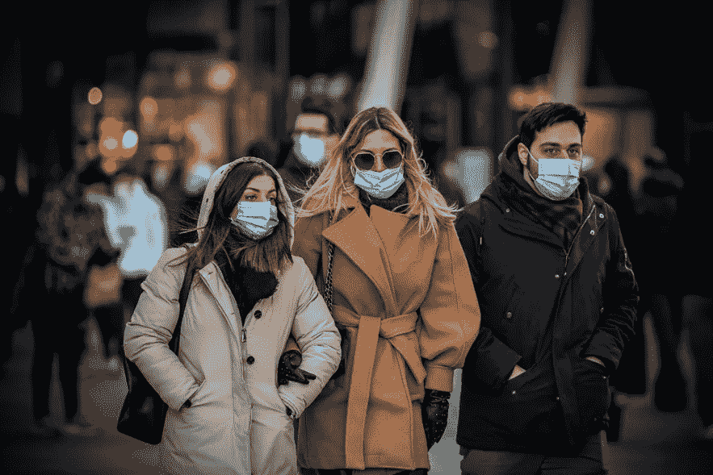
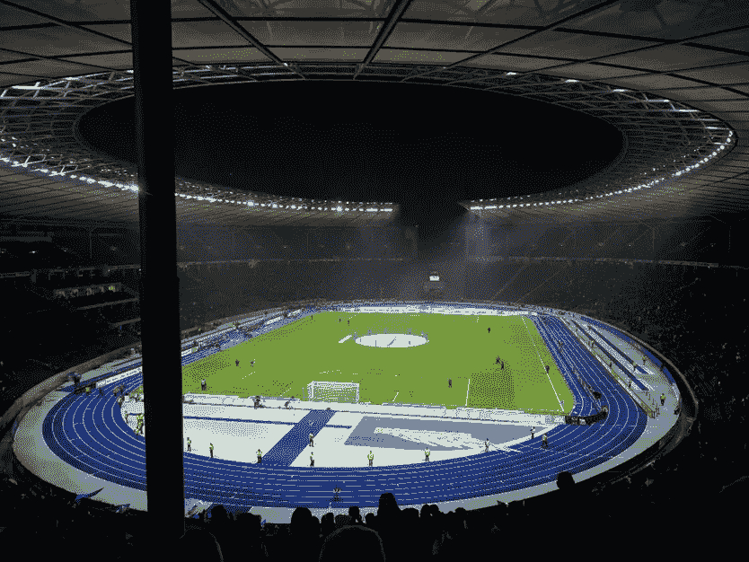
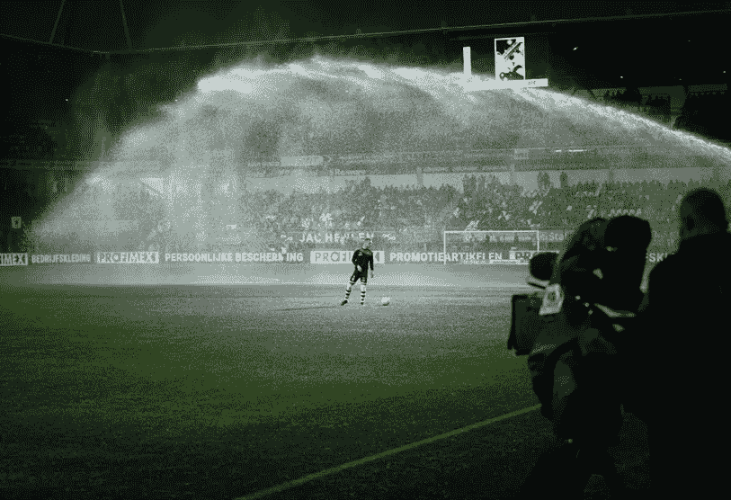

# 明天的人工智能体育场

> 原文：<https://blog.devgenius.io/the-ai-stadiums-of-tomorrow-10f42b86522b?source=collection_archive---------15----------------------->

**疫情的后效**

这意味着没有大规模的人群聚集，比如在电影院、体育馆、公共礼拜场所等等。然而，当世界范围内的病例减少时，大多数限制都放松了。现在允许在较低容量的大空间举行集会，前提是安全规则也得到充分遵守。

即便如此，大多数人还是不遵守规则，或者大型集会的场所不具备足够的设施或技术来更好地控制或管理人群。一个这样的空间是体育场。尤其是作为大多数外国居民的主食，粉丝们喜欢参加大量的活动。不幸的是，这意味着过度拥挤，安全规则没有得到有效遵守，病例再次增加。这将对体育场的收入造成伤害，因为他们将不得不因参与者的违规行为而关闭。

**解决方案:人工智能**

人工智能技术在体育场的流程和功能中的应用可以纠正甚至淡化它们所面临的困难。幸运的是， [Prisma AI](https://prisma.ai/) 创造了一套人工智能解决方案来帮助所有的体育场馆。

**人群扫描和指标**

智能人群扫描和度量系统可以记录体育场一天内的总流量，从而制定计划和策略来更好地控制人群。排队、收银台、安检亭的等待时间分析有助于估计与会者必须忍受的等待时间，以便实施更好的方法来节省等待时间并确保更好的体验。

**贵宾识别和禁止被禁个人**

贵宾或贵宾通行证持有人可以比普通通行证持有人更早地被护送到贵宾休息室或贵宾区，以确保贵宾体验。任何被禁止进入体育场的人也将被带走并报告，拒绝进入。

**智能停车管理系统**

智能停车管理系统可以解决最恼人和最困难的问题:停车，这是一个简单的任务，通过自动车牌识别系统，可以立即扫描和分配停车位给各种规模的车辆，并自动收费，让与会者有一个无障碍的体验。

**室内导航和热温度检测**

热温度探测器和室内导航系统可以大规模扫描人群，以确保保持正常的温度，参与者可以自动导航到任何感兴趣的地方，如洗手间、出口，而无需与任何人接触，因此消除了无意中被感染的风险。

**物体和标志识别**

物体检测可以识别遗弃物体的性质，并帮助在大型空间(如体育场)中寻找丢失的物体，徽标识别可以识别广告牌上赞助的品牌，并向与会者展示他们提供的产品和服务。

**事件和医疗急救检测**

事件检测可以检测和报告体育场周围发生的任何事件，如打架或火灾，以及医疗紧急情况，这将为需要的人带来即时关注。

**艾在体育**

人工智能在体育场馆和体育运动中的应用有助于监控社交距离、行为分析和情感分析，有助于创造更好的粉丝体验，同时确保安全。分析系统可以帮助体育场管理的所有部门获得有助于其战略的重要信息。

体育和体育场的人工智能不是对未来的思考，而是当今后大流行世界的一种需要和目标。