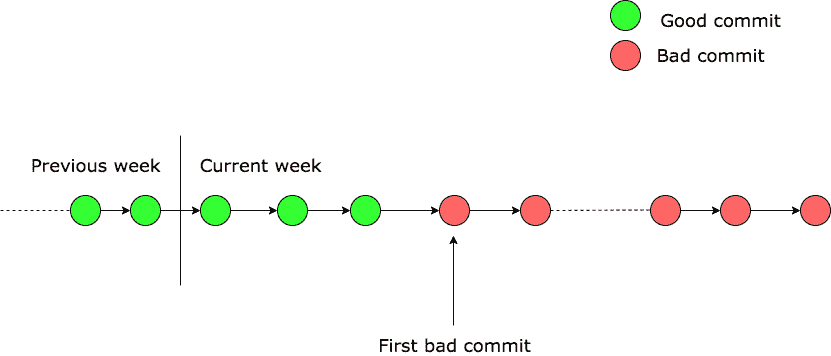
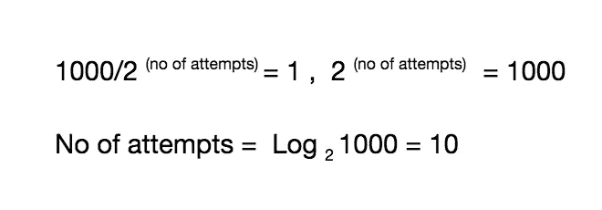

# 生活中的算法方法

> 原文：<https://blog.devgenius.io/the-algorithmic-approach-in-life-de0b2ecbff23?source=collection_archive---------8----------------------->

## 算法

你过去一定解决过很多算法问题，但是你有没有想过这些算法是如何在我们的日常生活中发挥重要作用的？我也一直很好奇。这就是为什么我想出了这个系列，它将通过考虑现实生活中的例子来建立你对算法的实际知识。

**今天我们要讨论一个这样的例子——**

假设有一天天气很好，在开发一个产品时，你在一个现有的特性中发现了一个错误。经过详细的分析，您意识到这个 bug 是由本周的一些提交引起的，因为您在本周早些时候测试了这个特性，它工作得很好。现在您需要找到导致这个问题的提交，并恢复它所做的更改。最大挑战是如何找到错误的提交。

# **让我们试着先把这个问题形象化**

从图中我们可以清楚地看到，一旦引入了一个错误，随后的提交也会有同样的错误，并且是糟糕的提交。**在第一次错误提交之前的提交将是好的。**

# 天真的方法

找到错误提交的一种方法是从最近一次开始扫描当前一周内完成的所有提交，并返回直到找到一个好的提交。之后的提交将是第一个错误的提交。

下面是同样的例子(G =好的提交，B =坏的提交)

这种方法看起来很简单，但是它的缺点是什么呢？想象一个大项目和多个团队参与其中。如果我们的代码库中本周有 **1000** 个提交会怎么样？使用上述方法扫描这些提交并找出第一个错误的提交需要大量的尝试。

我们可以很容易地发现，在最坏的情况下，尝试的次数将接近于 1000 次

我们能减少尝试的次数吗？

答案是**是的。**

在上面的方法中，我们按顺序扫描每个提交，直到找到一个好的提交。我们在这里忽略了一个重要的事实，即**提交**中有一个模式。如果好的提交由 G 表示，坏的提交由 B 表示，则提交历史类似于 GGGGGGGG……bbbbbbbbbbbbbbbbbb。

基于这个事实，我们可以找到中间提交，并检查它是好还是坏。如果中间提交是好的，那么我们的下一个搜索空间将包含中间提交之后的提交。类似地，如果中间提交是错误的，那么我们的下一个搜索空间将只包含中间提交之前的提交。通过这种方式，我们优化了我们的方法。**我们在这里应用了**[**分而治之的策略**](https://en.wikipedia.org/wiki/Divide-and-conquer_algorithm) **。**

# 详细优化方法

我们可以将初始搜索空间分为两部分，并检查两种情况下的中间提交:

*   第一种情况是中间提交是一个错误的提交。

现在有两种可能性:

1.  中间提交之前的提交是好的，那么中间提交是第一个坏的提交
2.  如果之前的提交也是一个错误的提交，那么我们的搜索空间将减少到这个中间提交之前的所有提交

*   **第二种情况是中间提交是否是一个好的提交。**

现在我们只需要考虑中间提交之后的提交，因为之前的提交都是好的提交。上述过程可以递归地应用于查找第一个错误提交。

为了更好地理解，下面是演示

# **分析**

在上述过程中，每次我们都将搜索空间减半，直到找到第一个错误提交，因此让我们计算尝试次数

每次我们将搜索空间减少一半，在最坏的情况下，我们将继续，直到我们在搜索空间中剩下 1 个提交，所以我们可以说

这种方法比前一种方法快得多，因为尝试次数从 1000 次减少到 10 次。

# **结论**

我也可以讨论问题的工作解决方案，但这不是这篇博客的目的。我只是想让大家了解，每当我们陷入现实生活中的问题时，我们如何应用我们的算法知识。

这只是个开始，请继续关注更多这样的内容😊

有关分治算法的更多信息，请查看以下链接-

*   [https://en.wikipedia.org/wiki/Divide-and-conquer_algorithm](https://en.wikipedia.org/wiki/Divide-and-conquer_algorithm)
*   [https://www . geeks forgeeks . org/divide-and-conquer-algorithm-introduction/](https://www.geeksforgeeks.org/divide-and-conquer-algorithm-introduction/)